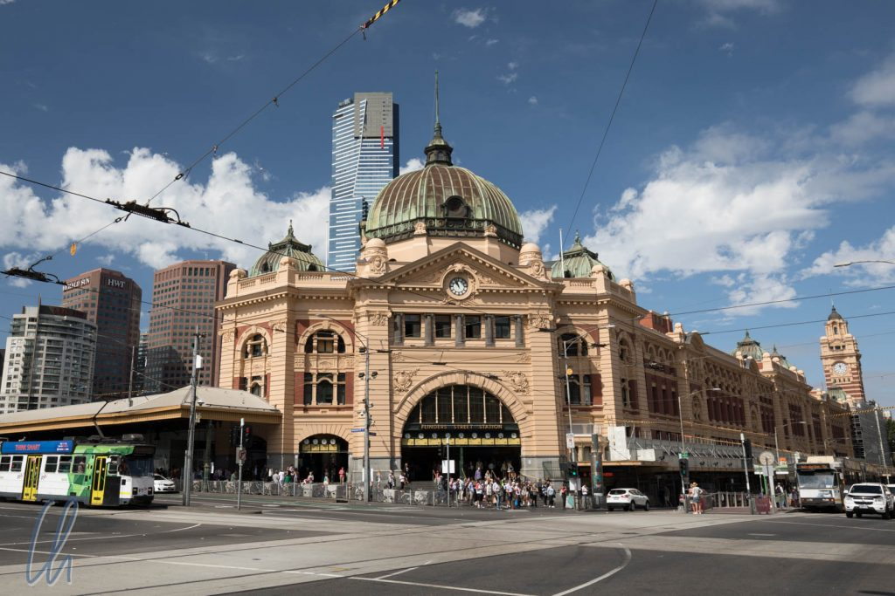
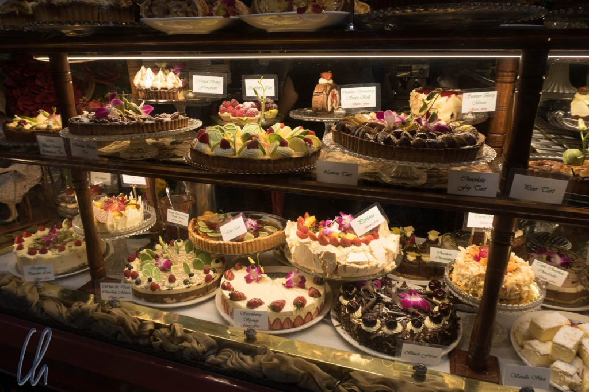

# 3 Tage in Melbourne

Auch wenn Canberra die offizielle Hauptstadt Australiens ist, so liefern sich Melbourne und Sydney als die beiden größten Städte des Kontinents ein Wettrennen um die Wahrnehmung als geistige Kapitale des Landes. Nach relativ viel Naturprogramm besuchten wir Melbourne, „[the world's most liveable city](https://www.smh.com.au/business/the-economy/melbourne-named-worlds-most-liveable-city-by-the-economist-for-seventh-year-20170816-gxx1kg.html)“, zu der sie der Economist wiederholt gekürt hat. Während Sydney unter anderem durch seine einmalige Lage am Meer besticht, punktet Melbourne durch eindrucksvolle Gebäude aus der Ära des Goldrausches, Kunst und Kultur bzw. Subkultur, interessante Einkaufsmöglichkeiten und vielfältige Gastronomie

<!--more-->

## Stadtrundgang Melbourne

Auch in Melbourne trafen wir wieder auf britisch anmutende Gebäude und Straßennamen. Eines der auffälligsten kolonialen Bauwerke in Melbourne ist die Flinders Street Station, Melbournes ältester Bahnhof. Direkt über dem Eingang befinden sich viele Uhren, die nicht die Zeit in verschiedenen Städten der Welt anzeigen, sondern den Zeitpunkt der Abfahrt der nächsten Züge.

Typisch für Melbourne sind außerdem seine teilweise europäisch anmutenden kleinen Gassen und seine Passagen, die auf Englisch als "Arcades" bezeichnet werden. Vielleicht als Vorläufer einer modernen Mall reihen sich verschiedenste individuelle Geschäfte teils in mehreren Etagen unter einem gemeinsamen Dach aneinander. Je nach Entstehungszeitraum und damaligem Geschmack variieren die Baustile: Die Bandbreite reicht von Art Deco bis hin zu prunkvoll kolonial.

Für uns als Besucher erschien Melbourne subjektiv weniger groß als Sydney, da sich die Anzahl der Hochhäuser in der direkten Innenstadt in Grenzen hält. Auch in zentrumsnahen Vierteln wie Fitzroy haben viele Gebäude nur 2 Stockwerke. Damit empfanden wir die 4-Millionen-Stadt nicht als überwältigend, was wir als Landeier sehr schätzten.

## Im Australian Open-Fieber

Als wir unser Hotel in Melbourne gebucht hatten, waren wir etwas verwundert, dass es deutlich teurer war als erwartet. Des Rätsels Lösung waren die Australien Open, die sich bei unserem Besuch in ihrer Endphase befanden. Ganz Melbourne schwelgte im Tennisfieber. Viele Schaufenster und Restaurants waren mit Tennisbällen in allen möglichen und unmöglichen Größen dekoriert und das Spektakel fand relativ zentrumsnah in den Stadien im Melbourne Park statt.

In den Cafés und Bars lief ausnahmsweise kein Football oder Cricket, sondern Tennis. An vielen öffentlichen Plätzen wurden Spiele auf riesigen Leinwänden übertragen: Am Federation Square und im Birrarung Marr Park. Wo die Melbourner an anderen Tagen vielleicht zum Joggen unterwegs sind, saßen jetzt Tausende Tennisbegeisterte. Da wir uns kein Match anschauen wollten, drehten wir nur eine Runde durch den Park und kehrten dann in die Stadt zurück.

## Kunst, Kultur und Subkultur

Kunst findet man in Melbourne nicht nur im Museum, sondern auch auf der Straße. Streetart wird in einigen Gassen zelebriert. Am bekanntesten sind die Hosier Lane und die AC/DC-Lane, aber es gibt noch viele andere Gässchen, die ebenfalls als Freiluft-Galerie dienen. Was heute an den Wänden prangt, kann morgen schon übersprüht sein. Die Motive sind sehr vielfältig und reichen von abstrakten oder textuellen Werken über meterhohe comicartige Darstellungen oder mit Farbe besprühte Mülltonnen bis hin zu sehr detaillierten Arbeiten oder Collagen. An einer Straßenecke befand sich zum Beispiel ein brüllender Löwe in Gesellschaft Albert Einsteins.

Im [ACMI-Film Museum](https://www.acmi.net.au/) (Australian Centre for the Moving Image) besuchten wir eine sehr sehenswerte Ausstellung über die britische Filmproduktionsgesellschaft [Aa​rdman](https://de.wikipedia.org/wiki/Aardman_Animations), die einen Blick hinter die Kulissen von Chicken Run, Wallace und Gromit, Shaun das Schaf und vielen anderen Produktionen erlaubte. Wir konnten original [Claymation](https://de.wikipedia.org/wiki/Knetanimation)-Kulissen und -Figuren bewundern, auf mehreren Bildschirmen liefen Filme und -ausschnitte und es bestand sogar die Möglichkeit, einen eigenen kleinen Film zu drehen.

Wir bekamen 2 Stückchen Knete und erhielten eine kurze Einweisung, wie das Set aussehen würde. Außerdem sollte der Film am Ende maximal 20 Bilder haben. Aus der Knete sollten wir beliebige Figuren formen, die dann durch minimale Veränderungen zum Leben erweckt werden würden. Das ganze war gar nicht so einfach, da die echten Filmstars nicht nur aus Knete bestehen, sondern auch aus einem Metallskelett. Die Statik war also ein Problem. So war das Endergebnis nicht ganz wie geplant, aber seht selbst ;)

https://www.youtube.com/watch?v=ub8djAfnecA

## Helden der Stadt

In der Victoria State Library bewunderten wir nicht nur den La Trobe Reading Room mit seiner lichtdurchfluteten Stahlbetonkuppel, sondern lernten außerdem den Mythos [Ned Kelly](https://de.wikipedia.org/wiki/Ned_Kelly) kennen, Buschranger, Widerstandskämpfer, Held, Straßenräuber und eine Art australischer Robin Hood. Viele Legenden ranken sich um den Mann und seine Geschichte ist mehrfach verfilmt worden. In der Ausstellung sahen wir sogar seine originale [Rüstung](https://de.wikipedia.org/wiki/Ned-Kelly-R%C3%BCstung), die sein Markenzeichen war und die er bei seiner letzten Schießerei trug. Das gute Stück wog 44 kg - das ist mehr als unsere beiden Rücksäcke zusammen! Unvorstellbar, sich darin gezielt vorwärts zu bewegen, geschweige denn zu kämpfen.

Melbourne hat uns sehr gut gefallen und die 3 1/2 Tage vergingen wie im Fluge. Melbourne ist eine dieser Städte, die genug Programm für 2 bis 3 Wochen böte. Ein herzliches Dankeschön möchten wir an dieser Stelle Jochen und Clare für ihre großartige Unterstützung ausdrücken! Sie gaben uns Starthilfe in Melbourne, indem sie uns einen Parkplatz für unseren Mietwagen zur Verfügung stellten und uns eine [Myki-Card](https://www.ptv.vic.gov.au/tickets/myki) besorgten, um das etwas kompliziertere Tramsystem nutzen zu können. Nicht zuletzt erinnern wir uns sehr gerne an den wunderbaren gemeinsamen Abend zurück. Vielen Dank!
