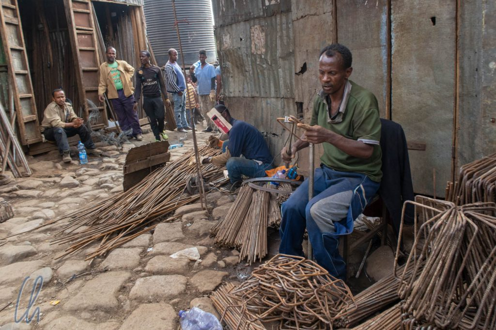

An unserem ersten Tag in Äthiopien erkundeten wir Addis Abeba, was wörtlich übersetzt "[neue Blume](https://de.wikipedia.org/wiki/Addis_Abeba)" heißt, zusammen mit unserem Führer Higo (für den Tag) und Maru (unserem Fahrer für die ganze Reise). Addis ist nicht nur die Hauptstadt Äthiopiens, sondern auch Sitz des Hauptquartiers der Afrikanischen Union. Die Millionenstadt wächst sehr schnell, anscheinend aber eher in die Breite als in die Höhe: Es gab nur sehr wenige Wolkenkratzer. Die Innenstadt von Addis Abeba präsentierte sich erfrischend grün. Rund um unser Hotel und überall in der Innenstadt wuchsen neben den Häusern Bäume und Palmen. Das war Balsam für unsere Seelen nach der jordanischen Wüste.

<!--more-->

## Hochlandfrische

Addis Abeba ist die dritthöchste Hauptstadt der Welt nach [La Paz](http://wittmann-tours.de/la-paz-fiesta-del-gran-poder-und-mehr/) und [Quito](http://wittmann-tours.de/die-zahlreichen-facetten-von-quito/) und die höchstgelegene Hauptstadt Afrikas (um doch noch einen Superlativ zu bemühen). Damit haben wir ungeplant das Triple vollgemacht. Addis Abeba liegt auf 2300m über dem Meeresspiegel und somit war das Klima deutlich kühler als in unseren vorherigen Reiseländern, aber tagsüber durchaus angenehm. Sobald sich die Sonne zeigte, brannte sie herab. Insgesamt war aber trotzdem die meiste Zeit ein Pullover die bessere Wahl als ein T-Shirt. Die Tagestemperaturen lagen bei angenehmen 20 bis 22 Grad Celsius, nachts kühlte es auf frische 10 Grad ab. Die Höhe machte sich bei uns nicht bemerkbar, auch wenn es sich etwas zu anstrengend anfühlte, die Treppen in den dritten Stock des Hotels zu unserem Zimmer zu erklimmen.

Auf den Straßen herrschte ein kreatives Verkehrschaos mit wenigen Ampeln und viel Stau. Es dauerte, sich mit dem Fahrzeug in der Stadt zu bewegen. Der Fuhrpark vor Ort bestand im Wesentlichen aus alten Autos, nur gelegentlich sahen wir neue Wagen, aber auch Esel und Schafe bewegten sich auf den Straßen. Es stank oft nach Abgasen. Vor allem LKWs, die oft 20 Jahre oder älter waren, stießen regelrechte Rußwolken aus. So sehr war uns das in noch keinem anderen Land aufgefallen. Insgesamt kam uns Addis Abeba deutlich moderner vor als [Antananarivo](http://wittmann-tours.de/antananarivo-und-akamasoa/), aber etwas weniger als [Dar es Salaam](http://wittmann-tours.de/dar-es-salaam/).

## Der Berg Entoto

Trotz der langen Geschichte Äthiopiens wurde Addis Abeba erst 1889 von Kaiser [Menelik II.](https://de.wikipedia.org/wiki/Menelik_II.) gegründet. Dieser hatte die Hauptstadt erst einige Jahre zuvor in die Entoto Berge nördlich des heutigen Addis verlegt. Seiner Gattin war es dort aber zu kalt (klingt realistisch ;)), es zog sie zu einem Ort im Tal, wo die Temperaturen angenehmer waren und es sogar heiße Quellen gab. Mit dem Bau des Kaiserpalastes ging zudem eine alte Prophezeiung in Erfüllung und so konnte die "neue Blume" austreiben. Der Mangel an Feuerholz (bzw. dessen weite Transportwege) wurde allerdings schnell zum Problem. Wäre nicht der Eukalyptusbaum eingeführt und angepflanzt worden, wäre die Blume nie wirklich erblüht.

Auch heute wachsen viele Eukalyptusbäume am Entoto Berg, aber man weiß, dass sie einheimische Pflanzen durch ihr schnelles Wachstum und ihren großen Wasserbedarf verdrängen. Die Einheimischen schätzen sie aber dennoch als Brennstofflieferanten. Auf dem Weg die Hänge des Entoto hinauf sahen wir immer wieder übervoll beladene Esel, die Eukalyptuszweige ins Tal transportierten. Sie kannten offensichtlich ihren Weg und liefen ohne menschliche Begleitung den Berg hinab. Bis ganz zum Gipfel konnten wir leider nicht fahren, da die Straße wegen einer Baustelle gesperrt war. Trotzdem hatten wir einen schönen, wenn auch etwas diesigen Blick über die Stadt.

## Afrika, die Wiege der Menschheit

Zurück in der Stadt statteten wir dem Nationalmuseum einen Besuch ab. Die Geschichte an sich beginnt in Ostafrika, der Wiege der Menschheit, ganz am Anfang, bei den ersten Menschen. In Äthiopien (auch in Kenia und Tansania) gab es vermutlich unsere ersten aufrecht gehenden Vorfahren, zu denen auch [Lucy](https://de.wikipedia.org/wiki/Lucy) gehörte. Ihre Knochen sind 3,2-3,5 Millionen Jahre alt und wurden 1974 im Norden Äthiopiens ausgegraben. Damals war dies eine Sensation, mit 47 von 207 Knochen gilt das Skelett als eines der vollständigsten [unserer Vorgänger](https://de.wikipedia.org/wiki/Australopithecus_afarensis#/media/Datei:Stammbaum_der_Entwicklung_des_Menschen.png). Sie war damals die erste einer neu entdeckten Art: [Australopithecus Afarensis](https://de.wikipedia.org/wiki/Australopithecus_afarensis), benannt nach der [Afar-Region](<https://de.wikipedia.org/wiki/Afar_(Region)>), die wir später auf der Reise auch noch besuchen würden.

Als Kuriosität war ein massiver steinerner Olmeken-Kopf vor dem Nationalmuseum nicht zu übersehen. Dies war 2010 ein Geschenk des mexikanischen Staates an Äthiopien, ist aber eine Replik. Etwas verblüfft beguckten wir das Artefakt, schließlich hatten wir die Originale erst vor wenigen Monaten in [Villahermosa](http://wittmann-tours.de/auf-den-spuren-der-olmeken-in-villahermosa/) (Mexiko) gesehen und waren sehr verwundert, die bekannten Gesichtszüge in Addis Abeba anzutreffen.

## Die Salomonischen Kaiser

Die Geschichte der Herrscher Äthiopiens geht nicht ganz bis zu Lucys Lebzeiten zurück, aber immerhin angeblich auf ein Ereignis, das im Alten Testaments beschrieben wird, nämlich den Besuch der [Königin von Saba](https://de.wikipedia.org/wiki/K%C3%B6nigin_von_Saba) am Hofe König Salomos. Bevor wir die Vorkommnisse allerdings schildern, müssen wir vorwegnehmen, dass man in Äthiopien immer aufpassen muss, ob man gerade über belegbare Geschichte oder über traditionelle äthiopische Überlieferungen redet. Letzte werden von den meisten Äthiopiern als absolute Wahrheit angesehen, sind aber aus wissenschaftlicher Sicht eher Legenden. Laut diesen Mythen regierten Nachfahren [König Salomos](https://de.wikipedia.org/wiki/Salomo) Äthiopien in einer kontinuierlichen Linie bis 1974, als der letzte Kaiser, [Haile Selassie](https://de.wikipedia.org/wiki/Haile_Selassie), nach einem Militärputsch abdanken musste.

Der Sage nach gründete [Menelik I.](https://de.wikipedia.org/wiki/Menelik_I.) das [Kaiserreich Abessinien](https://de.wikipedia.org/wiki/Kaiserreich_Abessinien) 980 vor Christus. Er soll der Sohn von König Salomo und der [Königin von Saba](https://de.wikipedia.org/wiki/K%C3%B6nigin_von_Saba) gewesen sein. Die äthiopische Überlieferung besagt außerdem, Menelik habe nach einem Besuch bei seinem Vater in Jerusalem die Bundeslade aus dem Tempel mich sich zurück nach Aksum (Äthiopien) gebracht. Auch wenn eine [kurze Recherche](https://de.wikipedia.org/wiki/Liste_der_Kaiser_von_%C3%84thiopien) schnell belegen kann, dass Haile Selassie wohl eher nicht der 225. Kaiser aus der Salomonischen Dynastie auf dem Abessinischen Thron war (auch wenn er versucht hatte, seine Abstammung auf den alttestamentarischen König zurückzuführen), sind diese Mythen den Äthiopiern sehr wichtig. Solcher Vermischung von Geschichte und Legende sollten wir noch häufiger begegnen.

## Politik, ein wichtiges Thema

Von der Geschichte im Nationalmuseum war es nicht weit bis zur Gegenwart und der aktuellen Politik. Dies war ein wichtiges Thema für die Menschen. Unser Führer Higo nahm, wie viele Äthiopier, kein Blatt vor den Mund, sondern sprach von sich aus über die positiven Entwicklungen der letzten Monate. Die Bevölkerung hatte viele Jahre Militärdiktatur und Unterdrückung hinter sich, in denen abweichende Meinungen nicht willkommen waren und viele Menschen aus politischen Gründen ins Gefängnis kamen. Mit der Wahl von [Abiy Ahmed](https://de.wikipedia.org/wiki/Abiy_Ahmed) wurde alles anders. Er ließ politische Gefangene frei und die Menschen blickten zuversichtlich in die Zukunft. In der Tat unterstützten nicht nur Higo, sondern alle Äthiopier, mit denen wir über Politik sprachen, Ministerpräsident Abiy Ahmed. Auch der Friedensvertrag mit Eritrea wurde immer wieder als großer Erfolg erwähnt.

Aber nicht alles in Äthiopien hatte sich auf einmal zum Märchenwunderland gewandelt. Die neuen politischen Entwicklungen waren nicht ohne Gegner. Und auch abseits der nationalen Politik gab es Sorgen, vor allem wegen der Beziehung und den Abhängigkeiten des Landes von der Volksrepublik China. Chinesische Firmen bauten zwar dringend benötigte Infrastruktur, z.B. eine [Stadtbahn](https://de.wikipedia.org/wiki/Stadtbahn_Addis_Abeba) in Addis Abeba, aber sie würden in viele Industriesparten eindringen. Sie kauften und bauten viele Fabriken, brächten häufig ihre eigenen Arbeitskräfte ins Land und würden wenige Äthiopier beschäftigen, erst recht nicht in höheren Positionen. Es gab (und gibt) also noch viel zu tun für Abiy Ahmed.

## Der größte Markt Afrikas

Auf dem sogenannten [Mercato](https://en.wikipedia.org/wiki/Addis_Mercato) begegneten wir allerdings keinen Chinesen. Die Bezeichnung des Marktes klingt vertraut und das ist kein Zufall. Der Warenumschlagplatz wurde während der kurzen Zeit der [italienischen Besetzung](https://de.wikipedia.org/wiki/Kaiserreich_Abessinien#Italienische_Invasion_und_Zweiter_Weltkrieg) Äthiopiens von den Kolonialherren gegründet. Auf dem Mercato gibt es tausende von kleinen Geschäften auf einer einen Quadratkilometer großen Fläche, es handelt sich um den größten Freiluft-Markt Afrikas. Wenn wir behaupten würden, dass dort alles verkauft wird, was man sich vorstellen kann, dann wäre das vielleicht etwas übertrieben, ist aber wahrscheinlich nicht weit von der Realität entfernt.

Natürlich gab es jede Menge Stände mit Lebensmitteln: Obst, Gemüse, Früchte, Getreide, Nüsse, Hülsenfrüchte und auch lebendige Hühner. Andere Verkäuferinnen und Verkäufer boten alles rund um die Haushalt an: Eimer, Töpfe, Tassen, Teller, Körbe, Besen, Fußbälle, Toilettenpapier, keine Wünsche blieben offen. All diese Waren wurden teils mit alten Pickups oder Transportern zu den Händlern geliefert. Das meiste trugen die Menschen allerdings selbst oder transportierten es auf den Rücken zahlreicher Esel.

Higo führte uns über den Markt. Ohne ihn hätten wir uns vermutlich bald hoffnungslos im Labyrinth der Stände verlaufen und wären nie mehr aus dem Mercato herausgekommen. Wohl bemerkten wir natürlich, dass das Warenangebot sich allmählich veränderte, jedoch hätten wir als Ortsunkundige große Schwierigkeiten gehabt, bestimmte Waren zu finden. Entweder kannte man sich aus oder eben nicht. An einigen Ständen machten wir kurz Halt, wenn es etwas besonders Interessantes oder für uns Unbekanntes zu sehen gab, [Kocho](<https://en.wikipedia.org/wiki/Kocho_(food)>) zum Beispiel. Kocho ist eine Art Brot, welches aus dem fermentierten Inneren des Stammes der [Ensete](https://de.wikipedia.org/wiki/Ensete)-Palme, einem Bananengewächs ohne Früchte, gewonnen wird.

## Der Recyclingmarkt

Auf keinen Fall gab es nur Neuware auf dem Mercato zu kaufen. Für Kleidung aus zweiter Hand gab es ebenso einen Bereich wie für gebrauchte Elektronik oder andere Ersatzteile. Einiges sah für unsere Augen wie Schrott aus, aber es hatte offensichtlich dort noch einen Wert oder konnte repariert werden: Radios, Fernbedienungen, Taschenrechner, Handys, Küchengeräte und vieles mehr.

Und selbst was nicht mehr zu reparieren war, landete nicht einfach auf der Müllkippe, sondern die Äthiopier sortierten die Rohstoffe aus, um sie zu verwerten. In einem Viertel hörte es sich an wie in einer Schmiede. Überall klopften Männer auf Metall, um es zu zerkleinern oder in die richtige Form zu bringen, wir stolperten fast über Haufen von Blechen, Streben, alten Felgen, Rohren usw.

Am Ende unserer Rundreise durch Äthiopien kehrten wir noch einmal auf den Mercato zurück. Statt Souvenirs zu kaufen, suchten wir nach 2 Fahrradschlössern (um unsere Rucksäcke in indischen Zügen vor Diebstahl zu sichern). Es war Sonntag und nur wenige Geschäfte hatten geöffnet, aber mit etwas Ausdauer, einheimischer Hilfe und ein bisschen Verhandlungsgeschick war unsere Shoppingtour am Ende erfolgreich :). Interessant an dieser Einkaufserfahrung war auch, dass wir für den Erwerb der Fahrradschlösser das Auto gar nicht verlassen mussten. Die Ware wurde nach einer Wartezeit zu uns gebracht. Sozusagen Drive-In-Mercato.

Aber wir wollen unseren weiteren Erlebnissen in Äthiopien nicht vorgreifen. Am kommenden Tag verließen wir die Hauptstadt nach Norden.
