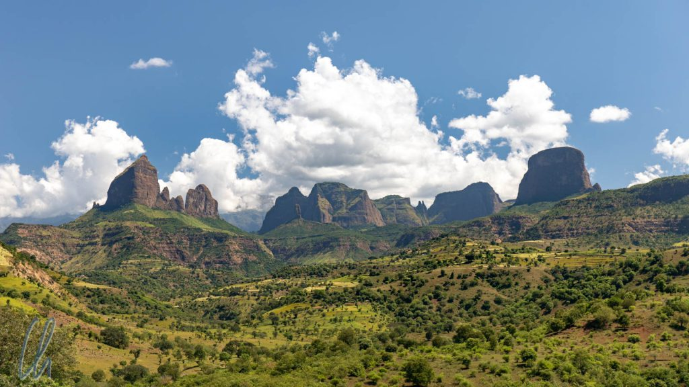
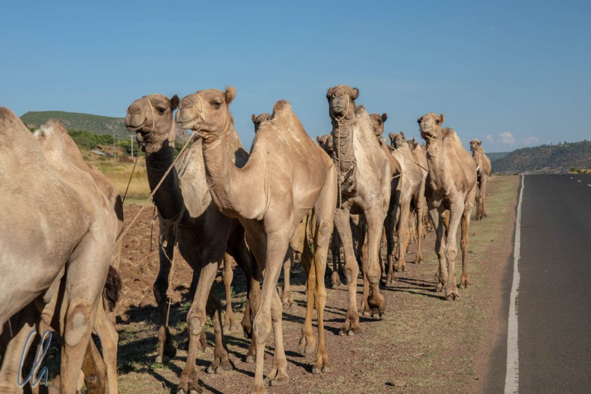
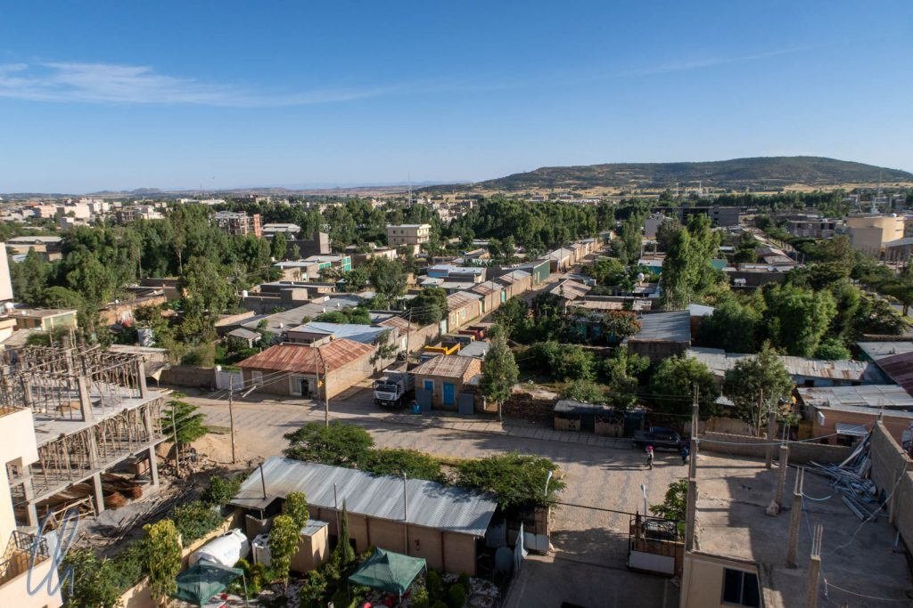

# Aksum, Aufbewahrungsort der Bundeslade?!

Aksum (auch transkribiert als Axum) ist ein Ort größter spiritueller und geschichtlicher Bedeutung in Äthiopien. Das legendäre [Aksumitische Reich](https://de.wikipedia.org/wiki/Aksumitisches_Reich) kontrollierte weite Teile des heutigen Nordäthiopien und Eritrea sowie die damit verbundenen Handelswege. Aksum ist außerdem die Wiege der äthiopisch-orthodoxen Religion und auch heute noch der wichtigste Pilgerort des Landes, da sich dort der heiligste mythische Kultgegenstand der Juden und Äthiopier befinden soll: Die Bundeslade.

<!--more-->

## Fahrt nach Aksum

Vom [Simien-Gebirge](http://wittmann-tours.de/das-simien-gebirge-heimat-der-dschelada-affen-und-aethiopischen-steinboecke) bis nach Aksum fuhren wir nur etwa 260km, aber es dauerte einen ganzen Tag. Der Weg war an diesem Tag wieder einmal das Ziel. Die Straße schlängelte sich die Berge hinab und weiter gen Norden. Unterwegs verlangsamten uns nicht nur die Schlaglöcher, sondern auch die Resten abgegangener Steinschläge, die uns zum Abbremsen zwangen. Ab und zu blockierten Steinblöcke, so groß wie eine Gartenhütte, eine der Fahrspuren. Auf der rechten Seite sahen wir das Simien-Gebirge aufragen und erste Wolken ballten sich darüber zusammen. 4 Stunden nach der Abfahrt hatten wir zwar schon 110km zurückgelegt, waren aber Luftlinie nur erst 30km (!) von unserem Startpunkt entfernt.

Ziemlich genau an der Stelle des obigen Fotos überquerten wir die Grenze nach [Tigray](<https://de.wikipedia.org/wiki/Tigray_(Region)>), der nördlichsten Verwaltungsregion Äthiopiens. Die Landschaft wandelte sich, es wurde trockener, wärmer, die Erde nahm eine rote Farbe an, es gab weniger Bäume, der Himmel strahlte in tiefem Blau und keine einzige Wolke trübte den Sonnenschein. Wir fingen im Auto zu schwitzen an, es wurde Zeit, die Pullover auszuziehen ;). Außerdem zeigte sich indirekt die Nähe zu Eritrea. Maru zeigte uns ein Flüchtlingslager für [Menschen aus Eritrea](https://www.thenewhumanitarian.org/news-feature/2018/11/15/eritrea-ethiopia-peace-leads-refugee-surge) und es gab einige Militärkontrollposten an der Straße. Grund für die zunehmende Migration war der Friedensvertrag, durch den die Menschen aus Eritrea einen Ausweg aus ihrem Land sahen, wo sie staatlicher Willkür ausgesetzt sein sollen und lebenslang zum Wehrdienst zur Verfügung stehen müssen.

In der trockenen Landschaft von Tigray sahen wir an diesem Tag auch zum ersten Mal eine Kamelkarawane in Äthiopien. Zwei Männer, einer vorne, einer hinten, trieben die etwa 30 Tiere am Straßenrand entlang. Maru vermutete, dass sie die Kamele nach Eritrea brachten, um sie dort zu verkaufen. Das sei lukrativ und nach dem Friedensvertrag jetzt wesentlich einfacher. Ein Kamel würde etwa 25.000 Birr erlösen, ungefähr 1.000 USD. Den Männern gehörten die Lasttiere aber nicht selbst, sie hatten nur den Auftrag, die Kamele sicher an ihren Zielort zu bringen.

## Das aksumitische Reich

Aksum ist heutzutage die wenig aufregende [Regionalhauptstadt](https://de.wikipedia.org/wiki/Aksum) von Tigray mit ca. 70.000 Einwohnern. Die Ortschaft spielte jedoch in der Geschichte Äthiopiens eine entscheidende Rolle und zwar so sehr, dass historische Zeitangaben häufig mit der Bezeichnung [prä-aksum](https://de.wikipedia.org/wiki/Pr%C3%A4-aksumitische_Periode) oder (weniger häufig) mit post-aksum versehen werden. In der Stadt Aksum befand sich der Herrschersitz der Könige des aksumitischen Reiches. Dieser bedeutende spätantike Staat erlebte seine Blütezeit zwischen dem 3. bis 6. Jahrhundert nach Christus und erstreckte sich auf dem Gebiet des heutigen Eritrea, Nordäthiopiens, Teilen des Sudans und Jemens. Damals war Aksum der wichtigste Warenumschlagplatz der Region und ein politisches Machtzentrum, wie es in Afrika seinesgleichen suchte.

Mit der Ausbreitung des Islam begann allerdings der Niedergang von Aksum, da es nach und nach von den profitablen Handelsrouten abgeschnitten wurde und damit an Einfluss verlor. Die kriegerische jüdische Königin [Gudit](https://de.wikipedia.org/wiki/Gudit) eroberte 960 schließlich die verbliebenen Gebiete des Reiches und tötete den letzten aksumitischen König.

## Die Stelen von Aksum

Zu seiner Blütezeit muss Aksum eine prächtige Stadt gewesen sein. Zeugnis davon legt auch heute noch das Stelenfeld ab, das erste Ziel, das wir zusammen mit unserem lokalen Führer Firdi besuchten. Die riesigen massiven Granitstelen dienten vermutlich als überdimensionierte Grabsteine, darunter befinden sich wohl die Grabkammern der aksumitischen Könige. Eingemeißelt in die Außenseite der Monolithen sind Strukturelemente aksumitischer Häuser mit Türen und mehreren Fenstern. Die Anzahl der herausgearbeiteten Stockwerke korrespondiert mit der der unterirdischen Gräber. So wirken die Monumente ein wenig wie sehr schmale antike Wolkenkratzer. Einer Theorie nach sollen die Stelen als symbolisches Tor in das Leben nach dem Tode gestaltet worden sein. Errichtet wurden die Denkmale wahrscheinlich als Machtdemonstration. Ein exaktes 3D-Modell, das auch die Grüfte unter der Erde darstellt, hat das [Zamani-Projekt](https://www.zamaniproject.org/site-ethiopia-aksum-stelae-field.html) erstellt.

Bis heute gibt es keine plausible Erklärung, auf welche Weise die tonnenschweren Stelen damals hatten aufgestellt werden können. Mögliche Theorien reichen von Flaschenzügen in Verbindung mit Arbeitselefanten bis hin zur Kraft der Bundeslade. Umso erstaunlicher ist es, dass einer der drei größten Monolithen, [König Ezanas Stele](https://en.wikipedia.org/wiki/King_Ezana%27s_Stela), seit dem 4. Jahrhundert nach Christus an seinem Platz steht. Das größte Monument hingegen, die Stele, die mit König König Remhai in Verbindung gebracht wird, liegt in Trümmern am Boden (es ist auf dem ersten Bild dieses Beitrags zu sehen). Es wäre 33 Meter hoch.

Die dritte der großen Stelen, der sog. "[Obelisk von Aksum](https://de.wikipedia.org/wiki/Obelisk_von_Axum)", überdauerte ebenfalls die Jahrhunderte, hat aber eine bewegte Geschichte hinter sich. Die italienischen Besatzer hatten offensichtlich Gefallen an dem Denkmal gefunden und nahmen es 1937 als Kriegsbeute ins Heimatland mit. 68 Jahre lang stand die Stele daraufhin in Rom vor dem damaligen Kolonialministerium, bevor die Italiener sie wieder zurück nach Äthiopien transportierten. (Vielleicht hat der eine oder andere sie bei einem Besuch der Ewigen Stadt gesehen?) Seit 2008 steht sie nun wieder im Stelenpark von Aksum.

## Die Kirche der Heiligen Maria von Zion

Schräg gegenüber vom Stelenfeld, tatsächlich einfach auf der anderen Straßenseite, steht die [Kirche der Heiligen Maria von Zion](https://en.wikipedia.org/wiki/Church_of_Our_Lady_Mary_of_Zion). Das erste Gotteshaus dieses Namens wurde an dieser Stelle im 4. Jahrhundert nach Christus gebaut. Damit gehen ihre Wurzeln bis zur Geburtsstunde der äthiopisch-orthodoxen Kirche zurück. [König Ezana](https://en.wikipedia.org/wiki/Ezana_of_Axum), dessen Stele wir vorher gesehen hatten, war als erster aksumitischer Herrscher zum Christentum konvertiert. Unter anderem wegen der relativen Isolation Äthiopiens nach dem Niedergang des aksumitischen Reiches haben sich die alten Traditionen dieser Religion bis heute erhalten.

In der Kirche der Heiligen Maria von Zion wurden traditionell die äthiopischen Kaiser gekrönt. Und in der Tat beruhte die Legitimation der Regenten auch auf der Durchführung dieser wichtigen Zeremonie in Aksum oder wenigstens einer Anerkennung des Herrschaftsanspruches im Rahmen einer heiligen Messe in diesem Gotteshaus.

Der aktuelle riesige Neubau der Kirche stammt aus dem Jahr 1950, Kaiser Haile Selassie gab die Konstruktion in Auftrag. Sie war mit Abstand das größte sakrale Gebäude, das wir in Äthiopien besuchten. Wie in Äthiopien üblich schmückten farbenfrohe Malereien biblischer Motive die Wände großzügig (aber nicht flächendeckend). Die Größe des Gotteshauses soll wahrscheinlich ihre Bedeutung widerspiegeln. Während andere Kirchen in Äthiopien nur eine Nachbildung der [Bundeslade](https://de.wikipedia.org/wiki/Bundeslade) bergen, befindet sich in Aksum das Original!

## Die Bundeslade

Um den Verbleib der biblischen Bundeslade, dieses heiligsten Kultgegenstandes, ranken sich unzählige Legenden und Mythen. Befindet sich die Bundeslade wirklich in Aksum? Liegt sie nicht doch verborgen im Inneren des [Mount Nebo](http://wittmann-tours.de/jordaniens-biblische-orte/)? Hat das [FBI sie unter Verschluss](https://de.wikipedia.org/wiki/J%C3%A4ger_des_verlorenen_Schatzes)? Oder ging die Bundeslade bei der [Eroberung Jerusalems 587. v Chr.](<https://de.wikipedia.org/wiki/Eroberung_von_Jerusalem_(587/586_v._Chr.)>) durch den babylonischen Herrscher Nebukadnezar II. verloren?

Für gläubige Äthiopier stellen sich solche Fragen nicht. Die Bundeslade befindet sich natürlich in Aksum in der Kapelle neben der Kirche der Heiligen Maria von Zion. Aber wie ist sie dort hingekommen? Nach äthiopischer Überlieferung nahm König Menelik I., der Sohn der Königin von Saba, ungefähr 980 v. Christus die Bundeslade aus Jerusalem mit, als er dort seinen Vater König Salomo besuchte. Seitdem befindet sich das hochverehrte Artefakt in der Kirche in Aksum, so steht es im Buch [Kebra Negest](https://de.wikipedia.org/wiki/Kebra_Negest) geschrieben. (Dass der erste sakrale Bau an jener Stelle im 4. Jahrhundert nach Christus errichtet wurde, ist dabei nicht von Bedeutung.)

Zahlreiche moderne Bücher haben im Laufe der Jahre mit diffizilen Argumentationsketten die Frage erörtert, ob sich die originale Bundeslade nun in Aksum befinden könnte oder nicht. Vor Ort selbst nachschauen kann man leider nicht, das wäre auch zu einfach ;). Für gläubige äthiopisch-orthodoxe Christen erfüllt ein Zweifel am Aufbewahrungsort des heiligen Kultobjektes den Tatbestand der Blasphemie. Tatsächlich ist es nur dem Mönch, dem die Aufgabe des Wächters des Artefaktes übertragen wurde, gestattet, die Bundeslade unverhüllt zu sehen.

Einmal im Jahr wird das Original im Rahmen einer großen religiösen Feier mit Seidentüchern abgedeckt in einer Prozession durch den Ort getragen. Doch was unserer Führer nicht erwähnte: Die Maße der mit wertvollen Stoffen behangenen Truhe, die den Gläubigen gezeigt wird, sollen nicht mit der detaillierten Beschreibung in der Bibel ([2.Mose 25,10-22](https://www.bibleserver.com/go.php?lang=de&bible=EU&ref=Ex25%2C10%E2%80%9322)) übereinstimmen. Es mutet also doch einiges reichlich mysteriös an…
