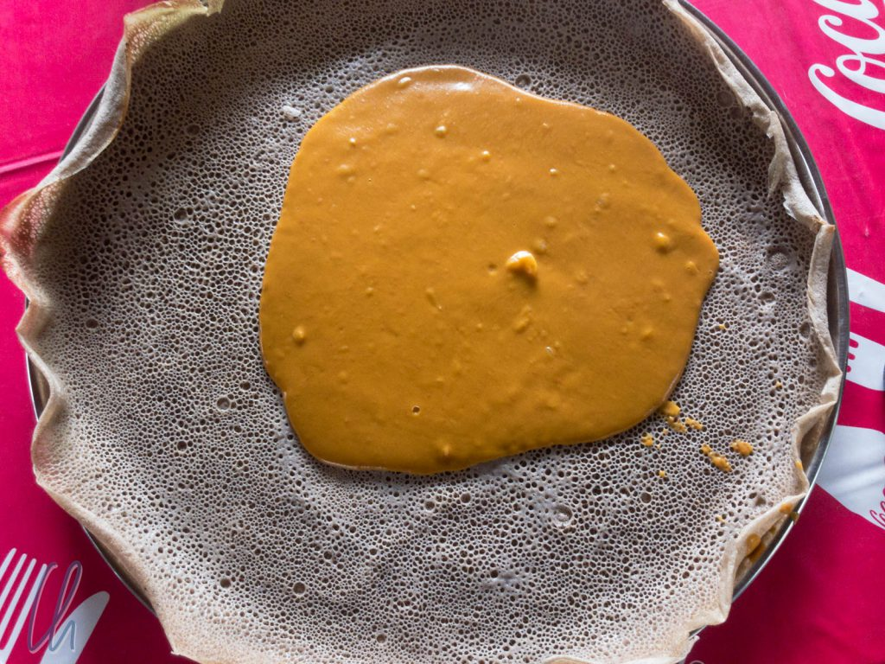
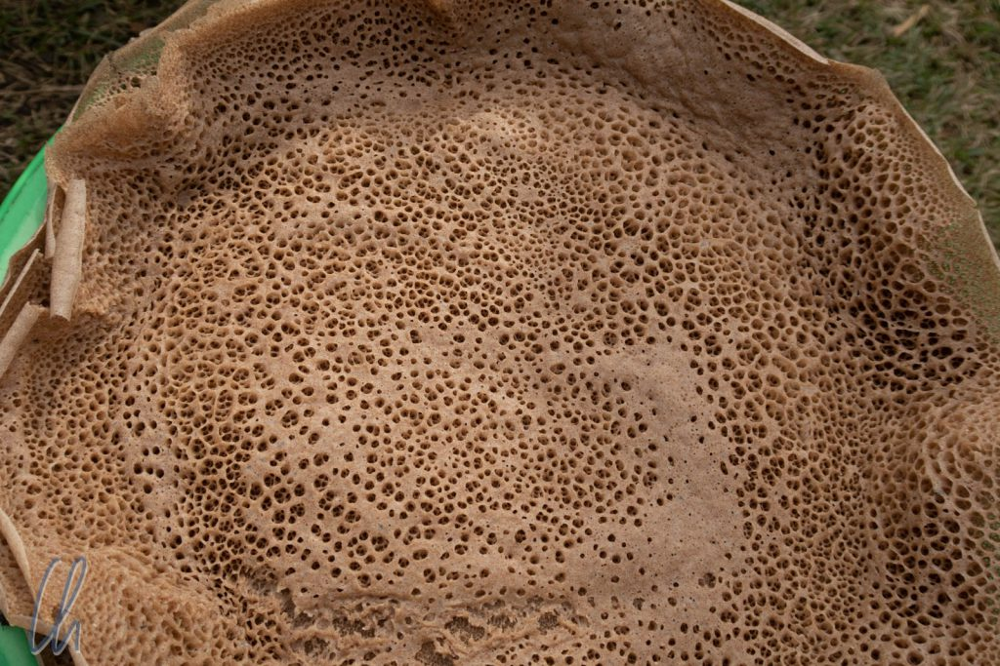
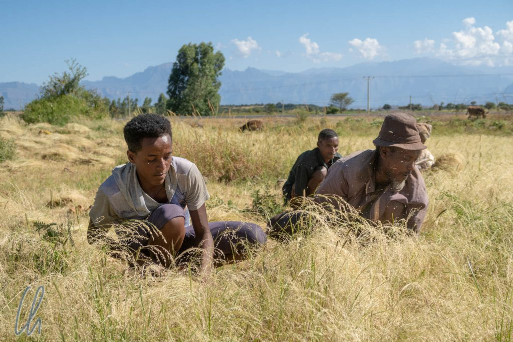

# Äthiopien kulinarisch: Injera mit Shiro

In Lateinamerika könnte man witzeln, dass es jeden Tag Hühnchen mit Reis gibt, dass man aber zur Abwechslung auch mal Reis mit Hühnchen essen kann. In Äthiopien besteht das Basisgericht aus Injera und Shiro. Injera ist eine spezielle Art von [Brot](https://de.wikipedia.org/wiki/Injera) und Shiro bezeichnet eine dickflüssige Soße aus Kichererbsen.

<!--more-->

## Teff, der Grundstoff für Injera

Was in anderen Ländern Reis oder Nudeln sind, ist in Äthiopien Injera. Es handelt sich um ein säuerliches Fladenbrot aus Teffmehl. Das Ergebnis sieht in etwa so aus wie ein überdimensionierter, luftiger Pfannkuchen. Die Konsistenz hat außerdem etwas von einem Schwamm (es ist also nicht knusprig), was praktisch ist, da man Stücke davon verwendet, um die gereichten Beilagen aufzunehmen und Soßen aufzutunken. Damit dient es nicht nur als Sättigungsgrundlage der Mahlzeit, sondern erfüllt auch die Funktion von Besteck. In Äthiopien isst man traditionell mit den Händen und nicht mit Messer und Gabel.

Die grundlegende Zutat von Injera ist [Teff](https://de.wikipedia.org/wiki/Teff), eine Hirseart, die in Äthiopien und Eritrea heimisch ist. Vielleicht wird Teff nach Quinoa bald zum neuen Supergetreide gekürt, es ist nämlich glutenfrei. Auf den Feldern sieht Teff auf den ersten Blick wie einfaches Gras aus, aber eigentlich ist [Getreide](https://de.wikipedia.org/wiki/Getreide) generell auch nichts anders als kultiviertes Gras. Die Körner sind verglichen mit denen von Weizen oder Roggen und selbst mit Sesamsamen (kein Getreide) sehr klein. Die Halme erreichten nur etwa eine Höhe von 30 Zentimetern.

## Bei der Teffernte

Wir bereisten Äthiopien im Oktober und die Erntezeit war in vollem Gange. So sahen wir häufig Bauern bei der Ernte und einmal hielten wir an, um uns die Arbeit der Menschen genauer anzusehen. Maru ging auf das Feld, redete mit den Bauern und forderte uns auf, ihm zu folgen. An der Teff-Ernte waren fünf Männer und zwei kleine Mädchen beteiligt, eines davon trug ein portables Radio an einem Riemen um den Hals und unterhielt so die Arbeiter. Um das niedrige Getreide zu ernten, hockten die Leute im Feld, griffen das Teff büschelweise und schnitten es mit einer Sichel ab, um es zunächst auf dem Boden abzulegen.

Die Bauern beäugten uns interessiert, arbeiteten aber trotzdem zügig weiter. Nach einem scherzhaften Wortwechsel griff auch Maru zu einer Sichel, so wie er es als Kind von seinem Vater gelernt hatte, und half in einem erstaunlichen Tempo mit, griff ein Büschel, Schnitt, griff ein Büschel, Schnitt, griff ein Büschel, Schnitt… Die Landwirte schätzten, wie Maru übersetzte, dass ihre Ernte dieses Jahr insgesamt ca. 800kg Teff erbringen würde, mehr für den eigenen Bedarf als zum Verkaufen.

## Wir backen Injera

Der Prozess, wie aus Teff der flüssige Injera-Teig wird, dauert 3 Tage und die Herstellung erfordert etwas Erfahrung. Typische Rezepte aus dem Internet beschreiben eine Kombination aus Teffmehl, Hefe und Wasser und der Teig kann auch relativ zügig gebacken werden. In der äthiopischen Realität nutzt man jedoch keine Hefe, sondern hebt vom alten Ansatz ca. einen Liter auf, um ihn der frischen Teffmehl-Wasser-Mischung zuzusetzen. Der dadurch in Gang gesetzte Fermentationsprozess dauert 2-3 Tage und läuft nur richtig ab, wenn man die benötigten Gefäße [nie wirklich saubermacht](https://link.springer.com/article/10.1007%2FBF02985300). Reines Teffmehl wird in Äthiopien nur selten verwendet und wäre absoluter Luxus, da es sehr teuer ist. Meistens benutzt man eine Mehl-Mischung aus Teff, Weizen und Dinkel, womit der Fermentierungsprozess dem eines [Sauerteigs](https://de.wikipedia.org/wiki/Sauerteig#Biologie_und_Chemie_des_Sauerteigs) ähnelt. Danke, Stefan, für die Recherche, ob man das wirklich alles so genau wissen möchte? ;).

Ist der Teig fertig gegoren, wird er auf einer großen, runden Tonplatte (Mitad) erhitzt. Dies durften wir ebenfalls einmal direkt neben der Straße beobachten und sogar ausprobieren. Als Maru eines Tages eine Frau neben der Straße Injera backen sah, hielt er an und fragte, ob wir zusehen und mitmachen dürften. Etwas zögerlich stimmte sie zu und fand es bestimmt sehr eigenartig, dass die Ferenji (so werden die Weißen in Äthiopien genannt) Injera zubereiten wollten.

Die Herstellung ist in der Tat ähnlich wie die von Crêpes. Man gießt den flüssigen Teig gleichmäßig auf die heiße Oberfläche, was einfacher gesagt als getan ist ;). Dieser wird nun mit einer Haube aus Korbgeflecht abgedeckt, damit sich die Hitze besser verteilt. Wenn der Teig nach 1-2 Minuten durch ist, bildet sich ein feines, wabenförmiges Muster. Injera unfallfrei zu wenden ist unmöglich, man bäckt es nur von einer Seite. Das fertige Brot löst man nun vorsichtig mit einer runden, dünnen, geflochtenen Matte, die unter das Brot geschoben wird, von der heißen Platte ab. Da der Prozess etwas aufwändig ist, backen die meisten Familien für mehrere Tage auf Vorrat.

## Beilagen zu Injera

Beim Servieren werden die Beilagen in der Regel auf dem Injera verteilt, d.h. die man löffelt die Soßen auf das Injera und leert die Schüsseln darauf aus. Es gibt zahlreiche begleitende Gerichte. Tibs z.B. sind gegrillte Rinderstückchen. Die meisten Speisen sind jedoch vegetarisch oder sogar vegan, wie das omnipräsente Shiro Wot oder einfach nur Shiro. [Wot](<https://de.wikipedia.org/wiki/Wot_(Gericht)>) bedeutet in etwa Soße und Shiro ist ein Kichererbsen-Curry. Es ist schmackhaft und immer ein wenig anders gewürzt.

Zusätzlich zum Haupt-Injera in der Mitte des Tisches bekommt man in der Regel zusätzlich noch aufgerolltes Injera und die absoluten Injera-Fanatiker bestellen [Firfir](https://en.wikipedia.org/wiki/Fit-fit). Firfir gibt es in vielen Varianten und es ist ein Curry, in dem Stücke von Injera untergemischt sind. Natürlich isst man es - richtig! - mit Injera. Wenn man im Norden Äthiopiens einheimisch essen möchte, dann kommt man um Injera unmöglich herum.

Injera selbst hat einen säuerlichen Eigengeschmack, der das Essen begleitet, da man vergleichsweise viel davon zu sich nimmt. Im Gegensatz zu Reis, z.B. als Beilage zu einem indischen Curry, ist der Injera-Geschmack deutlich wahrzunehmen, wohingegen der Reis eher in den Hintergrund tritt.

## Das ganze Jahr Fastenzeit

Im Gegensatz zu vielen anderen Ländern dieser Welt wäre es in Äthiopien kein Problem, eine vegetarische oder sogar vegane Ernährungsweise zu betreiben. Man könnte vermuten, dass Fleisch teuer ist (und das ist auch so), aber der wesentliche Grund liegt in der Religion. Die große Mehrheit der Äthiopier ist äthiopisch-orthodox und in dieser Glaubensrichtung gibt es bis zu [250 Fastentage](https://www.ethiopianorthodox.org/deutsch/calender.html) im Jahr, von denen 180 für die Gläubigen obligatorisch sind.

Die [Regeln](https://www.orthodoxe-ikone.de/fastenzeit-allgemein/) dieser Fastentage sind sehr komplex. Neben den Fastenzeiten sind auch in den meisten Wochen der Mittwoch und Freitag Fastentage, in Gedenken an den Verrat des Judas an Jesus Christus an einem Mittwoch und Jesu Kreuzigung am Freitag. Beim Fasten wird außerdem nach strengem Fasten (nur vegane Speisen) und leichtem Fasten (auch einige tierische Produkte) unterschieden. Zusätzlich sind auch bestimmte Uhrzeiten zu beachten.

## Zur Abwechslung mal Italienisch

So gut uns Injera und Shiro anfänglich geschmeckt haben, nach 3 Wochen hatten wir doch genug davon, vor allem, da uns die Abwechslung fehlte. Vielleicht war auch das Unterbewusstsein daran beteiligt. In keinem Land zuvor hatten wir so hartnäckige Verdauungsprobleme wie in Äthiopien. Mehr oder weniger wechselten wir uns im Laufe der Zeit mit milden Formen von Durchfall ab. Ohne es belegen zu können, hatten wir das Injera im Verdacht, da es alleine durch die Art seiner Zubereitung die Darmflora auf die Probe stellt.

Nach der anfänglichen Begeisterung wechselten wir ungefähr zur Halbzeit unseres Aufenthaltes im Land auf eine halb äthiopische, halb westliche Verpflegung. Nachdem das Frühstück in den meisten Hotels eher als kontinental bezeichnet werden könnte, nahmen wir meist eine weitere äthiopische Mahlzeit und die dritte westlicher Art ein, sehr oft italienisch. Auch wenn die Italiener Äthiopien nicht kolonialisiert haben, Pasta und Pizza sind mit Abstand die häufigste wohlschmeckende ausländische Kost.
