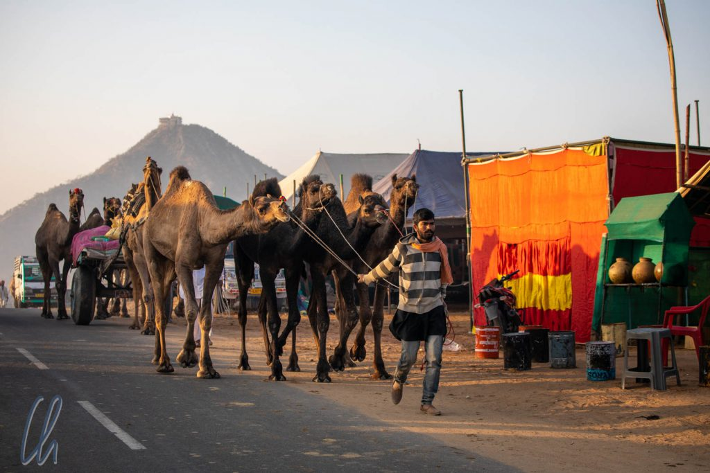
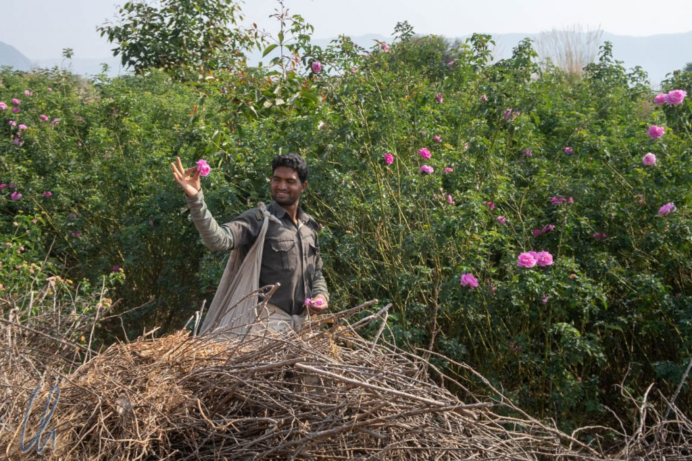

Nach den aufregenden Tagen in [Pushkar](http://wittmann-tours.de/der-pferde-und-kamelmarkt-in-pushkar) genossen wir das Glück der Erde eine weitere Woche auf dem Rücken der Marwari-Pferde. Angeführt von Ute ritten wir zusammen mit Annette, Brigitte, Yvonne, Sophia & Oliver (für 4 Tage) sowie Wiebecke & André (leider nur für einen Tag) gen Süden mit dem Ziel [Udaipur](https://de.wikipedia.org/wiki/Udaipur).

<!--more-->

## Von Pushkar ins ländliche Indien

Der Beginn unserer Reittour in Pushkar gestaltete sich ähnlich aufregend wie der Ritt über den Markt am Tag zuvor, allerdings wussten wir jetzt, dass wir uns auf die starken Nerven unserer Pferde verlassen konnten. Nur wenn Kamele in unser Blickfeld kamen, dann schnaufte Kirti entrüstet und tänzelte elegant, aber berechenbar, zur Seite ;). So mussten wir gleich zu Anfang eine belebte Straßenkreuzung überqueren, wo neben dem Auto- und Busverkehr auch Roller hupend links und rechts an uns vorbeifuhren. Am Rande der Fahrbahn hatten Händler ihre Stände mit bunten Waren aufgebaut, viele Leute waren unterwegs und das Leben pulsierte. Wir bogen nach links ab in den Bereich, wo die Pferdezüchter ihre Zelte aufgeschlagen hatten. Nach gut einer halben Stunde hatten wir den Ort und damit all den Wirbel hinter uns gelassen.

Wir durchquerten eine hügelige Dünenlandschaft, entspannenderweise ohne Trubel und ohne Kamele. Büschel von hohem Gras und einige dornige Akazien wuchsen in dieser wüstenartigen Gegend. Trotzdem dauerte es nicht lange, bis wir das nächste Dorf erreichten. Wir ritten auf Landwirtschaftswegen, teils asphaltiert, teils nicht asphaltiert und breit genug für ein Auto oder zwei Pferde, zwischen den Feldern entlang. Besonders erfreuten wir uns am Anblick einiger Rosengärten, welche einen berückenden Duft verströmten.

## Wasser für die Pferde

Unterwegs befanden sich immer wieder Wassertränken entlang des Weges, an denen die Pferde ihren Durst stillen konnten. Sie waren eigentlich für die Tiere der Bauern, die Wasserbüffel und Ziegen, vorgesehen und frei zugänglich. In dieser Gegend wirkte Indien sehr ländlich. Auch die Wasserversorgung der Haushalte wurde in vielen Dörfern anscheinend durch öffentliche Pumpen gewährleistet, von denen die Frauen das Wasser nach Hause tragen mussten.

In diesen kleinen Dörfern lebten wohl nicht die sprichwörtlichen Computerinder, es gab wenig Hinweise auf Indien als aufstrebende Wirtschaftsnation. Die Menschen führten ein einfaches bäuerliches Leben mit eingeschränkter Infrastruktur. Tatsächlich arbeiten immer noch knapp [60% der Inder in der Landwirtschaft](https://de.wikipedia.org/wiki/Indien#Landwirtschaft) (zum Vergleich: In Deutschland sind es [2,1% der Bevölkerung](https://de.wikipedia.org/wiki/Deutschland#Grundlagen)) und das BIP pro Kopf in Indien ist mit [etwa 2.000 USD (Rang 144 weltweit)](https://de.wikipedia.org/wiki/Liste_der_L%C3%A4nder_nach_Bruttoinlandsprodukt_pro_Kopf) eher gering. Diese Realität mag ein wenig überraschen, da es in Indien auch eine sehr gut verdienende Mittel- und Oberschicht gibt.

## Mittagspause im Schatten

Für die ausgedehnte Mittagspause steuerte Ute immer eine schattiges Plätzchen an, zum Beispiel in einem kleinen Wäldchen oder auf einem Hügel mit schöner Aussicht. Die Pferde konnten dann ein wenig verschnaufen und alle gemeinsam entgingen wir auf diese Weise der ärgsten Mittagshitze. Ute hatte keine [Dabbawallahs](https://de.wikipedia.org/wiki/Dabbawala) engagiert, um uns unsere Mittagsmahlzeit zu liefern. Stattdessen verpflegten unsere Reittiere sich selbst und wir griffen in unsere Satteltaschen, um unsere Tiffin-Boxen hervorzuholen. ("[Tiffin](https://de.wikipedia.org/wiki/Tiffin)" bedeutet "Mittagessen" in indischem Englisch).

Darin entdeckten wir jeden Tag ein anderes indischen Gericht, mal mit Kartoffeln, ein anderes Mal mit Gemüse. Dazu gab es zusammengerolltes [Chapati](https://de.wikipedia.org/wiki/Chapati) (dünnes indisches Fladenbrot) als Beilage, das die Morgenetappe immer unbeschadet überstand. Dies traf jedoch nicht auf die gekochten Eier zu: Bei einigen Exemplaren hielt nur die Alufolie die Schale noch zusammen, der Inhalt des Hühnerproduktes entpuppte sich trotzdem als unversehrt, bis wir es verspeisten ;).

## Auf Marwari-Safari

Unterwegs waren wir in allen Dörfern die große Attraktion. Manchmal konnte man den Eindruck gewinnen, die Menschen hätten noch nie einen Ausländer oder ein Pferd gesehen. Wir wurden bestaunt, fotografiert und gefilmt. Die (meisten) Kinder kamen gerannt, um uns zuzuwinken, nur einige Lausbuben warfen Steine und versuchten dadurch, die Rösser zu erschrecken. Ein wenig fühlten wir uns an das Reisen in [Madagaskar](http://wittmann-tours.de/category/afrika/madagaskar/) erinnert: Die Leute lächelten uns zu und grüßten (wir natürlich auch) auf eine freundliche und interessierte Art und Weise, nicht, um die Hand aufzuhalten. Dabei riefen die Kleinen uns häufig "Bye bye!" zu, was uns zunächst etwas verwunderte. Ute erklärte uns jedoch, die Formel "[Namaste](https://en.wikipedia.org/wiki/Namaste)" in Sanskrit könne gleichermaßen zur Begrüßung wie zum Abschied verwendet werden, ähnlich wie ein italienisches "[Ciao](<https://de.wikipedia.org/wiki/Ciao_(Gru%C3%9F)>)".

So durften wir auf dem Rücken der Marwaris ein Indien erleben, dass vermutlich vielen Besuchern verborgen bleibt. Uns erschloss sich ein Blick in das Leben auf dem Land. Obwohl auch einzelne Traktoren im Einsatz waren, arbeiteten die meisten Bauern ohne den Einsatz von Maschinen. Sie legten mit Hacke und Schaufel Bewässerungsgräben an oder pflügten ihre Felder mit dem Ochsengespann. Lustigerweise gerieten die großen Wasserbüffel trotz ihrer massiven Statur in Panik, wenn wir angeritten kamen, so dass sie meistens davonliefen.

Leider sahen wir immer mal wieder Plastikmüll, der meist außerhalb der Dörfer anscheinend auf Haufen zusammengetragen wurde. Manchmal durchstöberten Nutztiere den Abfall. Die Segnungen der Zivilisation hatten also auch schon ins Landleben Einzug gehalten… Aber Indien wäre nicht Indien, wenn die Welt nicht wenige Meter weiter ganz anders ausgesehen hätte. Wir begegneten großen, wild lebenden [Nilgai-Antilopen](https://de.wikipedia.org/wiki/Nilgauantilope), erspähten den farbenprächtigen Vogel [Indian Roller](https://de.wikipedia.org/wiki/Hinduracke) und ritten an leuchtend gelb blühenden Senffeldern vorbei. Einen lebendigen Zusammenschnitt unserer Erlebnisse zeigt das folgende Video:

https://www.youtube.com/watch?v=pW7aYr8wUks

## Der göttliche Ursprung der Marwari-Pferde

Abseits der landwirtschaftlichen Flächen, die die Dörfer umgaben, durchquerten wir sehr trockene Gebiete und tagsüber wurde es immer recht heiß. Die [Marwari-Pferde](<https://de.wikipedia.org/wiki/Marwari_(Pferd)>) sind bestens an dieses wüstenähnliche Klima angepasst, schließlich liegt ihr Ursprung dem Mythos nach im Zusammenwirken von Feuer und Wasser. Eine Legende erzählt, dass qualmende Flammen eines Abends die Augen eines Gottes reizten. Eine Träne, die aus seinem rechten Auges floss, verwandelte sich in einen Hengst, eine aus dem linken Auge schuf eine Stute. Daher glauben die Menschen, dass Pferde göttlich sind und dies erklärt ihre Kraft, Ausdauer und Tapferkeit.

Sehr sympathisch und immer ein Quell der Freude waren die typischen, sichelförmigen Ohren, deren Spitzen sich bei vielen Rössern nach vorne gerichtet sogar berühren. Verglichen mit anderen Pferderassen können die Marwaris ihre Ohren deutlich weiter bewegen, bis zu 180 Grad. Man sagt ihnen ein exzellentes Gehör nach. Außerdem wachsen ihnen mehr Haare in den Lauschern (um Windgeräusche besser herausfiltern zu können?). Diese für die Wüste praktischen Anpassungen, die wahrscheinlich ursprünglich als Folge einer Mutation entstanden sind, haben den Menschen anscheinend gefallen und so wurde bei der Zucht diese außergewöhnliche Form der Öhrchen bei den Marwaris gefördert.

Eine weitere Besonderheit der [Marwari-Pferde](http://www.princesstrails.com/german/horses.html) ist ihre vierte Gangart, der Revaal. Es handelt sich dabei um einen [Pass](https://de.wikipedia.org/wiki/Passgang), ähnlich dem der Islandpferde oder der [Paso Peruanos](http://wittmann-tours.de/ritt-auf-paso-peruanos-im-colca-tal/), also um einen Zweitakt. Einige Reittiere in der Gruppe konnten Revaal gehen, waren es aber nicht gewohnt. Daher trabten oder galoppierten wir auf den Abschnitten, wo es möglich war. Unsere Rösser stellten so immer wieder ihre Kraft, ihre Ausdauer und ihr Temperament unter Beweis. Trotz aller Geschwindigkeit konnten wir uns jederzeit auf unsere perfekt ausgebildeten Pferde verlassen. Einige der Tiere erkannten ihren Reiter bereits am dritten Tag und begrüßten sie oder ihn morgens freudig.

## Das Safari-Camp

Abends nach Abschluss unserer aufregenden Reitetappen erreichten wir das Camp, welches von der Crew fast jeden Tag an einem anderen Ort wieder aufgebaut worden war. Je zwei Reiter teilten sich ein großes Safari-Zelt mit echten Betten und einem Tischchen. Unsere Behausungen waren sogar hoch genug, dass man darin stehen konnte. Die faltbaren Unterkünfte wirkten nicht ganz so luxuriös wie die in [Kenia](http://wittmann-tours.de/auf-reitsafari-in-der-masai-mara/), aber trotzdem sehr komfortabel. Etwas lästig waren allerdings einige Kletten, von denen wir in Pushkar einen scheinbar unerschöpflichen Vorrat eingesammelt hatten. Immer wieder kamen Exemplare zum Vorschein und piksten, wenn wir barfuß in sie hineintraten. Autsch!

Zum Duschen und für wichtige Geschäfte gab es einen Toilettenwagen. In einem separaten Anhänger wurden Material und die Vorräte an Nahrungsmitteln transportiert. Morgens verwöhnte uns der Koch mit einem ausgedehnten Frühstück, abends mit wechselnden, schmackhaften, frisch zubereiteten Gerichten. In der Mitte unseres Zeltdorfes befand sich in der Regel ein zentraler Platz, der gleichzeitig als sozialer Treffpunkt und als Speisesalon fungierte. Dort stand ein langer Tisch, um den wir abends gemütlich saßen und uns unterhielten, bis uns die Kühle der Nacht ins Zelt trieb. Die Beleuchtung übernahm der helle Mond, so dass eine Taschenlampe nur notwendig war, um nicht wieder in eine Klette zu treten. Die meisten Abende lagerten wir in der Nähe eines Dorfes, so dass wir je nach Standort laute Musik von Hochzeiten, jaulende Hunde oder hinduistische Mantras als Untermalung hörten.

An einem Abend hatte Ute als Überraschung für uns die Darbietung von indischer Musik mit Tanz und Akrobatik organisiert. Die beiden Männer der Truppe waren mit einer doppelseitigen Trommel, einer [Dholak](https://de.wikipedia.org/wiki/Dholak), und einem [Harmonium](https://de.wikipedia.org/wiki/Harmonium#Das_Harmonium_in_Indien) für die Musik zuständig. Die beiden Frauen tanzten abwechselnd. Bei einer Einlage balancierte die eine dabei einen Behälter mit einem kleinen, offenen Feuer auf dem Kopf, während sie sich drehte und wiegte, und die andere trug beim Tanz zunächst einen, dann zwei, dann drei… am Ende zehn Gefäße übereinander auf ihrem Scheitel und schritt damit dann in der Manier eines Fakirs barfuß durch einen Scherbenhaufen.

## Indische Hochzeiten

Wie wir im Laufe der Reittour immer wieder merkten, war in Rajasthan die Hochzeits-Saison in vollem Gange. So wie wir abends die Musik der einen oder anderen Feier hörten, sahen wir tagsüber auch die Festivitäten vom Rücken der Pferde aus. Bevor wir die Hochzeitsgesellschaft allerdings zu Gesicht bekamen, kündigten sich die Feierlichkeiten bereits aus der Ferne mit voluminösen Klängen an, die von Party-Lkws mit vielen großen Lautsprechern gespielt wurden. Für einen kurzen Moment waren wir auch bei solchen Begegnungen die Attraktion. Kinder und Männer kamen gerannt, um uns anzuschauen, zu fotografieren oder zu filmen. Die Frauen in ihren leuchtend bunten Saris tanzten meistens weiter. Bei einer Gelegenheit schalteten die Leute freundlicherweise auch kurz die Musik für uns bzw. für die Pferde aus, damit wir passieren konnten. Trotz aller Gelassenheit war derart laute Musik unseren Reittieren denn doch nicht geheuer.

Marwari-Pferde spielen bei indischen Hochzeiten eine wichtige Rolle: Traditionell reitet der Bräutigam auf einem weißen, reich dekorierten Ross zu seiner Braut. Passenderweise sahen wir auch einen geschmückten Schimmel, welcher auf einem Transporter stand und auf seinen Einsatz wartete.

Bei derart vielen exotischen Eindrücken verging die Zeit wie im Fluge. Nach 6 Trail-Tagen wurden auch unsere Pferde auf Lkws verladen, um in die Nähe von Udaipur, auf die Farm von Ute und Virendra, ihrem Zuhause, transportiert zu werden. (Das letzte Stück des Weges wäre nicht schön zum Reiten gewesen). Von dort aus unternahmen wir am nächsten Tag einen letzten, landschaftlich wunderschönen Ausritt, bevor wir uns schweren Herzens von unseren herrlichen Marwaris verabschiedeten, die wir sehr ins Herz geschlossen hatten.

## Udaipur, Indien wie aus einem Bildband

Während wir auf dem Land ein Indien kennengelernt hatten, das viele Besucher so nicht erleben, erreichten wir mit Udaipur eine Stadt wie aus einem Rajasthan-Bildband. So stellt man sich im Westen eine indische Großstadt mit langer Geschichte vor und daher wollen viele Touristen sie besichtigen. [Rajasthan](https://de.wikipedia.org/wiki/Rajasthan) ist nicht umsonst der am meisten besuchte Bundesstaat Indiens mit vielen bekannten Sehenswürdigkeiten – Udaipur, die ehemalige Hauptstadt des Reiches Mewar, ist eine davon.

Die Gebäude Udaipurs umgeben die schimmernde Wasserfläche des [Pichhola-Sees](https://de.wikipedia.org/wiki/Pichhola-See), an dessen Ufer sich nicht nur der alles überragende [Stadtpalast](https://en.wikipedia.org/wiki/City_Palace,_Udaipur), sondern auch wunderschöne historische Villen, sogenannte [Havelis](https://de.wikipedia.org/wiki/Haveli), befinden. Auf einer Bootsfahrt bewunderten wir die prächtigen Fassaden, fuhren am [Lake Palace](https://en.wikipedia.org/wiki/Lake_Palace) vorbei und legten an der Insel des [Jagmandir Palastes](https://en.wikipedia.org/wiki/Jag_Mandir) an. Die beiden Prachtbauten waren früher Residenzen der Herrscherfamilie und sind heute Luxushotels. Für einen Blick in ihr reich ausgestattetes Inneres muss man nicht unbedingt ein Zimmer buchen, sondern kann sich stattdessen den Film [James Bond 007 - Octopussy](https://de.wikipedia.org/wiki/James_Bond_007_%E2%80%93_Octopussy) anschauen, der u.a. im Lake Palace und in dem auf einem Berg thronenden [Monsoon Palace](https://en.wikipedia.org/wiki/Monsoon_Palace) gedreht wurde.

## Märchen und Wirklichkeit

Im Museum des Stadtpalastes sahen wir anschließend auch einige der herrschaftlichen Räumlichkeiten, die mit ihrer verschnörkelt-verspielten Architektur, ihren bunt bemalten Kacheln, mit Blumen geschmückten Gottheiten, romantischen Innenhöfen, glitzernd verspiegelten Räumen, epischen Gemälden und der lebensgroßen Statue eines Elefanten der Schauplatz eines indischen Märchens hätten sein können.

Wie überall in Indien war die Realität allerdings nur wenige Meter entfernt. Auf den Straßen verlief der Alltag der Stadtbewohner in voller Lautstärke mit dem Geknatter und Hupen der Motorroller, den vielen Menschen auf der Straße, den bunten Ständen der Händler und den heiligen Kühen. Nirgendwo in Indien haben wir die Gegensätze so nah beieinander erlebt.

