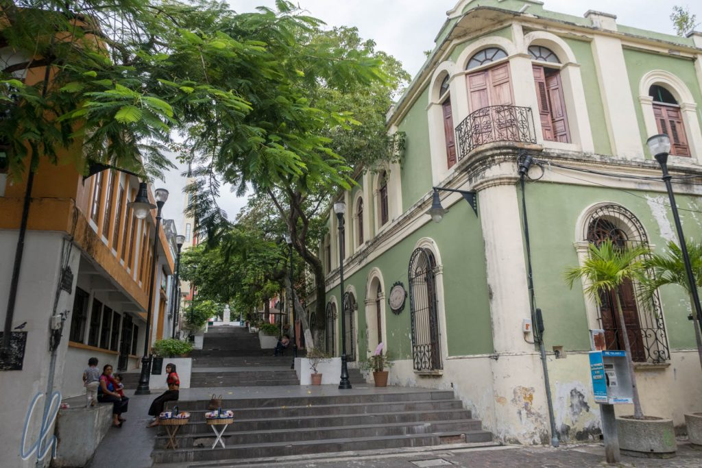
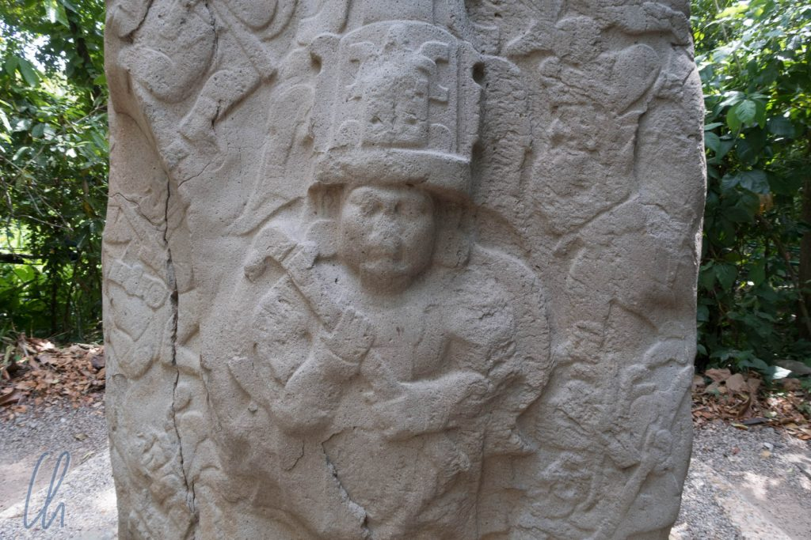
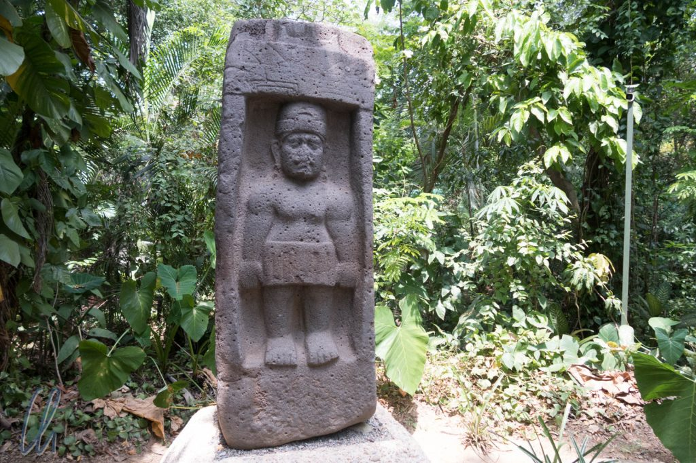
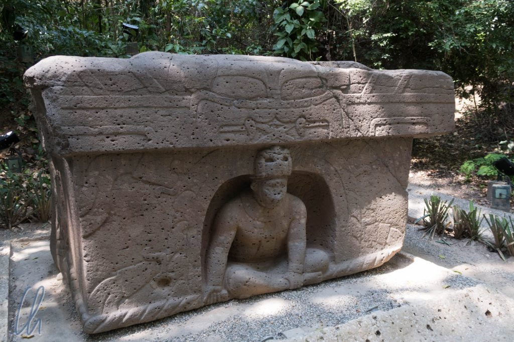

# Auf den Spuren der Olmeken in Villahermosa

Auf dem Weg in den Osten Mexikos, wo wir die berühmten Maya-Ruinen von Palenque und die weniger bekannte, aber nicht minder bedeutende Maya-Metropole Calakmul besuchen wollten (dazu mehr im nächsten Post), fuhren wir von [Oaxaca](http://wittmann-tours.de/in-oaxaca-und-um-oaxaca-herum/) aus mit dem Nachtbus nach Villahermosa. Als wir morgens im Bus aufwachten, staunten wir nicht schlecht, dass über Nacht draußen Palmen gewachsen waren. Willkommen zurück auf Meeresniveau!

<!--more-->

## Villahermosa, heutige Heimat der Tolteken

Für uns war Villahermosa, die Hauptstadt des Bundesstaates Tabasco, eigentlich nicht mehr als eine Durchreisestation, um es nach der Nacht im Bus ruhig angehen zu lassen und am nächsten Tag nach Palenque aufzubrechen. Der Reiseführer berichtete süffisant, dass der Name Villahermosa („die schöne Stadt") alles andere als der Wahrheit entspräche. Naja, der Ort ist keine Perle Lateinamerikas. Aber wir wollen die Stadt auf keinen Fall schlecht reden, schließlich gibt es dort den sehenswerten [Museumspark La Venta](https://de.wikipedia.org/wiki/Parque-Museo_La_Venta).

Dieser Park ist die angeblich beste Gelegenheit, archäologische Funde des Volkes der [Olmeken](https://de.wikipedia.org/wiki/Olmeken) zu Gesicht zu bekommen. Die Olmeken waren die erste bedeutende Hochkultur Mexikos zwischen 1500 und 400 vor Christus. Sie haben damit in vielen Bereichen den Grundstein für spätere Kulturen gelegt. Ihnen wird die erste Errichtung von Tempelpyramiden und das Ballspiel, sowie eine Schrift und Kalenderrechnung zugeschrieben. Vieles bleibt aber leider im Unklaren, gerade was ihre Gesellschaftsstruktur, ethische Vorstellungen und Religion anbetrifft. Was man weiß ist, dass sie gekonnt riesige vulkanische Gesteinsblöcke bearbeiten und transportieren konnten.

## Monumentale Werke der Olmeken

Sich wiederholende Motive sind gewaltige Köpfe mit teils negroiden (Lippen und Nase), teils asiatischen Zügen (mandelförmige Augen), die vermutlich wichtige Persönlichkeiten, z.B. Herrscher oder Krieger portraitierten. Die riesigen ca. 1,50 Meter großen Häupter ohne dazugehörigen Körper, Kolossalköpfe genannt, wirken teilweise erstaunlich lebendig. Häufig sieht man die Darstellung von höhlenartigen Strukturen, aus denen Menschen ans Licht gelangen. Diese werden als symbolische Darstellung des Mysteriums der Geburt gedeutet. Es tauchen auch immer wieder katzenähnliche Gravuren und Skulpturen auf, entweder als realistisches oder abstraktes Motiv oder als Bildnis einer zoomorphen Figur, also mit einer Mischung aus felinen und menschlichen Zügen. In diesem Zusammenhang vermutet man die Verehrung einer Jaguar-Gottheit.

Ein Großteil der Fundstücke im Museumspark steht nicht in einem klassischen Museum präsentiert, sondern in einem großen Park, umgeben von üppiger Vegetation. Die Exponate sind in [La Venta](<https://de.wikipedia.org/wiki/La_Venta_(Mexiko)>) gefunden worden, etwas 120km von Villahermosa entfernt. Sie wurden in den Park gebracht, um nicht durch Ölexploration zerstört zu werden.

## Der Zoo

Neben den archäologischen Ausstellungsstücken gab es auch einen Zoo, der erfreulich große Gehege und erstaunlich vielfältige, vor allem einheimische Tiere präsentierte. Unter anderem sahen wir viele bunte Vögel, Affen, Schlangen und Pekaris. Auch außerhalb der Umfriedungen bewegten sich einige ansässige Spezies, so z.B. wilde Brüllaffen und neugierige Coatis. Wir hatten Glück, die verschiedenen Katzenarten waren unerwartet aktiv. Wir sahen gelbe Jaguare, einen [Tigrillo](https://de.wikipedia.org/wiki/Tigerkatze), ein [Ozelot](https://de.wikipedia.org/wiki/Ozelot) und einen schwarzen [Jaguar](https://de.wikipedia.org/wiki/Jaguar), der durch sein Gehege schlich und sich lautstark äußerte.

https://www.youtube.com/watch?v=--vwgf8Ho-Y

Beim Mittagessen schlossen wir außerdem ungewollt enge Bekanntschaft mit den frei umherlaufenden [Coatis](https://en.wikipedia.org/wiki/Coati). Sie sind mit den Waschbären verwandt und nicht gerade scheu. Am Ende tauften wir sie Chaotis ;)

https://www.youtube.com/watch?v=Lvhc5BOG0wQ
