# Auf den Spuren der Römer in Jerash

Jerash ist eine der am besten erhaltensten und ausgedehntesten Römerstädte der Welt. Sie liegt 40 Kilometer nördlich von [Amman](http://wittmann-tours.de/erste-eindruecke-aus-jordanien-in-amman) und etwa genauso weit südlich der syrischen Grenze. Das moderne Jerash (bzw. [Gerasa](https://de.wikipedia.org/wiki/Gerasa)) ist eine Kleinstadt mit etwa 40.000 Einwohnern. Erstaunlich ist, dass die moderne Ortschaft nicht gänzlich auf den Ruinen der historischen Siedlung aufgebaut wurde, sondern scheinbar daneben. Anstelle von römischen Gebäuden in der Stadt (wie man es aus Rom, Trier etc. kennt) befindet sich die antike Stadt in einem separaten Areal neben den modernen Häusern. Dies hat seinen Grund darin, dass bei der Wiederbesiedlung der Region tscherkessische Siedler sich in den ehemaligen römischen Wohnvierteln östlich des Flusses niederließen. Dort begann dann auch die heutige Kleinstadt zu wachsen.

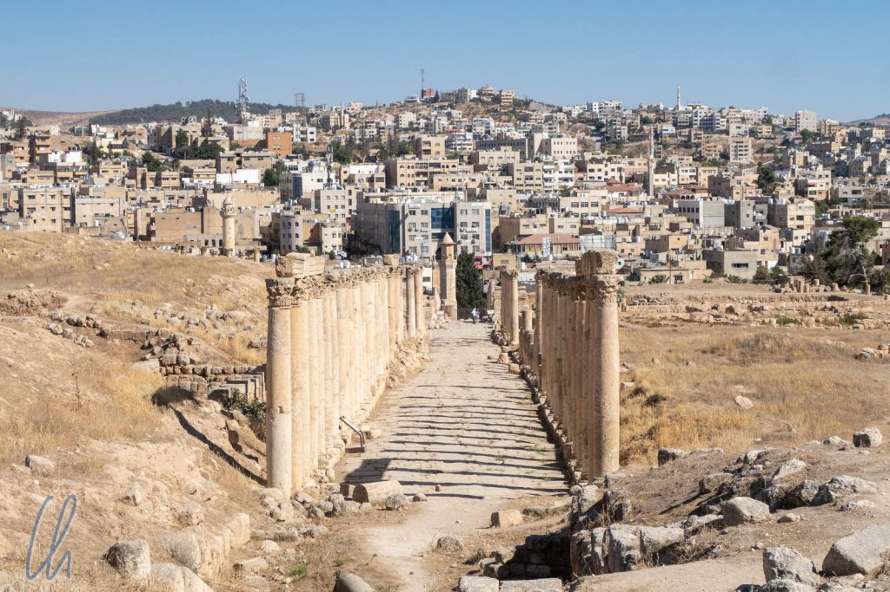

<!--more-->

## Das historische und moderne Jerash nebeneinander

Warum die historischen Ruinen auf der Westseite des Wadi Jerash nicht auch vollständig überbaut wurden, hat sich uns nicht vollständig erschlossen. Vielleicht waren die Trümmer der Prachtbauten, nachdem sie durch mehrere starke Erdbeben (wie in [Madaba](http://wittmann-tours.de/die-filigranen-mosaike-von-madaba)) zerstört worden waren, bei architektonischen Vorhaben im Wege.

Auch wenn wir über eine Römerstadt schreiben, so reicht doch die Geschichte viel weiter zurück. Die Griechen gründeten Jerash um 170 vor Christus, jedoch erinnern nur wenige Zeugnisse an diese Zeit. Ab 64 vor Christus übernahmen die Römer die Stadt. Sie wurde Teil der Provinz Syria und eine Stadt der [Dekapolis](https://de.wikipedia.org/wiki/Dekapolis). Strategisch gut gelegen entwickelte sich Jerash zu einem wichtigen Handelsstützpunkt.

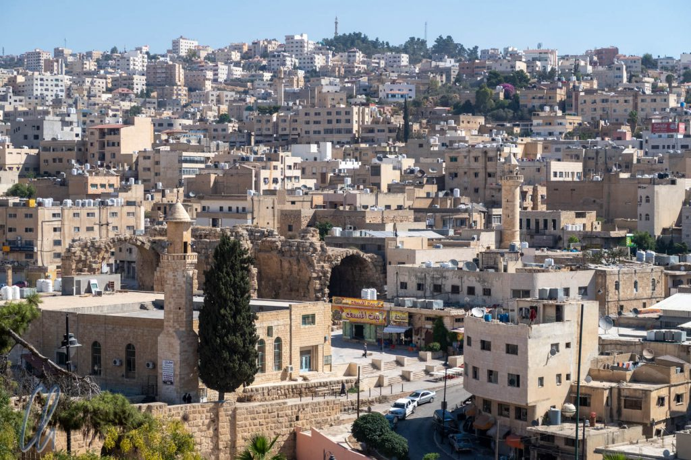

129-130 nach Christus erlebte Jerash eine Blütephase durch einen längeren Aufenthalt von Kaiser Hadrian. Dem Imperator zu Ehren wurde auch ein gewaltiger Triumphbogen errichtet. In der Folge änderte sich die politische Großwetterlage und die Stadt verlor an Bedeutung, ohne jedoch ganz unterzugehen. So wurde aus dem römischen Reich das byzantinische, die Muslime eroberten 636 die Region. 658 und vor allem 749 erschütterten zwei starke Erdbeben die Stadt. Die Auswirkungen müssen verheerend gewesen sein. Nach und nach verließen die meisten Menschen den Ort. Für mehr als 1000 Jahre gab es dort keine nennenswerte Siedlung mehr. Heutzutage ist das moderne Jerash um den Teil der historischen Stadt am westlichen Ufer des Flusses herum gewachsen. Eine Fläche von ca. 2km in Nord-Südausdehnung mit variabler Breite bleibt der alten Römerstadt vorbehalten.

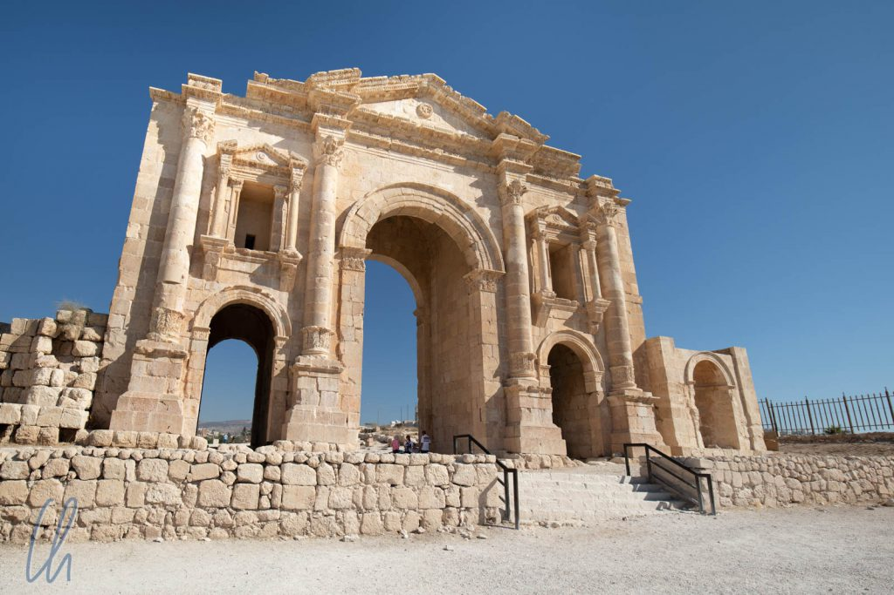

## Willkommen in Jerash

Wir betraten die römische Stadt durch den beeindruckenden [Hadriansbogen](<https://de.wikipedia.org/wiki/Hadriansbogen_(Gerasa)>), der zu Ehren Kaiser Hadrians 129/130 nach Christus errichtet worden war. Der Bogen ist aufwändig restauriert worden und vermittelt einen guten Eindruck des alten Glanzes der Stadt. Folgt man nun dem Weg in die Stadt, erreicht man als nächstes das nicht besonders große ("nur" 244 mal 52 Meter), aber noch voll funktionstüchtige Hippodrom, das damals immerhin Platz für 15.000 Menschen bot. Interessanterweise kann man dort in modernen Zeiten an fast jedem Wochentag Wagenrennen anschauen. Als Teil der Darbietung demonstrierten außerdem einige römische Legionäre die Kampftechniken der römischen Fußtruppen. Und nicht zuletzt kämpften einige Gladiatoren ebenso engagiert wie mitreißend um ihr Leben.

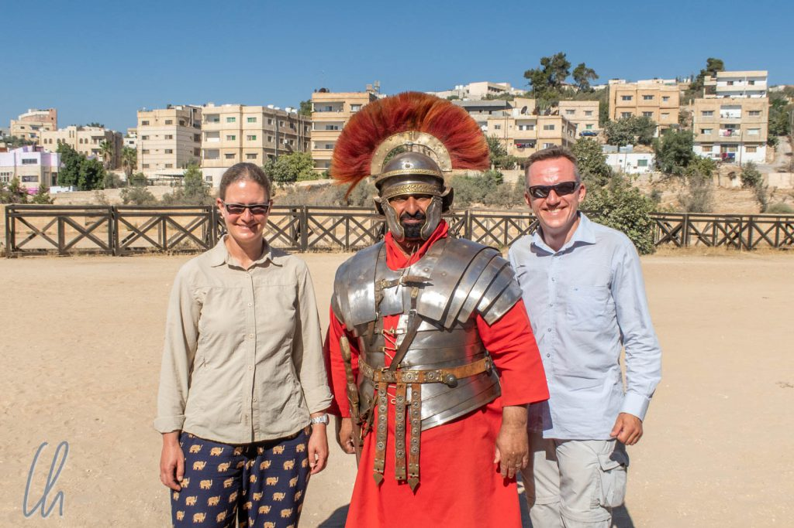

Die Karten für das Spektakel verkaufte uns ein römischer [Centurio](https://de.wikipedia.org/wiki/Centurio) in einer imposanten, historisch nachgebauten Uniform. In Ermangelung von [Sesterzen](https://de.wikipedia.org/wiki/Sesterz) konnten wir zum Glück in JOD bezahlen und nahmen mitten auf der Haupttribüne des Circus Gerasius in bester Manier der Caesaren Platz. Kurze Zeit später marschierte auch schon eine Gruppe Legionäre auf.

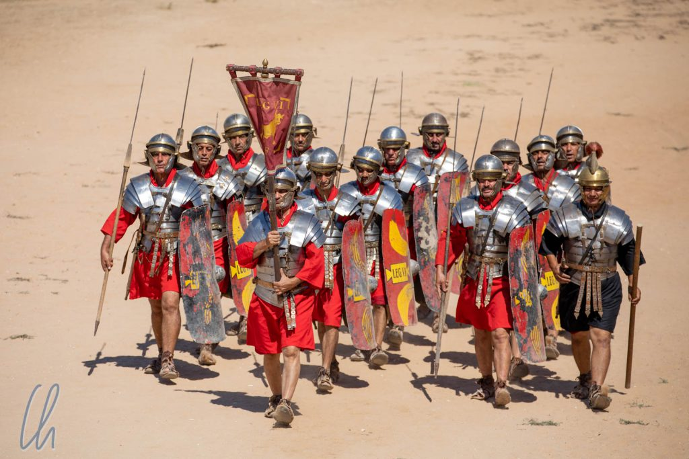

## Brot und Spiele

Sie präsentierten ihre [GladiI](<https://de.wikipedia.org/wiki/Gladius_(Waffe)>), ihre Lanzen und Schilde und zeigten, wie die römischen Soldaten nicht als einzelne Legionäre kämpften, sondern taktisch aufeinander abgestimmt agierten. Eine Strategie war zum Beispiel der "Rotate"-Befehl. Er bewirkte, dass sich in der Schlacht die erste Reihe der Römer hinter ihre Kameraden zurückziehen konnte, um sich zu regenerieren. Durch diesen Austausch rückten dann die Hintermänner nach vorne, so dass der Gegner immer körperlich frischen Soldaten gegenüberstand. Dieser Befehl konnte im Handgemenge alle paar Minuten gegeben werden. - Ein wesentlicher Vorteil im Kampf. Zur Demonstration bildete die Gruppe mit ihren Schilden auch die [Schildkröte](https://de.wikipedia.org/wiki/Schildkr%C3%B6tenformation) und weitere Formationen.

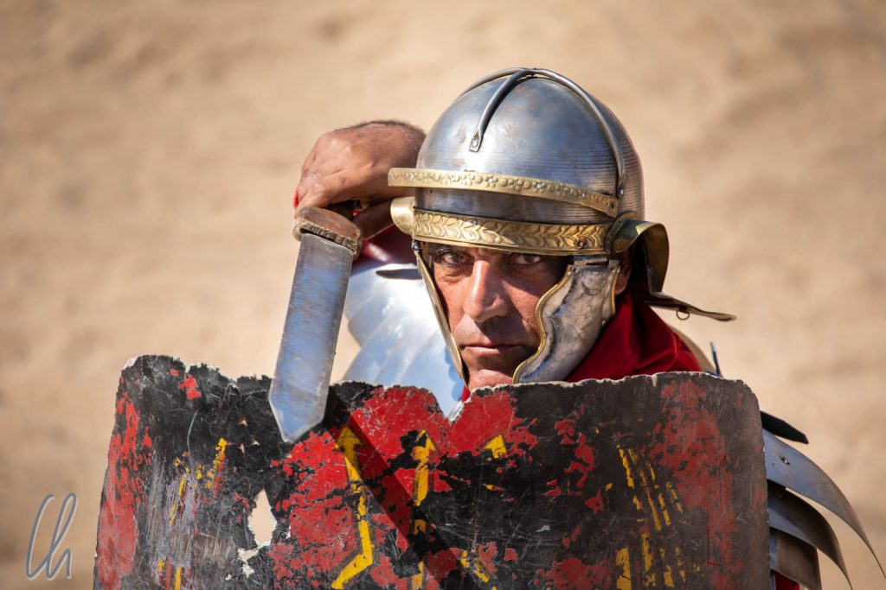

Anschließend betraten die Gladiatoren die Arena. Im Kampf Mann gegen Mann demonstrierten sie Wendigkeit und Kraft, jeder mit den Waffen seiner Wahl (Schwert, Dreizack etc.) und eher leichter Rüstung. War einer der Männer besiegt, durfte das Publikum wie in der Antike per Handzeichen über sein Schicksal entscheiden.

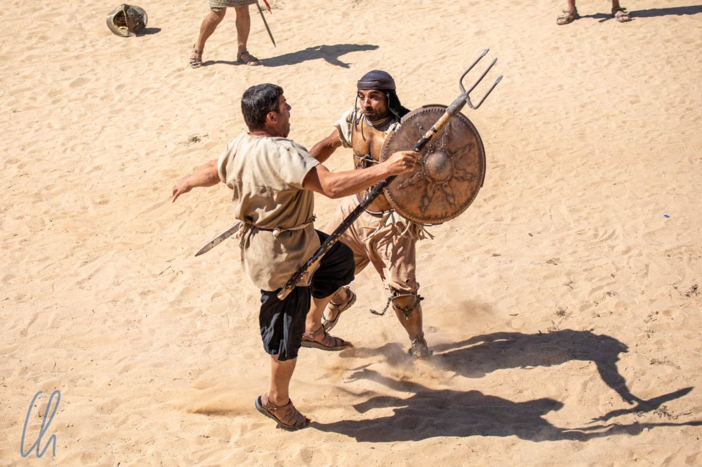

## Historische Wagenrennen

Zum krönenden Abschluss fuhren zwei doppelspännige Streitwagen à la Ben Hur ein, die in einem Rennen mit mehreren Runden gegeneinander antraten, zum Glück ohne Achsbruch, Sabotage oder Unfälle. Trotzdem war es ein spektakulärer Anblick, wie die Pferde in vollem Galopp über die Rennbahn jagten und mit wehender Staubfahne um die Kurven sausten.

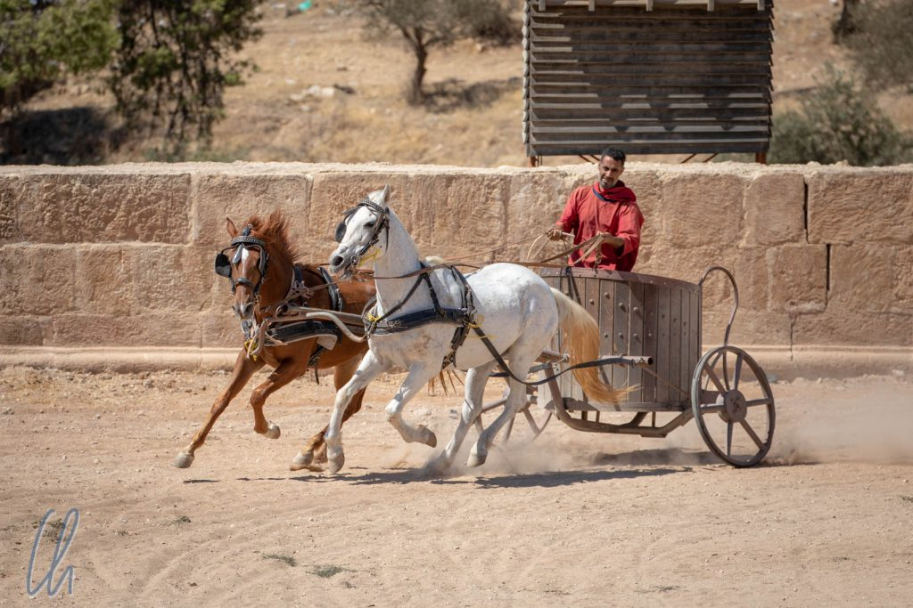

Bei der Konzeption des Wagenrennens im Hippodrom waren auch Leute beteiligt gewesen, die schon am Set von Filmen wie Ben Hur oder Gladiator gearbeitet hatten. Der Kompromiss zwischen Show und historischer Authentizität war unserer Meinung nach sehr gut gelungen. Nach Abschluss des Wettstreits bot sich sogar die Möglichkeit, selbst die Bühne zu betreten und zusammen mit den Darstellern für ein Foto zu posieren. Einer der Legionäre, mit dem wir ins Gespräch gekommen waren, lud uns sehr herzlich zum Abendessen ein, was wir leider ausschlagen mussten, da wir unsere Rückfahrt am Nachmittag schon gebucht hatten.

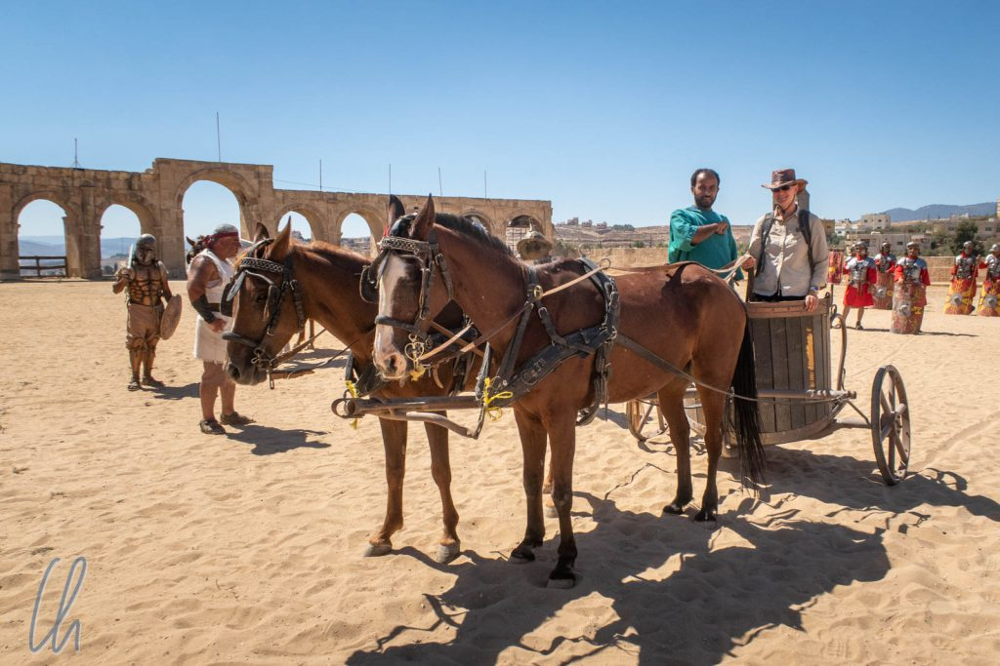

## Stadtrundgang im antiken Gerasa

Nach dem Ende des Spektakel im Hippodrom folgten wir der Straße in den antiken Stadtkern und überquerten dabei das sog. ovale Forum mit einem Durchmesser von 80 bis 90 Metern. Diese Form soll dem Betrachter vorgaukeln, dass der elegante Platz in Wirklichkeit rund sei. Dazu tragen auch die Säulen bei, die sich in ihrer Höhe dem leicht ansteigenden Terrain anpassen und damit die Perspektive ausgleichen.

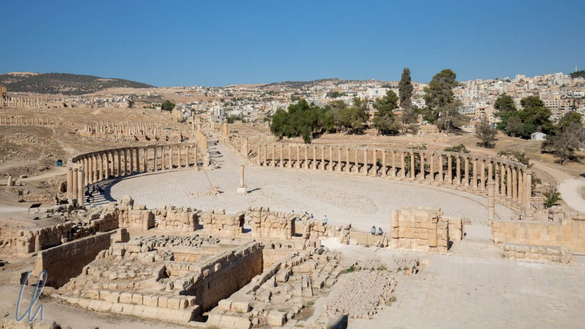

Weiter gingen wir auf der ehemaligen Hauptstraße, dem [Cardo](https://de.wikipedia.org/wiki/Cardo) Maximus, der die Nord-Südachse bildet. Er ist flankiert von zahlreichen Säulen und Gebäuden, von denen bei weitem nicht von allen bekannt ist, was ihre ursprüngliche Funktion einmal gewesen ist. Der Cardo war mit großen Steinplatten gepflastert, in die antike Wagenräder ihre Spuren eingegraben hatten. Für Fußgänger gab es schon damals einen Bürgersteig und unter der Straße befand sich eine Kanalisation.

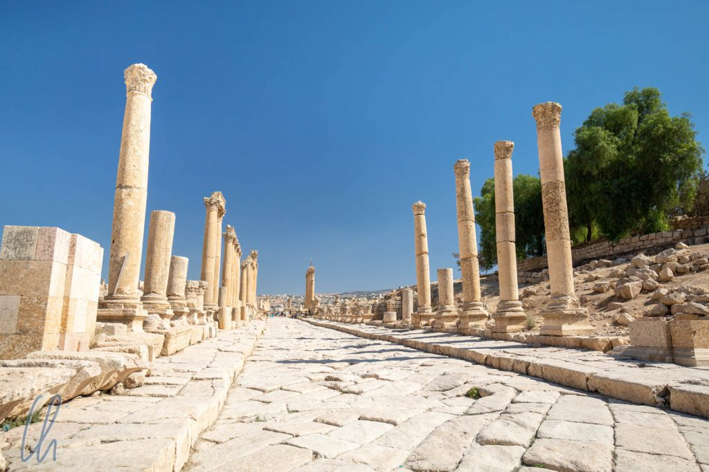

## Theater, Tempel, Kirchen und Mosaike

Von den größeren Bauten stach u.a. das [Nymphäum](https://de.wikipedia.org/wiki/Nymph%C3%A4um) ins Auge und natürlich die beiden Amphitheater. Im größeren der beiden erlebten wir 3 Araber, die Dudelsack und Trommeln spielten. Für ihre Darbietung nutzten sie die hervorragende Akustik des Theaters. Wir hatten sie schon von Weitem gehört und uns über die unerwarteten Klänge gewundert - so löste sich das Rätsel auf ;).

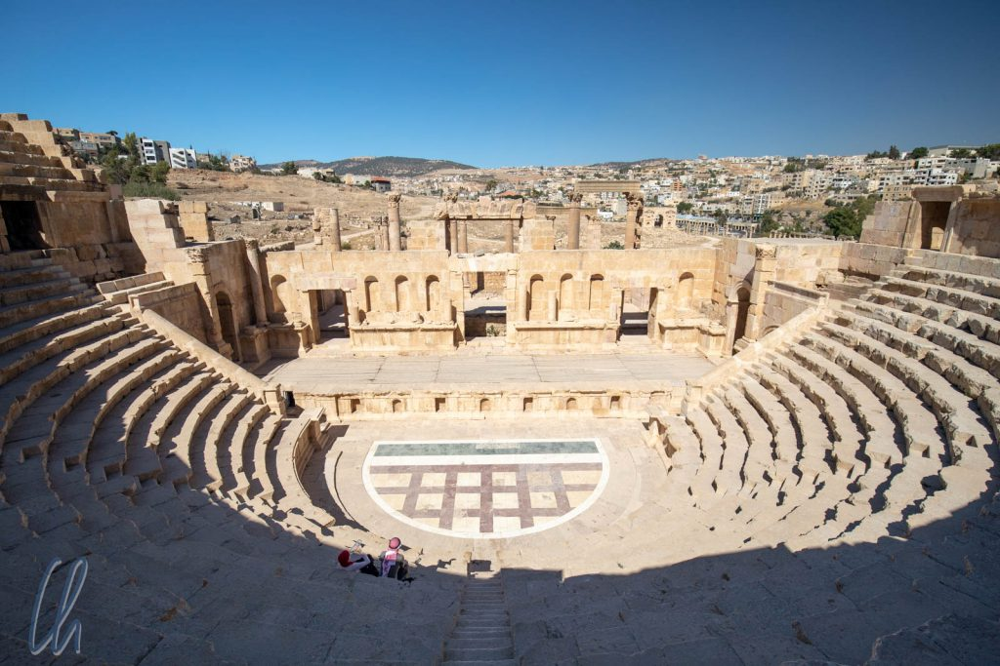

Einen herrlichen Blick über das antike und moderne Jerash hatten wir vom Tempel des Jupiter und vom luftigen Artemis-Heiligtum. Allein durch die Größe der Anlagen und den Ruinen nach zu urteilen müssen es früher ehrfurchtgebietende Anbetungsstätten gewesen sein. Aus späterer Zeit sahen wir die Grundmauern byzantinischer Kirchen, die mit feinen Mosaiken ausgelegt waren. Je weiter wir uns von der Hauptstraße entfernten, desto weniger aufwändig wurden die alten Schätze präsentiert. Einige Mosaike waren zum Schutz mehr oder weniger vollständig mit Sand bedeckt und es sah so aus, als ob an mehreren Orten weiterhin gegraben und geforscht würde. Es gibt bestimmt noch sehr viel zu entdecken.

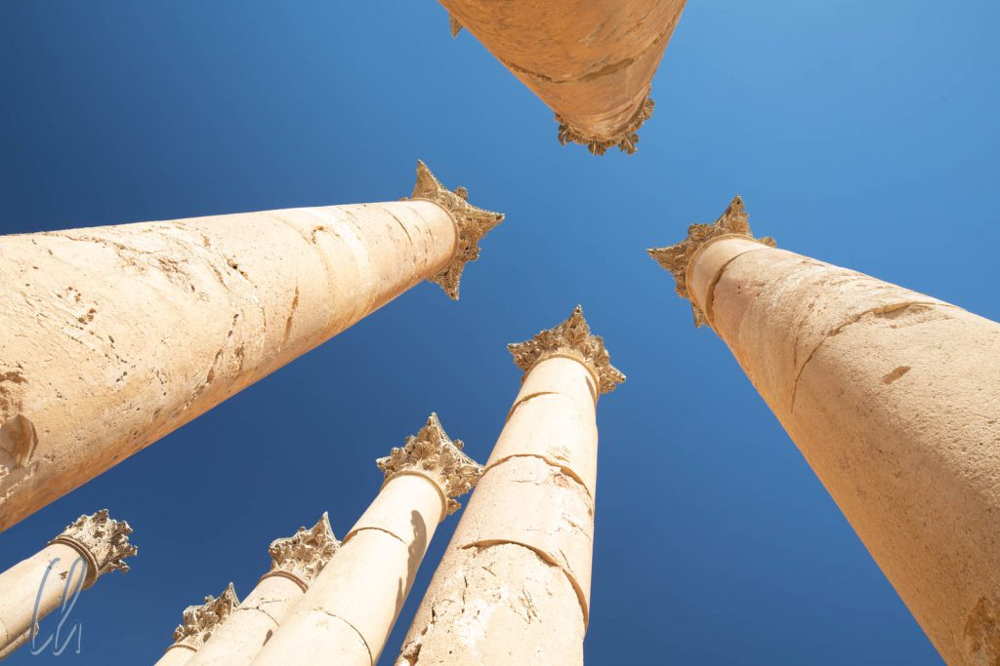

Nach unserem Besuch des antiken Gerasa fiel es uns nicht schwer zu glauben, dass der Ort eine der am besten erhaltensten und ausgedehntesten Römerstädte der Welt ist. Die Ruinen der historischen Siedlung erstrecken sich über ein riesiges, zusammenhängendes Areal, mit einigen erstaunlich gut erhaltenen bzw. wieder aufgebauten Gebäuden und sogar ganzen antiken Abschnitten wie dem Forum oder dem Cardo. Man fühlte sich fast wie mit einer Zeitmaschine in die Vergangenheit versetzt. Es hätte uns nicht weiter verwundert, wenn wir Gruppen distinguierter Römer in Togen, herausgeputzten Römerinnen mit künstlerischen Frisuren, Legionären, Sklaven und Ochsenfuhrwerken begegnet wären.
