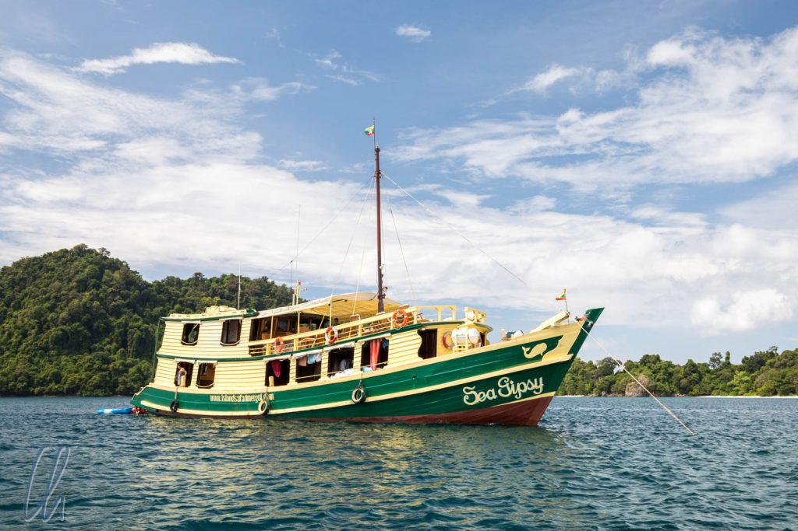
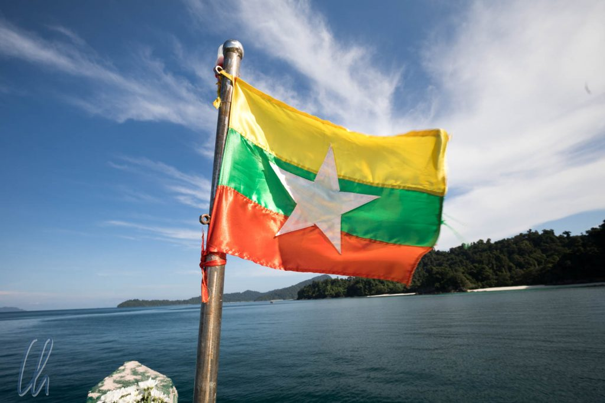
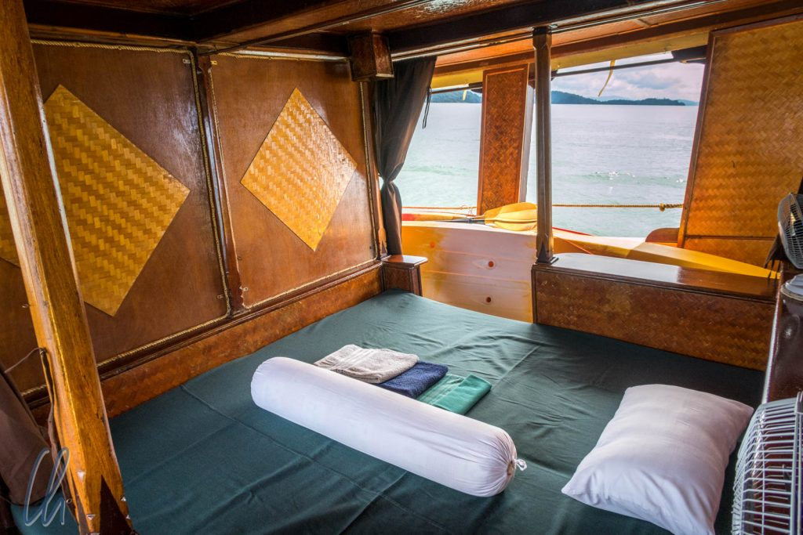
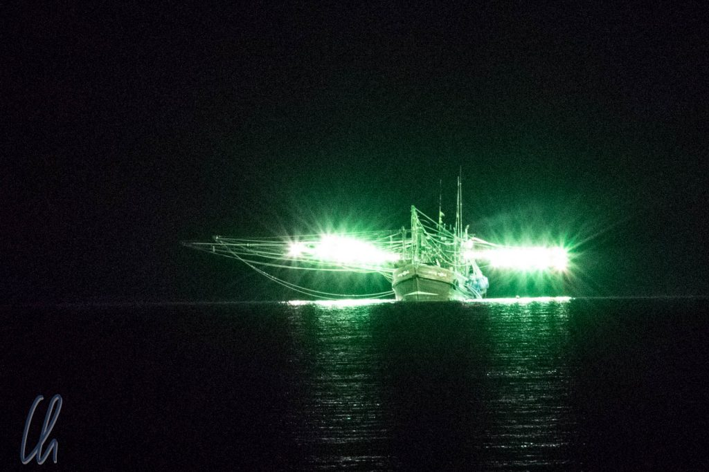
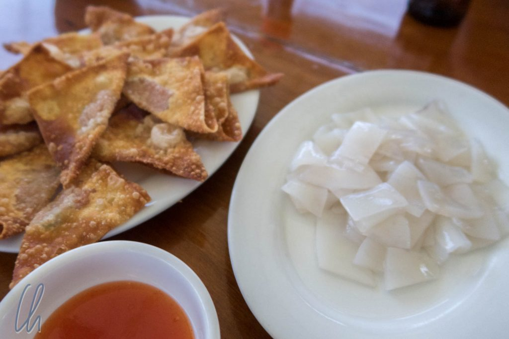

Nach 7 Wochen unterwegs machten wir "Urlaub vom Reisen" ganz im Süden von Myanmar. In [Kawthoung](<https://www.google.de/maps/place/Kawthaung,+Myanmar+(Birma)/@9.9963213,98.5344231,13.95z/data=!4m5!3m4!1s0x30564db9332efd15:0x594fdf223def259a!8m2!3d9.9958108!4d98.5528746>) gingen wir für 5 Tage zusammen mit Roos, Kees und Conny an Bord der Sea Gypsy, um durch das Myeik Archipel zu schippern. Der Name des Bootes ist von der ethnischen Minderheit der Moken inspiriert. Es sind Seezigeuner, die in der Trockenzeit in ihren Booten auf dem Wasser und in der Regenzeit an Land leben.

<!--more-->

## Paradies auf Erden

Für 5 Tage wurden wir also selbst zu Seezigeunern und lichteten den Anker, um an einigen der 800 Inselchen des Archipels vorbei durch die Andamanensee zu fahren. Jeden Abend lag die Sea Gypsy in einer anderen Bucht. Tagsüber beanspruchten uns Aktivitäten wie Schwimmen, Schnorcheln, Stand up Paddling oder Seekajakfahren, meistens bei Sommer, Sonne und Sonnenschein. Abends oder nachts gab es manchmal kurze Schauer oder etwas böigen Wind, aber das gehört auf See wohl einfach dazu.

Die "Kabinen" waren eher offene Schlafplätze, die durch Vorhänge von je einem Gang auf Backbord und Steuerbord abgetrennt sind. Trotzdem (oder gerade deshalb) waren sie sehr gemütlich. Da wir nur 5 Passagiere (maximal 10) an Bord waren, konnten wir uns sogar etwas ausbreiten.

Morgens, mittags und abends wurden wir von Ko Myo, dem Schiffskoch, seinem Assistenten Nei Nei und dem Rest der Mannschaft vorzüglichst versorgt. Neben frischen Früchten, leckeren Currys und schmackhaftem Gemüse waren natürlich die frisch zubereiteten Meeresbewohner die Stars der Menüfolge.

## Auf Tintenfischfang

Die meisten anderen Boote auf der Andamanensee sind nicht zum Vergnügen unterwegs sondern zum Fischfang. Auf besonders interessante Art und Weise fangen einige von ihnen Tintenfisch: Die Boote sind mit vielen kräftigen Lampen an seitlich befestigten Stangen ausgestattet. Bei einsetzender Dunkelheit werden die Lichter eingeschaltet, wodurch die Tintenfische angelockt werden. Wenn sich die Tintenfische um das Boot versammelt haben, werden die Lichter nach und nach ausgemacht, um den angelockten Schwarm unter einer Lichtquelle zu versammeln und dann abzufischen - hört sich einfach an, ist aber bestimmt trotzdem ein Knochenjob.

Als wir nachts in den diversen Buchten ankerten, sahen wir stets die beleuchteten Boote in der Ferne. Am zweiten Tag fuhren wir abends zu einem dieser Kutter und unsere Crew tauschte einige Bündel einheimischer Zigarren und 5 mal 1,5 Liter Softdrinks gegen einen Eimer Tintenfisch. Kurze Zeit später wurde die erste Charge als Sashimi-Snack serviert - das Leben an Bord war wirklich sehr hart ;)

## Unter den Wellen…

Beim Schnorcheln tauchten wir im wahrsten Sinne des Wortes in eine andere Welt ein. Einmal noch prüfen, ob die Maske sitzt, und wir ließen uns rückwärts über Bord des [Dingis](https://de.wikipedia.org/wiki/Dingi) fallen.

Platsch! - und Stille - wir schwebten im Wasser. Der Blick nach oben zeigte die Wasseroberflächenunterseite und Luftblasen stiegen funkelnd in die Höhe. Mit einigen Flossenschlägen drehten wir uns und erblicken die ersten Fische: Kleine blaue, silberne, längliche, mit goldenen Tupfen, größere grünblaue, knallig gelbe. An machen Stellen war das Meer wie ein Aquarium. Nemo haben wir auch gefunden!

Der Artenreichtum war noch sehr vielfältig. Trotzdem gibt es selbst in dieser scheinbar unerschlossen und ursprünglichen Meereswelt zahlreiche Probleme, die die Natur gefährden. Immer wieder trieb Plastikmüll vorüber, der leider von den einheimischen Fischern einfach über Bord geworfen wird. Außerdem gibt es anscheinend immer noch unerlaubte Dynamit-„Fischerei“. Als ob jemand an Land mit Fliegerbomben auf die Jagd gehen würde! Bei solcher Rücksichtslosigkeit für den kurzfristigen Profit kann man innerlich nur zornig werden und dem Buddha einige Blumen spenden, auf dass die Verantwortlichen maximal als Schlammspringer wiedergebohren werden. Trotzdem hoffen wir, dass das Myeik Archipel seine Ursprünglichkeit erhalten kann.

Zurück an Bord der Sea Gypsy studierten wir fleißig den deutschen "Riff-Führer" aus dem Jahr 1995. Dieses Kompendium war ein steter Quell der Freude und es belehrte uns, dass wir auch Barrakudas und Riesenkugelfische gesehen hatten. Trotz Fachliteratur konnten wir leider nicht alle Seesterne, Feuerfische oder Clownfische bestimmen. Auch blieb offen, ob es sich bei einem gelben Fisch um einen Stülpmaul-Lippfisch oder einen Dreipunkt-Kaiserfisch gehandelt hatte. Fischtaxonomie kann auch Spaß machen ;). Für die nächste Auflage würden wir empfehlen, in der Familie der Doktorfische auch den Doktor-Mona-Fisch aufzunehmen :).

## Besuch bei den Moken

Als echte Sea Gypsies war für uns ein Besuch in einem Dorf der Moken natürlich Pflicht! Wir nahmen die Panorama-Route und wurden auf der Südseite von Bo Cho Island abgesetzt. Von dort durchquerten wir den Dschungel auf der Insel zu Fuß. Dort zeigte sich einmal mehr, dass so ein Paradies auch seine Tücken haben kann. Die Mosquitos fielen nach kurzer Zeit über uns her, und trotz eines eher bewölkten Vormittags schwitzten wir in der schwülen Luft bald aus allen Poren. Zudem waren wir froh, dass es einen ausgetreten Weg gab. Schon einen Meter rechts oder links des Pfades wäre der Dschungel unpassierbar gewesen, so dicht standen die Pflanzen.

Im Dorf angekommen wurden vor allem von den kleinen Kindern überschwänglich begrüßt, die ihre helle Freude daran hatten, fotografiert zu werden und ihr Bild anschließend auf dem Display zu sehen. Von den echten Sea Gypsies haben wir leider nur recht wenig mitbekommen, da sie gerade in einem Konvoi von Booten das Dorf verließen.

## 5 Tage auf der Sea Gypsy

Wir hatten 5 einzigartige Tage an Bord in außerordentlich guter Gesellschaft: Danke Roos, Kees und Conny für die wunderschönen Tage, die wir zusammen verbringen durften. Gerne wären wir einfach weitergefahren!

Ein großes Dankeschön geht besonders auch an die gesamte Crew der Sea Gypsy: Danke an Cho Cho für die hervorragende Organisation und die tollen Ausflüge. Danke Captain Ko Ching für die sichere Fahrt und das Captain's BBQ, Ko Myo und Nei Nei für das wunderbare Essen, Lalu, für die tadellose Funktion der Technik an Bord und, last but not least, Ko Pyo für Deine stete Hilfsbereitschaft.

