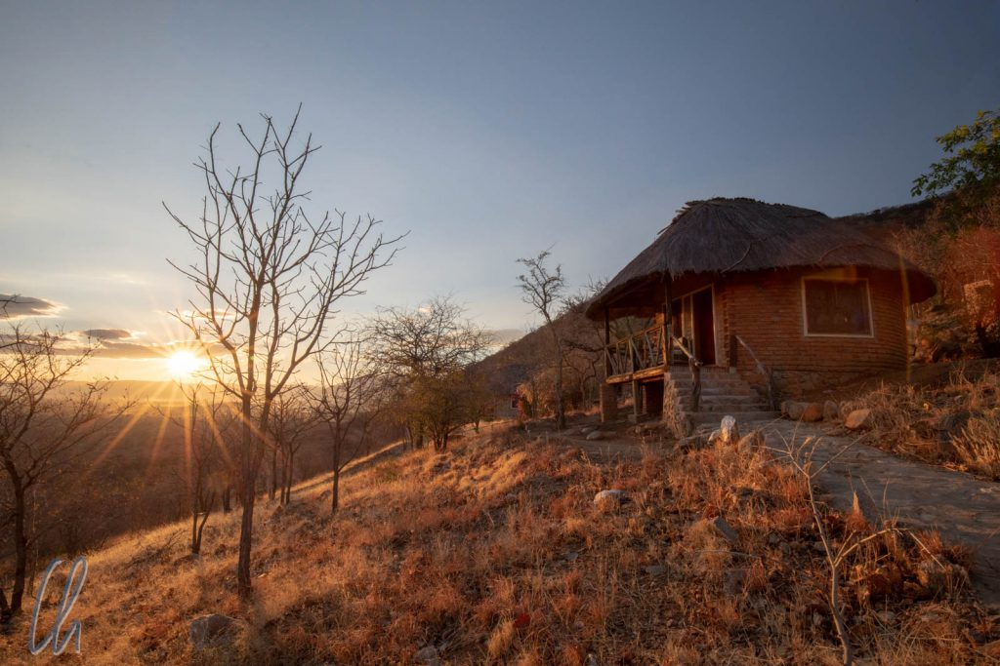

Im Ruaha Nationalpark waren wir dreieinhalb Tage lang klassisch auf Safari. Die meiste Zeit fuhren wir im Jeep durch den Park, waren aber auch einmal zu Fuß unterwegs, um die vielen Tiere, Pflanzen und die Landschaft anzuschauen. Wir waren sehr gespannt, was wir sehen würden. Die von Touristen oft ersehnten Big Five waren in Ruaha allerdings von vorneherein ausgeschlossen. Alle Nashörner waren von ambitionierten Jägern und Wilderern schon länger ins Nirvana befördert worden. Trotzdem, soviel nehmen wir vorweg, gab es wesentlich mehr als nur die Big Four zu sehen.

<!--more-->

## Die Ruaha Hilltop Lodge

Unser [Domizil](http://www.ruahahilltoplodge.com/) war die Ruaha Hilltop Lodge, die, wie der Name schon sagt, wenige Kilometer vom Parkeingang oben an einem Hügel gelegen die Ebene überblickte. Auch hier waren wir in den ersten beiden Nächten die einzigen Gäste. Dummerweise ;) kamen an den beiden anderen Tagen doch noch andere Besucher. Am persönlichen und aufmerksamen Service änderte dies jedoch nichts. Alois war für den Empfang zuständig und Exhaud kümmerte sich um die Gäste im Restaurant und das scheinbar rund um die Uhr.

Nach dem Abendessen zogen wir uns meistens erschöpft von den langen und aufregenden Fahrtagen zeitig in unseren Bungalow zurück. Morgens bekamen wir unser Frühstück immer schon vor Sonnenaufgang serviert, damit wir möglichst früh zum Nationalpark aufbrechen konnten. Am Fuße des Hügels, von der Terrasse aus gut zu überblicken, war eine Wasserquelle, an der sich gelegentlich sogar einige Tiere einfanden. Eines Morgens hörten wir wiederholt lautes Grunzen. Verwundert versuchten wir festzustellen, welche Art von Lebewesen diese Laute von sich gegeben hatte. Zu unserer Überraschung war ein Impala-Böckchen der Verursacher dieser Geräusche. Wer hätte gedacht, dass diese sonst so stillen, kleinen, fragilen Tiere solche gutturalen Lautäußerungen von sich geben?

Wie auch schon in [Mikumi](http://wittmann-tours.de/auf-safari-im-mikumi-nationalpark/) chauffierte Isaac uns im Jeep durch den Park. Donard blieb tagsüber in der Lodge, statt seiner übernahm der junge, engagierte Baraka die Funktion des Führers.

## Bürokratie am Parkeingang

Vor die Safari hat die [TANAPA](https://en.wikipedia.org/wiki/Tanzania_National_Parks_Authority) die tägliche Bürokratie gestellt. Mehrtagestickets? Fehlanzeige. Jeden Tag musste Baraka sich mit vielen Papieren und unseren Pässen bei den Rangern am Tor des Parks vorstellen, um die 20- bis 30-minütige Prozedur über sich ergehen zu lassen und die durchaus [beachtlichen Gebühren](http://ruahanationalpark.weebly.com/park-fees.html) zu bezahlen. Der Eintritt kostete 30 USD pro Ausländer und 150 USD für das Fahrzeug, die per Kreditkarte über eine instabile Mobilfunkverbindung zu bezahlen waren - mit ein Grund für das zeitaufwändige Verfahren.

Wir hatten also reichlich Zeit für einen letzten Boxenstopp, denn das Verlassen des Fahrzeugs war im Park nur an ausgewiesenen Rastplätzen erlaubt. Schließlich wollten wir nicht hinter einem Busch von einem Löwen gefressen werden. ;-)

## Willkommen im Ruaha Nationalpark

Fünf Kilometer hinter dem Parkeingang erreichten wir den namensgebenden [Fluss](https://de.wikipedia.org/wiki/Ruaha) des [Nationalparks](https://de.wikipedia.org/wiki/Ruaha-Nationalpark), den Great Ruaha River. Vom kleinen Parkplatz und von der Brücke über den Fluss aus sahen wir vor allem morgens viele Tiere. Immer wieder erschienen neue Herden: Erst tranken die Kudus, dann die Impalas, zwischendurch schnauften die Hippos wohlig im Wasser, ein Fischadler kreiste über unseren Köpfen, Krokodile dümpelten im Fluss und dann betrat eine Gruppe Elefanten die Bühne. Man hätte es sich auch einfach mit einem Sonnenschirm und einer gut gefüllten Kühlbox einen Tag lang dort bequem machen können und es wäre sicher nicht langweilig geworden.

Dennoch setzten wir unsere Fahrt nach einiger Zeit fort. Immer wieder begegneten wir unterwegs Gruppen von Tieren. Impalas waren bei weitem in der Mehrzahl, aber es gab auch erstaunlich viele Elefanten, Zebras, Giraffen und so weiter. Trotz der beachtliche Größe mancher Tiere erstaunte es uns, wie sehr sie trotzdem optisch mit der Landschaft verschmolzen. Es war keineswegs so, dass uns Elefanten oder Giraffen bereits aus weiter Entfernung ins Auge stachen. Sogar Giraffen sahen wir manchmal erst, wenn wir wenige Meter entfernt an den Paarhufern vorbeifuhren.

Neben dem Großwild gab es auch sehr viele Vögel, nicht nur was die reine Anzahl, sondern auch die Vielfalt der Spezies betraf. Besonders stolz war man im Park natürlich auf die beiden dort endemischen Arten, den "[Ruaha white headed black chat](https://en.wikipedia.org/wiki/Ruaha_chat)" und den "[Tanzanian red-billed hornbill](https://en.wikipedia.org/wiki/Tanzanian_red-billed_hornbill)" (Tockus ruahae). Den letztgenannten sah man im Park recht häufig. Trotzdem ist die Tatsache, dass es sich um eine eigene Spezies handelt (daran zu erkennen, dass die Zeichnung um die Augen herum nicht grau sondern schwarz ist!), erst seit wenigen Jahren bekannt.

## Vorsicht, Tsetsefliegen!

[Tsetsefliegen](https://de.wikipedia.org/wiki/Tsetsefliegen) sind vermutlich den meisten als Überträger der [Schlafkrankheit](https://de.wikipedia.org/wiki/Afrikanische_Trypanosomiasis) bekannt. Prinzipiell ist dies in Ruaha auch der Fall, die Durchseuchung ist aber relativ gering. Die tagaktiven Tsetsefliegen gab es außerdem nur in begrenzten Gebieten (kleinen Wäldern), so dass wir bei Verdacht die Fenster des Geländewagens schließen konnten. Eines dieser Areale lag allerdings zwischen Lodge und Parkeingang, wie wir erfahren mussten, so dass wir mindestens zweimal täglich ein Tsetse-Gebiet durchquerten.

Bei der Abwehr sind Insektensprays (auch hochkonzentriertes DEET) leider keine Hilfe. Selbst wenn man die Tierchen direkt einsprüht, stört sie dies (kurzfristig?) überhaupt nicht. Eine wertvolle Information ist jedoch, dass dunkle Farben die Fliegen anziehen. Am liebsten mögen sie Blau und Schwarz, aber auch dunkelgrün. Rund um den Parkeingang und den dortigen Parkplatz hingen deshalb dunkelblaue Tücher als Falle in den Büschen ausgespannt, die vermutlich mit Insektiziden getränkt waren. Daraus leitet sich die Empfehlung ab, auf Safari eher helle Kleidung zu tragen. Allerdings auch kein strahlendes Weiß, da dies wiederum die afrikanischen Tiere verschrecken könnte, die man eigentlich sehen möchte. Ein helles Safari-Beige ist damit wohl am besten.

## Der Kampf mit den Tsetsefliegen

Eines Morgens hatten wir dummerweise den Fehler begangen, in der Nähe des von Tsetsefliegen infestierten Gebietes anzuhalten, um Vögel zu beobachten. Leider war der dunkelgrüne Geländewagen wohl ein überaus attraktives Ziel und bevor wir uns recht besannen, hatten uns die Insekten erfolgreich umstellt (umflogen?). Wir schlossen sofort die Fenster, aber es war schon zu spät. Mehrere Dutzend Fliegen waren bereits ins Innere des Wagens gelangt. Da die natürlichen Opfer der Blutsauger sich bewegen, klebten die lieben Tierchen erst recht am Auto, als wir losfuhren. Trotz flotter Fahrt konnten wir die Plagegeister nicht abschütteln und auch fliegend konnten sie durchaus mithalten.

Sie waren ungefähr einen Zentimeter lang, summten aggressiv und die Stiche waren recht schmerzhaft. Isaac hatte einige Lappen dabei, eigentlich um das Auto zu entstauben. Nun mussten sie stattdessen als Tsetsefliegenklatschen herhalten. Dabei verwunderte uns, wie widerstandsfähig die Insekten waren. Ein Schlag, der eine mitteleuropäische Stubenfliege sicher ins Jenseits befördert hätte, bewirkte häufig nur, dass die Tsetses kurz betäubt dasaßen oder auf dem Rücken lagen, sich dann aber wieder berappelten und uns mit neuem Elan attackierten. Es dauerte mindestens 10 bis 15 Minuten, bis der Innenraum des Autos wieder fliegenfrei war. Als wir am Parkeingang anhielten, umgaben immer noch einige Exemplare unseren Jeep. Isaac machte den überlebenden dann unbarmherzig den Garaus.

## Freiluftzoo Ruaha

Am zweiten Tag sahen wir morgens vergleichsweise wenige Tiere. Trotzdem wurde es uns auf Safari nicht langweilig. Baraka erklärte uns unter anderem das soziale Gefüge in den verschiedenen Herden. Bei den Elefanten zum Beispiel gibt es mindestens drei Formen des Verbandes: Familien mit einer erfahrenen Leitkuh, Weibchen und ihren heranwachsenden Elefantenkindern, Gruppen aus männlichen Junggesellen und männliche Einzelgänger. Meist leben entweder junge Bullen oder alte Tiere allein. Die Männchen stoßen nur zur Brunftzeit zu den Familien-Herden, um sich zu paaren.

Auch die Flora hatte einige Kuriositäten zu bieten. Eine verbreitete Pflanze mit länglichen roten Blüten stach aus der sonst eher kargen Vegetation hervor. Aufgrund ihrer Form bezeichnet man sie als [Affenbürste](https://en.wikipedia.org/wiki/Combretum_rotundifolium) oder einfach als Zahnbürstenstrauch.

## Ein Löwenrudel

Der Morgen plätscherte ein wenig dahin, doch auf einmal gab es förmlich einen Paukenschlag! Eine Löwin schritt nur wenige Meter von uns entfernt parallel zu unserem Weg durch die Büsche. Mit ihrem sandfarbenen Fell war sie optimal getarnt. Dann entdeckten wir noch eine, und noch eine, und noch mehrere. Ein ganzes Rudel lief zielgerichtet durch das trockene Gestrüpp. Nach kurzer Zeit ließen sich die Raubkatzen alle im sehr begrenzten Schatten eines kärglichen Busches nieder.

Die Damen waren sehr hungrig und gereizt. Den Busch hatten sie nicht zufällig ausgewählt. In der Nähe verlief ein Fluss und einige Pfade zum Ufer führten dort vorbei. Früher oder später würden Tiere diese Wildwechsel benutzen, um zum Wasser zu gelangen und zu trinken. Genau an solch einem Zugang zur überlebensnotwenigen Tränke lagen die Löwinnen. Unseren Jeep, geparkt in etwa 15 Metern Entfernung, ignorierten sie vollkommen. Aber natürlich würde keine Beute kommen, solange wir dort waren. Also fuhren wir nach einigen Minuten weiter und wünschten den Damen Waidmannsheil.

## Picknick mit Wildlife

In ungefähr einem Kilometer Entfernung von der Stelle, wo wir die Löwen gesehen hatten, lag unser designierter Picknickplatz, ebenfalls am Fluss. Es gab ein paar Sitzgelegenheiten und Tische im Schatten einiger großer Bäume sowie ein Toilettenhäuschen. Der Ort war aber nicht von einem Zaun umgeben. Trotz der spärlichen Anzeichen von Zivilisation waren wir weiterhin mitten im Nationalpark zwischen den wilden Tieren. In der Ferne, auf der anderen Seite des Flusses, zogen einige Giraffen entlang des Ufers und sie erinnerten uns daran.

Sehr niedlich und zutraulich waren einige Hörnchen, die offensichtlich in den schattenspendenden Bäumen wohnten und genau wussten, dass die Touristen immer leckere Lunchpakete dabei haben und dass sie selbst, die kleinen Nager, unwiderstehlich süß waren. Da musste es doch etwas zu holen geben bei den Picknickern! Auch ohne dass wir sie aktiv fütterten fanden sie genug Krumen von uns und vorherigen Gruppen und knusperten diese emsig in unserer Nähe.

## Ein Leopard zeigt sich

Auch auf Safari hat das [Murphy'sche Gesetz](https://de.wikipedia.org/wiki/Murphys_Gesetz) Gültigkeit. Kaum hatten wir uns eine Mini-Auszeit gegönnt, um während der Fahrt ein paar Erdnüsse zu knabbern, da rief Baraka plötzlich: "A Leopard! Did you see it?" - Natürlich nicht, wir waren ja gerade anderweitig beschäftigt gewesen… Dann sahen wir doch noch für eine kurze Sekunde ein Leopardenmuster im Busch verschwinden… Ganz langsam fuhr Isaac weiter, wir schauten nach rechts, wohin das Raubtier verschwunden war, in der Hoffnung, mit unserem Röntgenblick etwas im Dickicht zu erspähen, da sagte Isaac auf einmal: "Left!", und tatsächlich war das Kätzchen auf einmal auf der linken Seite des Wagens, musterte uns kurz und entfernte sich.

Wir fuhren ein Stückchen bis zur nächsten Kurve und hielten Ausschau. Einige Vögel schlugen Alarm, der Leopard war also noch in der Umgebung. Kaum hätten wir es für möglich gehalten, da zeigte er sich wieder. Er schlich durch das Dickicht, in etwa 10 Meter von uns entfernt. Lautlos bewegte er sich, elegant und bestens getarnt, schenkte uns keinerlei Beachtung und wurde wieder vom Gestrüpp verschluckt. Zum Glück folge die Piste ungefähr seiner Richtung, also fuhren wir langsam weiter. Unsere Augen durchsuchten den Busch. Zwei bis drei Minuten später erspähte Baraka ihn erneut. Diesmal lag er im Schatten eines Baumes, verborgen hinter vielen dürren Zweigen. Für unsere Augen wäre es ein Stein gewesen, aber er war es wirklich wieder.

Lange blieb er nicht liegen, sondern schlich weiter. Vermutlich war er hungrig. Eine Zeitlang verloren wir ihn aus den Augen. Er bewegte sich entlang der Piste, also fuhren wir erneut langsam weiter. Schließlich entdeckten wir ihn wieder hinter unserem Jeep zwischen den Sträuchern. Der Leopard hatte die Richtung gewechselt, steuerte auf die Straße zu und überquerte sie. Danach entfernte er sich endgültig im hohen Gras. Einige Male sahen wir noch seine Silhouette in der Ferne, dann war er endgültig verschwunden. Was für ein Erlebnis!

## Abendsonne und Regenschauer

Nachmittags zogen jeden Tag einige Wolken auf, die angenehmen Schatten spendeten. Die Tiere wurden aktiver und wir sahen manchmal sogar, dass es in der Ferne regnete. Wir selbst bekamen aber nie einen Schauer ab. Neben dem nicht mehr so grellen Abendlicht, welches die Savanne erleuchtete, unterstrichen die Regenwolken die Weite der Landschaft.

Die markanten Baobab-Bäume zogen unsere Blicke auf sich. Auch in Tansania ranken sich zahlreiche Legenden um die Affenbrotbäume. Sie werden entweder als Tree of Life bezeichnet oder als Upside-Down-Tree. Letzteres bezieht sich auf die typische Silhouette der ungewöhnlichen Bäume: Die eigentliche Baumkrone befindet sich laut diesem Mythos unter der Erde, während die Wurzeln in der Luft ragen.

## Safari zu Fuß entlang des Großen Ruaha Flusses

Am nächsten Tag unternahmen wir eine Safari zu Fuß, was uns eine ganz andere Perspektive bot. Emanuel und Brosso, zwei Ranger des Parks, begleiteten uns. Sie waren mit geladenen Großkalibergewehren bewaffnet, gaben aber zu, dass sie nur ganz selten einen Schuss abgegeben hätten, und wenn, dann meist in die Luft. Nur einmal hatten sie bisher zur Verteidigung auf ein Tier schießen müssen, aber das hätte einen umfangreichen Papierkrieg nach sich gezogen. Schließlich hatten sie glaubhaft darlegen können, dass sie keine Wilderer waren.

Wir gingen entlang des Great Ruaha River und zogen anscheinend mehr Aufmerksamkeit auf uns als ein Rudel Löwen. Zu Fuß verschreckten wir die Tiere mehr als im Jeep. Vermutlich waren sie die großen fahrenden Elefanten eher gewohnt als diese aufrecht gehenden, seltsam gewandeten Homines Sapiens. Trotzdem suchten wir Deckung und liefen wir nicht offen im kiesigen Flussbett, sondern am Flussufer entlang. Emanuel ging voran, Brosso bildete die Nachhut, wir zusammen mit Baraka hielten uns in der Mitte. Dort, wo das Gelände unübersichtlich war, bewegten wir uns zügig vorwärts und blieben nicht stehen.

## Schreckhafte Tiere und ihre Spuren

Auch wenn die meisten Tiere anscheinend einen großen Bogen um uns machten, gab es viel zu sehen. Baraka zeigte und erklärte uns die Spuren im Sand, Federn von Vögeln und verschiedene Arten von Losung. Elefanten verdauen nicht gut, ihre Hinterlassenschaften erinnern an sehr große Pferdeäpfel. Impalas sind überaus effiziente Verwerter von Nährstoffen und Flüssigkeit, sie geben ihren Kot in vielen kleinen, harten Kügelchen ab. Giraffen-Köttel sind größer und liegen etwas verstreut, da sie von hoch oben herunterfallen. Die Hinterlassenschaften der Wasserböcke erinnern an kleine Kuhfladen, da die Antilopen relativ viel Wasser trinken. So konnten wir herausfinden, welche Tiere unseren Weg gekreuzt hatten.

Einige Tiere bekamen wir aber dennoch zu Gesicht. Im Fluss befanden sich an einer Stelle zahlreiche Krokodile. An einem anderen Abschnitt tummelte sich eine Gruppe von Flusspferden im Wasser. Sie hatten Nachwuchs und die Baby-Hippos hielten sich immer in der Mitte der Gruppe auf. Näher heran wollten wir auf keinen Fall, schließlich sind Flusspferde angeblich für die meisten Todesfälle auf Safari verantwortlich. Diese [Weisheit](https://lowvelder.co.za/245166/10-dangerous-animals-africa/) wird zwar oft berichtet, aber auch hier kommt darauf an, welche Gefahren man in den Vergleich einschließt. In der Flusspferd-Statistik geht es um große Tiere im Sinne von Großwild. Wesentlich gefährlicher sind jedoch statistisch gesehen Mosquitos, Menschen und Schlangen, nicht nur [in Afrika](https://www.tripsavvy.com/africas-most-dangerous-animals-1454125), sondern auch [weltweit](https://www.statista.com/chart/2203/the-worlds-deadliest-animals/).

## Termine mit den Tieren

Nachdem uns das Safari-Glück in den vergangenen Tagen konstant so hold gewesen war und wir einige spektakuläre Sichtungen hatten erleben dürfen, stiegen natürlich unsere Erwartungen immer weiter. Wir zogen Baraka damit auf, dass uns nach der Begegnung mit den Löwen und dem Leoparden noch ein Gepard auf der Liste der Raubkatzen fehlte. Gelegentlich telefonierte Baraka mit befreundeten Führern, um Neuigkeiten auszutauschen. Wir witzelten, er würde Treffpunkte mit den Tieren vereinbaren. Nur ein Witz oder war es wirklich so?

Diesmal nahmen wir auf dem Rückweg zur Lodge eine andere Route. Sie führte entlang der anderen Seite des Ruaha Flusses. Unverhofft bogen wir rechts ab und blickten in die vielen Augen einer große Herde von Büffeln. Einige lagen auf dem staubigen Boden, andere standen. Sie fixierten uns, als wollten sie sagen: Bis hierher und nicht weiter. Nicht umsonst gehören sie mit ihren kräftigen Körpern und gewaltigen Hörnern zu den Big Five.

## Rückfahrt durch die Little Serengeti

Nun führte der Weg durch die sogenannte Little Serengeti. In diesem Abschnitt des Parks gab es weniger Bäume und Sträucher. Die weite Graslandschaft ist ein ideales Revier für Geparden, da sie hier ihre Schnelligkeit besser zur Jagd nutzen können. Aber wo steckten sie?

Auch hier half die Ranger-Connection. Die Insassen eines anderen Fahrzeugs hatten einen Geparden gesichtet und den Tipp an Baraka weitergegeben. Als wir eintrafen, war der gefleckte Katzer anscheinend gerade von einem Nickerchen aufgewacht. Er hockte halb auf seine Vorderpfoten aufgerichtet und schien die Umgebung zu sondieren. Vielleicht überlegte er, wo er lohnendes Wild auftreiben könne.

Welch unglaubliche Überraschung! Der Gepard übernahm damit für uns die würdige Vertretung des Nashorns zur Komplettierung unserer persönlichen Big Five!

## Weiterflug nach Arusha

Am Abreisetag wurde es noch einmal spannend. Es war eine dieser Situationen, in denen man als Auf-eigene-Faust-Reisender vielleicht aufgeschmissen wäre. Es hatte sich eine Veränderung am Flug ergeben. Überraschenderweise war es aber nicht die Abflugzeit, sondern der Flughafen. Der neue Abreise-Flughafen war Ifunda. Auf keiner Karte, weder Google noch OpenStreetMap, war dieser Ort eingezeichnet und selbst unser Isaac musste sich durchfragen, wo er denn sei. Schließlich und endlich erreichten wir ein Tor und den Airstrip, eine Ebene mit trockenem Gras und einer staubigen Piste: Ifunda International.

Nach und nach kamen noch ein paar weitere Fahrzeuge und ein Kleinbus. Wie sich herausstellte fand der Check-in in diesem Bus statt und insgesamt hatten sich 11 Passagiere eingefunden. Eine Sicherheitsüberprüfung fand nicht statt. Auf einmal landete das Flugzeug, Gepäck wurde aus- und eingeladen und dann stiegen wir ein, freie Platzwahl bei vier Reihen mit je einem und zwei Sitzen pro Reihe.

Beim Umsteigen in Dar es Salaam erlebten wir ein auf der Weltreise einmaliges Vorkommnis. Unser Anschlussflieger startete zu früh. Das war jedoch kein Zufall, sondern eigentlich nur konsequent. So ein Flugzeug ist schließlich auch nur ein besseres Sammeltaxi ;). Alle Fluggäste hatten sich am Schalter vorgestellt und waren eingecheckt. Wozu sollte man noch 45 Minuten warten? Verdutzt gingen wir schnell noch einmal auf die Toilette, eilten zum Flugzeug und hoben kurze Zeit später Richtung Arusha ab. In der Luft nicht weit von unserem Ziel durften wir den Gipfel des Kilimanjaro sozusagen auf Augenhöhe bewundern.

