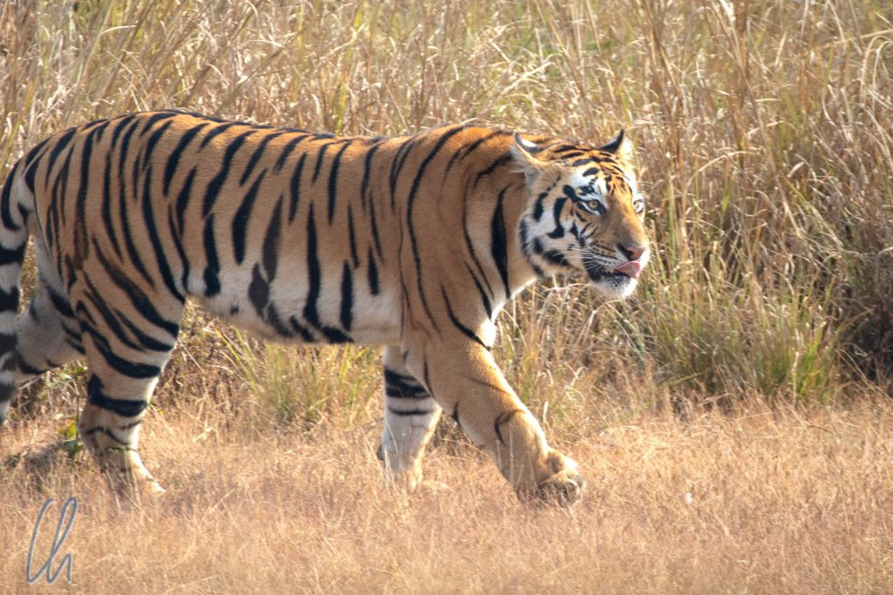
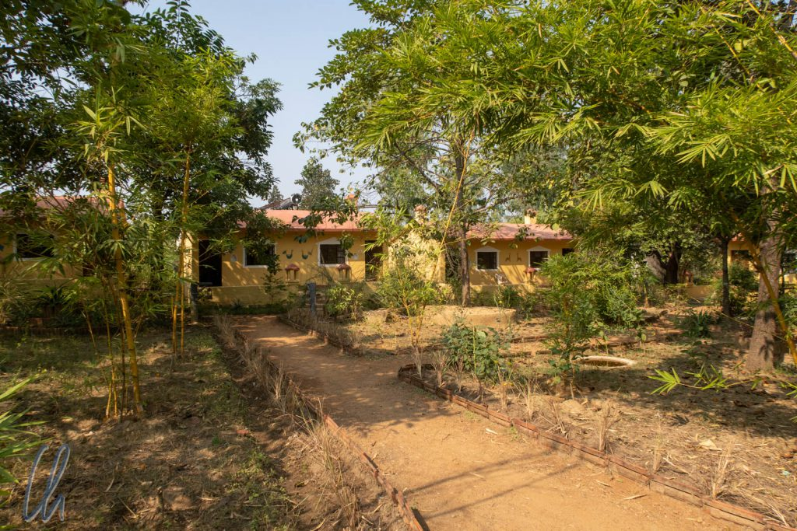
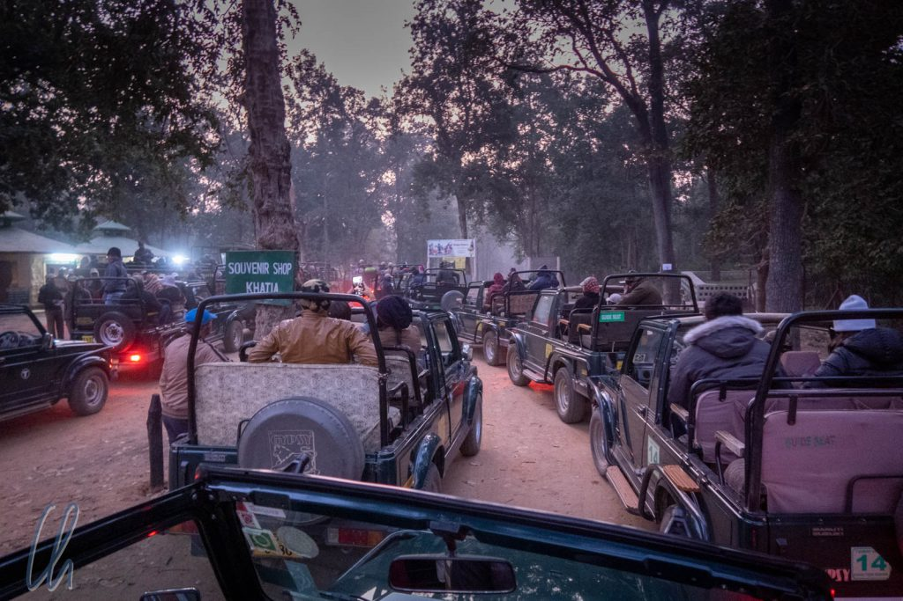

# Auf Tiger-Safari im Kanha Nationalpark

Als letztes Abenteuer unserer Weltreise hatten wir eine Tiger-Safari geplant. Wo waren die vergangenen 14 Monate nur geblieben? Mit der [Indischen Bahn ](http://wittmann-tours.de/unterwegs-mit-indian-railways)fuhren wir in 31 Stunden 1600 Kilometer von Udaipur über Ajmer nach Jabalpur. Nach zwei weiteren Stunden Autotransfer kamen wir schließlich in der kleinen Ortschaft Khatia beim [Kanha Nationalpark](https://en.wikipedia.org/wiki/Kanha_Tiger_Reserve) an, wo noch gut 100 [Bengal-Tiger](https://de.wikipedia.org/wiki/K%C3%B6nigstiger) in freier Wildbahn leben. Ob wir das Glück haben würden, die gestreiften Kätzchen in ihrer natürlichen Umgebung zu Gesicht zu bekommen?

<!--more-->

## Die Bändigung des indischen Papier-Tigers

Tiger sind nicht einfach zu beobachten. Sie leben in der Regel als Einzelgänger, habe riesige Territorien (etwa 15-200km² pro Raubkatze) und 16-20 Stunden pro Tag schlafen sie oder ruhen im Schatten. Zu allem Überfluss haben die hinduistischen Götter vor die Tiger-Safari deren Reservierung gestellt. Die Besucherzahlen (bzw. die [Anzahl der Fahrzeuge](https://www.kanha-national-park.com/safari-timings-in-kanha.html)) im Park sind stark limitiert und damit waren die Einfahr-Slots (v.a. in den begehrteren Sektoren) mehrere Wochen im Voraus ausgebucht. Die Feiertage rund um Diwali sorgten für zusätzliche Nachfrage.

Wir tauschten im Vorfeld eine scheinbar endlose Folge von E-Mails mit unserem Gastgeber Rahul vom [Pugmark Resort](http://www.pugmarkresort.com/) aus, bis wir endlich doch einen passenden Termin gefunden hatten, ganz am Schluss unserer Indien-Reise. Zum Glück kümmerte sich Rahul auch um den indischen Bürokratie-Dschungel, der für die Erringung einer verbindlichen Reservierung im Nationalpark durchdrungen werden muss. Nachdem wir dann einige Wochen später in Khatia angekommen waren, hatte er den Papier-Tiger erfolgreich gebändigt. Wir konnten uns in dem kleinen, familiengeführten Resort von der langen Zugfahrt erholen und uns mental auf den nächsten Morgen einstellen. Die nächste Nacht würde nämlich wieder kurz werden: Rahul wollte als einer der ersten am Parkeingang sein und schon um 5:20 Uhr in der Früh mit uns losfahren. Außerdem sollten wir uns warm anziehen, es wäre morgens immer recht frisch. Solch eine Weltreise war wirklich kein Zuckerschlecken! ;)

Weit kamen wir allerdings (wie geplant) zunächst nicht: Wir fuhren lediglich wenige hundert Meter noch in völliger Dunkelheit bis zur Parkeinfahrt am Khatia Gate, wo sich jeden Morgen eine ähnliche Prozedur abspielte. Einige andere Jeeps standen schon in mehreren Spuren am Tor und unser Fahrer reihte sich ein. Rahul ging mit unseren Pässen und einigen anderen Papieren zum Ranger-Büro, während wir im Auto warteten. Bald kam der [Chaiwallah](https://en.wikipedia.org/wiki/Chaiwala) vorbei, von dem wir dankbar einen Becher heißen, würzigen, süßen, milchigen [Masala Chai](https://de.wikipedia.org/wiki/Masala_Chai) kauften, um aufzuwachen und uns von innen zu wärmen. Rahul kam meist zügig zurück und dann warteten wir, bis der Park pünktlich um 6 Uhr im Morgengrauen öffnete.

## Die Tiger-Safari beginnt

Es war kalt, richtig kalt, deutlich kälter als wir erwartet hätten, schon als wir am Tor warteten und erst recht während der Fahrt im offenen Jeep. Zur Glück hatte Rahul Decken und Wärmflaschen im Auto bereitgelegt, aber trotzdem erschienen wir in den folgenden Tagen im erprobten Altiplano-Outfit: Lange Unterhose, Thermo-Unterhemd, Hemd, Hose, Wollpullover und Regenjacke, zusätzlich Schal, Mütze und Handschuhe, damit uns der Fahrtwind nicht gänzlich auskühlte. Früh morgens zeigte das Thermometer gerade einmal 5 bis 10 Grad an, aber durch die hohe Luftfeuchtigkeit, die der Wald speicherte, fühlte es sich noch kälter an.

Kaum öffnete um Punkt 6 Uhr ein Ranger die Schranke des Einfahrtstores in den Nationalpark, begann eine kleine Rallye der Jeeps. Jeder der Fahrer versuchte, so schnell wie möglich in den Park zu gelangen. Sie fädelten sich engagiert an den anderen Geländewagen vorbei nach vorne ein und schnitten sich gegenseitig den Weg ab. Die Fahrzeugkolonne teilte sich dann aber kurz nach der Einfahrt auf, zumal jeder Jeep im zugeteilten (bzw. reservierten) [Sektor](https://www.kanha.co.in/kanha-safari/kanha-safari-zones.html) bleiben musste. Die Autos sind zwar per Funk untereinander verbunden, aber im Endeffekt war es natürlich ein großes Glücksspiel, die Tiger zu finden. Wenn sie nicht gerade ruhen, durchstreifen sie ihr Revier und legen dabei beachtliche Distanzen von mehr als 10 km am Tag zurück. Um zu lauschen, was sich im Wald tat, ließ Rahul unseren Fahrer öfters anhalten und den Motor abstellen. Am ersten Morgen waren wir noch nicht lange unterwegs, bis er zum ersten Mal etwas hörte.

## Tiger Nummer Eins

Ein Tiger hatte einen Schakal getötet und streifte durch den Wald. Elegant und lautlos bewegte sich das kräftige Raubtier, das im Schnitt deutlich größer und schwerer ist als ein Löwe, zwischen den Bäumen. Jetzt musste es schnell gehen. Damit wir einen besseren Blick würden erhaschen können, wendete der Fahrer unseren Geländewagen und bog gut 50 Meter weiter nach rechts auf einen anderen Weg ab, wo schon zwei andere Geländewagen standen, deren Insassen die große Katze ebenfalls entdeckt hatten.

Es handelte sich um die Tigerdame Neina, die wir später anhand ihres Streifenmusters in einem Buch identifizieren konnten. Unbeeindruckt von den Fahrzeugen marschierte das fünfjährige Weibchen zwischen den Autos durch und verschwand im Unterholz. Wir warteten ca. 15 Minuten, horchten immer wieder, fuhren mal 100 Meter vor, dann wieder zurück, aber sie zeigte sich nicht noch einmal. Der Tag hatte mit einem Paukenschlag begonnen!

Allmählich stieg die Sonne empor. Bis sie uns wirklich wärmte, dauerte es allerdings eine gute Weile. Rahuls Ziel waren die offenen Wiesen der Kanha Zone, wo es leichter wäre, einen Tiger zu sehen als im Wald. Auf dem Weg beobachteten wir viele andere Tiere: diverse Vögel, Hirsche, Antilopen. Da wir bisher nur etwas Tee getrunken hatten, steuerten wir gegen 9 Uhr einen offiziellen Rastplatz an, um zu frühstücken. Unter den Fahrern verbreitete sich wie ein Lauffeuer die Neuigkeit, dass draußen ein Tiger gesichtet worden sei. Also machten sich viele Fahrzeuge (und auch wir) zügig wieder auf den Weg.

## Vier Tiger auf einmal!

In der Tat, wenige Minuten später sahen wir eine Tiger-Mama von rechts aus dem Gebüsch in die offene Graslandschaft schreiten. Und sie war nicht alleine: Drei weitere Raubkatzen, ihre Sprösslinge, folgten ihr. Rahul mutmaßte, dass sie ihre Jungen vermutlich zu einer gerissenen Beute führte. Die lieben Kleinen, drei Männchen, waren allerdings schon deutlich größer als ihre Mutter. Bald würde Hotel Mama schließen und die drei Jungtiger müssten ihre Obhut verlassen, um eigenständig zu jagen und sich ein neues Revier zu suchen.

Im Hier und Jetzt war die Situation extrem aufregend und die indischen Fahrer versuchten in bester Großstadtmanier, alles für ihre Gäste herauszuholen. Auf der schmalen, sandigen Piste entstand auf einmal eine weitere Spur, jeder Millimeter wurde ausgenutzt, um die gestreiften Kätzchen bestmöglichst in den Blick zu bekommen.

Ein Jungtiger mit dem Spitznamen "Micro-Charger" hatte schließlich genug von dem Trubel. Er drehte sich um, grollte uns an und fletschte seine eindrucksvollen Reißzähne, um deutlich zu machen, wer der Chef von Kanha wäre. Als das nicht dazu führte, dass die Jeeps sich zurückzogen, täuschte der junge Wilde sogar einen Scheinangriff auf ein Fahrzeug an.

## Überwachung des Tempolimits per GPS

Die vier Tiger verschwanden nach wenigen Minuten im hohen Gras und für uns war es höchste Zeit, uns Richtung Ausgang zu wenden. Es war spät geworden, um 11 Uhr sollten wir nach den Bestimmungen den Park verlassen haben. Der Weg war weit und im Nationalpark herrschte ein striktes Tempolimit von 20km/h. In der Tat fuhren alle Wagenlenker (von wenigen Ausnahmen abgesehen) so ordentlich wie Fahrschüler in der praktischen Prüfung. Schließlich drohten den Fahrern empfindliche Strafen und sie wurden permanent mit einer App auf dem Mobiltelefon per GPS überwacht.

Überschreitet ein Chauffeur 30km/h, erreicht er eine zu hohe Durchschnittsgeschwindigkeit auf einem Abschnitt oder wird er bei mehr als 90 GPS-Wegpunkten als zu schnell registriert, ist eine Strafe fällig, wenn die Daten des Wagens bei der Ausfahrt kontrolliert werden. Die indische Seele fühlte sich empfindlich kastriert. Zu allem Überfluss ist das Hupen im Park ebenfalls verboten - das ist doch kein Autofahren! ;) Außerdem darf nicht abseits der Pisten gefahren werden, sogar das Wenden auf freier Strecke ist verboten. Nur auf Kreuzungen mit genügend Platz darf ein Pkw umdrehen. Um diese Regel auszuhebeln, waren die Fahrer allerdings allesamt Meister im Rückwärtsfahren.

## Mittagspause

Nach einem opulenten, sehr schmackhaften Mittagessen im Resort ruhten wir uns ein wenig in unserem Bungalow oder in einer der Hängematten im gepflegten Garten aus. Dabei mussten wir uns ein bisschen vor den Affen in Acht nehmen, die lautstark durch die Bäume turnten und dort Früchte ernteten. Ab und zu ließen sie nämlich im besten Fall die Reste ihres Mahls einfach fallen, im schlechtesten Fall pinkelten sie ohne Vorwarnung herunter.

Von einem der Angestellten lernten wir einen einfachen, aber effektiven Trick, um sie zu verscheuchen, wenn sie zu aufsässig wurden. Sie kannten anscheinend das Konzept einer Steinschleuder, konnten aber nicht unterscheiden, ob wir wirklich eine in der Hand hielten oder nicht. Eine Geste, als ob wir eine große Zwille wie einen Bogen spannen würden, reichte aus, damit sie das Weite suchten. Auch mit Daumen und Zeigefinger eine Pistole zu mimen funktionierte erstaunlich gut. Wir bemühten uns allerdings meistens um eine friedliche Koexistenz, da es amüsant war, ihr Fangenspiel in den Wipfeln zu verfolgen und sie waren mit ihren Baby-Äffchen niedlich anzuschauen.

## Nachmittägliche Ausfahrt

Ab 14:15 Uhr sammelten sich die Fahrzeuge zur nachmittäglichen Pirschfahrt vor dem Khatia Gate und es spielte sich eine ähnliche Einlassprozedur ab wie am Morgen, allerdings diesmal bei deutlich angenehmeren Temperaturen. Wir fragten uns jedoch, ob wir all unser Tiger-Glück schon aufgebraucht hätten oder ob unsere Glückssträhne noch ein wenig anhalten würde. Die Diversität der Fauna im Kanha Nationalpark zeigte eine wesentliche Parallele zu unseren Erfahrungen im [Pantanal](http://wittmann-tours.de/tag/pantanal/) in Brasilien, wo auch die großen Raubkatzen die Hauptdarsteller waren, sich aber darüber hinaus die Vertreter vieler anderer interessanter Tierarten tummelten. Nicht zuletzt soll diese Gegend [Rudyard Kipling](https://de.wikipedia.org/wiki/Rudyard_Kipling) inspiriert haben, das [Dschungelbuch](https://de.wikipedia.org/wiki/Das_Dschungelbuch) zu schreiben.

So wie im Dschungelbuch neben dem gefürchteten Tiger Shere Khan auch noch [viele andere Tiere](https://www.kanha-national-park.com/wildlife-in-kanha.html) eine Rolle spielten, sahen wir nicht nur verschiedene Arten von Hirschen und Antilopen, sondern auch Wildschweine sowie zahlreiche Vögel. Andere Raubtiere, wie Leoparden (80 dieser Katzen sollen im Park leben) oder [Rothunde](https://de.wikipedia.org/wiki/Rothund) hielten sich vor uns versteckt. Sehr beeindruckt waren wir von der Sichtung eines [Gaurs](https://de.wikipedia.org/wiki/Gaur), eines riesigen, massiven Wildrindes, das wir kurz nach der Einfahrt in den Park im Dickicht entdeckten.

## Tigerflaute

Ähnlich wie die Tiger durchstreiften auch wir den Wald, nur eben im Geländewagen. Wie wir es auf anderen Exkursionen erlebt hatten, war es wichtig, nicht nur die Augen, sondern zusätzlich die anderen Sinne zu benutzen. Immer wieder hielten wir an, stellten den Motor ab und warteten in absoluter Stille, lauschten den Vogelstimmen, hörten, wie Wassertropfen zu Boden fielen und merkten beim Rascheln von Blättern auf, vielleicht war dies der Hinweis auf eine Raubkatze. Vögel konnten unsere Verbündeten sein, wenn sie einen Alarm-Ruf von sich gaben, und gelegentlich hörten wir sogar einen Tiger in der Ferne brüllen. Es war ein tiefer, kehliger, ehrfurchteinflößender Laut, der weit trug und sich wie: "Aouum" anhörte. Die Großkatzen benutzten gerne die Wege, auf denen wir fuhren, da sie dort zügig voran kamen. Immer wieder fanden wir Tigertatzenabdrücke auf dem Boden, aber die Verursacher der Spuren machten sich rar.

Stattdessen begegneten wir im Wald einer Gruppe von Rangern, die auf dem Rücken von Elefanten im Park Streife ritten. Die Rüsseltiere werden auch für Forstarbeiten eingesetzt. Auf den offenen Weiden grasten [Axishirsche](https://de.wikipedia.org/wiki/Axishirsch) (spotted deer), [Sambar Hirsche](https://de.wikipedia.org/wiki/Sambar) (sambar deer) und die seltenen [Barasinghas](https://en.wikipedia.org/wiki/Barasingha). Der Kanha-Nationalpark ist eines der wenigen Rückzugsgebiete für diese sonst ausgerottete Spezies von Hochland-Sumpfhirschen.

Wildscheine wühlten sich auf der Suche nach Leckerbissen durch den Boden. Im hohen Gras wandelten Grüppchen von prächtigen wilden Pfauen, die Sonne brachte die kräftigen Farben ihres Gefieders zum Leuchten.

## Ein würdiger Abschluss unserer Weltreise

Wie war schließlich die Bilanz unserer Tigerausbeute? Fünf Tigersichtungen in sieben Safaris zeugten von überdurchschnittlichem Glück, versicherte uns Rahul. Man muss also etwas Zeit für Erkundungsfahrten einplanen, sonst sind die Chancen für eine Begegnung mit den großen Raubkatzen relativ gering. Dadurch, dass wir alle fünf Tiger in einer Exkursion gesehen hatten, und das auch noch in der ersten, gestaltete sich für uns die Dramaturgie (fulminanter Auftakt und dann Flaute) zwar etwas anders gewünscht, aber wegen der vielen anderen Tierarten waren es trotzdem sehr lohnenswerte Pirschfahrten.

Positiv fiel uns auf, dass die meisten Besucher in Kanha Inder waren. In anderen Ländern, Kenia oder Tansania, hatten wir ausschließlich westliche Touristen getroffen. Tierbeobachtungen in Nationalparks durch die einheimische Bevölkerung schien dort nicht stattzufinden. In Kanha ist Wilderei trotz guten Schutzes weiterhin ein Problem, hoffentlich können die anmutigen gestreiften Großkatzen etwas Werbung zu ihrem eigenen Besten machen.

Mit Rahul verstanden wir uns sehr gut. Er erzählte uns viel Spannendes über die Tiere, den Park und über Indien im Allgemeinen. Er war auch interessiert an interkulturellen Themen und so entspann sich manch packende Unterhaltung, die uns ganz neue Aspekte aufzeigte. Sehr gut hat uns auch die familiäre Atmosphäre gefallen. Seine Frau und seine Tochter begleiteten uns auf einigen Ausfahrten, die ganze Familie war mit Leib und Seele dabei. Das merkten wir auch daran, wie sie die Lodge führten. Wir fühlten uns sehr gut aufgehoben und wurden immer mit phantastischen Mahlzeiten verwöhnt. Nicht zuletzt konnten sich alle jeden Tag aufs Neue für die Tiger begeistern. So war die Tiger-Safari ein würdiger Abschluss unserer Weltreise.
