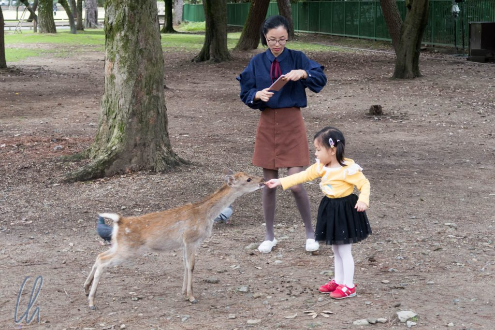

Ebenfalls ein Muss ist ein Ausflug nach Nara, damit ist das Hauptstadt-Trio vollständig. Nara war die erste permanente Hauptstadt Japans (710 bis 784) vor Kyoto und Tokyo. Von Kyoto aus war Nara für uns ein ereignisreicher Tagesausflug. Auch hier erwartet den Besucher große Kultur und viel japanische Geschichte, aber auch der vielleicht größte Streichel-Zoo der Welt.

<!--more-->

## Die Rehe von Nara

Die bekannteste Sehenswürdigkeit ist der große Buddha von Nara. Gleich dahinter rangieren die Rehe von Nara - und die sind sehr niedlich und lustig! Es sind heilige Tiere, Boten der Götter, und als solche leben sie in den Parks der Stadt, angeblich ca. 1000 Tiere. Das Füttern der Rehe ist hier erlaubt. Für 150 Yen, also gut einen Euro, bekommt man ein Bündel Bambi-Kekse.

Hält man die Kekse in den Händen, ist man sofort der Lieblingsmensch aller Bambis. Es heißt zwar, die Rehe würden sich höflich verbeugen (das tun sie manchmal sogar), trotzdem sind sie sehr fordernd. So bereut mancher Tourist schnell die Investition, und es fällt schwer, die Kekse nach eigenem Willen zu verfüttern. So verwandelt sich ein vermeintlich niedliches Fotomotiv zuweilen in eine Gruppe Kleidung zupfender und zerkauender Tiere. Unter Umständen kommt es zu ungewollter Komik wenn die Rehe Touristen verfolgen oder kleine Kinder erschreckt werden.

Einzig ein älterer Japaner konnte den Spieß nicht minder amüsant umdrehen. Er ging mit tiefer, lauter Stimme redend auf die Rehlein zu und streckte abrupt die Hand mit den Keksen aus, woraufhin die Bambis verunsichert den Rückzug antraten...

## Der große Buddha

Die echte Hauptsehenswürdigkeit ist aber eigentlich der große Buddha von Nara im [Tōdai-ji](https://de.wikipedia.org/wiki/T%C5%8Ddai-ji). Seine Größe ist wirklich äußerst beeindruckend und übersteigt die Erwartungen. Die Bilder können seine Höhe von ca. 15 Metern (plus 3 Meter Sockel) kaum widergeben.

Die Halle (Daibutsuden), eines der größten Holzgebäude der Welt, ist gleichermaßen gigantisch - obwohl sie nach einem Feuer ([gleiche Geschichte wie in Kyoto](http://wittmann-tours.de/kyoto-tempel-schreine-und-gaerten/)) ca. 30% kleiner als das ursprüngliche Bauwerk wieder aufgebaut wurde.

Neben einigen weiteren Tempeln und Schreinen besuchten wir den sehr sehenswerten und gepflegten Insuien-Garten und hatten so trotz Regenwetter einen schönen und ausgefüllten Tag. Erst bei Sonnenuntergang waren wir zurück am Bahnhof, um die Heimfahrt nach Kyoto anzutreten.
