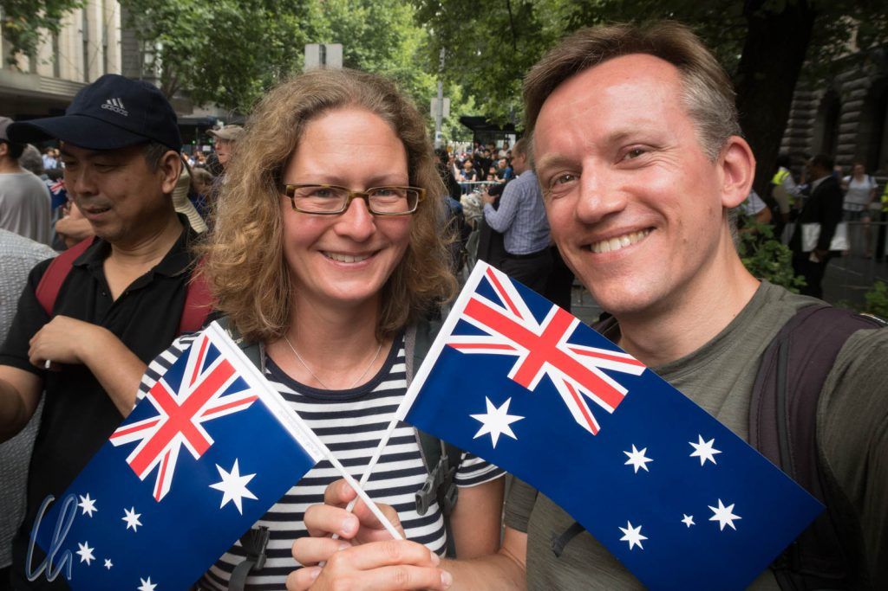
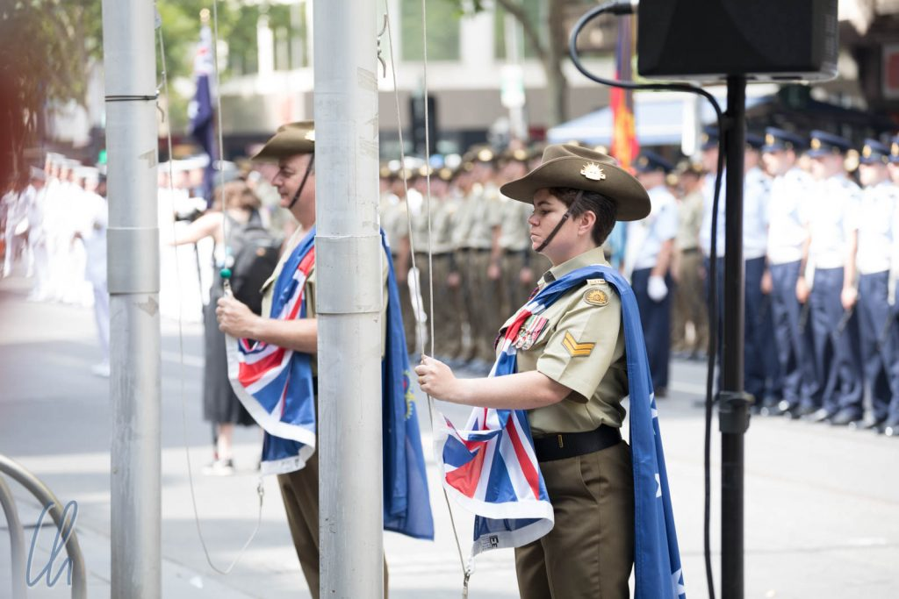
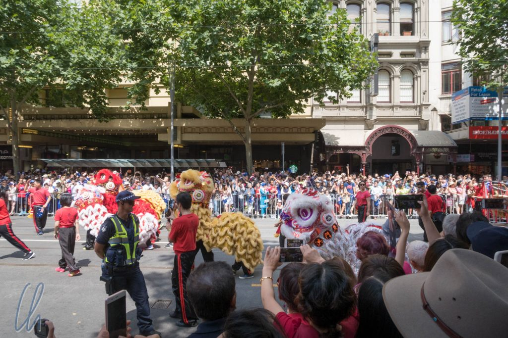
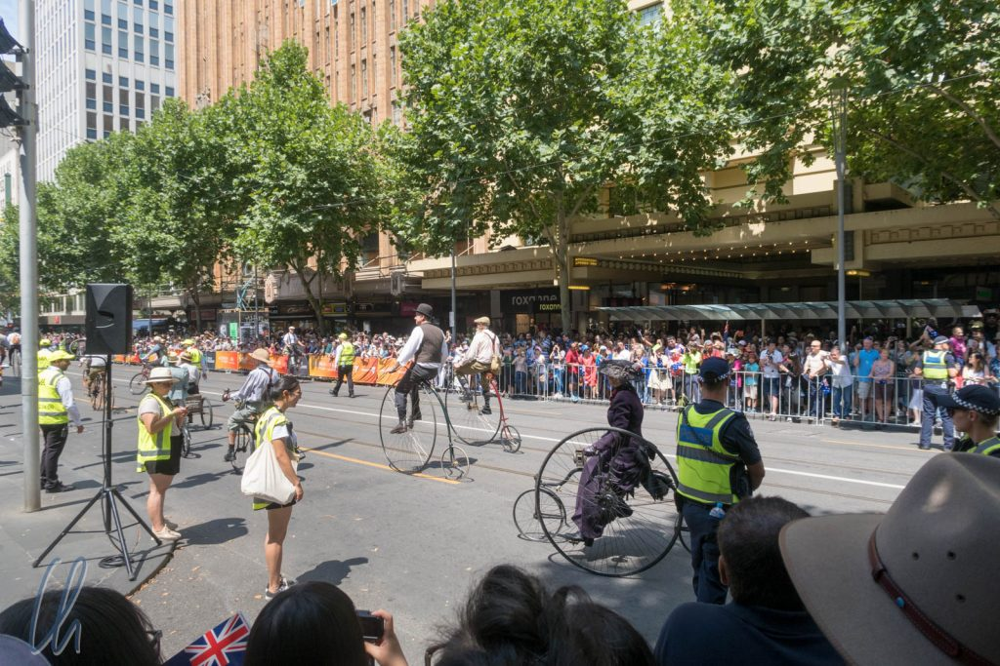
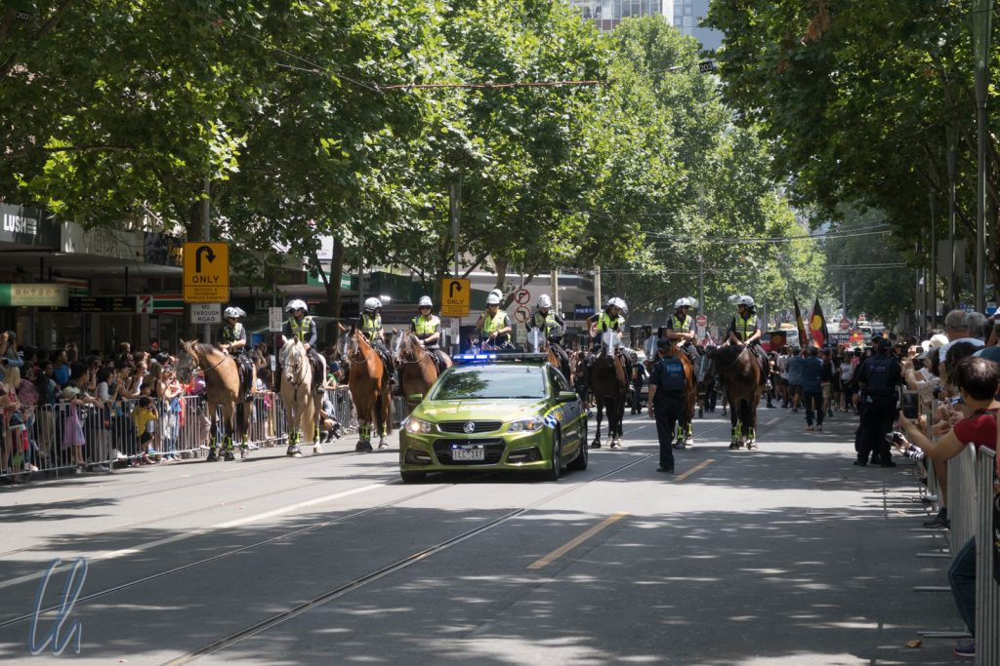
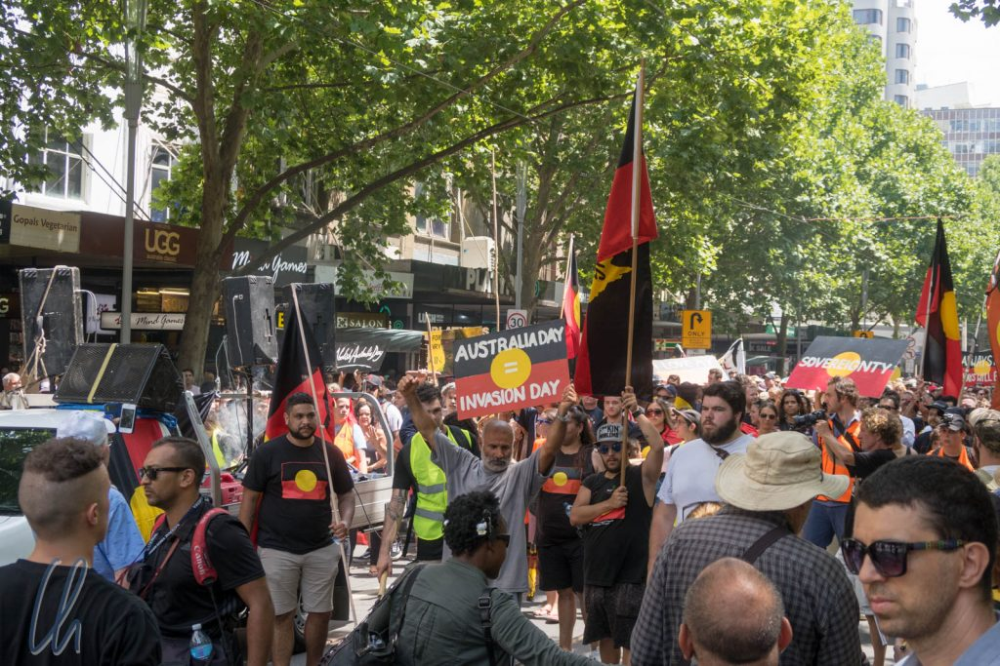

Am 26. Januar feiern die Australier den Australia Day, der an die Ankunft der First Fleet in der Sydney Cove am [26. Januar 1788](https://de.wikipedia.org/wiki/Australia_Day) erinnert. Dieser Feiertag ist nicht unumstritten. Die Aborigines bezeichnen diesen Tag als Invasion Day. So unterscheiden sich die Perspektiven. Wie wir diesen Tag in Melbourne erlebt haben, darüber möchten wir, möglichst objektiv, berichten.

<!--more-->

## Flag Raising Ceremony und die Parade

Das offizielle Programm zum Australia Day begann mit der sog. Flag Raising Ceremony und einer Parade. An beides hatten wir eher geringe Erwartungen, da wir nicht so recht wussten, was uns erwarten würde. So fanden wir uns 15 Minuten vor dem offiziellen Beginn des Programms an der City Hall ein, wo die Swanston Street schon für die Parade abgesperrt war. Wir suchten uns einen Platz in der nicht allzu großen Menge, von dem aus wir einen guten Blick auf das Geschehen haben würden. Die Pfadfinder, die an der Zeremonie teilnehmen sollten, wurden in unserer direkten Nähe positioniert und gegen 11 Uhr ging es los.

Eine Abordnung von Soldaten aus Heer, Marine und Luftwaffe marschierte ein und stellte sich in Reih und Glied vor der City Hall auf. Mehrere Politiker hielten kurze Ansprachen, von denen wir leider ob der schlechten Verstärkung sehr wenig verstanden. Immerhin bekamen wir mit, dass auch zwei ältere Abgesandte lokaler Aborigine-Stämme redeten. Außerdem wurden die Australians of the Year geehrt und die Gouverneurin schritt die Front der Soldaten ab. Schließlich wurden dann (endlich) die Fahnen gehisst: Die [Flagge Australiens](https://de.wikipedia.org/wiki/Flagge_Australiens), die [Flagge Victorias](https://de.wikipedia.org/wiki/Flagge_von_Victoria), die [Aborigine-Flagge](https://de.wikipedia.org/wiki/Flagge_der_Aborigines) und die [Flagge der Torres-Straits-Insulaner](https://de.wikipedia.org/wiki/Flagge_der_Torres-Strait-Insulaner). Bis dahin war der Verlauf der Veranstaltung sehr formal, das sollte sich jedoch bald ändern.

Mit dem Auszug der Soldaten, gefolgt von den Pfadfindern, die eine große Australienflagge präsentierten, begann die Parade, in der sich diverseste Gruppen präsentierten. Es begann mit der Feuerwehr, dem Rettungsdienst und der Küstenwache. Als nächstes zogen chinesische, ungarische, thailändische, ukrainische und Gruppen vieler anderer Nationalitäten in traditionellen Trachten vorbei, teilweise mit Musikinstrumenten und manche führten sogar spektakuläre Tänze auf. Auch Vertreter der LGBT-Szene in gewagten Aufmachungen nahmen teil und Rollenspieler, die u.a. als Figuren aus „Herr der Ringe“ und „Star Wars“ verkleidet waren. Ein abwechslungsreiches, buntes Treiben! Die 5 Deutschen in weißen Fußball-Trikots waren damit nicht ganz der Höhepunkt des Umzuges ;). Den Abschluss bildete ein Melbourner Verein, der sich für den Erhalt historischer Fahrräder einsetzt - wer hätte das gedacht!

## Die Gegendemonstration der Aborigines

Wenige Minuten nach Abschluss der Parade versammelte sich die Gruppe, die im offiziellen Umzug gefehlt hatte: die Aborigines. Wir hatten schon vermutet, dass sie nicht in der Parade vertreten sein würden, aber mit der anschließenden ausgewachsenen Demonstration hatten wir nicht gerechnet. Die Aborigines versammelten sich ungefähr einen Block von unserem Standort entfernt und berittene Polizei führte den Zug an, der den gleichen Weg nahm wie die Parade.

Der Ton der Demonstration war schrill und laut, eine der Sprecherinnen brüllte Parolen mit überschnappender Stimme. Die Slogans waren: "Shame on Australia", "No pride in genocide", "Always was, always will be Aboriginal land". Diese wurden über Megaphone und in Sprechgesängen immer wiederholt und standen auf den meisten Plakaten. Einige Transparente prangerten auch Todesfälle inhaftierter Ureinwohner an oder forderten die Abschaffung des Australia Day. An der Spitze des Zuges liefen einige Aborigines-Krieger mit Kriegsbemalung. Aber die meisten Demonstranten hätten wir auf der Straße nicht als Aborigines erkannt. Sicher hatten sich auch viele Sympathisanten dem Zug angeschlossen.

In groben Zügen war uns die unrühmliche Geschichte der Kolonialisierung bekannt. Jedoch fehlten auf den Plakaten konkrete politische Forderungen, auf welche Weise die Ureinwohner für das erlittene Unrecht entschädigt werden könnten. Immerhin scheint es eine mittlerweile breitere Debatte zu geben, den Australia Day auf ein anderes Datum zu verlegen. Wir haben die Gegendemonstration so verstanden, dass es im Grunde darum ging, die Aufmerksamkeit der Bevölkerung auf die negativen Folgen der Kolonialisierung für die Aborigines zu lenken. Eine Interpretation der Herald Sun findet Ihr unter [diesem Link](http://www.heraldsun.com.au/news/victoria/australia-day-2018-heavy-police-presence-around-melbourne-rallies/news-story/3cd02836c7e636edd2219b86bab3bb3d).

## Einfach ein freier Tag

Parade hin, Demo her, die meisten Australier wollten einfach nur ihren freien Tag genießen. Das BBQ (Barbie) und/oder Picknick schien in diesem Zusammenhang eine der beliebtesten Freizeitbeschäftigungen zu sein. In vielen Parks gibt es öffentliche Grills, die natürlich alle besetzt waren. Außerdem hatten sich in der Kings Domain einige sog. Food Trucks versammelt und viele Leute lagerten auf dem Rasen und schlemmten. Abgesehen davon gab es einige Attraktionen, vor allem für Kinder. Und so schlenderten auch wir durch die Parks und probierten Häppchen aus einem internationalen Angebot. Dann besuchten wir die Gärten des Gouvernement House (der Residenz des Gouverneurs) und den weitläufigen Botanischen Garten, in dem auch auf allen Grünflächen gepicknickt wurde.

Leider zog sich am späten Nachmittag der Himmel zu und es begann zu regnen. Das sehenswerte Feuerwerk in den Docklands konnte zum Glück trotzdem stattfinden. So haben wir einen interessanten Australia Day - nicht frei von Kontroversen - erlebt.

