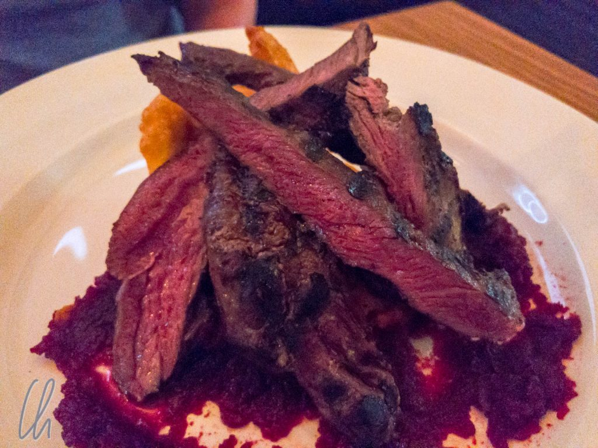
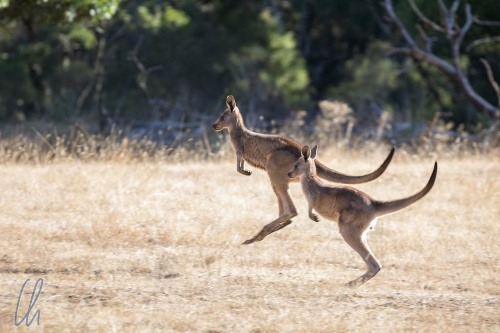

Als Bush Tucker oder Bushfood werden Nahrungsmittel bezeichnet, die ursprünglich von den Aborigines verzehrt wurden. Es hat knapp 3 Wochen gedauert, bis wir ein Restaurant dieser Richtung ausfindig machen konnten. Sogar im kosmopolitischen Sydney erkundigten wir uns vergebens. Wir hatten erwartet, dass es regelmäßig die Gelegenheit geben würde, authentische traditionelle Nahrungsmittel des Landes zu bekommen. Aber weit gefehlt, erst in Melbourne war es soweit. Auch in [Gariwerd](https://en.wikipedia.org/wiki/Grampians_National_Park) (den Grampians, einem Gebirge im Bundesstaat Victoria) konnten wir diverse Bush Tucker-Spezialitäten probieren.

<!--more-->

## Zum ersten Mal Bushfood

Warum Bushfood so selten angeboten wurde, ist uns nicht ganz klar. Liegt es daran, dass an der Ostküste, wo wir erst unterwegs waren, nur noch sehr wenige Aborigines leben? Sind die Zutaten nicht verfügbar? Gibt es kein Interesse an solchen Restaurants? Vielleicht sind das mögliche Faktoren. Auf alle Fälle ist zum Beispiel [Kängurufleisch](https://de.wikipedia.org/wiki/K%C3%A4ngurufleisch) nicht sehr beliebt, obwohl es ein sehr wohlschmeckendes, mageres Fleisch ist und an den Beuteltieren, die sich rasch vermehren, wahrlich kein Mangel herrscht. Erstaunlicherweise wird es größtenteils exportiert oder zu Hundefutter verarbeitet. Die Australier essen lieber Lamm, Rind, Schwein oder Hühnchen.

Im Restaurant „[Charcoal Lane](https://www.charcoallane.com.au)“ in Melbourne, das sozial benachteiligten jungen Ureinwohnern eine Ausbildung bietet, war es dann aber endlich soweit. Neugierig bestellten wir als Vorspeise eine Platte mit Aboriginal Tapas und als Hauptgericht eine Portion Känguru und Emu.

Die Vorspeise war ein interessanter Crossover aus europäischer und Bush Food-Küche: Känguru mit Buschtomatenchutney und grünen Bohnen, Emu-Kabanossi mit sauren Gurken, Kartoffelkroketten in rosa Sauce, Hummus mit Haselnüssen, schwarze und grüne Oliven, Rucola-Salat, Ozeanforelle mit Chili-Relish und Kumquat.

## Emu, Känguru und mehr

Das Känguru als Hauptgericht war sehr lecker und hatte einen deutlichen Wild-Geschmack. Wie auf dem [ersten Bild dieses Artikels](http://wittmann-tours.de/wp-content/uploads/2018/03/APC_0970-1.jpg) zu erkennen ist, war das Fleisch innen noch recht blutig. Als Garstufen existieren nur rare und medium rare, da es aufgrund des geringen Fettgehalts nicht länger gegrillt werden sollte, sonst wird es zäh. Einig waren wir uns, dass der Emu noch besser war als das Känguru. Das Fleisch war noch zarter und saftiger.

Zum Nachtisch gab es Lemon Mytrle-Eis, Regenwald-Kirsch-Sorbet, Pepperberries und andere Früchte. Wie auch schon bei den beiden vorherigen Gängen waren einige Geschmacksrichtungen ungewohnt und sehr intensiv, vielleicht nicht unbedingt für jedermann angenehm, aber für uns insgesamt sehr wohlschmeckend.

Als die Teller abgeräumt waren, hatten wir viele für uns neue Lebensmittel probiert, die wir noch nie zuvor gegessen hatten. Den Besuch in der „Charcoal Lane“ können wir aufgrund der schmackhaften und außergewöhnlichen Gerichte jedem interessierten Foodie nur ans Herz legen.

## Bush Tucker im Gariwerd-Gebirge

Die nächste Gelegenheit zu erfahren, was im Busch sonst noch so interessantes wächst, ergab sich schon 5 Tage später, als wir im Gariwerd-Gebirge ankamen, einem Nationalpark nordwestlich von Melbourne. Neben viel Natur ist eine der Sehenswürdigkeiten das [Brambuk Cultural Center](http://www.brambuk.com.au/), welches sich ausführlich mit der Geschichte und Kultur der dort lebenden Aborigines beschäftigt. Ein Aspekt ist das Essen, und so bietet das angeschlossene Café Bushfood in vielen Variationen.

Als eine der treibende Kräfte hinter dem Café lernten wir den Betreiber und Koch [Blake](https://www.facebook.com/blakesbushfood) kennen. Er ist selbst kein Aborigine, hat aber lange mit Aborigines zusammen gelebt und das Kochen ist eine seiner Leidenschaften. Zusammen mit Blake haben wir zwei kleine Wanderungen unternommen, auf denen wir einige traditionelle Nahrungspflanzen kennenlernten, zum Beispiel den Wattleseed-Baum.

## Probieren geht über Studieren

Im Café durften wir praktische Möglichkeiten der Zubereitung degustieren.

Was auf den ersten Blick wie ein recht herkömmlicher Grillteller aussieht, war in Wirklichkeit "beef sausage and native mint & pink salt spiced beef burger with bush tomato sauce". Bushfood zum Eingewöhnen. Das Fleisch war fantastisch gewürzt und die Tomatensauce hatte ein gutes Aroma.

Der zweite Teller bestand aus reinem Bushfood, diversen Häppchen zum Probieren. Im Einzelnen, zunächst die vegetarischen Schälchen: oben links: lemon aspen & pepper berry. Unten links: riberry. Oben rechts: native current. Unten rechts - quandong. Das Fleisch auf der rechten Seite war: oben: Känguru. Unten: Emu.

Das Fleisch war saftig und sehr schmackhaft, auch hier war der Emu etwas zarter. Die eingemachten Früchte waren teilweise sehr intensiv und ungewohnt im Geschmack. Vieles ließ sich nicht wirklich beschreiben mit "schmeckt so ähnlich wie…". An den pepper berries schieden sich unsere Geister. Während Mona sie gerne mochte, fand ich sie zu intensiv mit einem langen, dominanten Nachgeschmack. Alle anderen Kostproben waren sehr angenehm im Geschmack.

Als Bush Tucker-Backwaren hatte Blake kreiert: [Wattleseed](https://en.wikipedia.org/wiki/Wattleseed) Damper und [Lemon Myrle](https://en.wikipedia.org/wiki/Backhousia_citriodora) Scones. Der Damper erinnerte an Brötchen, allerdings waren sie nicht knusprig, sondern saftig. Die Lemon Myrtle Scones hatten in der Tat ein leichtes zitroniges Aroma.

Auch beim Bush Tucker ist der wichtigste Gang natürlich der Nachtisch. Blake servierte uns Eiscreme, Outback Gelato, in interessanten Aboriginal Geschmacksrichtungen, wie zum Beispiel "Roast Almond & Quandong" oder "Ribbery & Raspberry".

Insgesamt wirkten Blake's Kreationen authentischer als in der „Charcoal Lane“, da sie nur wenige europäischen Elemente enthielten. Das hat uns sehr gut gefallen, ein komplett neues Geschmackserlebnis, sehr zu empfehlen!

## Noch mehr Bush Tucker

Wenn's läuft, dann läuft's! Der Bann schien gebrochen, im Gariwerd gab es nicht nur bei Blake Bushfood, sondern auch im Kookaburra Restaurant. Dort probierten wir [Barramundi](https://de.wikipedia.org/wiki/Barramundi), einen schmackhaften australischen [euryhalinen](https://en.wikipedia.org/wiki/Euryhaline) Raubfisch. Zusammen mit einem Weißwein aus der Region eine perfekte Kombination.

Davon abgesehen fanden wir ulkigerweise im Supermarkt ein Bush Tucker-Müsli und sogar im Flugzeug auf dem Weg in die USA gab es Fleisch in Wattleseed-Kruste. Wir wagen es kaum zu glauben, nachdem wir die ersten Wochen vergeblich gesucht hatten (oder wussten wir nur nicht worauf wir achten sollten?). Unsere Nachforschungen haben sich auf alle Fälle gelohnt!
