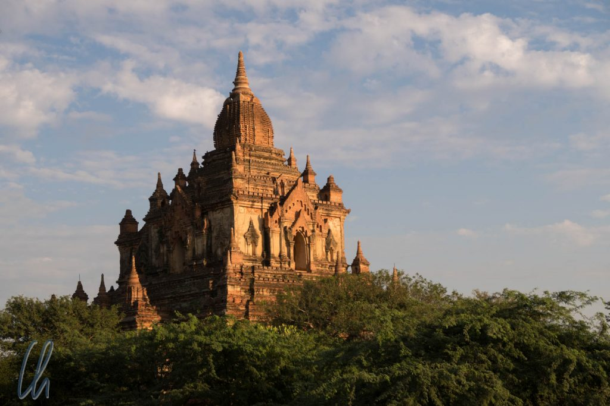
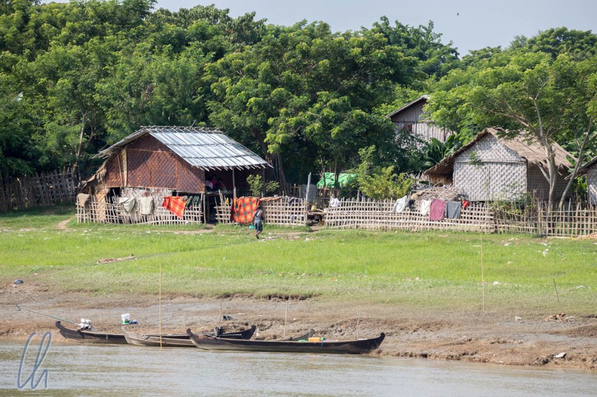
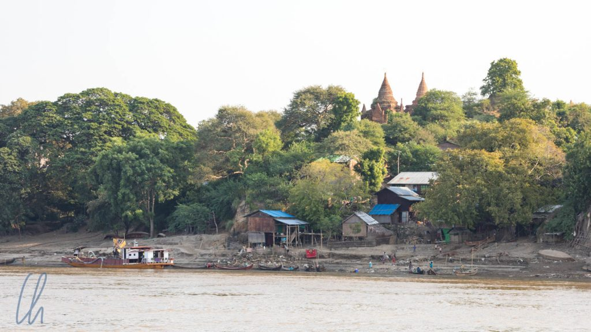

Wer denkt in [Kyoto](http://wittmann-tours.de/kyoto-tempel-schreine-und-gaerten/) stünden viele Tempel, der hat sicher Recht. Eine deutliche Steigerung findet der Reisende jedoch in Bagan. Die Zahlen sind nicht eindeutig, auch wenn einige Tempel nur mit Nummern statt mit Namen bezeichnet werden. Angeblich sind es mindestens 3000 Tempel auf wenigen Quadratkilometern.

<!--more-->

## Anreise nach Bagan auf dem Ayeyarwady

Für die Anreise wählten wir die Panoramaroute. Statt des Busses nahmen wir das Schiff und verbrachten einen interessanten und erholsamen Tag auf dem [Ayeyarwady](https://de.wikipedia.org/wiki/Irrawaddy), der Lebensader Myanmars. Er verläuft durch eine Tiefebene und versorgt viele Menschen mit Wasser und Lebensmitteln (durch Fischfang und als Transportweg). Für manche Dörfer ist des Boot auch die einzige Verbindung zur Außenwelt.

Die Fahrt begann morgens um 7:00 Uhr und so bot sich bei tiefstehender Morgensonne ein wunderschönes Panorama von [Sagaing](http://wittmann-tours.de/hauptstadt-hopping/), das wir 2 Tage zuvor besichtigt hatten. Unzählige Pagoden glitzerten golden auf den Hügeln.

Der Wasserstand erschien uns trotz der gerade erst beginnenden Trockenzeit recht niedrig. Unser Schiff mäanderte immer wieder vom rechten zum linken Ufer und retour, um den Sandbänken auszuweichen und in der Fahrrinne zu bleiben. An manchen Stellen teilte sich der Fluss sogar in mehrere Arme, an anderen bildete er große Becken. Dort war bis zu 2 Kilometer breit, sonst aber eher 500 bis 700 Meter, und damit aber immer noch deutlich breiter als Donau oder Rhein.

Immer wenn wir nahe dem Ufer fuhren sahen wir goldene Stupas, die Felder der Bauern, Ochsen und andere Nutztiere und kleine Dörfer mit einfachen Häusern. Am Flussufer wuschen Frauen Wäsche, Kinder spielten, Fischer sortieren ihre Netze. Letztere befuhren den Fluß auch mit ihren kleinen Booten. Größere Schiffe hingegen sahen wir selten. Insgesamt herrschte auf dem Ayeyarwady weniger Schiffsverkehr als wir gedacht hätten.

Nach gut 8 Stunden erreichten wir Bagan und die letzten 20 Minuten an Bord nahm die Tempeldichte deutlich zu - und das sollte nur das Vorspiel gewesen sein ;).

## Tour de Bagan: Mit dem Drahtesel von Tempel zu Tempel

Zwei der drei Tage in Bagan waren wir mit dem Fahrrad unterwegs. Unsere Fahrräder waren beinahe so alt wie die Tempel, ohne Gangschaltung, dafür mit quietschender Bremse. Trotzdem haben sie uns klappernd von Tempel zu Tempel gebracht. Aufgrund der Hitze (und des Materials) fuhren wir recht langsam. Das Gelände war größtenteils flach. Einige Wege waren so sandig, dass selbst die speziellen profillosen Sandreifen einsanken ;-) und wir schieben mussten.

Auf dem Weg zu den Haupttempeln fuhren wir an unzähligen kleinen vorbei. Die meisten bestehen nur noch aus roten Ziegelsteinen ohne Putz. Die ehemals vorhandenen reichen Stuckverzierungen und Wandbemalungen sind nur noch selten an und in besser erhaltenen Tempeln zu sehen. Eines der wenigen Gebäude, in dem die Fresken noch gut erhalten sind, ist der [Gubyaukgyi Tempel](<https://en.wikipedia.org/wiki/Gubyaukgyi_Temple_(Myinkaba)>). Dort kam eine junge Burmesin auf uns zu, die Deutsch lernen wollte und keinen Verkaufsstand hatte. Die meisten "Führer" kennen ein paar Details und weisen dann bald auf den eigenen Shop hin.

Die freundliche Burmesin war bestens informiert und erklärte uns, daß es sich bei den Wandbemalungen nicht um Fresken handle, weil die Pigmente auf den trockenen Verputz aufgetragen worden waren. Sie hatte eine gute Taschenlampe dabei, da man in den höhlenartigen Bauwerken mit kleinen Fenstern und ohne künstliche Beleuchtung die Bilder fast nicht erkennen konnte. Zu einigen Motiven erzählte sie uns die zugrundeliegenden Geschichten, die in unserem westlichen Bildungskanon unbekannt sind. Es handelte sich um sogenannte [Jatakas](https://de.wikipedia.org/wiki/Jataka), Episoden aus dem Leben Buddhas und seiner früheren Inkarnationen. Schlüsselszenen daraus werden neben anderen Motiven auf großen glasierten Kacheln oder als Wandbemalung dargestellt. So wurden die Abbildungen im Kegel der Taschenlampe für uns lebendig.

## Die Tempelbesichtigung

Die einzelnen Tempel sind alle auf ihre Art und Weise besonders und verschieden. Einige beeindrucken durch ihre Größe, die prächtigen goldenen Zedis, riesige Buddha-Statuen, Reste von Stuckverzierungen etc. Leider sind viele Gebäude zuletzt durch ein großes Erdbeben 2016 beschädigt worden, dennoch ist ihre Pracht ungebrochen.

Da die Bauwerke auch heute als Anbetungsstätten betrachtet werden, muß man vor dem Betreten unbedingt die Schuhe ausziehen. Beine und Schultern sollten auch bedeckt sein. Eher optional aber interessant: Einen religiösen Ort umrundet man im Uhrzeigersinn. Warum weiß keiner so genau, aber es heißt [Pradakshina](https://de.wikipedia.org/wiki/Pradakshina) ;). Der Höhepunkt ist der Besuch des Tempelinneren: Nicht selten stehen dort riesige, oft auch vergoldete, Buddha-Statuen. Und bei tropischem Klima sehr angenehm: Drinnen ist es dank der dicken Mauern angenehm kühl ;)

Ein besonderes Highlight ist der Blick über die Tempellandschaft, vor allem bei Sonnenauf- und -untergang. Da Bagan bretteben ist, war es in der Vergangenheit möglich (d.h. unreglementiert), auf die Tempel zu klettern. Zum Glück für die Tempel und zum Leidwesen der Besucher wurde das Besteigen der Tempel mittlerweile fast überall untersagt. Der Grund ist offensichtlich: Der Schutz der archäologischen Substanz. Um trotzdem den Panoramablick zu ermöglichen, wurden (und werden) an einigen Stellen Erdhügel aufgeschüttet. Von dort aus kann man bei Sonnenaufgang auch die berühmten Heißluftballons über die Tempel schweben sehen, die das Landschaftsbild zusätzlich garnieren.

## Über den Tempeln von Bagan

Für den zweiten Morgen in Bagan hatten wir uns sogar (recht lange im Voraus) einen Platz an Bord eines Ballons sichern können. So hieß es extra früh aufstehen: Wir wurden um 5:20 Uhr vom Hotel abgeholt und in einem liebevoll restaurierten, mit Holz ausgekleideten Oldtimerbus zum Startplatz gefahren. Nach Tee mit Keksen und einer kurzen Sicherheitseinweisung fingen die Crews an, die Ballons erst mit Kalt- und später mit Heißluft zu befüllen. Kurz nach Sonnenaufgang stiegen wir auf in die Lüfte über Bagan.

Unser Pilot Mike, ein Engländer, hielt den Ballon erst sehr tief, da der Wind in den oberen Luftschichten deutlich stärker wehte. So schwebten wir gemächlich über die ersten Tempel, zusammen mit 20 anderen Ballons. Die Tatsache, dass regelhaft mehrere Ballons fahren, macht die Fahrt für den Piloten anspruchsvoll und für die Gäste besonders spannend. Dass sich die Ballons berühren bzw. sich küssen, wie es in der Fachsprache heißt, kommt ab und zu vor und ist nicht schlimm.

Von oben konnten wir sehen, welche Strecke wir am Tag zuvor geradelt waren und welche Tempel wir uns noch ansehen würden. Erst aus der Vogelperspektive kann man die Ausdehnung und die schiere Anzahl der Bauwerke ansatzweise erfassen. Zusätzlich gab es früher viele Holzbauten, die natürlich nicht erhalten geblieben sind. Das Ausmaß der Stadt muss andere Hauptstädte der Antike deutlich übertroffen haben. Die einzige Steigerung der Ballonfahrt wäre eine Reise mit einer Zeitmaschine in die Blütezeit Bagans.

