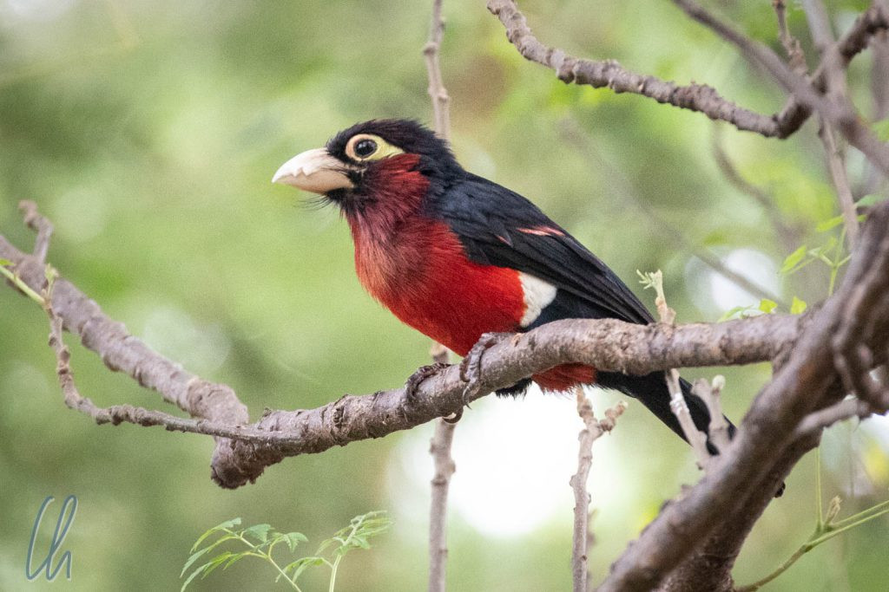
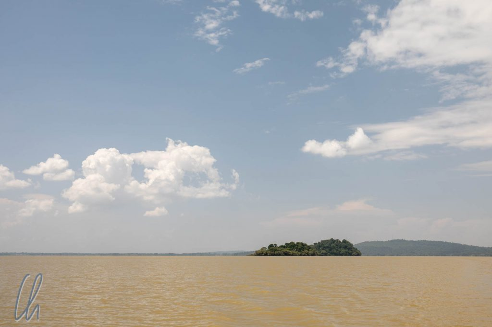
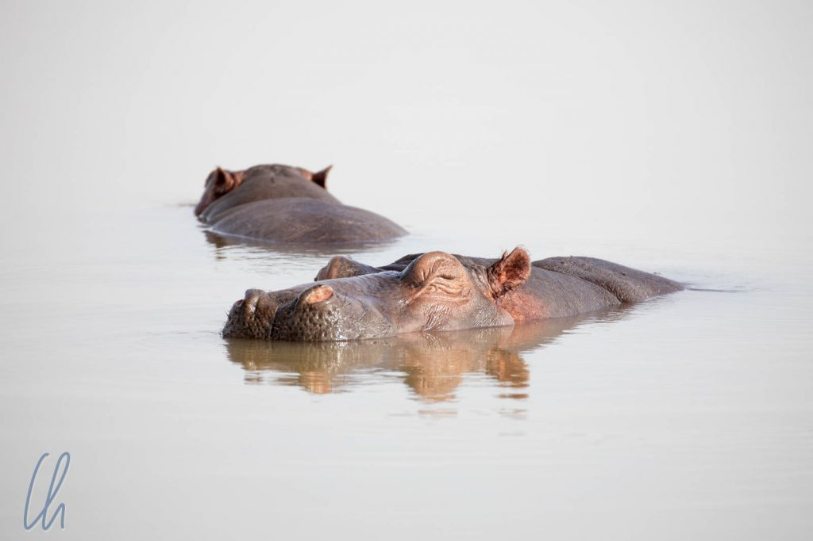
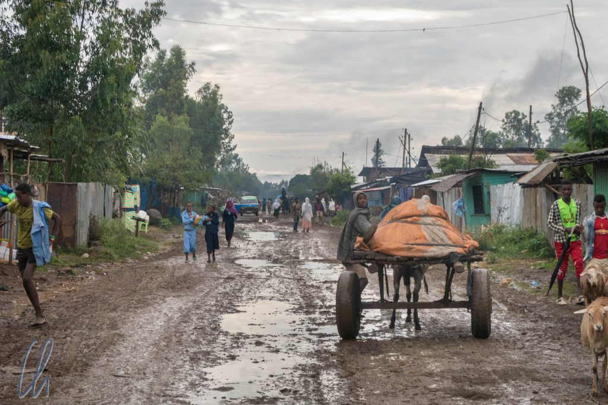

# Bahir Dar und die Wasserfälle des Blauen Nil

In Bahir Dar passierte in der ersten Nacht etwas (für uns) inzwischen Ungewöhnliches: Es regnete! Richtigen Niederschlag hatten wir das letzte Mal im [Masoala](http://wittmann-tours.de/drei-tage-im-masoala-regenwald/)-Nationalpark in Madagaskar erlebt, also 2 Monate und 3 Länder vorher. Für Bahir Dar war Regen aber keineswegs ungewöhnlich, wo sonst sollten all die Bäume und bunten Vögel herkommen? Unser Hotel lag in einem lauschigen Wäldchen, in dem sich diverse gefiederte Bewohner und mindestens eine lautstarke Affenfamilie von Meerkatzen tummelte.

<!--more-->

## Der Tanasee und der Blaue Nill

Bahir Dar liegt am Tanasee, dem größten See Äthiopiens und dem höchstgelegenen See Afrikas. Der See vereinigt zahlreiche Zuflüsse zu nur einem (natürlichen) Abfluss, dem [Blauen Nil](https://de.wikipedia.org/wiki/Blauer_Nil), der in Äthiopien "Abbai" heißt. Es ist vielleicht überraschend, in Äthiopien einem Fluss Nil zu begegnen, da man den Strom geographisch eher in Ägypten verortet und als Zufluss eventuell nur den Teil in Erinnerung hat, der vom Victoriasee nach Khartum verläuft. Dieser Abschnitt wird als [Weißer Nil](https://de.wikipedia.org/wiki/Wei%C3%9Fer_Nil) bezeichnet.

Der Name "Blauer Nil" stammt laut [Wikipedia](https://de.wikipedia.org/wiki/Blauer_Nil#Name) von einer ungenauen Übersetzung des Wortes "Azraq" aus dem Arabischen, das "dunkel" oder "blau" heißen kann. Durch die Ausschwemmung vieler Mineralien ist das Wasser jedoch alles andere als blau, sondern eher ockerfarben, aber biologisch gesehen ein [Weißwasserfluss](https://de.wikipedia.org/wiki/Wei%C3%9Fwasserfluss) (wie der Rio Solimões als Zufluss des Amazonas). Was für eine Farbverwirrung!

Treffend ist, dass im Quellsee des Blauen Nil neben vielen Wasservögeln (u.a. Pelikanen) auch Nilpferde zuhause sind. Werden die Flusspferde damit zu Seepferdchen? ;)

## Fahrt zu den Wasserfällen des Blauen Nil

Der blaue Nil war früher einmal ein mächtiger Strom, wird aber heutzutage (und in der Zukunft noch mehr) durch Wasserkraftwerke gezähmt und wirtschaftlich genutzt. Eine [Staumauer](https://de.wikipedia.org/wiki/Tis-Abay-Kraftwerke#Chara-Chara-Wehr) regelt den Pegel des Sees und damit nicht nur den Zufluss zu den [Tis-Abay-Kraftwerken](https://de.wikipedia.org/wiki/Tis-Abay-Kraftwerke), sondern auch zu den [Tisissat-Wasserfällen](https://de.wikipedia.org/wiki/Tisissat-Wasserf%C3%A4lle), den Wasserfällen des Blauen Nil, unserem ersten Ziel in der Umgebung von Bahir Dar. Die Katarakte waren einmal, glaubt man gut gefälschten Statistiken, die zweitgrößten Afrikas. Diese Zeiten sind aber vorbei, da das meiste Wasser jetzt die Turbinen antreibt. Dennoch machten wir uns von Bahir Dar auf den Weg, um die Tisissat-Wasserfälle zu besuchen.

Der nächtliche Regen hatte die unasphaltierten zwei Drittel der Straße zu den Fällen des Blauen Nil in eine Schlammpiste verwandelt. Aus Schlaglöchern wurden Pfützen, aus Spurrinnen langgezogene Wasserbecken. Zum Glück war unser Fahrzeug kein Softroader, sondern ein echter Geländewagen. Nach einiger Zeit blieben wir für einige Schrecksekunden in einem Schlammloch stecken. Der Allradantrieb konnte uns zum Glück aber dann doch befreien und der Matsch spritzte in alle Richtungen.

Die Menschen auf der Straße schienen deren Zustand ebenso wenig zu genießen, aber sie ertrugen, was für sie ganz normaler Alltag war. 500 Kilometer von der Hauptstadt entfernt war Äthiopien hier nochmal deutlich ländlicher. 95% der Verkehrsteilnehmer waren Fußgänger. Die meisten trugen Plastiksandalen, andere gingen barfuß. Esel und Menschen trugen Lasten gleichermaßen, aber keiner balancierte sie auf dem Kopf, das war in Äthiopien wohl unüblich.

## Die Ferenji kommen

So bequem wie unser Auto auch war, gleichzeitig stellte es hier den Prototyp einer Touristenblase dar. So war es kein Wunder, dass wir, die Faranji/Ferenji (bei der Transkription ist man sich nicht einig, aber im Original vermutlich: ፈረንጅ), sogleich Aufmerksamkeit auf uns zogen. "Ferenji" bezeichnet in Äthiopien das, was die Einheimischen in Madagaskar "Vazaha" nennen und in Tansania "[Mzungu](https://de.wikipedia.org/wiki/Mzungu)": Die Weißen, die Ausländer oder wörtlich die [Franzosen](https://translate.google.com/#view=home&op=translate&sl=am&tl=de&text=%E1%8D%88%E1%88%A8%E1%8A%95%E1%8C%85). Vielleicht kamen wir auch von einem anderen Stern wie die [Ferengi](https://de.wikipedia.org/wiki/V%C3%B6lker_und_Gruppierungen_im_Star-Trek-Universum#Ferengi)? Jedenfalls nehmen die meisten Äthiopier an, alle Ausländer seien reich, was relativ zum lokalen Wohlstandsniveau auch stimmt.

Jaju war unser offizieller Führer zu den Wasserfällen, aber viele andere Helfer boten sich an oder wollten uns Wanderstöcke aus Holz verkaufen. Vor allem einige Kinder sahen derartige Angebote aber als unnötigen Umweg an, sie fragten direkt nach Geld: "Give me money!", "Give me sweets, chocolate!", "Give me 100 Birr, I am student. I will share!", "Give me jacket!", "Give me bottle!" (gemeint war die Wasserflasche am Rucksack). Ein kleines Mädchen fand mein buddhistisches Armband aus Myanmar hübsch. Sie zeigte darauf und sagte "Give me!". Das war ein kleiner Vorgeschmack darauf, was wir im weiteren Verlauf der Reise immer dann erleben sollten, wenn wir eine Touristenattraktion besuchten. Eine Sehenswürdigkeit waren die Wasserfälle des Blauen Nils auf alle Fälle, trotzdem hielt sich die Anzahl der ausländischen Besucher in Grenzen.

## Wanderung zu den Fällen des Blauen Nil

Nicht nur die Straßen waren aufgeweicht, sondern natürlich auch die Fußwege. Wir nahmen schlammige und rutschige Pfade. Nach kurzer Zeit klebte eine Matsch-Schicht unter unseren Sohlen und machte das Profil nutzlos. Die angebotenen Wanderstöcke wären also nützlich gewesen ;), aber es ging auch ohne. Zunächst überquerten wir eine mindestens 100m lange alte Steinbrücke, die wohl für die ursprünglichen Dimensionen des Blauen Nil konzipiert gewesen war. Das Viadukt diente den Menschen anscheinend als Hauptverkehrsader, wir begegneten vielen Fußgängern und Lasteseln.

Einen kurzen Aufstieg später genossen wir den ersten Ausblick auf die Wasserfälle, die trotz der Wasserentnahme sehr beeindruckend waren. Mehrere Katarakte stürzten über die 400 Meter breite Abbruchkante. Auf der gegenüberliegenden Uferseite wanderten wir entlang des Panoramas.

## Rauchendes Wasser

Ins Deutsche könnte man Tisissat als "rauchendes Wasser" übersetzen. An einigen Stellen wurde der Sprühnebel des Wasserfalls zu uns herüber geweht und die Landschaft war noch grüner als anderswo in der Umgebung. Der Name würde seiner vollen Bedeutung allerdings heutzutage vermutlich erst gerecht werden, wenn man die Kraftwerke vorübergehend ausschalten würde. So war es eher nur ein rauschendes Wasser, wenn auch eine ganze Menge davon.

Eine deutlich weniger antike Hängebrücke, die von einer schweizer Hilfsorganisation konstruiert worden war, markierte den Wendepunkt unserer kleinen Wanderung. Auch bei dieser Überquerung der Schlucht auf die andere Seite der Fälle kamen uns viele Menschen und Lasttiere entgegen.

Einige hundert Meter weiter setzen wir mit einem Boot oberhalb der Fälle wieder auf die andere Uferseite des Blauen Nil über. Wir wanderten durch ein kleines Dorf und erreichten schließlich wieder unser Auto.

## Der Markt von Bahir Dar

Zurück in Bahir Dar unternahmen wir einen Rundgang über den Markt. Maru zeigte uns den Weg und erklärte uns Einiges zu den Waren. Dort betätigte er sich zum ersten Mal nicht nur als unser Fahrer, sondern als unser Führer. Maru war eher ein zurückhaltender Mensch, aber diese neue Rolle stand ihm auch sehr gut. Wir verstanden ihn problemlos, auch wenn sein Englisch nicht perfekt war. Er schien Gefallen daran zu finden, uns die verschiedenen Stände zu zeigen. Stolz war er darauf, dass nicht nur landwirtschaftliche Produkte „Made in Ethiopia“ waren, sondern auch manch andere Erzeugnisse.

Ferenji schienen sich auf diesen Markt sonst nicht zu verirren. Viele Verkäufer(innen) begegneten uns eher schüchtern, aber Maru verstand es, mit den Menschen zu reden und zu scherzen und für uns zu übersetzen. So ergaben sich einige schöne Begegnungen, an die wir uns gerne zurückerinnern.

Die Präsentation des wichtigsten landwirtschaftlichen Erzeugnisses in Äthiopien durfte natürlich auch nicht fehlen: [Teff](https://de.wikipedia.org/wiki/Teff). Teff ist ein Getreide, das nur in Äthiopien und Eritrea angebaut wird, sehr kleine Körner hat und die Basis für das Nationalgericht Injera darstellt. Die Geschichte von Teff und Injera werden wir allerdings in einem anderen Artikel erzählen.

