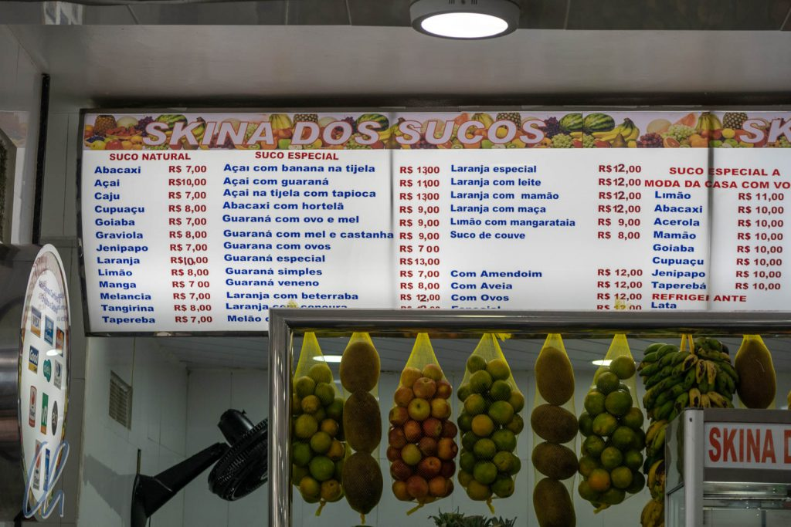
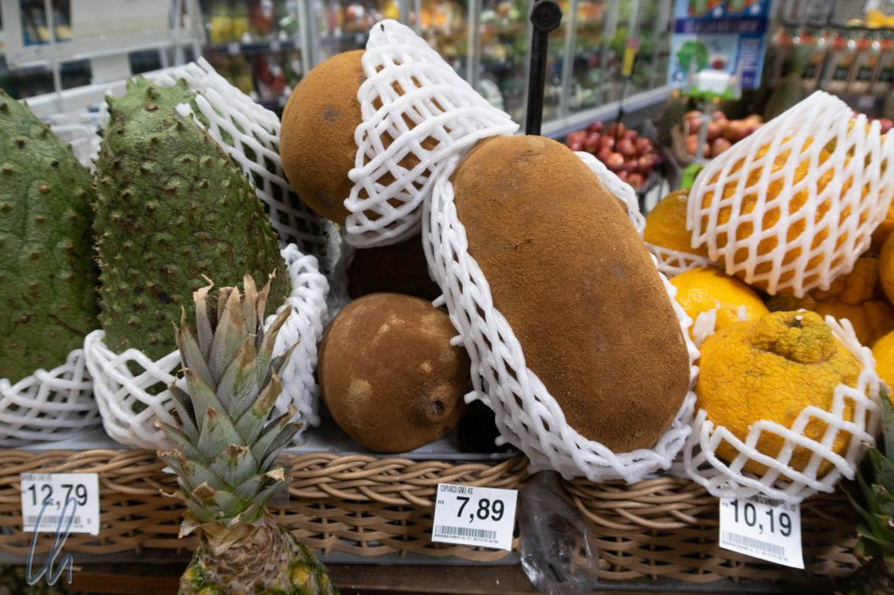

# Brasilien kulinarisch: Von Früchten und Säften

Ein besonderer kulinarischer Höhepunkt in Brasilien sind die vielen tropischen Früchte und diese werden zu phantastischen Säften verarbeitet. Neben einigen guten Bekannten wie z.B. Ananas gibt es in Brasilien viele Obstsorten, von denen wir noch nie im Leben gehört, geschweige denn sie probiert oder deren Saft getrunken hatten. Diese Fruchtvielfalt haben wir als Herausforderung verstanden. So bestellten wir bei jeder Gelegenheit zum Trinken genau die Früchte, unter denen wir uns nichts vorstellen konnten.

<!--more-->

## Sprachverwirrung?

Mit dem Portugiesischen hatten wir so unsere Probleme, aber geschrieben war es immerhin deutlich einfacher zu verstehen als gesprochen. Die Frucht, die auf Spanisch Naranja (Orange) heißt, ist eine portugiesische Laranja und aus einer Limon (Zitrone/Limette) wird eine Limão. Mit etwas Zeit und den Apps [Leo](https://dict.leo.org/portugiesisch-deutsch/) und [GoogleTranslate](https://translate.google.de/) erkannten wir auch auf Portugiesisch schnell einige unserer Favoriten auf der Getränkekarte wieder. Hinter einer [Abacaxi](https://dict.leo.org/portugiesisch-deutsch/Abacaxi) steckte eine Ananas und [Melancia](https://dict.leo.org/portugiesisch-deutsch/Melancia) heißt Wassermelone.

Als wir jedoch das erste Mal in einer brasilianischen Saftbar in Manaus saßen (zu dem Zeitpunkt noch ohne hilfreichen Internetzugang), mussten wir allerdings erkennen, dass die Technologie offline nicht alle Fragen beantworten konnte. Wenn wir nach "[Taperebá](https://translate.google.de/#view=home&op=translate&sl=pt&tl=de&text=Tapereb%C3%A1)" suchten, war die Übersetzung "Taperebá" und "[Cupuaçu](https://translate.google.de/#view=home&op=translate&sl=pt&tl=de&text=Cupua%C3%A7u)" blieb "Cupuaçu". Um aus der Bestellung keine Doktorarbeit zu machen, bestellten wir einfach Cupuaçu und ließen uns (positiv!) überraschen. Dass viele der uns sowieso schon unbekannten Früchte in verschiedenen Gegenden Brasiliens unterschiedliche Bezeichnungen haben, bemerkten wir erst im Laufe der Reise.

## Cupuaçu: Frucht, Saft und Schokolade

[Cupuaçu](https://de.wikipedia.org/wiki/Cupua%C3%A7u) schmeckte etwas nach Birne, aber doch anders, aromatisch-säuerlich. Es war ein wirklich eigener Geschmack, den wir sehr angenehm fanden. Der Saft wird wir aus dem weißen Fruchtfleisch hergestellt.

Später lernten wir, dass die Cupuaçu-Pflanze mit dem Kakao verwandt ist und dass man aus den fetthaltigen Samen eine Art Schokolade herstellen kann. Diese besondere Form der Schokolade nennen die Brasilianer "Cupulate", eingedeutscht würde es zu Cupulade. Die Cupulade ist in Kakao-Maßstäben eher minderwertig, was im wesentlichen aber daran liegt, dass das Verfahren zur Fermentation nicht ausreichend[ entwickelt](https://de.wikipedia.org/wiki/Cupua%C3%A7u#Nutzung) ist. Vita, die Köchin auf der [Lo Peix](http://wittmann-tours.de/mit-der-lo-peix-unterwegs-auf-dem-rio-negro), zauberte trotzdem aus Cupuaçu-Fruchtfleisch und Cupulade in mehreren Schichten den besten Nachtisch, den wir in Brasilien gegessen haben. Das Dessert vereinte Süße und Fruchtigkeit. Nur in Ermangelung eines Fotos dieser Köstlichkeit (die Schüssel war sehr schnell ausgekratzt) folgt ein Bild von abgepackter Cupulade.

## Superfrucht und super Saft

[Acerola](https://de.wikipedia.org/wiki/Acerola) wird auf Deutsch auch "Acerolakirsche" genannt, wie wir später von Wikipedia lernten. Die Frucht selbst ähnelt in der Tat einer Kirsche und ihr angenehmer Geschmack ist etwas säuerlich. Außerdem ist Acerola gesund und sehr reich an Vitamin C. Die ultimative Superfrucht ist aber angeblich die [Açaí](https://de.wikipedia.org/wiki/Euterpe_oleracea)-Beere, die sogar ein Exportschlager ist, was in Brasilien zu einem massiven Anstieg der Preise geführt hat.

Açaí (die Frucht ähnelt im Aussehen einer Heidelbeere) schmeckt nicht nur als Saft oder Smoothie, sondern auch in Kombination mit [Farofa](https://de.wikipedia.org/wiki/Farofa), geröstetem Maniokmehl, einer Basiszutat der brasilianischen Küche. Farofa und Açaí (in einer Konsistenz wie ein Smoothie) mischt man ungefähr so wie Müsli und Joghurt. Die Kombination schmeckt erfrischend und fruchtig zum Frühstück oder ist eine leckere Zwischenmahlzeit. Auch Açaí-Eiscreme ist erhältlich und scheint sich in Brasilien großer Beliebtheit zu erfreuen.

## Und noch mehr Säfte und Früchte

Vor allem in der ersten Zeit in Brasilien gab es jeden Tag etwas Neues zu probieren. Graviola (auch als [Soursop](https://de.wikipedia.org/wiki/Stachelannone), Guanábana oder Corossol bezeichnet), eine grüne stachelige Frucht mit weißem Fruchtfleisch und schwarzen Kernen, hatten wir zwar in Ecuador schon probiert, aber schon fast wieder vergessen. [Taperebá](https://en.wikipedia.org/wiki/Spondias_mombin) schmeckte ein wenig wie Mango, allerdings säuerlicher, und einige weitere Früchte können wir leider nicht mehr rekonstruieren…

Vor allem in Manaus drängte sich uns der Eindruck auf, dass Brasilien ein einziger Saftladen sei ;). All diese herrlichen tropischen, uns unbekannten und geschmacklich schwer zu beschreibenden Früchte verarbeiteten die Brasilianer wahrhaftig an jeder Straßenecke zu fruchtig-frischen Säften. Später auf unserer Reise durch das Land, zum Beispiel in Rio oder São Paulo, kommerzialisierte sich (leider) das Angebot. Açaí war meistens zuckersüß und sehr sämig. Glücklicherweise fanden wir auch überzeugenden Saft aus der Tüte, zum Beispiel Caju. Dabei handelt es sich nicht um ausgepresste Cashewnüsse, sondern um den Saft des sogenannten [Cashew-Apfels](https://de.wikipedia.org/wiki/Cashew#Cashewfrucht_und_Cashewapfel), des dicken fleischigen Fruchtstiels, an dem die Nuss wächst.

Die letzte Frucht, die wir auf keinen Fall unerwähnt lassen wollen, ist [Guaraná](https://de.wikipedia.org/wiki/Guaraná). Die Pflanze ist im Amazonasbecken verbreitet und sie war und ist Teil der indigenen Volksmedizin. Die getrockneten Samen der roten Frucht werden gemahlen und das Pulver kann mit heißen oder kalten Getränken gemischt werden. Diese Mixtur dämpft das Hungergefühl und wirkt leistungssteigernd. Heutzutage erfreut sich Guaraná auch als kommerziell hergestellte Limonade großer Beliebtheit. Die Samen, und damit auch die Limonade, enthalten Koffein. Das Getränk wirkt also anregend und man könnte es als die brasilianische Coca Cola bezeichnen.

