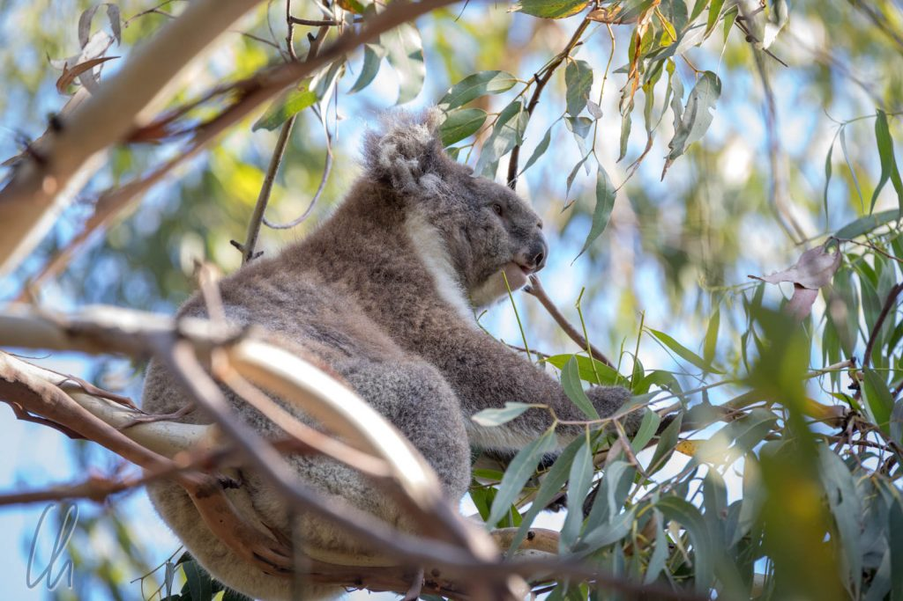
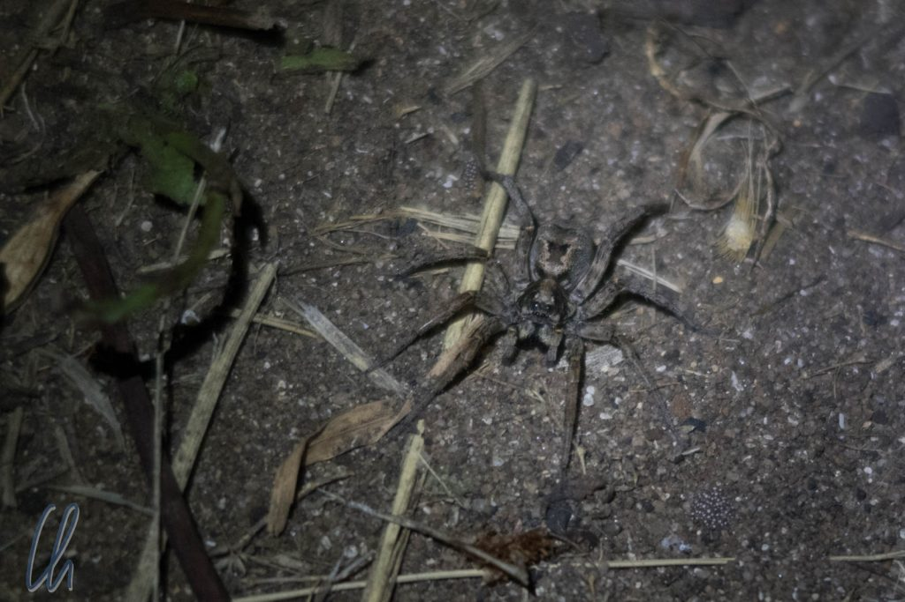

# Campen unter Koalas

Auf der Suche nach unserer ersten Unterkunft an der [Great Ocean Road](https://de.wikipedia.org/wiki/Great_Ocean_Road) stießen wir auf den [Bimbi Park](http://www.bimbipark.com.au/), einen Campingplatz im Regenwaldgebiet von Cape Otway mit dem Werbeslogan "Camping unter Koalas". Natürlich wollten wir unbedingt dort übernachten, auch wenn wir gar keine Campingausrüstung dabei hatten! Da alle Cabins ausgebucht waren, reservierten wir ein [Camping Pod](http://bimbipark.com.au/accommodation/camping_pods.html), für alle, die kein Zelt dabei haben und trotzdem unter Koalas schlafen möchten.

<!--more-->

## Das Versprechen wurde erfüllt

Bei der Tierbeobachtung gibt es bekanntlich mehrere Strategien: Entweder man begibt sich selbst auf die Suche nach den Tieren oder man schaut, wo andere Leute etwas entdeckt haben. Direkt nach dem Einchecken auf dem Weg zu unserem Pod sahen wir eine kleine Gruppen von Menschen, die ihre Kameras in eine Baumkrone richteten. Tatsächlich, ein Koala! Der niedliche Kumpane bewegte sich sogar und ließ sich seine Eukalytus-Blätter in der Abendsonne sichtlich schmecken.

Nach einiger Suche auf dem riesigen Gelände fanden wir endlich unseren Camping Pod. Die Grundfläche betrug etwa 6x3 Meter und das einzige Mobiliar war eine Art Bett. Im hinteren Drittel der Unterkunft war eine Spanplatte eingezogen, auf der eine dünne Matratze lag. Zum Glück konnten wir an der Rezeption wenigstens eine Decke ausleihen... Diese Bleibe war damit die einfachste, die wir in Australien hatten, aber auch eine der am schönsten gelegenen.

Vor Sonnenuntergang unternahmen wir einen Spaziergang auf den Wegen des Bimbi Parks. Koalas fanden wir abends keine mehr, dafür waren die zahlreichen Vögel, die auch in diesem Wald ihr Zuhause haben, sehr aktiv. Die Kakadus krächzten, grüne und rosa Papageien pickten im Gras nach Futter und flogen unter lautem Geschrei gruppenweise von Baum zu Baum. Wir konnten uns an ihnen gar nicht sattsehen.

## Übernachten unter den Koalas

Nach Einbruch der Dunkelheit machten wir es uns auf den Stufen im Eingangsbereich unseres Pods bequem und aßen unser Abendessen im Taschenlampenschein. Auf einmal bemerkten wir im Licht der Stirnlampen viele kleine funkelnde Tröpfchen auf dem Boden. Das wunderte uns ein wenig, denn es hatte bestimmt nicht geregnet. Handelte es sich vielleicht um Spinnen, ähnlich, wie wir sie in [Kambodscha im Dschungel](http://wittmann-tours.de/dschungel-trekking-in-chi-phat/) gesehen hatten? In der Tat, manche der kleinen Achtfüßler saßen auf dem Boden, bei anderen lugten nur die Augen aus dem Sand. Da wir nicht wussten, um welche Art von Spinnen es sich handelte und ob sie vielleicht giftig wären, navigierten wir auf dem Weg zum Wasch-/Toilettenhaus sicherheitshalber großzügig um sie herum.

Auf einem dieser Gänge mitten in der Nacht reflektierte das Licht der Stirnlampe in einem paar Augen von einem großen Baum direkt in unserer Nachbarschaft. Ein Koala hatte es sich dort gemütlich gemacht und blinzelte herunter. Anscheinend nächtigte er buchstäblich über uns. Am nächsten Morgen fanden wir ihn nur wenige Äste weiter im gleichen Baum, wo er sich ein Schattenplätzchen gesucht hatte.

