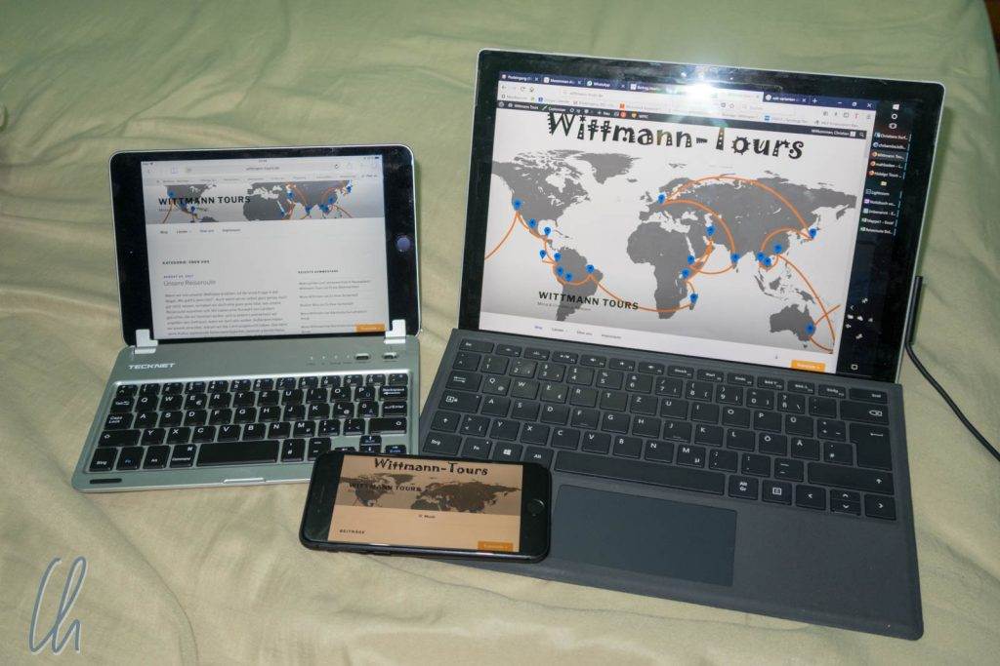
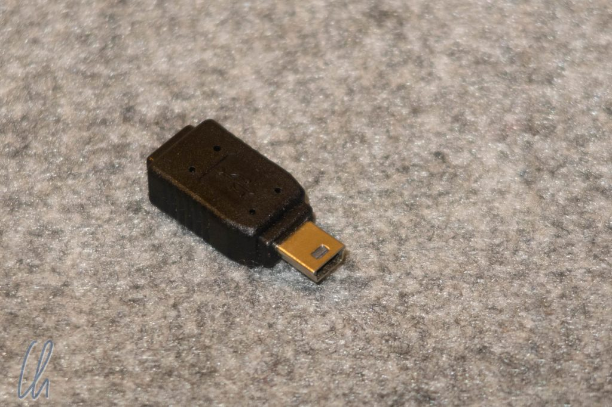
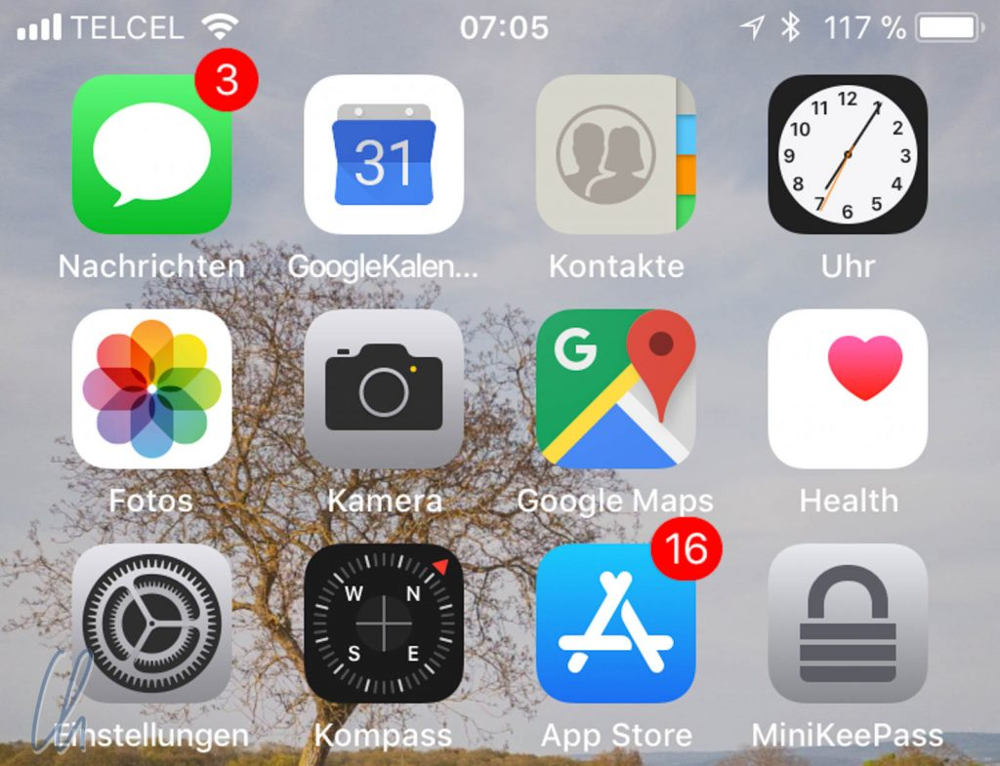
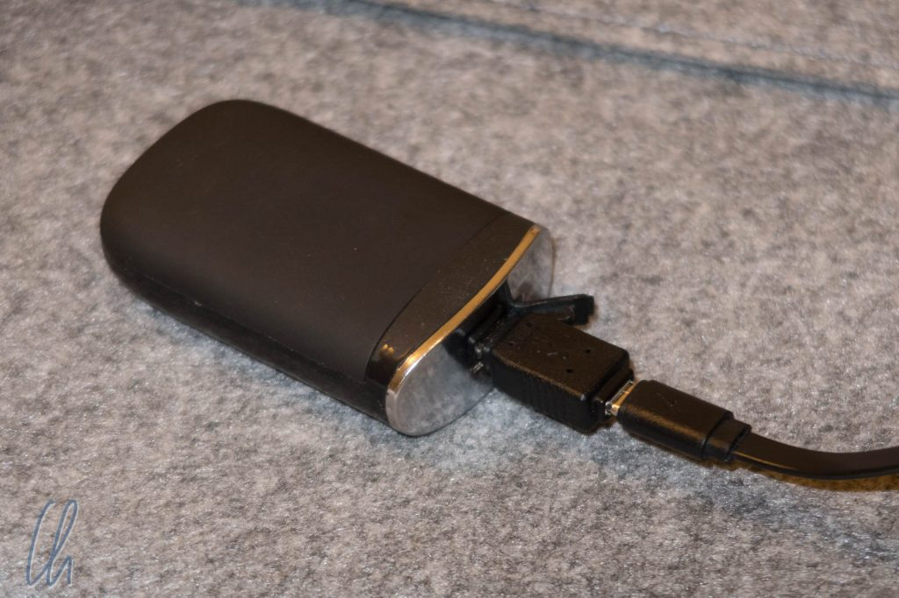
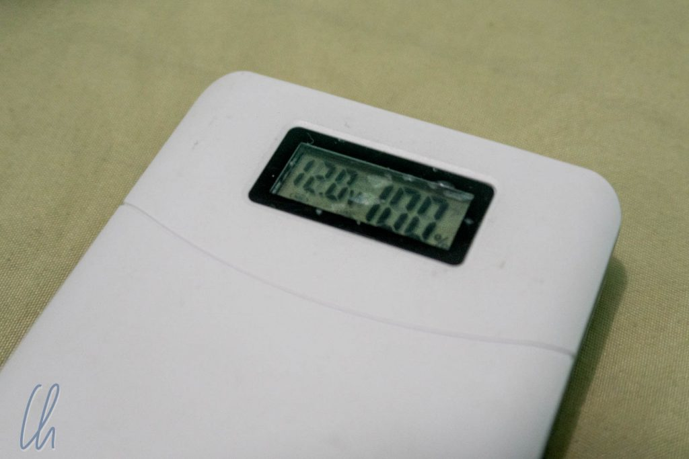

Diverse kleine elektronische Helferlein sind aus dem Alltag einfach nicht mehr wegzudenken, so auch für uns als Reisende. Die Reiseführer lesen wir mit der Kindle App, den Blog schreiben wir auf Laptop und iPad. Tagsüber ist Google Maps auf dem iPhone meist der Navigator durch Großstädte oder auf Wanderungen. Dazu ist es natürlich wichtig, dass der Akku immer voll aufgeladen ist. Der SmartCharger ist eine tolle neue Erfindung, die wir nicht mehr missen wollen.

<!--more-->

## 100% Kapazität und mehr

In Brisbane haben wir vom SmartCharger des Startups Charge100+ gehört. Damit lassen sich lassen sich beliebige Lithium-Ionen Akkus überladen, ähnlich wie früher Prozessoren übertaktet wurden.

Die Technik hört sich einfach an, erfordert aber viel Knowhow. Moderne Akkus werden weit unter Ihren Möglichkeiten betrieben, damit sie möglichst lange halten. Durch trickreiches Aufladen - hierzu wird der Strom moduliert und auf doppelte Normfrequenz oszilliert - nehmen die Akkus mehr Energie als ihre nominelle Kapazität auf. Tests mit zahlreichen Geräten haben gezeigt, dass es langfristig keine negativen Auswirkungen gibt, solange ein Akku mindestens einmal pro Quartal bis unter 10% entladen wird.

Die erreichbaren Zusatzkapazitäten hängen stark vom Akku ab. Als Faustformel gilt, dass modernere Akkus mit immer mehr Reserve gefertigt werden, um Sammelklagen zu vermeiden, wie es zum Beispiel [jüngst Apple traf](https://www.heise.de/mac-and-i/meldung/iPhone-Drosselung-wegen-altem-Akku-Klage-Tsunami-gegen-Apple-3936050.html). Bei der aktuellen Smartphone-Generation sind Kapazitäten von bis zu 130% möglich, bei älteren Geräten eher 110-120%. Unsere beiden iPhones, ein 6s und ein 7er, erreichen mit dem SmartCharger 113% bzw. 117%.

## Etwas Reserve ist immer gut

In [Japan](http://wittmann-tours.de/category/asien/japan/), [Myanmar](http://wittmann-tours.de/category/asien/myanmar/) oder [Kambodscha](http://wittmann-tours.de/category/asien/kambodscha/) gab es viele Tage, an denen wir am Ende den Stromsparmodus aktivieren mussten, um nach dem Abendessen Google Maps noch als Wegweiser zum Hotel nutzen zu können. Die SmartCharger-Extraprozente machen viel aus und geben uns eine willkommene Reserve, vor allem auf langen Fahrten, oder wenn wir neu in einer Stadt angekommen sind.

Der SmartCharger war erstaunlich günstig: 39 australische Dollar (entspricht 30 USD bzw. 25 EUR) mussten wir berappen. Da der SmartCharger zusätzlich zwischen Gerät und Ladegerät geschaltet wird, ist er klein, kompakt und kann mit allen Geräten genutzt werden. Das Basispaket hat alle passenden Stecker: Mini-USB (je Typ A und B), Micro-USB (je Typ A und B), Lightning. Weitere Steckertypen sind gegen Aufpreis erhältlich.

Einzig problematisch ist nur die Anzeige bei machen Geräten, da die Firmware nicht mehr als 100% zulässt. Dann ist es aber so wie bei manchen vollgetankten Autos. Dort bewegt sich während der ersten 100km die Tanknadel nicht, ein Elektrogerät (zum Beispiel meine Powerbank) zeigt mit SmartCharger aufgeladen einfach länger 100% an. Für iOS und Android sind ist seit kurzem Apps verfügbar, die im Hintergrund laufen, und über die der echte Akkustand angezeigt wird.

## Bald soll der SmartCharger weltweit verfügbar sein

Aus patentrechtlichen Gründen - die Konkurrenz schläft nicht - wird der SmartCharger aktuell noch nicht weltweit verkauft. Sobald die Patente erteilt wurden, soll sich dies ändern. Charge100+ ist optimistisch, dass sie in zahlreichen Märkten zum Weihnachtsgeschäft 2018 schon vertreten sein werden.

Der SmartCharger ist für uns eines der wichtigsten Gadgets für unterwegs geworden. Wir sind sehr zufrieden und freuen uns, dass wir gleich zugeschlagen haben! Hoffentlich startet der weltweite Verkauf bald.
