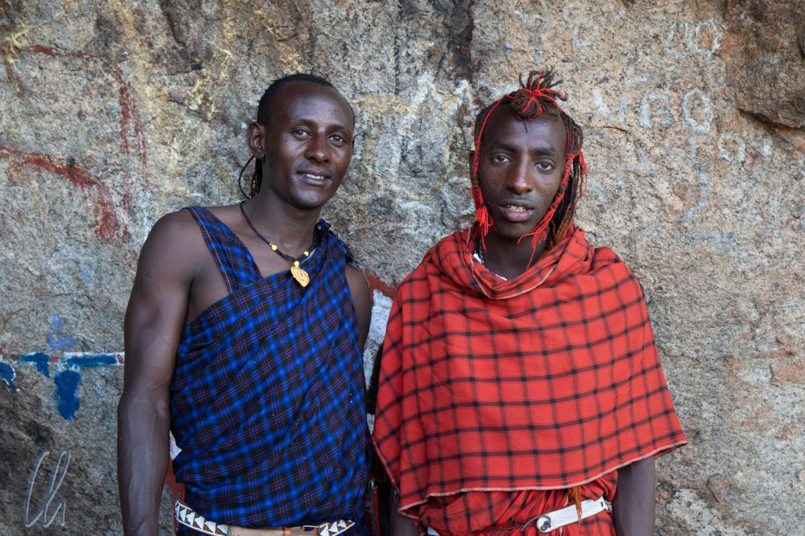
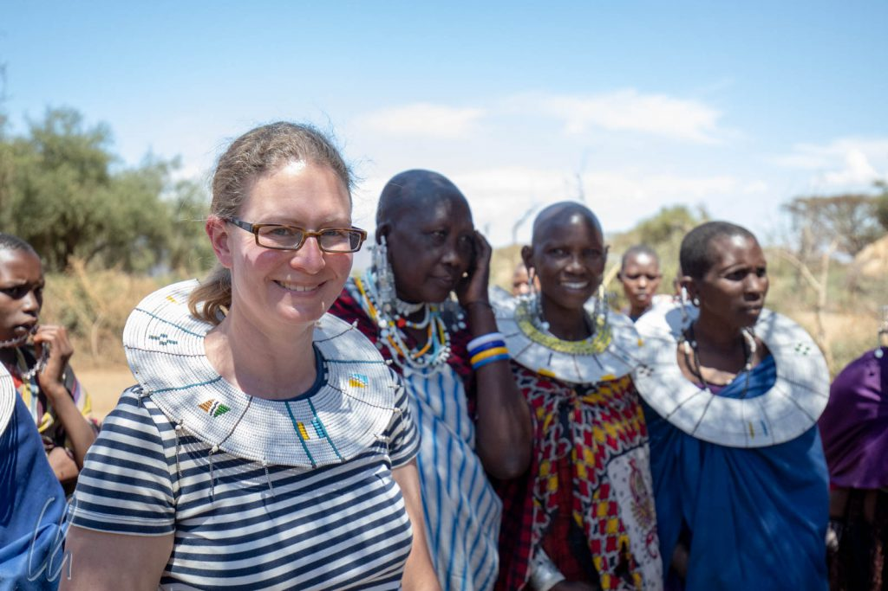
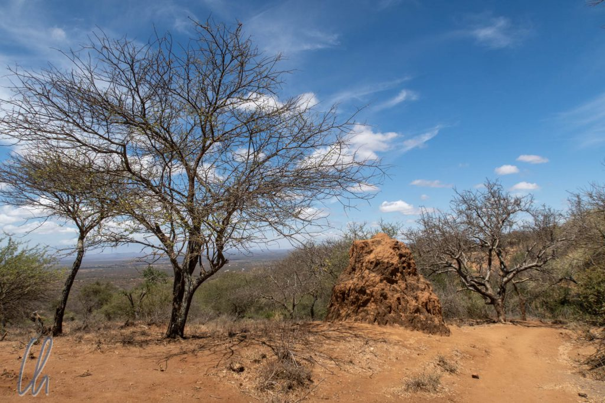
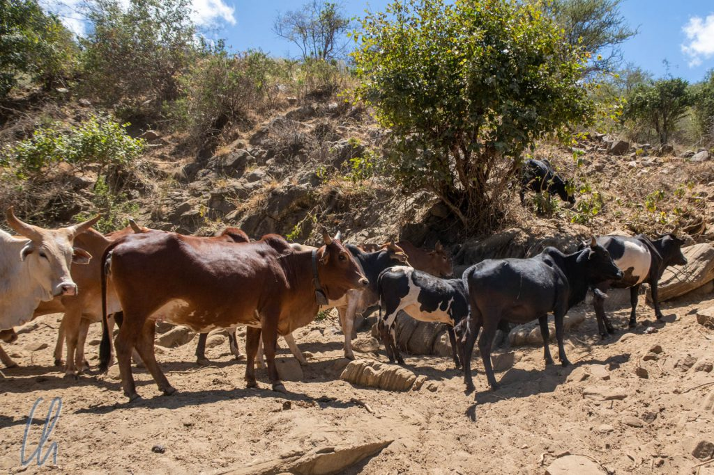
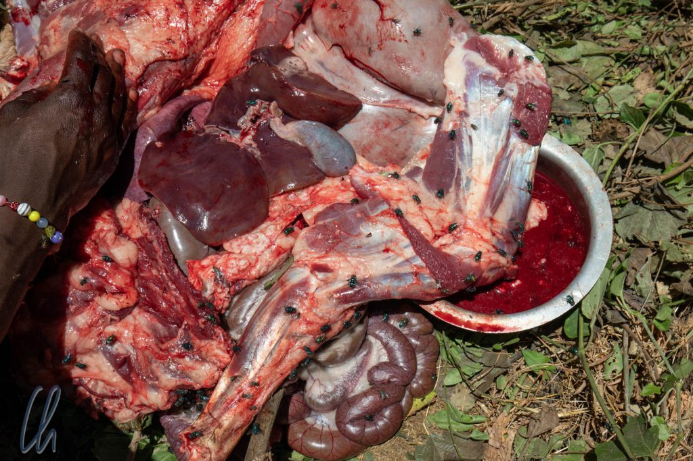

Denkt man an Tansania, so kommen einem vielleicht als erstes Safaris in den Sinn oder auch die Insel Sansibar. Sicher sind dies die bekanntesten Aktivitäten bzw. Ziele in Tansania. Um die Menschen und das Land an sich besser kennenzulernen, bietet sich der sogenannte Cultural Tourism an. Wir wohnten in [Arusha](http://wittmann-tours.de/arusha-am-fusse-des-mount-meru) und besuchten von dort aus ein Dorf der emblematischen Massai.

<!--more-->

## Cultural Tourism, was ist das?

Kaum ein anderes Volk hat so viel [Strahlkraft](https://de.wikipedia.org/wiki/Massai) wie die Massai. Man denkt an stattliche Krieger, den Prototypen des "[edlen Wilden](https://de.wikipedia.org/wiki/Edler_Wilder)", der im Einklang mit der Natur lebt. Mit ihren Speeren töten sie unerschrocken Löwen und trinken das Blut ihrer Rinder mit Milch vermischt. So oder so ähnlich könnte man die Massai klischeehaft beschreiben, aber deckt sich das auch mit der Realität? Wie leben die Massai heute? Um solche Fragen zu beantworten, gibt es Cultural Tourism.

Die Organisation im Vorfeld war nicht einfach, da die Strukturen in Tansania vor allem darauf ausgerichtet sind, dass man Aktivitäten vor Ort bucht. Vieles findet man (noch) nicht im Internet und in diesem Fall gab es die zentrale Online Anlaufstelle (<http://www.tanzaniaculturaltourism.go.tz>) einfach nicht mehr. So waren wir dankbar für die Vermittlung eines Kontakts durch unsere Safari-Lodge in Ruaha. [Gideon](http://www.stainbokadventures.co.tz/cultural-tourism/), ein Massai, der schon lange in der Stadt lebt, organisierte u.a. Touren in sein Dorf. Auf diese Art kann man im Rahmen von Cultural Tourism Einblicke in Leben und Kultur von lokalen Bevölkerungsgruppen gewinnen.

## Auf dem Weg zu den Massai

Bei der Buchung wussten wir noch nicht, welches einzigartige Erlebnis uns erwarten würde. So fuhren wir morgens von Arusha aus nach Norden in Richtung der kenianischen Grenze. Unterwegs erzählte uns Gideon, dass wir nicht nur das Dorf sehen würden, sondern außerdem die günstige Gelegenheit nutzen könnten, die Zusammenkunft einiger Massai-Krieger in der Nähe zu besuchen. Zusammen mit Gideon (in westlicher Kleidung) und Saidoti (im Massai-Shúkà), dem Dorfvorsteher, wanderten wir (im Touri-Look) zu den Massai.

Das satte Grün Arushas war einer trockenen und heißen Halbwüstenlandschaft gewichen. Roter, staubiger Boden, kleine Bäume oder Büsche und vertrocknetes Gras prägten die Landschaft. Es ging leicht bergauf und wir trafen einige Hirten mit ihren Ziegen auf dem Weg. Die meisten waren Kinder und die traditionelle Begrüßung verlief wie folgt: Sie kamen zu uns und senkten ihren Kopf wie bei einer Verbeugung, um uns Respekt zu bezeugen. Der Gruß wird erwidert, indem man ihnen die Hand auf den Kopf legt und "Supai" sagt.

Das letzte Stück des Pfades ging es steiler bergauf. Dort hatten acht Massai-Krieger für etwa 2 Wochen ein Lager aufgeschlagen. Sie trafen sich, um sich auszutauschen, voneinander zu lernen und um gemeinsam ein sog. "meat eating ritual" ("Ol Pul") durchzuführen. Frei übersetzt könnte man es als traditionelles Schlachtfest bezeichnen. Gemeinsam hatten sie an dem Tag eine Ziege geschlachtet, um sie anschließend in den folgenden Tagen zu verspeisen. Teile des Fleisches sollten auch an junge Männer anderer Dörfer verteilt werden. Frauen dürfen sich während der Zeremonie nicht dem Lager der Krieger nähern. Für Mona galt glücklicherweise eine Ausnahme.

## Die Massai-Krieger schlachteten eine Ziege

Als wir ankamen, waren zwei Massai gerade damit beschäftigt, die Ziege zu zerlegen. Sie hatten sie erstickt, damit das wertvolle Blut nicht ausliefe. Dieses wurde im Laufe des Zerteilungsprozesses abgeschöpft, um es später zu trinken. Ein Massai führte dabei die beiden Messer, ein langes und ein kurzes, er fungierte als Lehrer. Der andere Massai war der Schüler und assistierte mit bloßen Händen, indem er die Ziege ausrichtete und festhielt.

Es war eine blutige Angelegenheit, aber die beiden strahlten eine unglaubliche Ruhe aus und arbeiteten sehr routiniert. Das archaische Ritual war nicht abstoßend, sondern faszinierend zu beobachten. Die beiden zogen der Ziege nach und nach das Fell ab und öffneten den Rumpf immer weiter. Sie entnahmen die Innereien und schöpften das Blut in eine Metallschüssel ab. Danach zerteilten sie das Tier in handlichere Stücke. Natürlich waren die Umstände mit heutigen Vorstellungen von Lebensmittelhygiene ganz und gar nicht vereinbar. Zahlreiche Fliegen surrten über den Kadaver und saßen auf dem Fleisch. Einziges Zugeständnis an die Sauberkeit war, dass der Boden, auf dem das Schlachtgut lag, mit abgeschnittenen Zweigen und Blättern bedeckt war. Unter den Gegebenheiten erschien ein solches Verfahren jedoch normal und nicht zu ändern.

Wir waren willkommene Gäste, um zu beobachten, was die beiden taten. Zwischendurch durften wir auch ihr einfaches Quartier besuchen. Sie hatten einen Bereich vor einem großen Felsvorsprung mit dornigen Ästen umzäunt. Dort gab es eine Feuerstelle mit einem großen Topf, ein Gestell zum Trocknen und Aufbewahren des Fleisches und mehrere Schlafplätze.

## Im Dorf der Massai

Anschließend wanderten wir zum Massai-Dorf, wo wir von den Bewohnern begrüßt wurden. Ein Massai-Dorf ist allerdings beinahe ein Widerspruch in sich, da die Massai ursprünglich ein halb-nomadisches Leben geführt hatten. Sie zogen früher zu verschiedenen Jahreszeiten in unterschiedliche Regionen, damit ihre Rinder, ihr großer Reichtum, stets bestens versorgt waren. Permanente Siedlungen sind damit eine eher neue Erfindung, die es ihnen heutzutage auch ermöglicht, selbst ein wenig Landwirtschaft zu betreiben. Früher hatten sich die Massai stets geweigert, Ackerbau zu betreiben, aber aufgrund der geringeren Größe der Herden können sie in der Gegenwart auf Getreide und Mais in ihrer Ernährung nicht mehr verzichten.

Die Massai des Dorfes, das wir besuchten, hatten ursprünglich in der Serengeti gelebt. Sie waren aber umgesiedelt worden, als das Gebiet zum Nationalpark erklärt wurde. Statt jedoch eine Geschichte von Vertreibung und Bitterkeit zu erzählen, war diese Gruppe von Massai nach ihren Angaben mit dem Tausch sehr zufrieden. Sie waren entschädigt worden und die Kinder haben jetzt besseren Zugang zu Schulen. Diese positive Haltung ist jedoch nicht die Regel, da man im Internet auch aktuell Berichte über [menschenunwürdige Zwangsumsiedlungen](https://afrika.info/newsroom/tansania-maasai-werden-aus-ihren-doerfern-vertrieben/) findet.

## Tanz und Gesang

Ein Höhepunkt unseres Besuches im Dorf war die Darbietung eines typischen Massai-Tanzes, der von einem rhythmischen Sprechgesang begleitet wurde. Die Menschen bildeten einen Kreis, die Frauen standen auf der einen, die Männer auf der anderen Seite, die Kinder drumherum. Einige Massai erzeugten mit ihren Stimmen den Rhythmus, andere die Melodie mit dem Text. Die Männer wippten in den Knien und nach und nach kam jeweils einer in die Mitte und sprang einige Male kräftig in die Höhe. Dies war eine Kraftdemonstration der unverheirateten Männer und Werbung um die hübschesten Mädchen.

Die Frauen bewegten sich ebenfalls zur Musik. Ihr prächtiger Schmuck aus Ketten und Armreifen verstärkte so den Rhythmus. Instrumente gab es nicht. Alles war a capella, trotzdem aber harmonisch, kraftvoll und mitreißend.

## Mittendrin statt nur dabei

Wie wir es aus Madagaskar kannten, es aber in Tansania noch nicht erlebt hatten, wollten die Kinder sich selbst und auch die anderen Dorfbewohner auf dem Display meiner Kamera bestaunen. Es war ein großer Spaß für sie und für uns ein einfacher Weg, uns ein wenig zu revanchieren. Gideon versprach, bei einem nächsten Besuch einige Bilder als Abzüge mitzubringen und zu verteilen.

Zum Abschluss besuchten wir eine typische Massai-Hütte, das Haus der Mutter des Dorfvorstehers Saidoti. Ein Gerüst aus Holz gab dem Gebäude Stabilität, das Dach war aus Zweigen, die mit getrocknetem Gras gedeckt waren, und die Wände aus Lehm und Kuhdung mit winzigen Fenstern. Vor allem direkt nach dem Eintreten erschien uns das Innere der Hütte sehr dunkel und unsere Augen mussten sich erst an das gedämpfte Licht gewöhnen. Verglichen mit draußen war es in dem Raum aber relativ kühl. Wir sahen die Schlafplätze der Bewohner, die Kochstelle und einen kleinen Abstellraum in der niedrigen Hütte, in der wir nicht aufrecht stehen konnten.

## Ein faszinierender Tag

Das Leben der Massai hat sich im Gegensatz zu früheren Zeiten in einigen Punkten geändert. Wir hatten den Eindruck, dass der Alltag der Menschen, den wir sahen, keine Touristen-Show war, sondern dass ihre Kultur einen großen Stellenwert einnahm und dass auch jüngere Generationen die Traditionen achteten und fortführten. Wir haben an diesem Tag viel gelernt, auch oder gerade wegen unseres Führers Gideon als modernen Massai, der mit uns seine eigenen Wurzeln besuchte und viele Brücken für uns schlagen konnte.

Der Besuch bei den Massai war ein faszinierendes Erlebnis. Besonders das Treffen der Krieger zum Schlachtfest hat uns in seiner archaischen Form tief beeindruckt. Wir verbrachten einen wirklich außergewöhnlichen Tag mit den Massai.
