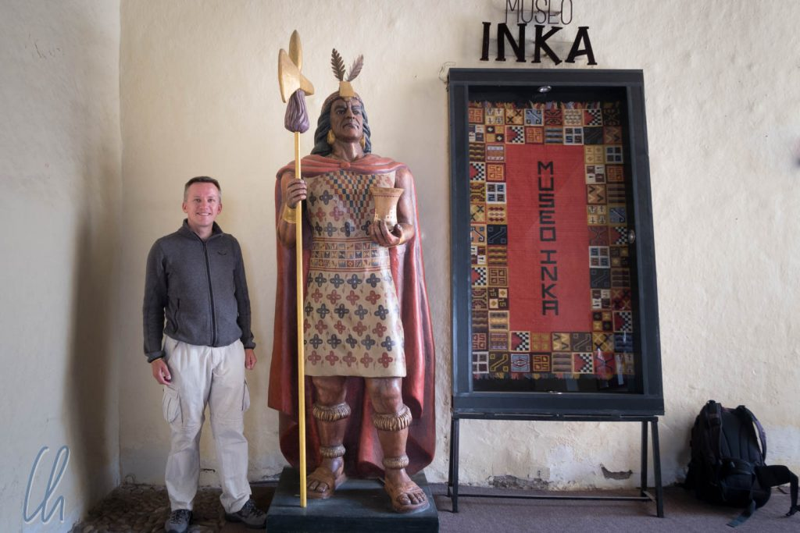
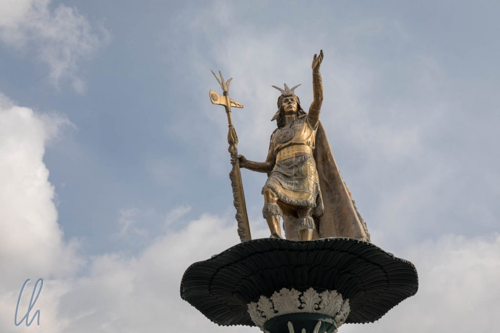

Die Touristenmassen zieht es also mit guten Grund nach Cuzco, der früheren Hauptstadt von [Tawantinsuyu](https://de.wikipedia.org/wiki/Inka#Tawantinsuyu_%E2%80%93_Reich_aus_vier_Reichen), dem Reich der Inka. Angeblich handelt es sich um die am längsten kontinuierlich bewohnte Stadt in den Amerikas. Es ist also ein sehr geschichtsträchtiges Pflaster und dort spielten sich auch einige Kapitel des Untergangs des Inka-Imperiums ab. Wir besuchten sowohl die Innenstadt als auch die umliegenden Inka-Ruinen.

<!--more-->

## Tawantinsuyu, das Reich der Inka

Der Legende nach wurde Cuzco vom ersten Inka [Manco Cápac](https://de.wikipedia.org/wiki/Manco_C%C3%A1pac), einem Sohn des Sonnengottes [Inti](<https://de.wikipedia.org/wiki/Inti_(Gottheit)>), im 11. Jahrhundert an dem Ort gegründet, an dem er einen goldenen Stab im Boden versenken konnte. Es dauerte aber bis zum 15. Jahrhundert, bis die Inka unter [Pachacútec Yupanqui](https://de.wikipedia.org/wiki/Pachac%C3%BAtec_Yupanqui), dem neunten Inka, eine überregionale Großmacht wurden. Auf dem Zenit ihrer Macht herrschten die Inka über ein Gebiet, das in etwa das heutige Ecuador, Peru, Bolivien, Nordchile und Nordargentinien umfasste.

Die Inka herrschten über eines der größten Reiche in den Amerikas vor Ankunft der Europäer, allerdings nur ca. 100 Jahre lang. Bis heute scheint diese Zeit die Peruaner trotzdem sehr mit Stolz zu erfüllen, was sich schon in der lokalen Zeitrechnung widerspiegelt. Wenn es um die Geschichte Lateinamerikas geht, gibt es aus europäischer Sichtweise ganz grob die präkolumbianische Zeit, die Kolonialzeit und die Zeit nach der Unabhängigkeit. In Peru wird hingegen anders gerechnet. Hier bezieht man sich auf die prä-Inka-Zeit, die Herrschaft der Inka, die Kolonialzeit und die Zeit nach dem Ende derselben.

Das heutige Stadtbild von Cuzco entspricht weniger der früheren Inka-Stadt, sondern mehr dem, was nach der Eroberung durch die Spanier daraus entstanden ist. So dominiert die Kathedrale die Plaza de Armas und auch der zentrale Sonnentempel der Inka (Qorikancha) wurde durch Kirche und Konvent Santo Domingo überbaut. Es verwundert natürlich historisch betrachtet kaum, dass die Spanier keineswegs am Erhalt der als heidnisch betrachteten Inka-Kultur interessiert waren. Ihr hauptsächliches Ziel war es, die Reichtümer der Inka zu erobern. Trotz ihrer offensichtlichen militärischen Unterlegenheit waren die Inka wahre Meisterarchitekten. Ihre Mauern aus riesigen Steinblöcken stellen die Architektur der kolonialen Kirchen deutlich in den Schatten.

## Parade auf der Plaza de Armas

An unserem zweiten Tag in Cuzco wollten wir eigentlich die Inka-Stätten in der Umgebung der Stadt besuchen. Dazu war unsere erstere Anlaufstelle die Touristen-Information an der Plaza de Armas (die Angestellten von [iPeru](https://www.peru.travel/en-us/) zeigten sich immer sehr gut informiert und hilfsbereit!), um zu erfragen, wo wir am besten ein Collectivo (Sammeltaxi) finden könnten. Am Rande des Platzes hatten sich viele Schaulustige versammelt, deutlich mehr Peruaner als Touristen. In der Mitte waren Uniformierte aufmarschiert und eine Kapelle spielte. Irgendetwas würde dort bestimmt passieren. Auf Nachfrage bei den Einheimischen bekamen wir nur "desfile" ("Parade") als Antwort. Wir beschlossen zu warten und uns das Spektakel anzusehen.

Wie sollten nicht enttäuscht werden. Zunächst bezogen die Soldaten Aufstellung, meistens eher ernst und steif, ein paar Unterbefehlshaber hüpften aber mit gezogenem Säbel (!) sehr dynamisch und eher komödial über den Platz. Dann folgte der Aufmarsch der Universität. Dieser war nicht ganz so spannend, aber trotzdem interessant, dass die Studentinnen und Studenten mit einer Standarte ihrer Fakultät, erstere in hochhackigen Schuhen, mitmarschierten. Anschließend zogen einige indigene Gruppen in Trachten vorbei, zu typischer Andenmusik tanzend. Einige führten sogar geschmückte Lamas mit sich :). Den Abschluss bildete wieder das Militär, aber seht selbst:

https://www.youtube.com/watch?v=eJue8-TECgM

## Um Cuzco herum

Zwei Tage später starteten wir einen neuen Anlauf, die Inka-Ruinen im Umland von Cuzco zu besichtigen. Als wir auf dem Weg zur Bushaltestelle die historische Altstadt verließen, sahen wir ein anderes Cuzco, eine ganz normale lateinamerikanische Stadt. Wir ließen die wie geleckt wirkenden alten Häuser und die Andenkenläden hinter uns. Stattdessen betraten wir ein kreatives Chaos, in dem wir uns zur „Parada de Autobús“ durchfragen mussten, was sich aufgrund der sich widersprechenden Aussagen von Passanten etwas schwierig gestaltete. Schließlich fanden wir die Haltestelle nach gut einer halben Stunde des Suchens. Mehr Peruaner als Ausländer warteten auf den Bus, der sicher irgendwann kommen würde.

Eigentlich fuhr der Bus nach Pisac (im heiligen Tal), wir stiegen jedoch deutlich früher bei den Ruinen von [Tambomachay](https://de.wikipedia.org/wiki/Tambomachay) aus, um von dort aus bergab wieder nach Cuzco zurückzuwandern. Tambomachay, [Pukapukara](https://en.wikipedia.org/wiki/Puka_Pukara) und [Q’enqo](https://en.wikipedia.org/wiki/Qenko) waren eher kleine historische Stätten, aber dennoch sehenswert und sehr schön in den Bergen gelegen.

Auf dem Weg zurück nach Cuzco liefen wir einige Kilometer an der Straße entlang und machten jeweils an den Ruinen halt. Unterwegs gab es keine Souvenirstände mehr. Lamas und Alpakas grasten am Wegesrand, sie wurden allerdings nicht als Fotomotiv vermarktet. Auf vielen Dächern der Häuschen in den Dörfern fielen uns kleine Tonfiguren auf, die unter anderem zwei Stiere unter einem Kreuz darstellten und die das Haus beschützen sollen.

## Sacsayhuamán

Die beeindruckendste und historisch bedeutendste Inka-Stätte in der direkten Umgebung von Cuzco ist die gewaltige Festung [Sacsayhuamán](https://de.wikipedia.org/wiki/Sacsayhuam%C3%A1n) mit ihren riesigen Zickzackmauern. Viele der Bezeichnungen aus dem Quechua sind schwierig zu merken, dieser hingegen vergleichsweise einfach: Man muss nur an „Sexy Woman“ denken ;). In Sacsayhuamán bewunderten wir die imposantesten Inkamauern (handwerklich deutlich hochwertiger als in Machu Picchu!), perfekt zusammengesetzt aus gigantischen, tonnenschweren Steinblöcken. Wie es den Inka im 15.Jahrhundert gelungen war, ohne Rad und Arbeitstiere, geschweige denn Maschinen, ein solches Werk zu vollbringen, überstieg unsere Vorstellungskraft.

Sacsayhuamán war sowohl ein Heiligtum als auch ein mächtiges Bollwerk. Letzteres ist durch die Bauweise und die Lage oberhalb von Cuzco einfach nachzuvollziehen. In der Geschichte der Eroberung des Inka-Reiches durch die spanischen Kolonialisatoren war Sacsayhuamán die Bühne für den vorletzten Akt. Ab April 1536 [belagerten](https://de.wikipedia.org/wiki/Belagerung_von_Cuzco) die Inka unter [Manco Inka](https://de.wikipedia.org/wiki/Manco_C%C3%A1pac_II.) ihre eigene Hauptstadt im Kampf gegen die Konquistadoren. Sacsayhuamán war Dreh- und Angelpunkt der Kämpfe. Ende Mai 1536 konnten die Spanier Sacsayhuamán in einer blutigen Schlacht erobern. Nach der Niederlage waren Tausende getötete Kämpfer überall in der Festung zurückgeblieben. Ihre Leichname lockten Scharen der aasfressenden Andenkondore an. Erst im April 1537 gaben die Inka auf und zogen sich nach Ollantaytambo zurück (mehr dazu im folgenden Artikel).

In der Mitte der Anlage erstreckt sich ein weitläufiger Platz. Dort grasten einige Alpakas, die eine magische Anziehungskraft auf die Touristen auszuüben schienen. Sie dürften auf zahlreichen Urlaubsfotos von Reisenden aus aller Welt verewigt worden sein. Die Baby-Alpakas mit ihrer extra-weichen Wolle waren nicht nur die flauschigsten, sondern auch die niedlichsten. So stahlen die Kameliden den Ruinen doch ein wenig die Schau ;)

Sacsayhuamán liegt direkt oberhalb von Cuzco. Wir genossen von dort aus einen herrlichen Blick über die Stadt. Am Ende dieses langen Tages waren wir mehr als dankbar, dass wir nur noch absteigen mussten. Der Weg führte auf einem alten Inka-Pfad, mit großen Steinen uneben gepflastert, bergab zurück nach Cuzco und in der Verlängerung zu unserem Hotel.

