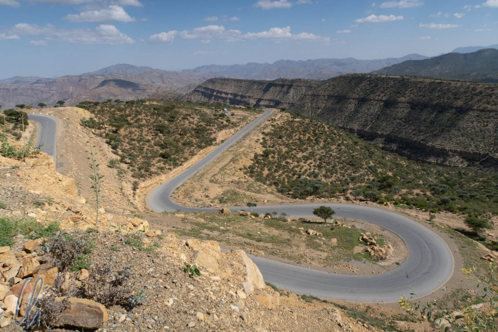

Für die nächsten Tage hieß es "Hochland, Adé!". Wir besuchten die [Danakil-Wüste](https://en.wikipedia.org/wiki/Danakil_Desert) in der [Afar-Region](<https://de.wikipedia.org/wiki/Afar_(Region)>), die teils auf, teils unter Meeresspiegelniveau liegt. Statt fruchtbarer Berglandschaft prägt diese Region eine lebensfeindliche Wüste, in der sich der heißeste Ort der Welt befinden soll: Dallol.

<!--more-->

## Das Thermometer steigt

Auf dem Weg nach Osten sahen wir schon nach kurzer Zeit keine Felder mehr am Straßenrand, stattdessen nur noch einige Ziegenherden, die sich in der kärglichen Umgebung ihr Futter suchten. Langsam aber sicher rollten wir Kurve um Kurve aus dem Hochland hinab. Die Straße war erstaunlich gut, durchgehend glatter Asphalt ohne Schlaglöcher, nur gelegentlich lagen die Reste von Geröll-Lawinen auf den Fahrspuren. Diese Verbindung scheinbar durchs Nirgendwo war deutlich besser als alle anderen Straßen, auf denen wir bisher gefahren waren. Der Abbau von Salz und Pottasche schien uns als Erklärung dafür eher unwahrscheinlich. Vielleicht standen militärische Gründe dahinter? Schließlich führte die Straße in das Grenzgebiet zu Eritrea.

In einer Kehre stand ein Junge, der ein Bündel Zweige hochhielt, als er unser Fahrzeug kommen sah. Wie Maru uns erklärte, bot der Jugendliche Ästchen des [Zahnbürstenbaums](https://de.wikipedia.org/wiki/Zahnb%C3%BCrstenbaum) zum Verkauf an. Traditionell benutzen Angehörige der Volksgruppe der Afar das Holz dieses Gewächses zur Reinigung ihres Gebisses. Und in der Tat sahen wir in diesem Teil des Landes immer wieder Männer, die auf einem Zweig herumkauten oder ihn lässig im Mundwinkel hängen ließen.

Je mehr Höhe wir abbauten, desto heißer wurde es und schnell war die 30 Grad-Marke überschritten. Obwohl die Sonne ihren Zenit schon lange überschritten hatte, stieg das Thermometer weiter. Die Zeit war gekommen, die Klimaanlage einzuschalten. (Bisher hatten wir meist die Fenster zum Lüften etwas geöffnet). Gegen 16 Uhr stand das Thermometer bei kuscheligen 37 Grad. Als ich die Scheibe kurz herunterließ, um ein Foto zu machen, blies ein heißer Zugwind, fast wie ein Föhn, ins Wageninnere.

Als wir auf Meeresspiegelniveau anlangten, zeigte das Thermometer schon 40 Grad, Tendenz steigend. Um 16:45 Uhr kamen wir am Ort unseres Nachtlagers in der Nähe des kleinen Ortes Hamed Ela auf -90m an. Das Dorf war nicht mehr als die Ansammlung einer Handvoll verstreuter Hütten mit Wänden aus Holzstangen in einer graubraunen Steinwüste. Dort erreichte das Thermometer unser Tagesmaximum von 42 Grad Celsius.

## Sonnenuntergang über dem Salzsee

Wir verweilten allerdings nur so lange in der wenig einladenden Siedlung, bis Maru nach einigem Palaver mit den einheimischen [Afar](<https://de.wikipedia.org/wiki/Afar_(Volk)>) und einer kurzen Wartezeit den für diesen Abschnitt vorgeschriebenen Roadguide, zwei bewaffnete Bewacher und den zusätzlichen Fahrer aufgetrieben hatte. Diese fuhren in einem separaten Auto vor uns her. Es gab keine Zeit zu verlieren, denn zum Sonnenuntergang wollten wir am [Karum-Salzsee](https://de.wikipedia.org/wiki/Karumsee) sein. Schon wenige Meter hinter dem Dorf endete die asphaltierte Straße und wir fuhren auf einer Piste über die Salzpfanne des Sees. Diese führte erst über eine trockene Trasse, dann durch seichtes Wasser. Die Szenerie, wenn auch sicherlich nicht die Temperaturen, erinnerten uns naturgemäß sehr an den Salar de Uyuni in Bolivien.

Am designierten Sonnenuntergangspunkt standen schon ein paar andere Geländewagen. Der Ort war nicht zufällig gewählt. Dort fing der See an, das Wasser stand wenige Zentimeter tief und spiegelte sehr stimmungsvoll den Sonnenuntergang. Die Ausdehnung des Salzsees schwankt saisonal erheblich. In der Regenzeit wird er durch Wasser aus dem Hochland gespeist und wächst, in der Trockenzeit verdunstet viel Flüssigkeit in der sengenden Hitze.

Es erschien uns schon etwas paradox: 5 Monate zuvor hatten wir auf dem [Salar de Uyuni](http://wittmann-tours.de/salar-de-uyuni-salz-soweit-das-auge-reicht/) auf 3600 Metern über dem Meeresspiegel bitterlich beim Sonnenuntergang in einer ähnlichen Landschaft gefroren. In Äthiopien standen wir nun 130 Meter unter dem Meeresspiegel barfuß und schwitzend im seichten Salzwasser, welches bei 40 Grad Außentemperatur allerdings keine Abkühlung spendete.

## Das Wüstencamp

Unser "Camp" bestand aus einer aus dünnen Holzstangen, Drahtgitter und Naturfasermatten konstruierten Hütte, in der unsere Crew wohnte. In diesem Teil Äthiopiens war es notwendig, eine ganze Entourage von [Afar](<https://de.wikipedia.org/wiki/Afar_(Volk)>) zu engagieren. Neben dem Roadguide und dem Fahrer gehörten auch ein Koch und zwei Bewacher mit Gewehren zu unserem Gefolge. (Diese Region war lange Zeit durch politische Instabilität geprägt.) Wir hielten wir uns fast die gesamte Zeit außerhalb des rudimentären Bauwerks auf, da es drinnen noch heißer war.

In einer Senke nicht weit von unserer Hütte hatte sich einiges an Müll angesammelt, Plastik und alte Konservendosen. Organischer Abfall wurde, wie wir miterlebten, restlos von den lokalen Ziegen verwertet. Wir vergnügten uns damit, die munteren gehörnten Nutztiere mit Gurkenschalen und dergleichen zu füttern und in der Tat wurde nichts verschmäht. Wir hofften auch, die Ziegen dadurch davon abhalten zu können, Bestandteile der Holzbude zu fressen. Dies gelang jedoch nur vorübergehend.

## Eine Nacht im Freien

Es gab keine sanitären Einrichtungen und wenig Deckung in der vegetationslosen Wüste, der zweite Punkt relativierte sich allerdings nach Einbruch der Dunkelheit ;). Maru hatte sogar eine Art Camping-Dusche dabei, so dass wir uns im Schutze der Nacht wenigstens vorübergehend den Schweiß abwaschen konnten. Das Thermometer stand weiterhin stur auf 38 Grad. Während des Abendessens setzte relativ plötzlich ein anhaltender Wind ein. Er entstand vermutlich durch die nun unterschiedlich schnell erkaltenden Luftmassen, trug aber nur wenig zur Abkühlung bei.

In dieser Nacht schliefen wir im Freien auf sehr einfachen, aber erstaunlich bequemen Holzpritschen, die wir im Windschatten des Geländewagens positionierten. Ein drittes, auf die Seite gestelltes Bett komplettierte den Windschutz für eine der heißesten Nächte unseres Lebens ;-). Der Sternenhimmel war allerdings weit weniger eindrucksvoll als man vielleicht vermuten könnte. Neben den über uns liegenden Luftmassen mit hoher Luftfeuchtigkeit war der Mond der Übeltäter. Er überstrahlte die Milchstraße und machte eine Taschenlampe vollkommen überflüssig. Ab 22 Uhr legte sich der Wind ein wenig, frischte aber gegen Morgen wieder auf. Kurz vor Sonnenaufgang lag die Tiefsttemperatur gerade einmal noch bei erfrischenden 30 Grad Celsius - nur um kurze Zeit später wieder zügig anzusteigen.

## Kamele statt Lastwagen

Am nächsten Morgen fuhren wir auf dem Weg zum Geothermalgebiet am Vulkan Dallol zunächst wieder in Richtung Karumsee. Auf dem Weg zur Salzpfanne trafen wir eine Kamelkarawane. Die Männer waren mit den Lasttieren auf dem Weg zum Salzabbaugebiet, das wir später noch besuchten. Erstaunlicherweise sind die ausdauernden Kamele auch heute noch das beste Transportmittel in dieser unwirtlichen Gegend, zuverlässiger als jeder Lkw.

Die Karawane umfasste in etwa 20 Tiere. Bis zu ihrem Ziel waren es noch gut 2 Kilometer, aber wir konnten nicht einschätzen, wie lange sie schon unterwegs waren. Weder den Männern noch den Kamelen schien die Hitze zu schaffen zu machen. Mona durfte sich sogar als Karawanenführerin versuchen.

https://www.youtube.com/watch?v=LgIISLs_fmk

Aber auch den zähen Paarhufern kann diese lebensfeindliche Umgebung zu viel abverlangen. Ab und zu sahen wir die gebleichten Skelette von verendeten Kamelen neben der Piste liegen.

## Das Geothermalgebiet Dallol

Ein paar Kilometer nördlich des Salzsees befindet sich der Vulkan Dallol, in dessen Umfeld sich ein wahrhaft spektakuläres Geothermalgebiet erstreckt. Vom Ende der Piste aus wanderten wir einige hundert Meter über ein erkaltetes Lavafeld. Der Weg wies eine leichte Steigung auf und führte in Richtung des "Gipfels" (auf -48m gelegen). Aus dem unebenen graubraunen Stein des Untergrundes erhoben sich einige Felskonen, vielleicht handelte es sich um ehemals aktive kleine Lavaschlote?

Einige hundert Meter weiter wurde es auf einmal bunt. Zunächst sahen wir kleine farbige Flecken von einem oder zwei Metern Durchmesser, die sich in einem kräftigen, schwefeligen Gelb vom restlichen Grau-in-grau der Lava abhoben. Je weiter wir gingen, desto größer wurden diese Ablagerungsareale und desto intensiver die Farben. Neben dem Gelb komplettierten ein kräftiges Braun-orange und Weiß die Palette. Darin befanden sich giftgrüne Pfützen, deren Flüssigkeit einen extrem sauren [pH-Wert](https://de.wikipedia.org/wiki/PH-Wert) von maximal 1 haben sollen.

Es war ein mehr als heißer Anblick, nicht nur weil die Temperaturen schon wieder die 40 Grad-Marke überschritten hatten. In der Luft lag ein Geruch nach faulen Eiern und es zischte und brodelte hier und da aus Spalten und kleinen Thermalspringbrunnen. Der Boden war mit filigranen Ablagerungen überkrustet, die an Butterstreusel oder Popcorn erinnerten. Schlammtümpel oder Geysire gab es nicht. Wir standen mitten im Wunderland des unglaublich knallbunten Dallol-Geothermalgebietes, dessen unwirkliche Landschaft aus einer psychodelischen Halluzination zu stammen schien.

https://www.youtube.com/watch?v=m-DnuTJ-etc

## Am Fuße des Vulkans Dallol

Eineinhalb Stunden und eine große Wasserflasche pro Person später waren wir wieder zurück im Auto, wo uns die Klimaanlage etwas Erfrischung spendete. Wir fuhren entlang des Dallol, der so flach war, dass er kaum als Berg auszumachen war. Am Übergang zur Salzpfanne war eine ganz eigene Umgebung aus rötlich-weiß aufgeschichteten Formationen entstanden.

Wir hatten Maru vom Salar de Uyuni erzählt und auch, dass wir dort Trickbilder geschossen hatten. Wir waren uns nicht ganz sicher, ob er uns geglaubt hatte, daher zeigten wir ihm ein [Beispiel](http://wittmann-tours.de/wp-content/uploads/2018/11/APC_1598.jpg). Er war begeistert und so nutzten wir die Gelegenheit und hielten an einem geeigneten Ort, mitten im Weiß der salzigen Wüste, für ein kurzes Shooting an. Maru durfte unseren Geländewagen auf der Handfläche halten ;).

## Salz aus der Wüste

Auf dem Rückweg zum Camp hielten wir am Ort des Salzabbaus an. Die Afar betreiben diese Art der Mineralgewinnung in dieser Gegend unverändert seit Jahrhunderten. Heutzutage wird der gewonnene Rohstoff als Viehsalz gehandelt. Die Männer dort haben vielleicht den härtesten Job der Welt. In der brütenden Hitze verrichteten sie bei über 40 Grad Celsius körperliche Schwerstarbeit, ganz gleich welchen Arbeitsschritt man betrachtet. Zunächst hackten sie die Salzwaben auseinander, die sich durch natürliche Prozesse im Laufe der Zeit gebildet hatten.

Anschließend führten sie Stangen in die geschaffenen Rinnen ein und hebelten mit diesen die großen Platten nach oben, so dass sie unter ihrem eigenen Gewicht zerbrachen. Weit und breit gab es keinen Schatten und einige (wenige) trugen noch nicht einmal eine Kopfbedeckung. Arbeitssicherheit und Arbeitsschutz waren absolute Fremdwörter. Wir wollten uns nicht ausmalen, was bei einem Unfall passieren würde.

Abschließend zerteilten sie die so entstandenen "handlicheren" Tafeln weiter und meißelten sie zu einer normierten Größe für den Transport via Kamelkarawane. Jeder dieser Arbeitsschritte muss ein höllisch schwerer Knochenjob sein. Einzig der Satan höchstpersönlich als Aufseher hätte noch gefehlt.

Für 3 Birr (8 Euro-Cent) pro Stück kauften die Karawanenführer diese Salzblöcke von den Arbeitern. Mit ca. 20 dieser Platten beluden sie daraufhin je ein Kamel, um die Tafeln 2 Tage später nach einem langen Fußmarsch für 20 Birr auf dem Markt wieder zu verkaufen. Der Wert des Salzes versiebenfachte sich also durch den Transport und eine Kamelladung erlöste etwas mehr als 11 Euro. Bei 20 bis 30 Tieren pro Karawane ein hart erarbeiteter, aber vermeintlich stolzer Gewinn, wenn die Kameltreiber nicht einen Großteil des Geldes an die Besitzer der Lasttiere abgeben müssten…

## Dallol, der heißeste Ort der Welt?

Ist Dallol nun wirklich der heißeste Ort der Welt? Das kommt natürlich darauf an, welche Kriterien man betrachtet. Wenn man die höchste jemals gemessene Temperatur zugrunde legt, dann führt das [Death Valley](https://de.wikipedia.org/wiki/Hitzepol#H%C3%B6chste_Einzelmessungen) die Statistik mit 56,7°C an. Geht es jedoch um die [Durchschnittstemperatur](https://de.wikipedia.org/wiki/Hitzepol#H%C3%B6chste_Jahresdurchschnittstemperatur), so stellt Dallol wohl tatsächlich das konstant heißeste Gebiet der Welt dar. Bei durchschnittlich(!) 34,4 °C bekommt man dort so schnell keine kalten Füße. Die Tendenz der Statistik können wir aus persönlicher Erfahrung bestätigen. In beiden Gegenden kann es ziemlich warm werden. Im Death Valley haben wir allerdings auch schon einmal gefroren. Dafür fiel das Thermometer in Dallol (bzw. in der Umgebung) nicht unter 30 Grad Celsius - und wir hatten uns in der kühleren Jahreszeit dort aufgehalten!

Wie faszinierend Dallol auch gewesen war, wir genossen unsere nächste, wenn auch recht einfache Unterkunft in Abala sehr. Im Zimmer des Guesthouse fehlte zwar jegliches Mobiliar, so dass wir auf mitgebrachten Schaumstoffmatratzen schliefen. Dafür gab es aber fließendes Wasser, Toiletten, Duschen und es herrschten erträgliche Temperaturen. Die Nacht war eine angenehme Verschnaufpause, bevor wir am nächsten Tag zum Erta Ale aufbrachen.
