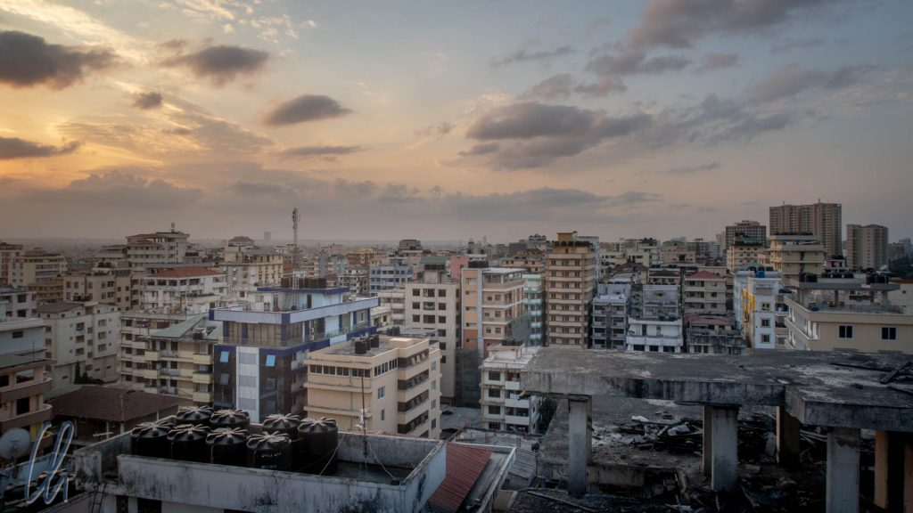
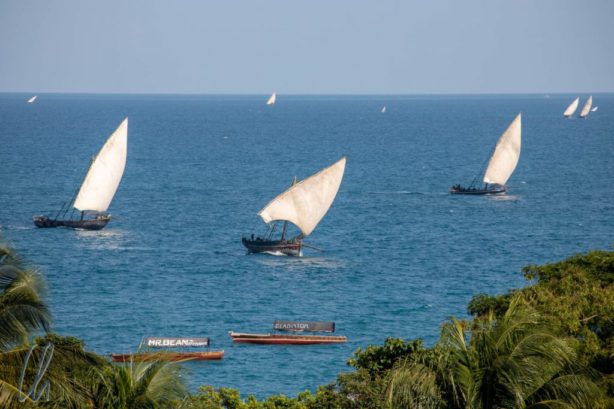
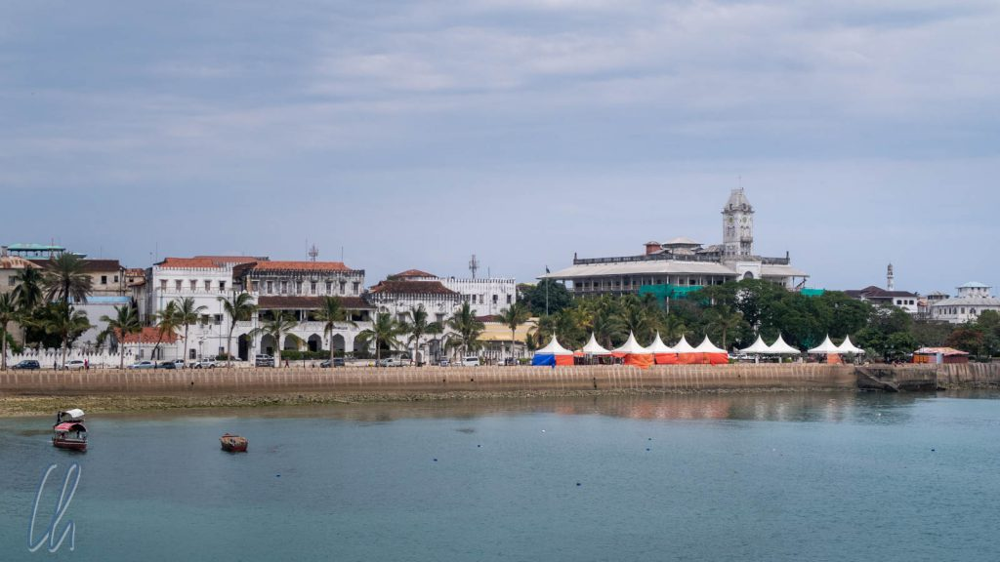
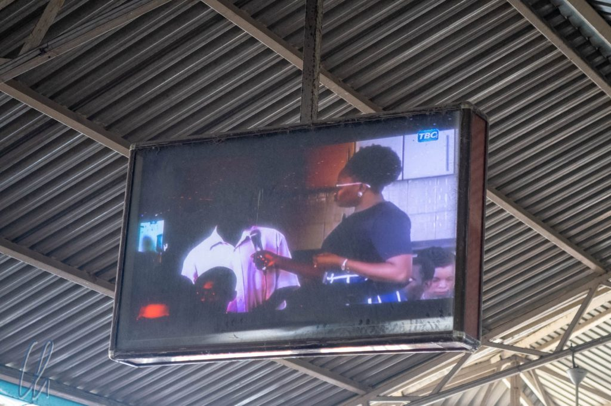

# Dar es Salaam

Nach einer Woche auf [Sansibar](http://wittmann-tours.de/erste-eindruecke-aus-tansania-sansibar/) setzten wir mit der Fähre auf das Festland nach Dar es Salaam über. Dar ist die [größte Stadt Tansanias](https://de.wikipedia.org/wiki/Daressalam). 1973 verlor sie zwar ihren Status als offizielle Hauptstadt (stattdessen heute [Dodoma](https://de.wikipedia.org/wiki/Dodoma)), fungiert allerdings immer noch als de-facto Kapitale. Interessanterweise ist Dar es Salaam keine altehrwürdige Stadt, sondern hat nur eine relativ kurze (koloniale) Geschichte vorzuweisen.

<!--more-->

## Ausreise aus Sansibar

Bevor wir uns auf der Fähre einschiffen durften, mussten wir offiziell aus Sansibar ausreisen. Im Gegensatz zur innerdeutsch-bayrischen Grenze, über die ja gerne gewitzelt wird, existierte hier eine reale Grenze innerhalb des Landes. Der formale Akt war scheinbar wichtig. Generell fragte ich mich an vielen Grenzübergängen: Was passiert eigentlich mit all den Ein- und Ausreiseformularen? Mittlerweile bin ich der festen Überzeugung, dass sie eigentlich nur der Überprüfung dienen, ob der Reisende intelligent genug ist, seinen Pass abschreiben zu können, vor allem in Zeiten von maschinenlesbaren Ausweisdokumenten.

Bei der "Ausreise" von Sansibar nach Tanganjika wurde dieser Prozess in all seiner Absurdität zelebriert. Bevor man sich in die eher chaotische Schlange mehr drängte als stellte, sollte man besser (um der Zurückweisung zu entgehen) brav seinen Namen, Vornamen, Passnummer und viele andere spannende Daten in ein etwa DIN A6-großes Formular eingetragen haben. Natürlich gab es keinen geeigneten Platz, wo man dieses wichtige Dokument hätte ausfüllen können. So ein Rucksack als Unterlage ist zwar der Schönschrift nicht unbedingt zuträglich, aber wir gaben natürlich trotzdem unser Bestes.

War man endlich an der Reihe, reichte man das ausgefüllte Formular, Ticket und Pass durch ein Fenster. Und nun geschah das Unglaubliche: Der Beamte drehte das Formular ungesehen um, stempelte es auf der Rückseite ab, malte noch einen Kringel dazu und dann landete es auf einem chaotischen Haufen (und dieser bei Feierabend im Mülleimer?). Wo war hier der Respekt vor der Autorität des geschriebenen Wortes, vor der Erhabenheit des Dokumentes? ;) Wenigstens verglich er schließlich den Namen im Pass mit dem Namen auf dem Ticket (nachdem das Ticket schon zweimal abgestempelt worden war). Das nächste Mal trage ich "Kermit der Frosch" auf so einem Formular ein, nur um einmal auszuprobieren, ob ich darauf dann auch einen Stempel bekomme oder nicht. ;)

## Mit der Fähre auf das Festland

Nachdem wir den formalen Akt erledigt hatten, passierten wir einen Metalldetektor, der bei jedem Passagier energisch piepte, was allerdings die Sicherheitskräfte nicht im geringsten in ihrer lässigen Passivität zu erschüttern vermochte. Das Gepäck wurde ebenfalls durchleuchtet, bzw. es fuhr auf einem Laufband durch ein großes Gerät. Und dann Gepäck abgeben? Jein. Einen Sticker sollten wir ausfüllen und daraufkleben, aber tragen mussten wir es selbst (vielleicht auch besser so). So versuchten wir, den Abfertigungsprozess so gut wie möglich zu begreifen und zu unterstützen und amüsierten uns nebenbei, dass auf dem Bildschirm des Wartebereichs das kerngesunde TV-Programm von [TBC](https://en.wikipedia.org/wiki/Tanzania_Broadcasting_Corporation) lief ;).

Die Fähre war modern und moderat überbucht, wir saßen auf dem Fußboden und auf den Treppenstufen. Schnell verschwand Sansibar am Horizont. Bei bewölktem und recht windigen Wetter erklomm die Fähre langgezogene Wellenberge und durchfuhr die zugehörigen Wellentäler, so dass es kaum möglich war, zu stehen, ohne sich festzuhalten. Viele Einheimische hatten sichtbar mit Seekrankheit zu kämpfen. Für die 85 Kilometer bis nach Dar es Salaam brauchten wir 2 Stunden.

## Angekommen in Dar es Salaam

In Dar es Salaam angekommen, offenbarte sich die Großstadt mit Allem, was dazugehört. Es war laut, hektisch, unübersichtlich. Jede Menge Menschen, die alle nur unser Bestes wollten, begrüßten uns überschwänglich und boten uns Taxis, Hotels und vieles mehr an. Da wir wussten, wohin wir wollten und was der Transfer kosten sollte, gingen wir einfach weiter und hielten erst etwa 300 Meter vom Anleger entfernt an, um ein Uber zu rufen.

Die App hatte vor allem in einer solchen Situation viele Vorteile und half uns, kein leichtes Opfer des Nepp zu werden. Bei Uber sind die Preise fest und nicht verhandelbar, der Fahrer ist registriert (den Namen sollte man trotzdem erfragen und überprüfen) und das Ganze funktionierte schnell und zuverlässig. Im Gegensatz zu Brasilien sprach jeder Uber-Fahrer Englisch, was daran liegt, dass in Tansania ab der Sekundarstufe [auf Englisch unterrichtet wird](https://en.m.wikipedia.org/wiki/Education_in_Tanzania).

Der Empfang in Dar es Salaam konnte schon einschüchternd wirken und der Reiseführer tat sein Übriges, unsere Befürchtungen zu schüren, mit Passagen wie "Nimm nur so viel Bargeld auf die Straße mit, wie Du bereit bist, zu verlieren". Und ja, Wachsamkeit war wichtig, wie in eigentlich jeder Großstadt. Trotzdem fühlten wir uns tagsüber überall sicher. Abends fragten wir im Hotel, ob es OK wäre, im Dunklen zum ausgewählten Restaurant zu laufen, was immer mit Vorsichtsbelehrungen (keine Wertsachen, Telefon in der Hosentasche lassen) verknüpft, aber bejaht wurde. Auch wenn es vielleicht eine eingebildete Unsicherheit war, an einen Abend fuhren wir trotzdem mit dem Taxi wieder zurück zum Hotel, da die Straßen schon auf dem Hinweg sehr dunkel und leer waren und auf dem Rückweg wohl umso mehr.

## Der Kariakoo Markt und die umgebenden Straßenmärkte

In [Kariakoo](https://en.wikipedia.org/wiki/Kariakoo) sollte man nachts beispielsweise besser nicht unterwegs sein. Tagsüber ist der Stadtteil (mehr als an anderen Orten in der Stadt) ein riesiger Markt mit vielen kleinen Ständen und einer Markthalle im Zentrum. Das Angebot war vielfältig: Bürsten, Besen, meist in quietschbunten Farben, Teller, Töpfe, Besteck, Schüsseln, Pfannen, Tonnen und Wannen, Mülleimer, Siebe und vieles mehr rund um den Haushalt wurde feilgeboten. In der Markthalle befand sich ein Baumarkt mit Groß- und Kleingeräten, Düngemitteln, Samen etc. Außerdem hätte man Handyhüllen, Gürtel, Kleidung, Schuhe, Flipflops, Stoffe, Garne erwerben können - nur Zwirn haben wir leider nirgendwo gefunden. Unsere Vorräte gingen zur Neige, das meiste hatten wir schon im Rahmen von Flickarbeiten in unsere Ausrüstung eingearbeitet.

Früchte und Gemüse waren meistens akkurat arrangiert und oft zu hübschen kleinen Pyramiden aufgeschichtet: Äpfel, Avocados, Orangen (auch geschält, mit verbleibender weißer Schicht der Schale), Zuckerrohr, Jackfruit, Bananen, Trauben. Viele Verkäufer saßen einfach nur auf der Straße vor einer Schüssel oder einem Korb mit Maniok, Bohnen oder Kokosnüssen. Andere hatten eine Art Bauchladen oder schoben einen kleinen Wagen mit Zahnpasta, Seife, Windeln, Kämmen, Bürsten, Wäscheleinen, Wattestäbchen. Bei diesem Überangebot auf den Straßen war ein Supermarkt völlig überflüssig und das Warenangebot verteilte sich räumlich noch weiter als im größten Super-Center.

## Kleinstunternehmer auf der Straße

Schließlich kauften wir dann doch noch etwas ein: Zahnpasta. Die junge Frau war beinahe erstaunt, dass wir bei ihr einkaufen wollten. Womöglich hatte sie noch nie internationale Kundschaft.

Ein typisches Geräusch in Dar es Salaam erzeugten fliegende Händler, die eine paar große Münzen in der einen Hand klimpern ließen und damit wie mit einem Glöckchen Aufmerksamkeit auf sich zogen. Diese Technik und dieser Klang waren weltweit einzigartig. In der anderen Hand trugen sie einen Korb mit in Papiertütchen verpackten Erdnüssen, Zigaretten oder anderen Kleinigkeiten.

Ab und zu wurden wir angesprochen, ob wir nicht ein Taxi, Stadttouren, Safaris oder Ähnliches bräuchten. Klar, wir waren eindeutig als Wazungu zu erkennen, und klar, man kann es ja mal versuchen. Taxi, vielleicht, aber wer bucht ernsthaft einfach so von einem wildfremden Menschen auf der Straße eine Safari? Wir wunderten uns ein wenig, aber Hakuna Matata, kein Problem, vielleicht ein anderes Mal.

## Dar es Salaams (koloniale) Geschichte

Auch wenn Dar es Salaam größtenteils eine architektonisch nicht sehr aufregende Stadt ist, so befinden sich direkt in der Nähe des Hafens, im alten Stadtzentrum, einige interessante koloniale Gebäude. Die [Azania-Front-Kathedrale](https://de.wikipedia.org/wiki/Azania-Front-Kathedrale) zum Beispiel wurde im ausklingenden 18. Jahrhundert von evangelisch-lutherischen Missionaren gebaut. Dar es Salaam war damals gerade die Hauptstadt von [Deutsch-Ostafrika](https://de.wikipedia.org/wiki/Deutsch-Ostafrika) geworden und hatte nur etwa 13.500 Einwohner.

Nach dem ersten Weltkrieg übernahmen die Engländer die Herrschaft über die deutsche Kolonie. Interessanterweise ehrten die Engländer die Tansanier, die als [Askari](https://de.wikipedia.org/wiki/Askari) im ersten Weltkrieg für sie gekämpft hatten mit einem Standbild. Das [Askari-Denkmal](https://en.wikipedia.org/wiki/Askari_Monument) steht heute, wie so manche Sehenswürdigkeit in Dar es Salaam, in der Mitte eines Kreisverkehrs.

Ein Symbol der Unabhängigkeit Tansanias am 9. Dezember 1961 ist das [Uhuru Denkmal](https://en.wikipedia.org/wiki/Uhuru_Monument), welches eine Replik der [Uhuru Fackel](https://en.wikipedia.org/wiki/Uhuru_Torch), der Fackel der Freiheit, zeigt. Diese Fackel wurde am Tage der Unabhängigkeit auf dem Gipfel des Kilimanjaro entzündet, um der jungen Nation das Licht der Hoffnung, der Liebe und des Respekts zu bringen. Diesem Symbol begegneten wir auch noch an anderen Orten im Land und es ist Bestandteil des [Wappens von Tansania](https://de.wikipedia.org/wiki/Wappen_Tansanias).

## Im Nationalmuseum von Dar es Salaam

Die verschiedenen Phasen der Geschichte Tansanias waren auch das Thema der Ausstellungen des Nationalmuseums, dessen Abteilungen allerdings von sehr gemischter Qualität waren. Sehr modern aufbereitet war eine Exposition über die Geschichte der Menschheit. Solch eine Ausstellung darf anscheinend in keinem Nationalmuseum Ostafrikas, das als Wiege der Menschheit betrachtet wird, fehlen. Trostlos hingegen wirkte die Biologie-Abteilung, die aus leeren Glaskästen, verstaubten Knochen, aufgespießten Schmetterlingen und wenigen bestückten Aquarien bestand.

Sehr interessant hingegen waren die Ausstellungen zur kolonialen und Zeitgeschichte. Zum Beispiel amüsierten wir uns über einen alten Stadtplan von Dar es Salaam, der eine kleine Ortschaft zeigte und durch deutsche Beschriftungen und Straßennamen komplettiert wurde. Dort, wo heute unser Hotel zwischen vielen anderen 10-stöckigen Häusern stand, hatte sich früher nur Wald befunden, außerdem waren Öl- und Kokospalmen eingezeichnet.

## Julius Nyerere, der Vater der Nation

Als politische Persönlichkeit übertrifft [Julius Nyerere](https://de.wikipedia.org/wiki/Julius_Nyerere) alle anderen Tansanier an Berühmtheit und Ansehen. 24 Jahre lang war er Staatsoberhaupt und viermal wählten ihn die Bürger erneut zum Präsidenten. Vorher hatte er Tanganjika friedlich in die Unabhängigkeit geführt. Das ist eine Bilanz, die sich sehen lassen kann.

Wirtschaftlich gingen seine Konzepte leider nicht auf. Nach der [Arusha-Deklaration](https://de.wikipedia.org/wiki/Arusha-Deklaration) im Jahre 1967 baute er Tansania kommunistisch um, die Nation sollte ich selbst versorgen. Er verstaatlichte Banken und andere Unternehmen, es fanden (zwangsweise) Umsiedlungen in sog. Ujumaas, sozialistische Dorfgemeinschaften, statt und er reformierte das Schulsystem. Die Alphabetisierungsquote stieg an, die Korruption allerdings auch und der ersehnte Aufschwung blieb aus.

Trotzdem hält Tansania Nyereres Ansehen weiterhin hoch. Durch seine friedlichen und toleranten politischen Überzeugungen konnte er Tansania über alle Stammesgrenzen hinweg als zusammengehörige Nation einen. Die Tansanier fühlen sich in der Gegenwart als Bürger eines Landes, obwohl sie einem der 129 verschiedenen Stämme angehören. Dafür bezeichnen die Menschen Nyerere auch heute noch als "Mwalimu" (Lehrer) und "Baba wa Taifa" (Vater der Nation).

## Dar es Salaam, interessanter als erwartet

Zugegebenermaßen wird es Dar es Salaam nicht auf die Top-10-Liste der Lieblingsorte unserer Weltreise schaffen, aber die Stadt hat dennoch unsere Erwartungen übertroffen. Als Überbrückungsstation zwischen Sansibar und Safari geplant, zeigte uns Dar die Dynamik einer afrikanischen Großstadt mit einer kurzen, aber sehr interessanten Geschichte.

