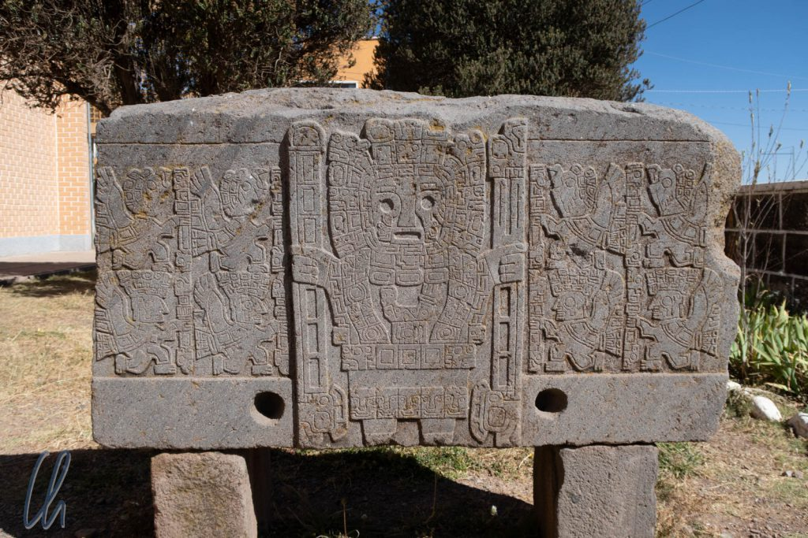

Das hochentwickelte und mächtige Volk von Tiwanaku wird als [Mutterkultur der Anden](https://de.wikipedia.org/wiki/Tiwanaku) angesehen. Es handelte sich um eine Hochkultur lange vor den Inka, die über ein beachtliches Gebiet herrschte. Ihr Einfluss in der Region hielt über einen Zeitraum von etwa 1500 Jahren an, während die Macht der Inka nur ca. 100 Jahre dauerte. Die Ruinen ihrer mutmaßlichen Hauptstadt Tiwanaku liegen südöstlich des Titicacasees nicht weit von La Paz und sind problemlos in einem Tagesausflug zu besuchen. Auf geht's!

<!--more-->

## Bolivianische Anfahrt

Eigentlich sollte unsere Tour ganz bequem um 9 Uhr morgens beginnen. Am Abend zuvor rief uns allerdings um 22 Uhr die Agentur an, bei der wir den Ausflug gebucht hatten, dass wir unbedingt schon um 7 Uhr losfahren sollten, da es voraussichtlich am kommenden Morgen in El Alto zu Demonstrationen und Straßensperren kommen werde. Was blieb uns anderes übrig, als den Wecker deutlich früher zu stellen als ursprünglich geplant?

Was aber war nun der Grund für die Proteste? Wie wir am kommenden Morgen erfuhren und später auch in der Zeitung [nachlasen](https://www.eldeber.com.bo/bolivia/Estudiante-de-El-Alto-muere-por-impacto-de-una-canica-la-UPEA-desconfia--20180525-0005.html#), ging es bei den Demonstrationen ursprünglich „nur“ um mehr Geld für die Universität von El Alto. Drei Tage vor unserem Tiwanaku-Ausflug war dabei allerdings ein Student erschossen worden. Niemand wollte die Verantwortung für die Tat übernehmen. Dadurch waren die Proteste (verständlicherweise) deutlich eskaliert und die Studenten zogen auf die Straße, um gegen staatliche Willkür und für die Aufklärung des Todes von Jonathan Quispe Vila zu demonstrieren.

In der Tat gelang es uns, die geplanten Straßensperren durch den frühen Start zu umgehen. Wie wir später aus den Nachrichten erfuhren, präsentierte die Polizei schließlich und endlich einen [Schuldigen](http://www.la-razon.com/sociedad/Identifican-subteniente-Policia-Jonathan-Quispe-Bolivia_0_2938506143.html) als Bauernopfer.

## Tiwanaku

An der Ruinenstätte angekommen besichtigten wir nach einem improvisierten Frühstück zunächst das kleine Museum, das uns die Geschichte von Tiwanaku näher brachte. Leider konnten wir nur einen Teil der Ausstellung sehen, da das Dach des neu gebauten Hauses vom Einsturz gefährdet war und daher nicht alle Fundstücke gezeigt werden konnten. Trotz wesentlich früherer Funde entwickelte sich Tiwanaku erst ab 300 v. Chr. zu einem administrativen, religiösen und kulturellen Zentrum in der Region. Den Höhepunkt seiner Macht erlebte Tiwanaku zwischen 600 und 900 n. Chr. Zu dieser Zeit erstreckte sich das Reich vom Süden des heutigen Peru über die gegenwärtige bolivianische Provinz Cochabamba bis zur Pazifikküste Nordchiles und Teilen des heutigen Argentinien. Der Niedergang Tiwanakus folgte circa 1200 n. Chr., Ursache war vermutlich eine ausgeprägte Dürreperiode. Trotzdem hatte die Kultur wohl eine große Strahlkraft, so dass Elemente ihrer Religion bis in die Inka-Zeit lebendig blieben.

Die ausgegrabene Stadt selbst ist ein weitläufiges Areal mit den Resten mehrerer Bauwerke, einer Pyramide an einem Hügel, Tempel, anderer zeremonieller Gebäude und einiger Stelen. Viele Details rund um Tiwanaku sind weiterhin Spekulation, nicht zuletzt, weil die Stadt später von Schatzjägern geplündert und als Steinbruch genutzt wurde. (Die Dorfkirche des Ortes wurde zum Beispiel ohne Zweifel zur Zeit der Kolonialisierung durch die Spanier mit Baumaterial aus den Ruinen errichtet.) Die Ausmaße der Stätte zeugen dennoch von einer sehr frühen Hochkultur, die einige architektonische Meisterwerke hervorgebracht hatten.

Nicht nur, dass sie tonnenschwere Steinblöcke gut 40 Kilometer aus den Steinbrüchen transportiert hatten. Die Tiwanaku-Baumeister konnten die Steine auch haarfein bearbeiten und verzieren und das 500 bis 700 Jahre bevor die Inka ihre berühmten Bauwerke errichteten. Am sogenannten [Puma Punku](https://de.wikipedia.org/wiki/Pumapunku) haben die Tiwanaku-Steinmetze zum Beispiel Steinplatten passgenau angefertigt, die bis zu 140 Tonnen wiegen und mehrere Meter lang sowie breit sind.

## Wurde Tiwanaku von Aliens gebaut?

Wie die Tiwanakuaner es schaffen konnten, Steinmetzarbeiten einer solchen Präzision auszuführen und solche gewaltigen Steinblöcke zu transportieren, ist weiterhin rätselhaft. Um das Unerklärliche verständlich zu machen, werden in Tiwanaku sogar die [Außerirdischen](https://www.ancient-code.com/the-alien-connection-the-pre-inca-tiwanaku-culture/) bemüht. Befeuert werden die Theorien durch einen mittlerweile verwitterten Steinkopf im Templete Semisubterráneo, der so aussieht, wie man sich ein Alien aus der [Area 51](https://de.wikipedia.org/wiki/Area_51#UFO-_und_Verschw%C3%B6rungstheorien) vorstellt.

Weiterhin wurde die Theorie aufgestellt, dass das berühmte Sonnentor ein Dimensionsportal gewesen sein soll. Alles sehr amüsant und prinzipiell möglich ;). Leider befand sich um das Monument eine Absperrung, so dass wir es nicht selbst ausprobieren konnten. Vielleicht werden die Archäologen in der Zukunft noch andere Erklärungsmodelle aufstellen, schließlich sind weite Teile von Tiwanaku noch nicht ausgegraben.

Zweifelsohne ist die Stätte von Tiwanaku bei weitem nicht so spektakulär wie z.B. Machu Picchu. Nichtsdestotrotz fanden wir unseren Tagesausflug dorthin lohnenswert.
