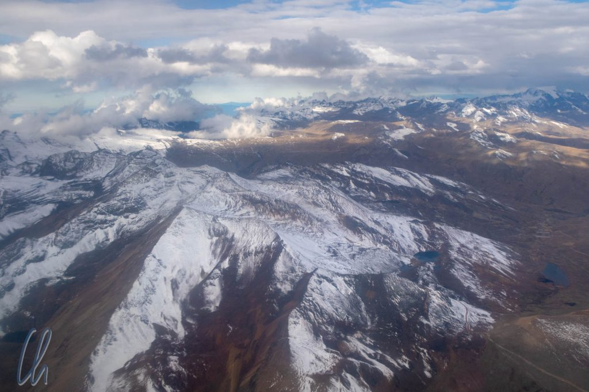

Bisher hatten wir in Ecuador, Peru und Bolivien hauptsächlich das Andenhochland bereist, obwohl alle drei Nationen auch viel Staatsgebiet im Amazonasbecken haben. Nach 7 Wochen in der Höhe der Anden flogen wir von La Paz nach Rurrenabaque (kurz: "Rurre"), um von dort aus den Madidi Nationalpark zu besuchen. Namensgebend für den [1995 gegründeten](https://en.wikipedia.org/wiki/Madidi_National_Park) Nationalpark sind die Ameisen. "Madidi" heißt in der lokalen Sprache "Ameise". Das klang ja vielversprechend ;).

<!--more-->

## Panoramaflug in den Dschungel

Da Busreisen in den bolivianischen Dschungel lang (18-24 Stunden), unbequem und verspätungsanfällig sein können, entschlossen wir uns, von Sucre über La Paz nach Rurre zu fliegen. Der Flug von La Paz nach Rurrenabaque war bemerkenswert. Auch wenn die physikalischen Details vielleicht etwas vereinfacht sind, kam uns der Flug so vor: Einmal in La Paz (El Alto auf 4060 Metern) für den Start Anlauf nehmen, etwas Höhe gewinnen, um dann sofort in einen verlängerten Landeanflug überzugehen. Nach kaum 20 Minuten in der Luft landeten wir auf gerade einmal 200 Metern über dem Meeresspiegel und in einer gänzlich anderen Umgebung.

Kurz nach dem Start sahen wir, dass es auf den Gipfeln rund um La Paz frisch geschneit hatte. Nach wenigen Minuten wandelte sich die Landschaft jedoch schlagartig. Wir segelten über endlose grüne Hügel und an den höheren Erhebungen hingen ein paar Wolken. Im krassen Gegensatz zur kargen Vegetation des Hochlandes landeten wir inmitten üppigen tropischen Grüns bei angenehmen 22 Grad.

Der Kontrast zu den Teilen Boliviens, die wir vorher gesehen hatten, war enorm. Keine Ponchos, keine andinen Muster mehr. Stattdessen begrüßte uns das Bild eines Tukans im Hostel. Abends saßen wir im Freien in einem kleinen Fischrestaurant nicht weit vom Río Beni und das Leben der Kleinstadt zog - hauptsächlich auf Motorrädern - an uns vorbei. Die Eindrücke und die Geräuschkulisse erinnerten uns an Asien.

## Unterwegs auf den Seitenarmen des Amazonas

Der einzige Weg in den Madidi Nationalpark führt erst über den [Río Beni](https://de.wikipedia.org/wiki/R%C3%ADo_Beni), und anschließend biegt man in den [Río Tuichi](https://de.wikipedia.org/wiki/R%C3%ADo_Tuichi) ein. Beide Ströme sind kleine Nebenästchen im riesigen Amazonas-Flussystem. Wir fuhren flussaufwärts zur Chalalán Ecolodge. Wenn wir dagegen dem Río Beni flussabwärts gefolgt wären, dann dem [Río Madre de Dios](https://de.wikipedia.org/wiki/R%C3%ADo_Madre_de_Dios) und dem [Río Madeira](https://de.wikipedia.org/wiki/Rio_Madeira), wären wir nach gut 2000 Kilometern mit dem Boot 150 Kilometer östlich von [Manaus](https://de.wikipedia.org/wiki/Manaus) (eine unserer späteren Stationen in Brasilien) im Hauptfluss Amazonas angekommen und nach weiteren 1700 Kilometern im Atlantik, kaum vorstellbar!

Zusammen mit David aus Nordirland und Sergio, unserem Guide für die kommenden Tage, bestiegen wir das lange, schmale Motorboot. Der Morgen in Rurre war kühl, aber sonnig. Flauschig weich aussehende Baby-Alpaka-Wolken hingen in den Hügeln (das Wort "Berg" vermeiden wir hier bewusst, nachdem wir in den Anden echte Berge gesehen hatten ;) ). An einigen Stellen sanken sie ins Flusstal hinab und lösten sich dabei auf.

## Der mühsame Weg stromaufwärts

Unser Boot kam stromaufwärts nur langsam voran. Für eine Strecke von 50 Kilometern benötigten wir 6 Stunden (auf der Rückfahrt würden wir dagegen nur 3 Stunden brauchen). Dabei erschien uns die Strömung des Flusses im Übergang zwischen Regen- und Trockenzeit insgesamt schon recht zahm und der Wasserstand niedrig. In der Regenzeit soll der Pegel 1 bis 2 Meter (oder sogar 5 Meter nach sehr starkem Regen) höher sein, als wir ihn gesehen haben.

Wie stark die Strömung in der Regenzeit wirklich wird, konnten wir nur erahnen. Nicht nur Treibholz, sondern ganze Treibbäume, die der Fluss angeschwemmt hatte, zeugten von seiner Kraft! Und obwohl die Wassermassen der Regenzeit schon abgeflossen waren, musste der Motor an den Stromschnellen trotzdem sehr hart arbeiten. An anderen Stellen hingegen war der Wasserstand so niedrig, dass der Außenborder hochgeklappt und das Boot mit einer Stange vorwärts gestakt wurde.

Unterwegs sahen wir auch schon die ersten Tiere, allen voran die Wasservögel. Zahlreiche [Cocoireiher](https://de.wikipedia.org/wiki/Cocoireiher) standen fast bewegungslos (zur Tarnung beim Fischfang) im Fluss. Raubvögel wie der Great Black Hawk und der King Vulture zogen ihre Kreise oder saßen am Flussufer. Kaimane lagen bewegungslos auf den Sandbänken in der Sonne und Totenkopfäffchen hüpften durch die Bäume. Ein [Capybara](https://de.wikipedia.org/wiki/Capybara) beäugte uns vorsichtig aus dem Gebüsch. Besonders amüsant waren [kleine Schildkröten](https://de.wikipedia.org/wiki/Terekay-Schienenschildkr%C3%B6te), die sich ebenfalls in Wassernähe sonnten, aber flugs eine nach der anderen in den Fluss hüpften, sobald wir zu dicht herankamen. So war die lange Fahrt sehr abwechslungsreich.

## Die Chalalán Ökolodge

Die [Chalalán Lodge](http://chalalan.com/es/index_en.php) war einerseits recht einfach, andererseits trotzdem komfortabel. Die Ausstattung unseres großen Bungalows im Grünen umfasste ein Doppelbett, komplette sanitäre Einrichtungen und eine Dusche. Die Fenster waren mit intakten Fliegengittern versehen und trotzdem hing ein lochfreies Moskitonetz über dem Bett, was auch gut so war ;). Andererseits gab es Strom nur abends von 6:30 bis 10:00 Uhr. Die Laufwege draußen waren nicht beleuchtet, so dass wir nach Einbruch der Dunkelheit immer mit Stirnlampen unterwegs waren. Das Brauchwasser hatte eine erfrischend kühle Temperatur, was aber nichts machte, da das Klima glücklicherweise warm war.

Die Lodge lag direkt an einem See, der nach den Wanderungen zu einem Bad einlud. Trotz oder gerade wegen der dort heimischen Kaimane, von denen sich einer gerne in der Nähe des Stegs aufhielt. Schwimmen mit Seelöwen oder Delfinen kann schließlich jeder, Schwimmen mit Kaimanen ist der neue Trend ;)

Ebenfalls am See (und gelegentlich auch im Bungalow) gab es Glühwürmchen. Eines morgens leuchtete eines direkt auf unserer Bettdecke noch schwach - wie auch immer es ins Moskitonetz gekommen sein mag. Frösche, Fledermäuse und Zikaden sorgten für die abendliche akustische Untermalung mit Dschungelgeräuschen. So war Chalalán eine Lodge ohne Schnickschnack. Den Tag verbrachten wir sowieso immer draußen und in der Nacht war unsere Hütte sehr bequem. Der Bungalow war in traditioneller Bauweise aus sehr ästhetischen Naturmaterialien erbaut worden. Auch deshalb hatten wir immer das Gefühl, draußen im Dschungel zu sein und nicht in einem Hotel. So sollte es unserer Meinung nach sein.

## Wanderungen im Dschungel

Die beste Art und Weise, den Dschungel kennenzulernen, war, ihn zu erwandern. Jeden Tag unternahmen wir längere Touren. Statt Wanderschuhen trugen wir Gummistiefel, da es sehr matschige Abschnitte gab. Unterwegs war es fast immer angenehm schattig. Im Regenwald ist es am Boden bis zu 10 Grad kühler als oberhalb des Blätterdaches. Dennoch kamen wir aufgrund der hohen Luftfeuchtigkeit gut ins Schwitzen. Dank der kleinen Gruppe mit 4 Personen (Sergio, David und wir beiden), entdeckten wir erstaunlich viele Tiere. Immer wieder begegneten wir zum Beispiel Familien von Kapuziner-, Spinnen- oder Totenkopfäffchen. Meistens verrieten sie sich durch das Rascheln der Blätter hoch in den Bäumen und mit etwas Glück sahen wir sie dann auch.

Der Regenwald an sich, mit seinen Baumriesen, gewaltigen Brettwurzeln, Lianen und dem dichten Gewucher von Pflanzen, war sehr beeindruckend. Weiter entfernt vom Fluss gab es auch immer mehr alte Bäume, obwohl der Park erst seit 1995 unter Schutz steht. Das Schlagen von Holz war dort (zum Glück) wohl zu schwierig. Je älter die Bäume, desto mehr Schatten warfen sie und desto weniger Vegetation gab es direkt am Boden. Jedes Loch im Blätterdach verursacht hingegen ein "Rennen nach oben", eine Explosion von grünem Leben, das zum Licht strebt. Bunte Schmetterlinge begleiteten uns manchmal ein Stück des Weges, bevor sie im Dickicht verschwanden. Am eindrucksvollsten waren die großen, leuchtend [blauen Morphos](https://de.wikipedia.org/wiki/Blauer_Morphofalter).

Die außergewöhnlichsten Vögel, die wir im Dschungel ab und zu sahen, waren [Hoatzins](https://de.wikipedia.org/wiki/Hoatzin). Sie sind relativ groß, leben in Gruppen zusammen und stoßen markante, lautstarke Rufe aus. Auch ihr Aussehen ist bemerkenswert mit einer nackten blauen Partie um die roten Augen und einer wilden Federhaube auf dem Kopf, die an einen Irokesenschnitt erinnert. Ulkigerweise können diese Vögel nicht gut fliegen, sondern sie gleiten nur ein Stück weit oder klettern durch die Bäume. Besonders hilfreich ist dabei, dass Jungvögel an beiden Flügeln Haken besitzen, mit denen sie sich an den Ästen festhalten können. Daher wurde auch die Theorie aufgestellt, dass der Hoatzin einen überlebenden Verwandten des Urvogels Archaeopteryx darstellt, quasi ein lebendiges Fossil.

## Madidi bei Nacht

Tagsüber gab es im Dschungel überall kleine Spinnennetze, die wir erwischten, wenn wir nicht direkt auf dem Weg gingen. Auch nachts waren Spinnen die Tiere, die wir am häufigsten sahen. Im Madidi Nationalpark entpuppte sich nicht jeder im Schein der Stirnlampe reflektierende Punkt als Spinne. Ein Teil waren Wassertropfen, es gab aber auch eine Menge Spinnen! Sie saßen auf dem Boden, an Bäumen, auf Blättern oder in kleinen Löchern.

Direkt im mit Palmwedeln gedeckten Dach des Hauptgebäudes der Lodge wohnten außerdem mehrere beachtliche Vogelspinnen, die wir natürlich auch besichtigten mussten ;).

Von weiteren Spinnenarten abgesehen sahen wir auch andere große Insekten (wie Gottesanbeterinnen) und Frösche. Während der ersten Nachtwanderung dachten wir für einen Moment, das großes Los gezogen zu haben, als wir ein Paar katzenhafter Augen in der Dunkelheit glaubten entdeckt zu haben. In Wirklichkeit war es jedoch nur ein Nagetier, ein [Paca](https://en.wikipedia.org/wiki/Paca).

## Der Harpy Eagle

Natürlich möchte jeder Besucher des südamerikanischen Regenwaldes am liebsten einen Jaguar sehen, aber die Katzen sind sehr scheu und extrem gut getarnt. Es ist natürlich möglich, dass sich eine solche Wildkatze ganz in unserer Nähe befand und uns beobachtet hat. Wir sahen jedoch in den 4 Tagen im Madidi-Park keinen Jaguar, nur seine - immerhin frischen - Spuren.

Noch viel seltener zu entdecken sei der [Harpy Eagle](<https://de.wikipedia.org/wiki/Harpyie_(Vogel)>), sagte unser Führer. Angeblich 50mal schwieriger als ein Jaguar. Sergio hatte ihn seinen Angaben nach bisher nur zweimal gefunden, aber er wisse, wo die Greifvögel gewöhnlich ihr Nest hätten. Also wandten wir uns in diese Richtung, um das Unwahrscheinliche zu versuchen. Nach gut 2 Stunden Wanderung mit anderen interessanten Tier-Sichtungen bogen wir links ab und Sergio suchte in den Baumkronen. Fast erschien es uns zu einfach, denn da saß ein großer Harpy Eagle auf einmal gut 20 Meter über uns in einem Wipfel, hüpfte gelegentlich von Ast zu Ast, flog aber erst nach einigen Minuten weg. Es handelte sich wohl um ein junges Tier, das sich noch nicht weit vom Nest entfernt.

Wie schwierig es wirklich war, den Vogel zu finden, können wir schwer einschätzen. Auf alle Fälle war das Foto vom Harpy Eagle, dem kräftigsten Raubvogel der Welt, am Abend die große Attraktion im Camp und jeder wollte die Aufnahme sehen. Ein wichtiges Merkmal waren die Federn am Hinterkopf, denn diese sind typisch für den Harpy Eagle.

## Sterne, Millionen von Sternen

Am zweiten Abend unternahmen wir einen Nachtausflug im Kanu auf dem See neben der Lodge. Auch wenn der Kaiman wieder direkt an der Anlegestelle im Wasser dümpelte, waren die Sterne die Hauptattraktion. Und was für ein Sternenhimmel sich uns präsentierte! Fernab von jeglicher Zivilisation und Lichtverschmutzung funkelte die Milchstraße über uns. In dieser mondlosen Nacht war es trotzdem hell genug, um die Konturen des Waldes und die Umrisse des Sees zu erkennen. Einige Sternschnuppen verglühten am Himmel und die glatte Wasseroberfläche reflektierte die Sterne wie ein Spiegel. Die gelegentlichen Paddelstöße, mit denen wir über den See glitten, verzerrten das Bild nur vorübergehend. Allein diese nahezu überirdisch schöne Bootsfahrt war es wert, nach Chalalán zu kommen!

## Piranhafischen auf der Laguna Rosa

Am dritten Tag machten wir einen Ausflug zur Laguna Rosa, um dort Angeln zu gehen. Damit genug Zeit zum Fischen blieb, liefen wir von der Lodge 2 km zum Fluss und fuhren dann mit dem Boot, statt 6 km durch den Dschungel zu wandern. Die Laguna Rosa war wesentlich größer als die Laguna Chalalán. Bei unserer Ankunft war es vollkommen windstill; so war das Wasser spiegelglatt und reflektierte die Berge und die Wolken.

Unser Kanu war gerade groß genug für 5 Personen, Sergio, William (ein weiterer Führer), David und uns beide, allerdings leckte es sichtlich, so dass wir regelmäßig Wasser aus dem Boot schöpfen mussten. Das Angelset bestand aus einem Hölzchen, auf das eine Angelschnur mit Haken gewickelt war. An der designierten Stelle im See angekommen wickelten wir etwas Leine ab, befestigten ein Stückchen rohes Rindfleisch am Haken und warfen mehr oder weniger elegant 2 bis 3 Meter Schnur aus.

## Catch of the Day

Die empfohlene Technik war, den Köder treiben zu lassen, bis wir ein Knabbern spürten. Dann sollten wir fest an der Schur ziehen, wenn der Fisch angebissen hatte, damit der Haken sich verfing und wir ihn ins Boot ziehen konnten. Hört sich einfach genug an, aber unsere ersten Versuche waren eher eine Fischfütterung. Die Piranhas knabberten lediglich das Fleisch von unseren Haken! Statt Fischen angelten wir Stöckchen oder Algen. Sergio bewies aber, dass die Fischlein wohl anbissen, alle 5 bis 10 Minuten zog er einen an Bord. Erst am Ende konnten wir wenigstens ein bisschen zum Fangerfolg beitragen!

Wir nahmen denselben Weg zurück nach Chalalán und kamen dort pünktlich zum Mittagessen an. Es gab Bohnen, Reis und Rote Beete. Kaum hatten wir angefangen zu essen, wurden außerdem, sozusagen als Hauptgang 2.0, zu unserer großen Freude auch frisch gebratene Piranhas aufgetragen! Sie waren etwas schwierig zu essen, da sie viele kleine Gräten aufwiesen, aber sehr schmackhaft.

## Das bedrohte Paradies

Der wunderschöne Madidi-Nationalpark, dessen viele Facetten wir erleben durften, könnte bald nicht wiedergutzumachenden Schaden nehmen. Die Lobby der Umwelt- und Tierschützer ist anscheinend weniger mächtig als die der Öl- und Gaswirtschaft. Unter dem Madidi-Park schlummern wohl ernstzunehmende Vorkommen dieser fossilen Brennstoffe und die Politik ist dabei, die Pfründe zu verteilen. Den Weg sollen Infrastrukturprojekte ebnen. In Rurrenabaque wird zum Beispiel eine neue Brücke gebaut und weitere Straßen sind in Planung, um den Park zu erschließen.

Außerdem soll ein [großer Staudamm](https://en.wikipedia.org/wiki/Madidi_National_Park#The_Bala_Dam_Project) gebaut werden, der große Teile des südlichen Madidi-Parks überfluten, einige lokale Gemeinschaften heimatlos machen und den Lebensraum vieler Tiere zerstören würde. Wie sich das mit der [bolivianischen Verfassung](http://www.bolivia.de/fileadmin/Dokumente/Presse-Medien_Dt%2BSp/Interessante%20Dokumente/CPE_aleman.pdf) verträgt, in der weitreichende Rechte indigener Völker verbrieft sind, blieb uns allerdings verborgen.

## Widerstand ist möglich

Die Gemeinschaft, die die Chalalán Lodge betreibt, ist ein indigenes Dorf, das sich aktiv gegen die Erschließung des Regenwaldes wehrt. Die Organisationsform hörte sich, wie sie uns erklärt wurde, recht kommunistisch an. Alles gehört der Gemeinschaft, die Arbeitskräfte kommen aus dem Dorf und über die Verwendung der Gewinne wird zusammen entscheiden. Finanziert werden damit zum Beispiel die medizinische Versorgung vor Ort und Schulen für die Kinder mit insgesamt 4 Lehrern.

Nach langen Anstrengungen wurde der Gemeinschaft ein großes Stück Land entlang des Tuichi Flusses zugesprochen. Die Fläche beträgt [400.000 Hektar](http://chalalan.com/es/comunidad_en.php). Die Waldbewohner versuchen, die Regierung zum Schutz des Nationalparks zu bewegen, sehen sich aber in einen Kampf gegen Windmühlen verwickelt, da der Staatsapparat angeblich andere Interessen verfolgt. Beispielhaft sei, dass gerade einmal 18 Ranger mit dem Schutz des gesamten Madidi-Gebietes von 18958 qkm betraut wurden. Für mehr Forstwächter gibt es anscheinend kein Geld vom Staat.

Es ist der immer wiederkehrende Konflikt zwischen dem großen Geld und der Erhaltung der Natur. Wer hat den Mut, zu sagen, dass es mehr Wert ist, die Umwelt zu schützen, als das Öl zu gewinnen? An der Förderung hängen Millionen von Dollars und die Politiker versprechen Beschäftigung und Wohlstand für die Region. Wem der Wert dieses vielfältigen Ökosystems nicht klar ist, dem können wir einen mehrtägigen Besuch im Madidi-Nationalpark nur wärmstens empfehlen, um die Artenvielfalt persönlich zu erleben. Die Natur ist atemberaubend schön!
