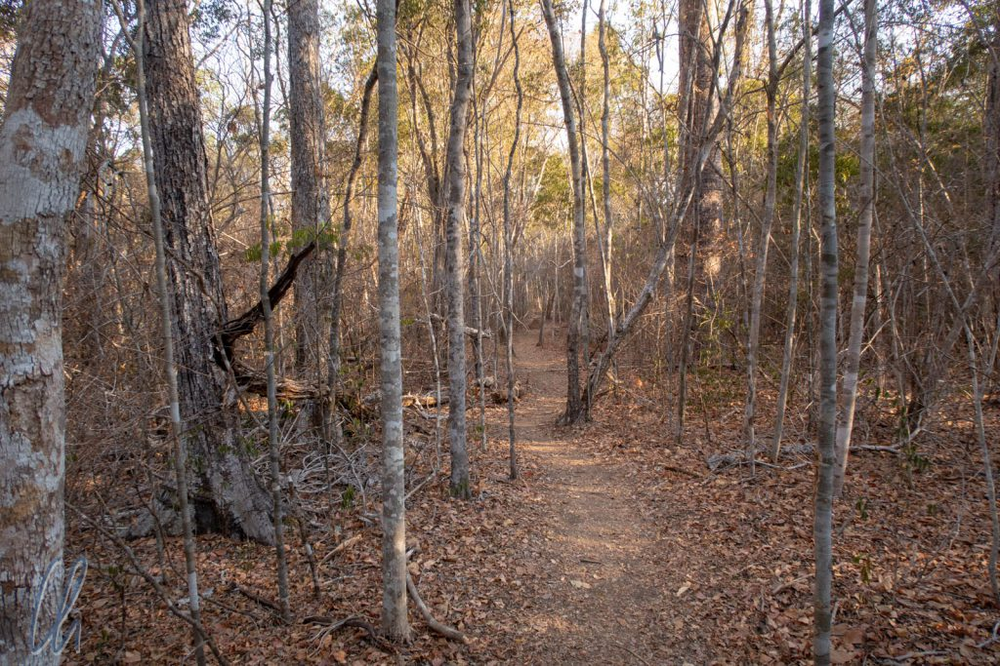
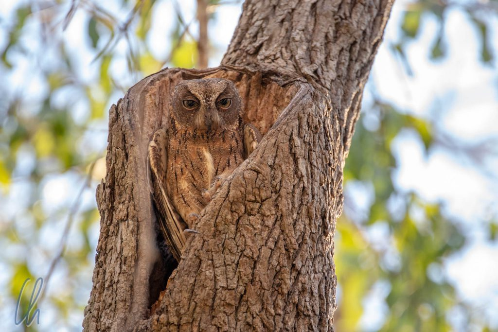

Von der [Baobab-Allee](http://wittmann-tours.de/ueber-die-baobab-allee-nach-norden/) fuhren wir zum Kirindy-[Reservat](https://en.wikipedia.org/wiki/Kirindy_Forest) (nicht zu verwechseln mit dem Kirindy [Nationalpark](https://de.wikipedia.org/wiki/Nationalpark_Kirindy-Mitea)). In dem privaten Reservat, das ursprünglich zur nachhaltigen Forstwirtschaft geschaffen worden war, ist der Trockenwald noch vergleichsweise intakt. Hört sich nicht so spannend an? Ganz im Gegenteil, dort sahen zum ersten Mal auf dieser Reise freilebende Lemuren und Chamäleons, bei Tag und auch bei Nacht.

<!--more-->

## Tagwanderung im Kirindy Reservat

Der Trockenwald wurde seinem Namen gerecht, es war in der Tat sehr trocken. Auch waren wir im August da, also mitten in der Trockenzeit. Die Pflanzen trugen nur wenige grüne Blätter und der Boden war mit abgeworfenem Laub bedeckt. Die Bäume, groß, klein, Edelhölzer (zum Beispiel Palisander), Bambus und auch ein paar Baobabs sahen nach unseren Begriffen herbstlich oder winterlich aus. Auf Madagaskar würde man vielleicht sagen, sie sähen trockenzeitlich aus ;). Trotzdem spendete der Wald Schatten und bot ein wenig erfrischende Kühle.

In den kahlen Bäumen erspähten wir bald auch die ersten Tiere. Eine Gruppe [Larvensifaka](https://de.wikipedia.org/wiki/Larvensifaka) machte anscheinend gerade Siesta hoch oben im Geäst. Andere Tiere hatten offenbar ihre angestammten Plätze im Wald und waren dadurch vergleichsweise einfach zu finden. Eine farblich gut getarnte Eule zum Beispiel saß auf einem hohlen Baumstamm, sie schien dort zu wohnen.

Am späten Nachmittag erwachten allmählich auch einige nachtaktive Tiere. Ein [Wieselmaki](https://de.wikipedia.org/wiki/Wieselmakis) schaute ziemlich verschlafen aus der Wäsche bzw. aus seinem Versteck in einem trockenen Baumstamm. Mit seinen großen Augen sah er uns beinah etwas vorwurfsvoll an, als würde er sich fragen, was wir denn dort trieben. Die Begriffe [Maki](https://de.wikipedia.org/wiki/Makis) und [Lemur](https://de.wikipedia.org/wiki/Lemuren) sind übrigens nicht synonym zu verwenden. Vielmehr sind die Makis eine Untergruppe der Lemuren, die heutzutage nicht mehr als Halbaffen klassifiziert werden, sondern als Feuchtnasenaffen. Aha!

## Die Rotstirnmakis

Trotz der Trockenheit sahen wir immer wieder einige Tiere. Entweder fand unser aufmerksamer Führer sie oder sie verrieten sich durch ein Rascheln in den Blättern. So begegneten wir auch zwei Gruppen von Rotstirnmakis. Eine befand sich oben in den Bäumen und die Lemuren schauten von dort mindestens genauso neugierig auf uns herab wie wir zu ihnen hinauf.

Die andere Lemurengruppe bewegte sich weiter unten, fast auf unserer Augenhöhe, und wir näherten uns vorsichtig. Die Lemuren hangelten sich von Ast zu Ast und machten dabei lustige Grunzgeräusche, wirklich putzig :). Als wir in ihrer Nähe standen, nahm Mona einen Schluck aus der Wasserflasche und die Lemuren bekamen auf einmal ganz große Augen und reckten ihre Hälse. Es war sehr trocken, die Lemuren hatten Durst und das Wasser erregte offensichtlich ihr Interesse.

Wenn uns nicht unser Führer ermuntert hätte, den Lemuren einen Schluck zu geben, hätten wir es nicht getan. Am Boden lag ein Schneckenhaus, welches wir auffüllten und ihnen vorsichtig hinhielten. Sie fassten Vertrauen zu unserer Offerte, die Verlockung des Wassers war zu groß. Vorsichtig kamen sie näher und tranken aus dem Schneckenhaus, waren dabei aber immer auf etwas Abstand bedacht. Vermutlich bekamen sie ab und zu mal einen Schluck, waren aber auf keinen Fall aufdringlich.

## Kirindy bei Nacht

Die Dämmerung kam, wie üblich, sehr schnell. Wir kehrten zum Besucherzentrum zurück, nur um kurze Zeit später wieder in den Wald zu gehen. Die Route war (vermutlich) sehr ähnlich, aber wir entdeckten ganz andere Tiere. Die winzigen [Mausmakis](https://de.wikipedia.org/wiki/Mausmakis) waren erwacht und huschten geschwind durch das Geäst. So klein wie sie waren, so schwierig waren sie auch im Lichtkegel der Taschenlampen zu erkennen. Als einfacher zu beobachten, da größer und langsamer, erwiesen sich die Chamäleons. Sie sind Meister der Tarnung, aber unser Führer Gregoire fand trotzdem eines.

Unter den Lemuren gibt es, vielleicht entgegen unserer Vorstellung, mehr nacht- als tagaktive Arten. Die Rotstirnmakis und die Sifakas hielten jetzt Nachtruhe. Dafür hatten die Wieselmakis ausgeschlafen. Wir sahen einige von ihnen auf den Bäumen sitzen. Wie so häufig auf Nachtwanderungen verriet sie die Reflexion ihrer großen Äuglein. Auf Englisch heißen sie übrigens [Sportive Lemur](https://en.wikipedia.org/wiki/Sportive_lemur) ;).

Wieselmaki, warum hast Du so große Ohren? Damit ich Dich besser hören kann! Wieselmaki, warum hast Du so große Augen? Damit ich Dich besser sehen kann! Zum Glück hatten sie kein großes Maul und keine langen (dafür aber spitze) Zähne. Ihre Hör- und Sehorgane sind jedoch in der Tat überproportional groß, damit sie sich in der Dunkelheit bestens orientieren können. Das gleiche gilt auch für die Mausmakis, von denen wir einen schließlich doch ganz nah erleben durften. Wir standen wohl direkt an dem umgestürzten Baum, in dem er wohnte.

Zu lange wollten wir natürlich nicht stören. Es war spät geworden und wir hatten noch ein paar Kilometer Piste bis zu unserer Unterkunft beim heiligen Baobab vor uns. Bis zum Besucherzentrum, wo wir Gregoire absetzten, fuhren wir im Taxi-Brousse-Modus, zu viert auf die Rückbank gequetscht. Es war spürbar kühler geworden, nachts fielen die Temperaturen in den deutlich einstelligen Celsius-Bereich. Zum Glück haben die Lemuren ein kuscheliges Fell, das sie hoffentlich warmhält.

