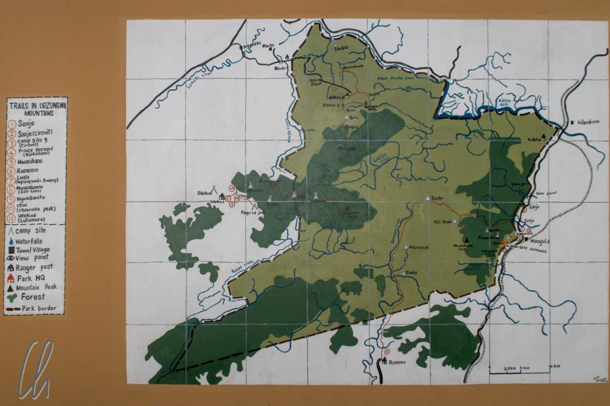

# Der Udzungwa Nationalpark

Der Udzungwa Nationalpark ist landschaftlich ein ziemlicher Gegensatz zu [Mikumi](http://wittmann-tours.de/auf-safari-im-mikumi-nationalpark). Statt mit Savanne ist Udzungwa mit dichtem Regenwald bewachsen. Flora und Fauna unterscheiden sich damit sehr. Statt Löwen und Zebras sahen wir Affen und Schmetterlinge. Außerdem besuchten wir den höchsten Wasserfall in Tansanias Nationalparks.

<!--more-->

## Ein Wald mitten in der Savanne

Nur etwa 50 Straßenkilometer von Mikumi entfernt (eigentlich handelt es sich um ein zusammenhängendes System aus Nationalparks) beginnen die [Eastern Arc Mountains](https://en.wikipedia.org/wiki/Eastern_Arc_Mountains) sich zu erheben. An ihren Ausläufern ändert sich die Landschaft schlagartig: In der Ebene erstrecken sich Felder, an den Hängen Wald. Die steilen Berge machen Landwirtschaft aufwändig bis unmöglich. Neben dieser geografischen Ursache gibt es auch eine kulturelle, die dazu geführt hat, dass die Bäume nicht abgeholzt wurden. Der Wald in den Bergen ist mit Tabus belegt. Wer z.B. eine bestimmte Baumart fällt, läuft Gefahr, in naher Zukunft von einem Löwen gefressen zu werden. Dieser Aberglaube war ein wirksamer Schutz für den Urwald.

Trotzdem bedrohten in Udzungwa Abholzung und Wilderei das Ökosystem, daher wurde 1992 der Nationalpark gegründet. Von der Umgebung geografisch getrennt und dann unter Schutz gestellt, konnten sich viele Tiere und Pflanzen wie auf einer Insel über Jahrmillionen eigenständig entwickeln. Der Anteil der endemischen Pflanzen und Tiere ist sehr hoch und immer noch entdecken Forscher dort regelmäßig neue Arten. Im Nationalpark gibt es auch heute fast keine Straßen und nur wenige offizielle Wege.

Auf dem Hinweg bogen wir vom Tanzam Highway nach Süden ab. Die Straße war erst ein schmales Asphaltband, später nur noch Piste, aber gut befahrbar. Dort bekamen wir einen ersten Eindruck vom ländlichen Tansania. Statt kahler Savanne gab es viele große Bäume und Palmen. Verglichen mit Madagaskar war die Infrastruktur insgesamt wesentlich besser. Besonders fielen uns Landmaschinen auf, die die Menschen offensichtlich bei der Arbeit unterstützten.

## Aufstieg zu den Sanje Falls

Um den Wald kennenzulernen, unternahmen wir eine durchaus anstrengende Wanderung zur oberen Kante der [Sanje Falls](https://de.wikipedia.org/wiki/Sanje_Falls). Mit 170 Metern Höhe sind sie die höchsten Wasserfälle in Tansanias Nationalparks, ein etwas spezieller Superlativ. Für die Einschränkung sind vermutlich die [Kalambo-Fälle](https://de.wikipedia.org/wiki/Kalambo-F%C3%A4lle) verantwortlich, die an der Grenze zu Sambia liegen und mindestens 221 Metern hoch sind.

Der Weg führte mehr oder weniger konstant bergauf. Zwischendurch gab es allerdings immer wieder gute Gelegenheiten für kleine Verschnaufpausen, da uns Samuel, unser junger lokaler Führer, die Verwendung zahlreicher Pflanzen erklärte. Auch wenn der Wald offiziell ein Regenwald ist, so stellte er sich für uns im September eher als recht trocken dar. Von Juni bis Oktober (und Dezember bis Februar) ist Trockenzeit und es regnet in der Tat sehr selten.

## Oben angekommen

Oben angekommen erstreckte sich zu unseren Füßen ein scheinbar unendlicher Fernblick über die Ebene, die, gut bewässert durch das Nass aus den Udzungwa-Bergen, erstaunlicherweise fast flächendeckend grün war. Bevor wir uns zum wohlverdienten Picknick niederließen, besuchten wir erst die zwei oberen, nicht so hohen Stufen des Wasserfalls. In der Trockenzeit waren dies schon bemerkenswerte Katarakte, die allerdings in der Regenzeit um ein Vielfaches anschwellen.

Der Sanje Fluss ist eher unbedeutend und kurz. Im Internet findet man nichts darüber. Nur auf [Openstreetmap](https://www.openstreetmap.org/way/135171104#map=14/-7.7763/36.9280) ist er eingezeichnet. Dort beginnt er kurz vor den Fällen und versickert nach wenigen Kilometern in der Ebene. Für die Trockenzeit entspricht das vermutlich den Tatsachen, in der Regenzeit mündet er aber bestimmt in den [Great Ruaha River](https://de.wikipedia.org/wiki/Ruaha).

https://www.youtube.com/watch?v=7TEHZTROoPQ

Große flache Felsen im Flussbett boten direkt an der Abbruchkante der Wasserfälle den perfekten Picknickplatz mit phantastischer Aussicht - natürlich ohne Absperrungen oder Warnschilder ;).

## Wildlife im Udzungwa Nationalpark

Bisher hatten wir auf unserer Wanderung kaum Lebewesen gesehen. Natürlich gab es diverse Vögel und Schmetterlinge, aber die Affen zeigten sich erst beim Abstieg. Wir sahen zwei Gruppen von [roten Stummelaffen](https://de.wikipedia.org/wiki/Rote_Stummelaffen) (Red Calabass Monkey). Ähnlich wie die Lemuren in Masoala waren sie schwer zu sichten, da sie ganz oben in den Bäumen saßen. Mit ihren lustigen Gesichtern und steilen Punkerfrisuren waren sie allerdings sehr sehenswert.

Wieder am Fuß der Sanje Fälle angekommen, nutzen wir die Gelegenheit, um in einem natürlichen Becken in das erfrischend kühle Wasser des Sanje zu hüpfen. Später am Abend, zurück in Mikumi, machte der Regenwald (vielleicht) doch seinem Namen alle Ehre. Es regnete ein wenig. Bei uns fielen nur ein paar Tropfen, im Udzungwa-Wald aber vielleicht umso mehr.

## Chief Mkwawa

Nach einer letzten Übernachtung in Mikumi brachen wir am nächsten Morgen zum Ruaha Nationalpark auf. Auf der Weiterfahrt planten wir einen Zwischenhalt in der Stadt [Iringa](https://de.wikipedia.org/wiki/Iringa), da es dort noch ein paar deutsche Kolonialgebäude geben sollte. Mit ein bisschen Glück durften wir unterwegs einen Abschnitt der lokalen Geschichte hautnah erleben. Kurz vor Iringa bogen wir unerwartet von der Hauptstraße nach links ab. Dort stand ein Denkmal, das von den Deutschen für ihre gefallenen Soldaten errichtet worden war. 1891 waren die Männer an dieser Stelle getötet worden, nachdem [Chief Mkwawa](https://de.wikipedia.org/wiki/Chief_Mkwawa), Stammesoberhaupt der Hehe, sie in einen Hinterhalt gelockt hatte. Dies war einer der wenigen vernichtenden Siege der Einheimischen über die Kolonialmacht.

Die [Hehe](https://de.wikipedia.org/wiki/Hehe), angeführt von Häuptling Mkwawa, waren damals der dominierende Stamm mit überregionalem Einfluss in der Gegend. Es dauerte 3 Jahre, bis die Deutschen sich für einen Gegenangriff gesammelt hatten und die Hehe besiegen konnten. Nach ihrer Niederlage führten die Hehe sechs Jahr lang einen Guerilla-Krieg gegen die Deutschen, bis Chief Mkwawa gefangen und erschossen wurde. Seinen abgetrennten Kopf schickte man als Beweis für seinen Tod nach Deutschland. Erst 1954 wurde sein Haupt an Tansania zurückgegeben.

Zufälligerweise trafen wir am Denkmal einen Nachfahren von Chief Mkwawa. Es war ein offensichtlich wohlhabender Tansanier, der mit seiner Familie in einem modernen Pickup vorfuhr. Wir kamen ins Gespräch und er erzählte uns die Geschichte seines Vorfahren am Ort des größten Sieges der Hehe über die Deutschen. Wir waren sehr beeindruckt und dankten dem Schicksal, das uns diese interessante Fügung hatte zuteil werden lassen. Der späte Nachfahre von Mkwawa gab sich sehr tolerant uns gegenüber und schien glücklicherweise keinen Groll gegen Deutsche zu hegen.

## Iringa Boma

In der Tat gab es in Iringa noch ein paar deutsche Gebäude, allen voran die [Iringa Boma](https://www.lonelyplanet.com/tanzania/iringa/attractions/iringa-boma/a/poi-sig/1583173/1001344), das älteste Gebäude in Iringa, erbaut um 1900. "Boma" ist eigentlich Swahili und bedeutet soviel wie befestigtes Bauwerk oder Festung. Die Bedeutung des Wortes hat sich aber gewandelt und bezeichnet heute auch Kolonialgebäude wie dieses. Ursprünglich war die Boma ein Militärkrankenhaus, dann ein Verwaltungsgebäude und heute beherbergt sie ein Museum.

Frisch renoviert (von der EU und Deutschland gefördert) erschien es fast ein wenig paradox, dass in der Ausstellung dort natürlich auch über die Heldentaten von Chief Mkwawa und über den Widerstand gegen die Deutschen berichtet wurde ;). Außerdem thematisierte die Ausstellung die Geschichte und Kultur der Hehe, widmete sich dem Wissen und den Praktiken von Naturheilern und stellte lokale Künstler vor. Insgesamt hat uns das Museum sehr gut gefallen: Ein Niveau, dass wir uns auch vom Nationalmuseum in Dar es Salaam gewünscht hätten ;).

Nach einem kurzen Rundgang durch die Stadt, in deren Straßen auch Markt abgehalten wurde, fuhren wir weiter nach Ruaha. Etwa 20 Kilometer von Iringa entfernt wandelte sich die Asphaltstraße zu einer Piste. Diese war jedoch erfreulich breit mit vielen Fahrspuren, oft sogar breiter als der mit Belag versehene Streifen des Tanzam Highway. Manchmal hatte sich zwar ein sehr ausgeprägtes Wellblech entwickelt, außerdem Schlaglöcher und Buckel, Isaac nutzte die Fahrbahn jedoch in ihrer ganzen Breite aus, um die beste Spur zu finden. Damit war es zwar sehr laut im Wagen, aber vergleichsweise bequem.

