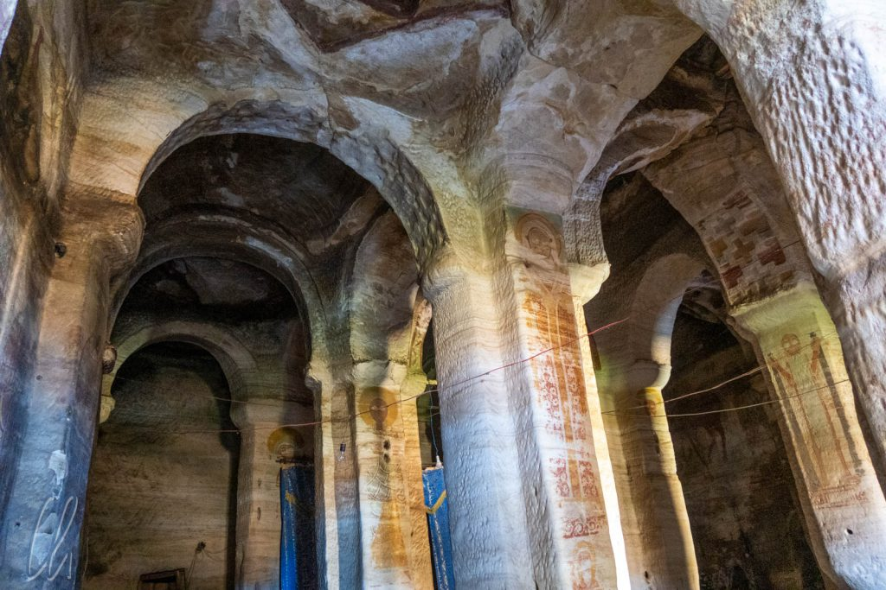
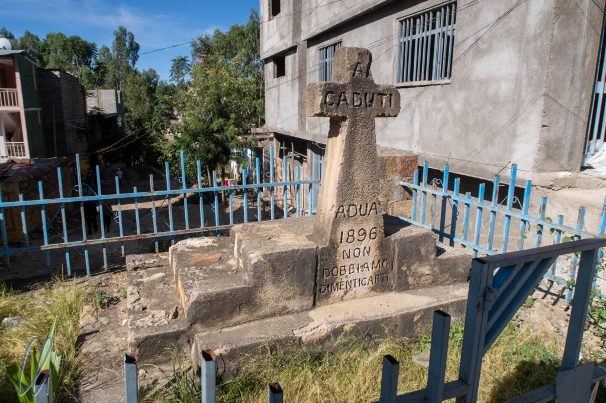
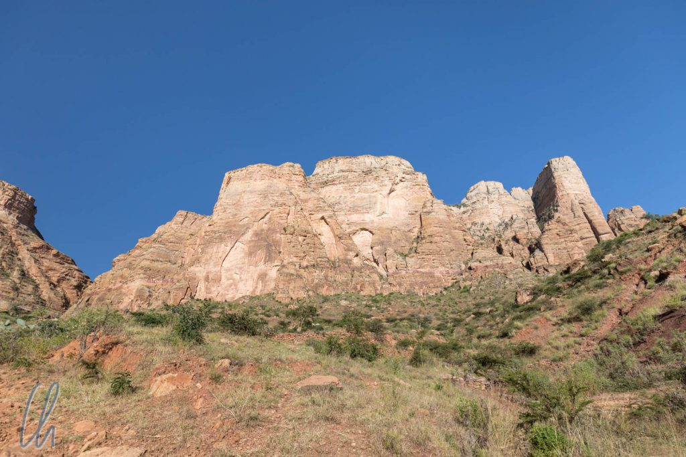
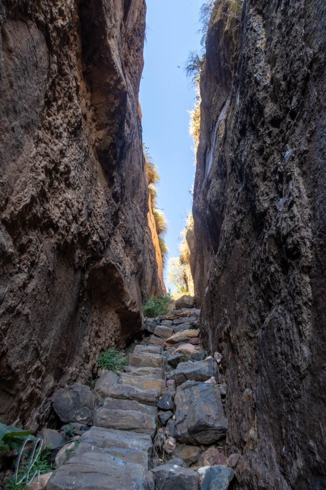
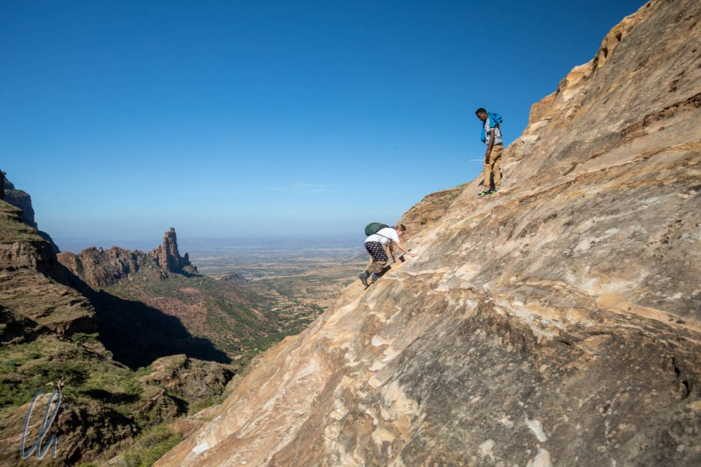

# Die Felsenkirchen von Gheralta

Äthiopien ist berühmt für seine monolithischen [Felsenkirchen](https://de.wikipedia.org/wiki/Felsenkirche) in Lalibela (wohin wir auch noch fahren würden), aber es gibt auch viele kleinere und weniger bekannte Gotteshäuser, die aus dem massiven Felsen herausgearbeitet worden sind. In der Nähe von Gheralta besuchten wir zwei dieser sakralen Stätten, die abgelegen hoch oben in den Bergen liegen. Um sie zu erreichen, wanderten (und kletterten) wir über abenteuerliche Wege, so wie es die Gläubigen auch tun, um dort zu beten und den Gottesdienst zu besuchen.

<!--more-->

## Auf der Fahrt nach Gheralta: Das Schlachtfeld von Adua

Auch dieses Mal gab es auf der Fahrt nicht nur - durchaus reizvolle - Gegend zu sehen. Östlich von [Aksum](http://wittmann-tours.de/aksum-aufbewahrungsort-der-bundeslade) passierten wir das einstige Schlachtfeld von Adua (auch Adwa transkribiert). Von einer Anhöhe aus blickten wir auf ein friedliches Tal mit Feldern, Wald und Bergen im Hintergrund. Aber in dieser idyllischen Landschaft hatte die blutige [Schlacht von Adua](https://de.wikipedia.org/wiki/Schlacht_von_Adua) stattgefunden. Angeführt von [Menelik II.](https://de.wikipedia.org/wiki/Menelik_II.) schlug das äthiopische Militär 1896 an diesem Ort italienische Truppen vernichtend. Auch heute noch sind die Äthiopier überzeugt, dass die Kraft der Bundeslade diesen Sieg ermöglicht hatte, auch wenn historische Zeugnisse eher [andere Faktoren](https://en.wikipedia.org/wiki/Battle_of_Adwa#Battle) anführen. Als Folge dieser entscheidenden militärischen Auseinandersetzung konnte Äthiopien die imperialistischen Bestrebungen Italiens abwehren und sich seine Unabhängigkeit bewahren. Die Äthiopier sind zu Recht stolz darauf, dass ihr Land nie kolonialisiert wurde.

In der Kleinstadt Adua stand auch ein kleines unscheinbares Denkmal, das an diesen Wendepunkt im [Italienisch-Äthiopischen Krieg](<https://de.wikipedia.org/wiki/Italienisch-Äthiopischer_Krieg_(1895–1896)>) erinnert. Maru wusste ungefähr, wo es sich befinden musste. Wir fuhren die Hauptstraße entlang und suchten am Straßenrand. Schließlich tauchte der Gedenkstein tatsächlich in einer Gebäudelücke auf. Interessanterweise war das Monument auf Italienisch beschriftet und erinnerte nicht an die 10.000 gefallenen Äthiopier, sondern an die gestorbenen Italiener. Wenn wir es richtig interpretieren bedeutet die Inschrift: "Gefallen, Adua 1896, wir dürfen nicht vergessen".

## Gheralta Guides und Scouts

Am folgenden Tag hatten wir eine Wanderung zu einer der Felsenkirchen, Mariam Korkor, geplant. Wir trafen unseren Führer Gebre von der Gheralta Guides Association und fuhren über eine holperige Piste zum Fuß der Berge. Auf dem sonst trockenen Weg befand sich eine matschige Stelle, vermutlich verlief dort ein kleiner Bach, dort blieb das Auto erstmal stecken. Wir sahen uns schon durch den knietiefen Schlamm waten und den Geländewagen aus dem Dreck schieben, aber dann schafften Maru und der Vierradantrieb nach mehreren Anläufen zum Glück doch noch ein Befreiungsmanöver, wobei der Matsch in alle Richtungen spritzte.

Am Parkplatz trafen wir zu unserer Verwunderung einen unangekündigten Scout namens Embei, der uns auch begleiten würde, wie uns Gebre eröffnete. Embei war ein rüstiger alter Mann, nach eigenen Angaben war er 82 Jahre alt. Vor vollendete Tatsachen gestellt ahnten wir schon, dass es am Ende eine unvermeidliche Tragödie um seine Entlohnung geben würde, da selbsternannte Führer von uns normalerweise kein Trinkgeld erhalten…

## Aufstieg zur Felsenkirche Mariam Korkor

So standen wir am Fuße des Berges, dessen Felsen steil emporragten. Kaum konnte wir uns vorstellen, wie wir ihn bezwingen sollten. Der Fußweg wies von Anfang an eine ziemliche Steigung auf und führte uns in eine enge Spalte zwischen zwei Felswänden. Direkt am Eingang mussten wir an einem Steinblock von mehreren Metern Durchmesser vorbeiklettern, der erst kürzlich in die Schlucht gefallen war, wie beruhigend ;). Der Pfad war mit losem Geröll bedeckt, welches stellenweise zu einer Treppe aufgeschichtet war. Dies war nicht (ausschließlich) für Besucher wie uns geschehen, schließlich befanden wir uns auf dem regulären Weg zur Kirche, den viele Gläubige regelmäßig benutzten.

Nach der Durchquerung der Felsspalte gelangten wir auf ein kleines Plateau. Wir hatten schon etwa 150 Höhenmeter bewältigt (Halbzeit) und es eröffnete sich für uns ein eindrucksvoller Ausblick über die Landschaft auf der anderen Seite des Massivs. Nach einer kurzen Verschnaufpause - die Anstrengung und die einsetzende Hitze hatten uns ins Schwitzen gebracht - setzten wir den Aufstieg fort. Abschnittsweise kraxelten wir über den bis zu 60 Grad steilen Felsen, nur an wenigen Stellen waren schmale Trittstufen hineingehauen worden, nicht viel breiter und tiefer als eine Schuhspitze. Glücklicherweise war die raue Oberfläche des Felsens sehr griffig, so dass die Kletterpartie uns viel Spaß bereitete.

## Die Kirche Mariam Korkor

Oben angekommen genossen wir erneut den fabelhaften Blick auf die ländliche Ebene. Einige hundert Meter weiter erreichten wir die Kirche [Mariam Korkor](https://fr.wikipedia.org/wiki/Maryam_Korkor), deren Fassade direkt vor eine Felswand gebaut worden war. Das Innere des Gotteshauses befand sich im Berg. Das komplette Kirchenschiff war aus dem massiven Stein gehauen worden, großzügige 10 Meter breit, 17 Meter tief und 6 Meter hoch. Mariam Korkor war die erste monolithische Felsenkirche, die wir in Äthiopien sahen und entsprechend beeindruckt waren wir ob der handwerklichen Meisterleistung.

Der Innenraum roch ein wenig modrig und war in nur zwei Bereiche aufgeteilt: den Hauptraum, wo die Gottesdienste stattfinden, und das Allerheiligste mit der Replik der Bundeslade. Die Säulen und Wände waren auch in Mariam Korkor mit zahlreichen Abbildungen biblischer Motive geschmückt. Die Farben der detailreichen Bildnisse waren schon deutlich verblasst. Angeblich stammten sie aus dem 13. Jahrhundert. Die Malereien wirkten auf jeden Fall sehr alt und faszinierend lebendig auf der fugenlosen Felswand.

In einer weiteren Höhle neben der Kirche lebte ein Mönch, der das Plateau dort oben nicht verlässt und der die Kirche mit einem riesigen Schlüssel für uns öffnete (natürlich gegen eine Spende) und uns das Innere zeigte. Mariam Korkor war aber nicht nur eine Touristenattraktion und ein Ort des Gebetes für den Mönch, der Gott in der Einsamkeit suchte, nein, dort fanden regelmäßig Gottesdienste statt. Jeden Sonntag (und zu anderen äthiopischen Feiertagen) kletterten die Menschen auf der gleichen Route, die wir genommen hatten, die Felsen hinauf, um an der Messe teilnehmen zu können.

## Abba Daniel Korkor

Anschließend umrundeten wir den Berggipfel, in dem sich Mariam Korkor befand. Über einen nur etwa 2 Meter breiten Vorsprung entlang des Abgrundes erreichten wir nach weniger als 5 Minuten eine weitere kleine Kirche, Abba Daniel Korkor, die wir eher als Kapelle oder Gebetsraum bezeichnen würden. Auch diese sakrale Stätte war aus dem Felsen gehauen worden. Sie hatte nur einen Raum, in den wir durch eine schmale, niedrige Öffnung gelangten. Auch die Wände dieses Kirchleins waren mit christlichen Abbildungen versehen.

Als wir wieder ins Freie gelangten, offenbarte sich erneut ein monumentaler Blick über die zu unseren Füßen liegende Gegend, auf die wir aus der Vogelperspektive herabblickten.

## Das liebe Trinkgeld

Häufig hatten wir den Eindruck, dass die Einheimischen uns als wandelnde Trinkgeldkasse betrachteten. Dessen waren wir uns natürlich bewusst und aus vorheriger Erfahrung im Land darauf vorbereitet. Bei diesem Ausflug war es leider schade, dass wir mehr als einmal direkt daran erinnert wurden, obwohl wir eindeutig versichert hatten, dass wir uns am Ende unseres Besuchs natürlich auch dem Mönch gegenüber erkenntlich zeigen würden, schließlich war er der Hüter der beiden monolithischen Kirchen.

Am Ende bekam auch Embei von uns ein Trinkgeld, als einziger selbsternannter Führer auf der ganzen Weltreise. Er hatte sich sehr freundlich um uns bemüht (engagierter als unser offizieller Guide), hatte versucht, uns einiges mit ein bisschen Englisch zu erklären und vor allem auf die Tücken des Weges hinzuweisen. Wir gaben ihm 200 Birr (etwa 5 Euro), einen für äthiopische Verhältnisse mehr als großzügigen Tageslohn. Er beschwerte sich allerdings bitterlich bei uns, dass dies zu wenig sei. Daraufhin boten wir an, dass er uns das Trinkgeld gerne zurückgeben könne, wenn er nicht zufrieden sei. Das tat er natürlich nicht. Leider brachte diese Meinungsverschiedenheit einen Missklang in unseren Abschied, obwohl es eine phantastische Wanderung gewesen war.

## Die Gheralta Lodge

Zurück in unserer Unterkunft, der Gheralta Lodge, konnten wir im Sonnenuntergang das Bergmassiv bestaunen, das wir an diesem Tag erklommen hatten. Das Hotel war die mit Abstand beste Unterkunft, die wir in ganz Äthiopien erleben durften. Eine weitläufige gepflegte Gartenanlage mit hübschen kleinen Hütten traditionell aus Naturstein erbaut, die ruhige Lage, direkter Zugang zu einem kleinen Aussichtshügel mit spektakulärem Ausblick über die Landschaft, gutes italienisches Essen, engagiertes Personal. Der Besitzer der Simien Lodge sollte vielleicht mal ein paar Tage dort verbringen…

Auch die Fauna kam nicht zu kurz in der Gheralta Lodge. Morgens wurden wir vom lautstarken Gesang der Vögel geweckt, die leider Frühaufsteher zu sein schienen. Es lohnte sich allerdings, sich aus dem Bett zu erheben, hinauszugehen und die vielen bunten gefiederten Freunde zu beobachten, die sich ihr Frühstück in den nahen Bäumen suchten. Außerdem hatte die Lodge einen ökologischen Rasenmäher, ein hübsches kleines Pferd. Leider war es sehr misstrauisch, es hatte anscheinend schlechte Erfahrungen mit Menschen gemacht.

## Aufstieg mit Hindernis

Vier Tage später, als wir zurück aus der Danakil Wüste waren (Bericht folgt in den nächsten Beiträgen), besuchten wir die Felsenkirche [Abuna Yemata Guh](https://en.wikipedia.org/wiki/Abuna_Yemata_Guh). Auch dieser Ort des Gebetes lag hoch oben im Gheralta-Massiv und die Wanderung zeigte einige Parallelen zum Besuch von Mariam Korkor. Wir trafen unseren Führer Jemana und fuhren über eine idyllische aber holperige Piste, bis es wirklich nicht mehr weiterging. Links und rechts des Weges erstreckten sich die Felder der Bauern und geradeaus ragten die Berge empor. Maru blieb beim Auto und wir machten uns zu dritt auf den Weg.

Kurz vor dem Ziel gelangten wir zu einer steilen, fast senkrechten Felswand, verglichen damit war der Aufstieg zur Mariam Korkor-Kirche ein flacher Hügel gewesen. Alles kein Problem, wir sollten unsere Schuhe ausziehen. Wie wir die Schritte zu setzen hätten und wo man sich festhalten könne, würden uns die Helfer zeigen, die dort auf Kundschaft warteten. Gegen eine schmale Gebühr von einigen hundert Birr bestünde auch die Möglichkeit, ein Klettergeschirr anzulegen, damit wir mit einem Seil gesichert werden könnten. Die Offerte war mehr als sinnvoll, aber trotzdem wirkte es wie ein Nepp. Warum eröffnete uns das unser Führer 20 Meter vor bzw. unter dem Ziel? Im Auto muss man ja für den Sicherheitsgurt auch keinen Aufpreis bezahlen, ebenso wenig wie bei einer Bootsfahrt für Schwimmweste oder Rettungsring.

Natürlich bezahlten wir für die Sicherung, fühlten uns aber trotz des geringen Betrags mustergültig abgezockt. Wer verzichtet schon auf eine Sicherung, wenn man an einem unbekannten Berg 20 Meter Felswand hoch und wieder herunter klettern möchte? Das Geschäftsmodell war perfekt eingefädelt und auch die Mitglieder einer anderen Besuchergruppe, die kurz nach uns eintrafen, waren mehr als irritiert. Gut gemeinter Rat an die Gheralta Guides: Schließt das Klettergeschirr einfach im Preis mit ein. Niemand würde protestieren ;) Ob es noch einer gesonderten Erwähnung bedarf, dass auch die drei Helfer an der Felswand ein Trinkgeld erwarteten?

## Die Felsenkirche Abuna Yemata Guh

Oben angekommen war das Terrain beherrschbar, aber trotzdem abenteuerlich. Die Felsen fielen steil ab und die begehbaren Flächen glichen schmalen unebenen Simsen über dem Abgrund. Welch ein Ort, um eine Kirche aus dem Stein herauszuarbeiten! So abgeschieden wie das kleine Gotteshaus war, eignete es sich bestimmt bestens dazu, in Ruhe und Einsamkeit zu beten. Bei unserem Besuch lebte dort oben kein Mönch mehr, trotzdem wurde in dem sakralen Bauwerk jeden Sonntag ein Gottesdienst abgehalten. Die Einheimischen kletterten bestimmt ohne Sicherung dort hinauf.

Die Kirche war laut Legende dort im 5. Jahrhundert von keinem Geringeren als [Abuna Yemata](https://orthodoxwiki.org/Abba_Yem%27ata) selbst, einem der [Neun Heiligen](https://en.wikipedia.org/wiki/Nine_Saints), alleine aus dem Felsen geschlagen worden (andere Quellen nennen das 15. Jahrhundert). Auch dort war der Innenraum über und über mit detailreichen christlichen Motiven bemalt und die angeblich noch originalen Farben leuchteten regelrecht, vor allem an der Decke. An der gegenüberliegenden Wand fiel uns zuerst eine Abbildung von Abuna Yemata zu Pferd ins Auge.

## Äthiopische Kirchenkunst

Nachdem wir nun schon seit 2 Wochen durch Äthiopien reisten, dachten wir, wir hätten in der Zwischenzeit einiges gelernt. Oben in einer Kuppel waren neun Männer mit Heiligenschein dargestellt. Also frage ich, auf ein "Ja" spekulierend, unseren Führer, ob dies die bekannten Neun Heiligen wären. Die Antwort war - zu meiner großen Enttäuschung - allerdings "Nein": Es seien die Zwölf Apostel und die Abbildung der drei fehlenden befände sich darunter.

Folgerichtig waren in der anderen Kuppel auch nur acht der Neun Heiligen abgebildet, der Gründer der Kirche ritt schließlich auf seinem Pferd darunter an der Wand entlang… Es lag also noch ein langer Weg vor mir bis zum Experten für äthiopisch-orthodoxe Kirchenkunst ;)

Die Felsenkirchen an sich beeindruckten uns tief. Ihre Lage war atemberaubend und wir fragten uns, nach welchen Kriterien die Orte ihrer Erschaffung ausgewählt worden waren. Die Begeisterung, Entschlossenheit und Hingabe ihrer Erbauer (besser der Steinmetze) muss grenzenlos gewesen sein.
