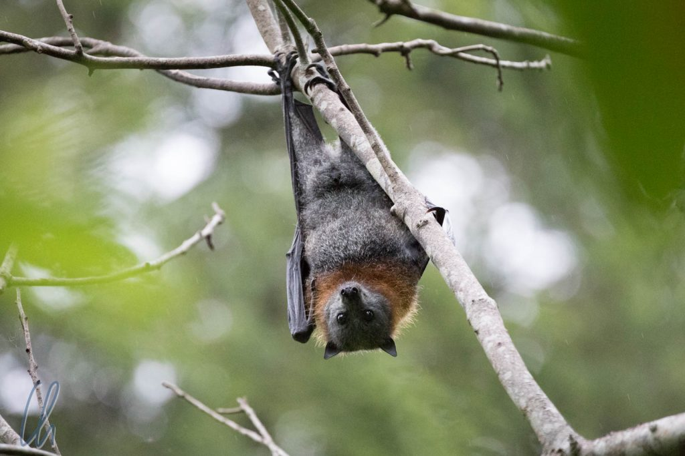
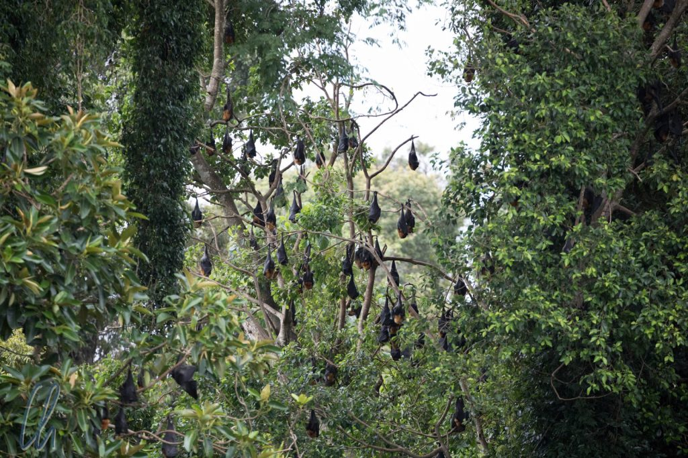
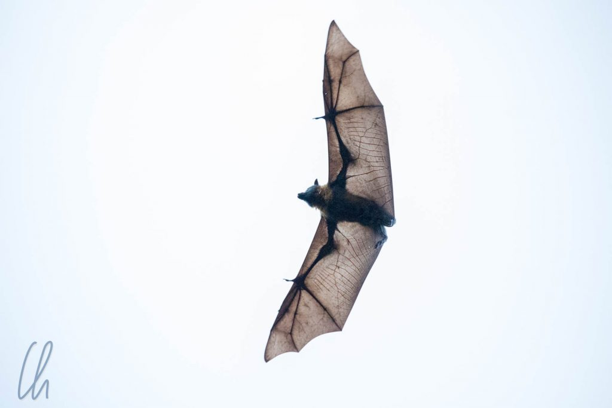
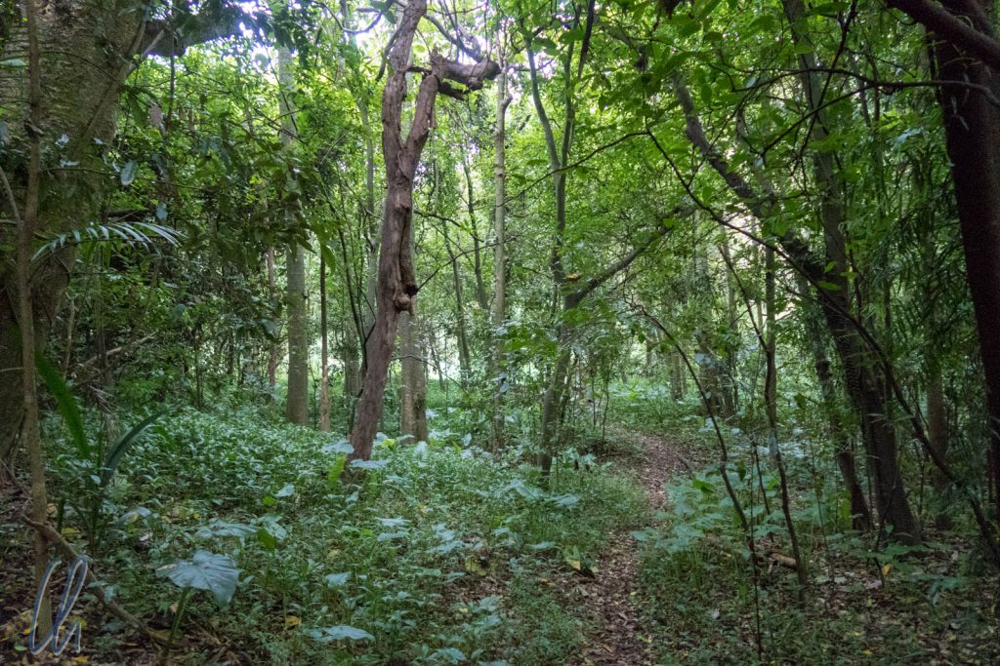
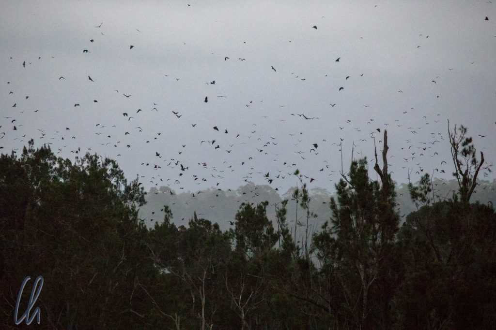

Unser Driveabout führte uns von [Mon Repos](http://wittmann-tours.de/die-schildkroeten-von-mon-repos/) immer entlang der Ostküste Australiens nach Süden. Es waren recht lange Fahrtage, aber Mona hatte immer wieder interessante Zwischenstopps und schöne Orte zum Übernachten ausgesucht. Die letzte Nacht, bevor wir Sydney erreichten, verbrachten wir in Bellingen ("Bello"). Die Sehenswürdigkeit des kleinen Hippiedorfes ist eine große Kolonie von Flughunden. Nach unserer ersten Bekanntschaft mit den possierlichen Tierchen [in Brisbane](http://wittmann-tours.de/erste-eindruecke-aus-australien-brisbane/) waren wir vorgewarnt - und vorbereitet!

<!--more-->

## Zu Besuch bei den Flughunden

In der Abenddämmerung starten Tausende Flughunde, um auf die nächtliche Jagd zu gehen. Die meisten Leute schauen sich den Abflug aus der Ferne an, das war auch unser ursprünglicher Plan. Da wir jedoch früh genug in Bellingen angekommen waren, unternahmen wir vorher einen Spaziergang direkt zu der Kolonie der Flughunde. Sie leben auf einer Insel im Bellinger-Fluss, in dieser Gegend das angeblich letzte Stück ursprünglichen Waldes.

Auch wenn die Flughunde eigentlich nachtaktiv sind, veranstalteten sie schon am späten Nachmittag ein lautstarkes Spektakel. Von der Straße aus hörten wir sie schnattern und gelegentlich flogen auch einige Tiere umher. Bei genauerem Hinsehen hingen sie überall in den Bäumen und je länger wir schauten, desto mehr sahen wir.

Der Zugang zur Insel war gut versteckt, aber schließlich fanden wir doch eine in die Jahre gekommene Hinweistafel und den mit Gestrüpp überwucherten Pfad, der direkt ins Dickicht zu führen schien. Da wir ja schon aus leidvoller Erfahrung wussten, dass es Niederschlag geben könnte (nicht nur wegen der Wolken am Himmel) hatten wir als Vorsichtsmaßnahme Regenschirme dabei ;)

## Auf der Insel der Flughunde

Aus der Nähe sahen wir durch die andere Perspektive erst nur wenige Tiere in den Bäumen hängen, bei genauerer Beobachtung erneut aber immer mehr. Sie versteckten sind ganz gut, und die meisten hingen recht weit oben in den Bäumen. Sie waren fleißig dabei, sich für ihren nächtlichen Ausflug bereitzumachen und ihre Flügel zu putzen.

Die Flughunde aus der Nähe zu beobachten, war an sich schon sehr beeindruckend. Die Geräuschkulisse, die sie verbreiteten, war beinahe schon unheimlich, ein Schnattern und Quieken, ein Rufen und ein Quietschen, eigentlich unbeschreiblich und ziemlich laut. Um einen Eindruck zu bekommen, hier ein kurzes Video, bei dem es ausschließlich um den Ton geht:

https://www.youtube.com/watch?v=vngUuCd-1rY

Kaum waren wir zurück im Guesthouse, von wo wir einen guten Blick über den Wald auf der Insel hatten, da starteten auch schon die ersten Tiere auf ihren nächtlichen Ausflug, dann mehr und immer mehr. Es war ein Szenario wie aus einem Horrorfilm. Schwärme von Flughunden schwirrten am trüben, dämmrigen Himmel. Der Strom der Tiere ebbte erst ab, als es fast Dunkel war. Dann waren schließlich auch die Langschläfer aufgebrochen.

