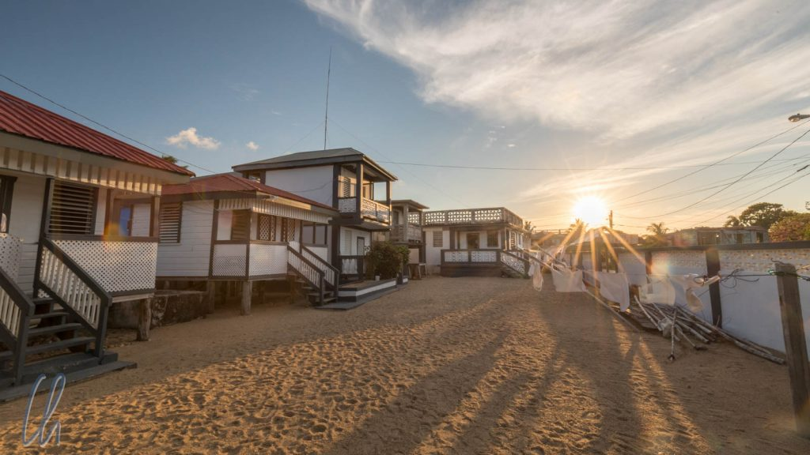

# Die Garifuna-Hauptstadt Dangriga

Nach Dschungel und Unterwasserwelt wollten wir mehr vom ursprünglichen Belize erleben. Wir blieben drei Tage in Dangriga, der inoffiziellen Kulturhauptstadt der [Garinagu](https://de.wikipedia.org/wiki/Garifuna). Hier waren 1832 die ersten ihres Volkes an Land gegangen. Mit ca. 10.000 Einwohnern ist Dangriga, wie eigentlich jede Stadt in Belize, sehr überschaubar. Der Ort scheint touristisch nicht erschlossen zu sein, was einen Teil seines Reizes für uns ausmachte.

<!--more-->

## Ruthie's Cabanas

Unser Zuhause war bei Ruthie, einer vielleicht 50 Jahre alten, sehr freundlichen und herzlichen Garifuna-Dame, die einfache Bungalows am Strand vermietet. Ruthie hat zwar Internet, aber es scheint nicht ihr Medium zu sein. Die Reservierung hatten wir telefonisch vorgenommen und Ruthie verkündete in ihrem unnachahmlichen Kreol-Dialekt: "I wait for you, my friend". Wir kamen wie angekündigt am späten Vormittag, trotzdem waren zunächst die Türen verschlossen und ihre Hunde bellten uns kräftig an. Gut 10 Minuten später kam Ruthie auf ihrem Fahrrad vom Markt. Sie war vormittags einkaufen, da sie wusste, dass wir kommen würden - offensichtlich waren wir zu früh ;)

Die Bungalows waren recht einfach. Durch den blauen Anstrich innen fühlte man sich ein wenig wie unter Wasser. Phantastisch war die Lage direkt am Strand, komplett mit Kokospalmen, deren Wedel im Wind raschelten. Durch die Meeresbrise genossen wir eine natürliche Klimaanlage. Aus unserem Fenster, oder besser durch unsere Holzlamellen, hatten wir einen schönen Blick auf das Meer und den Strand. Wir konnten die badenden Kinder beobachten, Pelikane, die sich auf der Jagd nach Beute wie Geschosse ins Wasser fallen ließen und Fischer in ihren winzigen Holzbooten. Eines Tages kam ein Junge auf einem cremefarbenen Pferd ohne Sattel den Strand entlang galoppiert, führte das herrliche Tier ins Meer und wusch es im türkisfarbenen Nass.

Außerdem ging es sehr familiär zu. Frühstück gab es zum Beispiel direkt bei Ruthie in der Küche: Fry Jacks, Bohnen und Rührei. [Fry Jacks](https://en.wikipedia.org/wiki/Fry_jack) sind eine ur-belizianische Erfindung. Es handelt sich um in Öl gebackene köstliche Halbmonde aus lockerem Teig, warm serviert, von denen wir nicht genug bekommen konnten. Abends wurde in der Nachbarschaft oft getrommelt und musiziert, so dass wir typische Garifuna-Rhythmen frei Haus zu hören bekamen.

## Unterwegs in Dangriga

Unsere ersten Besorgungen, zum Beispiel Kleider zum Waschen abgeben, wurden dadurch erschwert, dass die Beschilderung sehr sparsam war. Die Einheimischen wissen eben, wo die Wäscherei ist, nämlich schräg gegenüber der Post. Aber auch die erkannten wir erst, als wir zum dritten Mal daran vorbei gegangen waren ;). Am Ende fand die Angestellte der Reinigung durch Zufall eher uns als wir sie.

Ähnlich ging es uns auch mit einer lokalen Sehenswürdigkeit. Im Rathaus sollte ein Wandbild des berühmten Garifuna-Künstlers [Pen Cayetano](https://en.wikipedia.org/wiki/Pen_Cayetano) zu sehen sein. Die Einheimischen schienen erst nicht zu wissen, wovon wir redeten, so dass wir schon aufgeben wollten. Dann kam aber doch der "Chef" (seine genaue Rolle haben wir nicht erfahren). Das Gemälde war nicht an einer Außenmauer, wie wir erst vermutet hatten, sondern drinnen im zweiten Stock. Kurzerhand schloss er uns den Mehrzweckraum auf, sehr nett. Das Bild stellt die Ankunft der Garinagu in Dangriga dar und das friedliche Zusammenleben mit den verschiedenen ethnischen Gruppen heute in Belize.

Auf der Suche nach einem Lokal zum Mittagessen müssen wir anschließend einen etwas orientierungslosen Eindruck gemacht haben. Da kam zufällig der „Chef“ auf seinem Motorrad vorbei und fragte uns, was wir gerne essen würden. Wir antworteten eher unspezifisch, dass wir gerne etwas für Dangriga Typisches probieren würden. Daraufhin führte er uns zu seinem Lieblingsstand in der Markthalle, wo er uns den Fisch empfahl. Der kam wenige Stunden vorher frisch aus dem Meer und so schmeckte er auch.

Später sahen wir auf beiden Seiten der Brücke über den Stann Creek die improvisierten Fischverkaufsstände, wo der Fang küchenfertig vorbereitet wird. Eine Schar Pelikane beobachtete wachsam jede Bewegung des Händlers, um sich bei Gelegenheit gleich auf die Reste zu stürzen.

## Palmento Grove Cultural Center in Hopkins

Auch wenn es in Dangriga natürlich ein weiteres Garifuna-Museum (neben dem in [Belize City](http://wittmann-tours.de/erste-eindruecke-aus-belize)) gab, so war die interessantere Institution doch das Palmento Grove Cultural Center in Hopkins, einem kleinen Ort ungefähr eine Stunde südlich von Dangriga. Dort wird die Garifuna-Kultur gepflegt und Besuchern nähergebracht. Bei unserem mehrstündigen Besuch bekamen wir nicht nur einen Überblick über Geschichte, Bräuche und Rituale der Garinagu, sondern auch eine praktische Einführung mit Kochkurs und Trommelunterricht. Für ein authentisches Garifuna-Erlebnis durften wir entsprechende Kleidung überziehen.

Vor das Kochen hat der liebe Gott die Beschaffung der Zutaten gestellt. Für uns bedeutete das, dass wir Kokosnüsse pflücken und dabei helfen mussten, sie zu öffnen. Schritt Eins war relativ einfach, da an der designierten Kokospalme eine Leiter stand ;). Hat man eine Kokosnuss gewählt, ist der Trick, nicht daran zu ziehen, sondern sie am Stiel abzudrehen. Der Reifegrad entscheidet anschließend über die Verwendung. Die jungen Kokosnüsse sind zum Trinken gedacht ("recreational coconut"; je nach Gusto auch mit einem Schuss Rum verfeinert). Die mittelalten eignen sich zum Kochen, da sie mehr Fruchtfleisch enthalten. Aus den alten, die von selbst vom Baum fallen, wird Kokosöl hergestellt.

Zum Öffnen der Kokosnuss gab es ein erstaunlich einfaches Instrument: einen angespitzten Pfahl, der fest im Boden steckte. Wenn man die Kokosnuss im richtigen Winkel ansetzte und in die relativ weiche grüne Ummantelung drückte, war die äußere Hülle leicht abzuhebeln. Den Rest erledigte dann eine scharfe Machete :)

## Garifuna kulinarisch: Wir kochen Hudut

Hudut ist eines der klassischen Gerichte der Garifuna-Küche. Es besteht aus gebratenem Fisch und Kochbananenpüree mit einer köstlichen Sauce auf Kokosmilchbasis. Für die Zubereitung benötigt man die folgenden Zutaten (das Nachkochen könnte zugegebenerweise aufgrund einiger Zutaten und notwendiger Utensilien schwierig werden): - Plantains (Kochbananen) (4 unreife, 2 reife) - Einen Fisch - Eine halbe Zwiebel - Mehrere Knoblauchzehen, nach Geschmack - 2 mittelalte Kokosnüsse zur Herstellung von Kokosmilch (oder 1l Kokosmilch aus der Dose ;) ) - Koriander, Oregano, Petersilie, Thaibasilikum, Salz, Pfeffer, Gewürzmischung für Fisch - 2 Habanero Chilis

Zunächst werden die Plantains ähnlich wie Kartoffeln in Wasser gekocht (gedrittelt, mit Schale). Die vier unreifen brauchen 20 Minuten, die zwei reifen nur 10 Minuten. Also gibt man einfach die reifen Kochbananen nach 10 Minuten in den gleichen Topf. Wenn sie fertig sind, Wasser abgießen und abkühlen lassen, damit sie später weiterverarbeitet werden können.

## Parallel wird weitergekocht

Während die Plantains kochen, wird als erstes der Fisch zerteilt. Zunächst den Kopf abtrennen (wird noch für die Sauce gebraucht) und dann den Rest zerschneiden. Dabei kommt es nicht so sehr drauf an, ordentlich zu arbeiten oder auf Gräten zu achten. Es sollten ca. 10x5 cm große Stücke entstehen.

Nun wird die Kokosmilch hergestellt: Zwei mittelalte Kokosnüsse öffnen, das Kokoswasser weggießen und das Fruchtfleisch herausraspeln. Die Raspel werden nun mit einem Liter Wasser aufgegossen und mit den Händen durchgeknetet. Dadurch verwandelt sich das Wasser in Kokosmilch. Dann die Kokosraspel zwischen den Händen ausdrücken und zur Seite legen. Die verbliebene Flüssigkeit durch ein Sieb abgießen, um restliches Fruchtfleisch zu entfernen. Die Raspel sind kein Abfall, man kann sie als Hühnerfutter oder zum Einreiben der Haut verwenden ;)

Nun folgt die Zubereitung der Sauce: Die halbe Zwiebel würfeln, ebenso die Knoblauchzehen. Die Würfelchen in die Kokosmilch geben, kleingeschnittene Kräuter und Gewürze hinzufügen: Salz, Pfeffer, Koriander, Oregano, Petersilie, Thaibasilikum. Zusätzlich die zwei Habanero Chilis (nicht zerschneiden) und den Fischkopf zugeben. Die Sauce aufkochen, bis die Augen des Fischkopfes weiß werden. Vorsicht mit den Chilis: Wenn die Habaneros aufplatzen, wird es höllisch scharf!

## Auf der Zielgeraden

Am arbeitsaufwendigsten ist die Zubereitung des Kochbananenpürees. Die Plantains sind mittlerweile hoffentlich kühl genug zur Verarbeitung. Die geschälten Bananen werden im Mörser zerstampft. Man beginnt mit den unreifen, bis sich die Masse beim Stampfen vom Rand löst. Das dauert eine gute Weile. Dann die reifen hinzufügen und das Stampfen weiterführen, bis sich die Masse erneut vom Rand löst. Fertig ist das relativ zähe Bananenpüree. Anschließend nimmt man die Masse mit feuchten Händen (ganz wichtig, sonst klebt es sehr!) aus dem Mörser und teilt mit einem Esslöffel kleine Portionen ab, die ungefähr so groß wir ein halber Kloß sind.

Nun wird der Fisch gebraten. Hierzu würzt man die Fischstücke mit Salz und Pfeffer sowie einer geheimen Gewürzmischung. Anschließend werden die Stücke in einer Pfanne mit heißem Öl gebraten, bis der Fisch knusprig ist.

Essen ist fertig! Den Fisch und das Kochbananenpüree serviert man in Kokosschalen (halbe Kokosnüsse), dann noch großzügig Soße dazu. Gegessen wird mit den Händen. Man tunkt das zähe Püree und den Fisch in die Soße und lässt es sich schmecken. Guten Appetit!

## Trio mit dem Trommel-Meister

Nach dem Mittagessen war das Programm noch nicht vorbei. Unser Trommel-Lehrer Chow Cas wartete schon auf uns. Die Einführung in die Garifuna-Trommelkunst befasste sich nicht lange mit Theorie, sondern wir legten gleich los. Unsere Aufgabe war vermeintlich einfach. Wie sollten "nur" den Grundrhythmus trommeln. Nachdem dies einigermaßen gut funktionierte, drehte Chow richtig auf und improvisierte dazu. Wir "lernten" insgesamt drei Rhythmen, könnten aber jetzt bestimmt keinen einzigen davon mehr spontan spielen…

https://www.youtube.com/watch?v=-j_Hq3SGXW8

## Belize kulinarisch: Marie Sharp

Die Belizianer essen gerne scharf. So steht in jedem noch so kleinen Restaurant ein Set von Hot Sauce-Fläschchen von Marie Sharp auf dem Tisch. Unsere Lieblingsvariante war „Belizean Heat“, aber auch das grüne Elixier mit Nopale-Kaktus war lecker. Mona mochte auch die „Smoked“-Sauce sehr gerne. Marie hat klein angefangen und mehrere Spezialrezepte entwickelt. Ein amerikanischer Investor versuchte, sie über den Tisch zu ziehen und klagte sie aus ihrem ersten Unternehmen heraus, aber das Rezept hat sie nie verraten. Mittlerweile produziert sie unter ihrem eigenen Namen in eigener Regie und in großem Stil. Ihre Saucen exportiert sie (fast) in alle Welt, sogar nach [Deutschland](https://www.amazon.de/s/field-keywords=marie+sharps+sauce).

Die Fabrik liegt vor den Toren Dangrigas, wo auch die Zutaten angebaut werden. Professionelle, sehr interessante Führungen in Kleingruppen starten, sobald genug Besucher eingetroffen sind. Die Produktionsanlagen wirken top-modern und die Fabrik wurde von allen relevanten internationalen Institutionen zertifiziert (damit der Export kein Problem ist). Alles ist blitzsauber und jede Flasche wird am Ende des Produktionsprozesses sogar geröntgt, um Fremdkörper auszuschließen und sicherzustellen, dass sie ausschließlich 100% Marie Sharp enthält.

Es geht also, (Klein-)Industrie auf höchstem Niveau im beschaulichen Dangriga. Auch wenn Belize für unsere Augen sehr hübsch und malerisch war, so sahen wir war doch von Marie Sharp's Fabrik abgesehen wenig ernstzunehmendes Gewerbe. Alles andere bröselte nach unserem subjektiven Eindruck etwas vernachlässigt vor sich hin. Die einzige andere Ausnahme waren die Geschäfte und Betriebe der fortschrittlichen Mennoniten in San Ignacio. Rein optisch hätte die landwirtschaftlich geprägte Gegend mit ordentlich abgegrenzten Feldern, gepflegten Häusern samt Gartenzaun und moderner Ausstattung (große Silos, Traktoren etc.) auch irgendwo in Deutschland liegen können. Der Sieg der Spice Queen jedoch ist eine echte belizianische Erfolgsgeschichte und auch wenn es einfach gesagt ist, fragten wir uns, warum es nicht mehr davon gibt.

## Abschied von Dangriga

Unvergesslich war auch mein (Christians) Besuch beim Friseur. Der Laden - oder besser die Holzhütte - war von durchaus beachtlicher Größe, vielleicht 7x7 Meter. Zwei kräftige Schwarze waren dabei, die Haare ihre Kundschaft von 3 auf 2mm herunterzuscheren. Plakate mit verblichener Reisewerbung für Ziele in Belize und Collagen leicht bekleideter Damen schmückten die Wände und die Einheimischen neckten sich gegenseitig unter herzhaftem Gelächter. Sie sprachen Kreol untereinander und dementsprechend verstanden wir fast nichts. Da es keine Spiegel gab, war es ein ungewöhnliches Gefühl zu sehen, wie die Wolle fiel. Der Dangriga-Cut fiel in der Tat sehr kurz aus und etwas anders als sonst ;).

Dangriga bestätigte unsere Erwartungen: In dem etwas verschlafenen Nest tickten die Uhren deutlich langsamer als an vielen anderen Orten der Welt. Wir hatten den Eindruck, einen unverstellten Blick auf den Alltag in einer belizianischen Kleinstadt werfen zu können. Erstaunlicherweise hatten wir viel Reise-Freizeit: Zeit zum Planen, für Spaziergänge am Strand und zum Baden im Meer. Es war sehr entspannend. Auch die Busfahrt nach Belize City über den landschaftlich schönen Hummingbird Highway mit Blick auf den Regenwald und die Maya Mountains war sehr angenehm.

https://www.youtube.com/watch?v=IuHNaDdM5Hs
