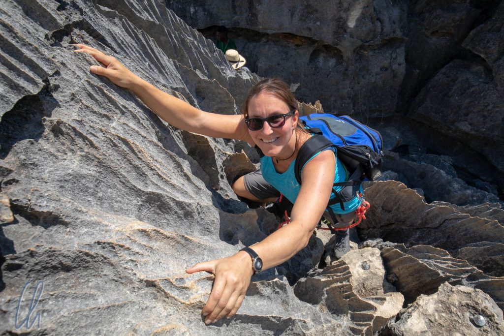

Die Tsingys sind ein abgelegener [Nationalpark](https://de.wikipedia.org/wiki/Nationalpark_Tsingy_de_Bemaraha), eine Karstlandschaft aus scharfkantigem Felsen. Vor Millionen von Jahren hatten sich Kalkablagerungen aus Fossilien und Muscheln auf dem Grunde des Ozeans gebildet und nachdem der so entstandene Stein nicht mehr im Meer lag, schuf die Erosion mit Regenwasser ein seltsames Labyrinth aus bedrohlichen Felsnadeln. Es ist eine beeindruckende Landschaft und dieses eigenartige Gebirge bietet zahlreichen Tieren ein Zuhause. Wie schroff die Tsingys sind, beschreibt ihr Name auf Malagasy. Übersetzt heißt Tsingy "auf Zehen laufen" oder "wo man nicht barfuß laufen kann".

<!--more-->

## Wanderung in den großen Tsingys

Also zogen wir es ausnahmsweise vor, nicht barfuß zu wandern ;) und schnürten unsere Wanderschuhe. Zusammen mit unserem lokalen Führer Meric fuhren wir am ersten Tag zu den sogenannten großen Tsingys und wanderten auf dem "Circuit des Grand Tsingy". Dort gab es einen gut ausgebauten Wander- und Kletterweg, über den wir mitten in das Labyrinth der Tsingy-Felsnadeln gelangten.

Der Weg war zunächst eben, wandelte sich nach kurzer Zeit aber in eine unterhaltsame Kletterpartie. Wir mussten sogar ein Klettergeschirr anlegen und uns sicherheitshalber an einigen Stellen in Stahlseile einklinken. Der Weg führte uns durch dunkle Höhlen und steile Leitern hinauf. Wir schlängelten uns durch schmale Canyons, die das Regenwasser in den Kalkstein gefressen hatte. Über große Felsstufen kletterten wir immer weiter nach oben. Nach knapp 2 Stunden waren wir am höchsten Punkt angekommen und blickten von oben auf die spitzen Zacken und in die zahlreichen engen Schluchten.

Der Weg, den wir genommen hatten, war für uns von oben zwischen den vielen Felsnasen nicht mehr nachvollziehbar. Vereinzelt ragten Bäume aus den Spalten hervor, die erstaunlicherweise auf dem Gestein und in seinen Ritzen Halt gefunden hatten.

## Sehr gepflegte Wanderwege

Auch wenn in Madagaskar die touristische Infrastruktur und die Straßen vom Standard her häufig eher rustikal sind, waren die Wanderwege in den Tsingys bestens in Ordnung. Die Wege, Leitern, Geländer, Brücken etc. waren qualitativ hochwertig und machten einen verlässlichen Eindruck. Eigentlich kein Wunder, sollte man meinen, schließlich sind die Tsingys eine der großen Sehenswürdigkeiten Madagaskars und die ausländischen Besucher eine gute Einnahmequelle. Trotzdem ist eine solche Ausstattung (auch im weltweiten Vergleich) auf keinen Fall selbstverständlich.

Das Besucheraufkommen war unserer Meinung nach schon am oberen Ende dessen angekommen, was wir für vertretbar halten würden. Vor allem an den steileren Stellen der Wanderung kam es sogar zu kleinen Staus… Nach kurzer Zeit zerstreuten sich die Besuchergruppen aber wieder, so dass wir unsere mitgebrachten Baguettes bei herrlicher Aussicht genießen konnten.

Bevor wir den Abstieg antraten, überquerten wir zwei freischwingende Hängebrücken, die tiefe Canyons überspannten. Anschließend verschwanden wir wieder in den tiefen, dunklen, schattenspendenden Schluchten des Tsingy-Labyrinths.

## Ein Wald voller Tiere

Unvermittelt traten wir aus der schroffen Felsenwelt hervor und erreichten einen Wald, in dem wir vielen einheimischen Tieren begegneten. Ein [Coua](https://de.wikipedia.org/wiki/Coquerel-Seidenkuckuck) (gesprochen "Koa"), ein hübscher Laufvogel mit langem Schweif und auffälliger blauer Augenpartie streifte über den Waldweg und fühlte sich von unserer Anwesenheit anscheinend nicht sonderlich beeindruckt. Auf Deutsch wird er treffenderweise als Seidenkuckuck bezeichnet.

Wenig später trafen wir am Waldrand auf eine Gruppe von [roten Makis](https://de.wikipedia.org/wiki/Roter_Maki). Sie hielten sich auf den Bäumen bzw. auf ein paar kleinen Tsingy-Ausläufern auf, die dort standen. Auch sie ignorierten uns im großen und ganzen. Vielleicht lag dies auch daran, dass sie offenbar eine kleine Delikatesse gefunden hatten: Sie mampften vergnügt kleine gelbe Früchte, die sie von einem Strauch pflückten. Es war sehr interessant, die aktiven Lemuren bei ihrem Treiben zu beobachten.

Kaum waren wir schließlich weitergewandert, bog Meric vom Hauptwanderweg ab, um nachzusehen, ob ein alter Bekannter zu Hause war. Und in der Tat, ein Wieselmaki blinzelte uns mit seinen großen Kulleraugen aus einer Höhle oben in einem Baum an.

## Zu Besuch bei den Vazimba

Am nächsten Tag standen die kleinen Tsingys auf dem Programm. Zunächst unternahmen wir jedoch eine Bootsfahrt auf dem [Manambolo](https://en.wikipedia.org/wiki/Manambolo_River)-Fluß. Ein sehniger alter Fischer paddelte uns in zwei miteinander verbundenen Einbäumen mit kräftigen Stößen über das Wasser, dessen Oberfläche in der Morgensonne glitzerte. Auf einer Klippe am Flussufer konnten wir eine kleine Gruppe der ungewöhnlichen grauen [Vasapapageien](https://de.wikipedia.org/wiki/Vasapapageien) beobachten.

Wir gingen an Land, um eine kleine Höhle mit schimmerndem Tropfstein zu besuchen und einer Grabstätte der Ahnen, der [Vazimba](https://en.wikipedia.org/wiki/Vazimba), die Ehre zu erweisen. Die Vazimba waren dem Volksglauben zufolge die ersten Siedler auf Madagaskar gewesen. Zahlreiche Legenden ranken sich um dieses Volk und seine übernatürlichen Fähigkeiten. Die Einheimischen besuchen diesen Ort, um ihre Verehrung auszudrücken und um Beistand zu bitten. Es heißt, die Vazimba hätten in und um die Tsingys gelebt und bei Gefahr das Labyrinth der Felsnadeln wie eine natürliche Festung als Rückzugsort genutzt.

Vom Boot aus erklommen wir eine steile Böschung. Die Knochen der Ahnen und die Reste ihrer hölzernen Särge lagen unter einem Felsvorsprung. Um uns einzuführen und als Opfergabe hatte der Fischer aromatisierten Rum in einer alten 0,5l Plastikflasche mitgebracht. Den Alkohol verteilte er großzügig über den Gebeinen und erklärte den Vazimba, dass die Vazahas zu Besuch kämen und dass sie in guter Absicht hier seien. Sie würden die Knochen nicht stehlen, sondern nur ein paar Fotos machen.

## Wanderung in den kleinen Tsingys

Die kleinen Tsingys waren in der Tat deutlich kleiner als die großen. Dennoch hätten wir auch hier nicht barfuß laufen wollen. In den Petits Tsingy wuchsen deutlich mehr Pflanzen und wir trafen nur zwei andere Touristengruppen. Trotzdem bildeten sie kein geringeres Labyrinth und auch hier kletterten wir über die scharfen Felsen, die die Erosion im Laufe der Jahrmillionen geformt hatte.

Auf dem Rückweg nach Bekopaka liefen wir durch ein kleinen Ausläufer des Dorfes. Die Menschen gingen ihren alltäglichen Beschäftigungen nach und schnell waren wir wieder mittendrin statt nur dabei. Eine Frau war gerade dabei, Reis zu stampfen, um die Hülsen von den Reiskörnern zu trennen. Dafür wird der Reis in einem Holzmörser mit einem schweren Holzstab (ähnlich wie bei den Goldsuchern) kraftvoll bearbeitet. Wir durften auch ausprobieren, wie anstrengend es ist und die Einheimischen hatten ihren Spaß, uns bei unseren nicht sonderlich geschickten Bemühungen zu beobachten.

Anschließend trennte die Frau die Spreu vom Weizen oder genauer gesagt die Schalen vom Reis, indem sie den Reis von einer Art dünnem Flechtkorb in die Luft [worfelte](https://de.wikipedia.org/wiki/Windsichten#Worfeln) und der Wind bzw. ihr vorsichtiges Pusten die leichten Hülsen davontrug. Es war faszinierend zu beobachten und wir lernten ein für uns neues Wort unserer eigenen Sprache!

## Madagaskar kulinarisch

Die Mittagspause verbrachten wir in einem sehr sympathischen einheimischen Lokal, unser Favorit auf dieser Madagaskar-Reise. Auf einer schattigen Terrasse servierten die Besitzer typisch madegassische Gerichte. Das bedeutet zunächst erstmal Reis, morgens, mittags, abends. Pro Mahlzeit rechnet man mindestens einer Kapoka (die leere Kondensmilchdose) Reis (ungekocht) pro Person. Die auf dem Land hart arbeitenden und damit hungrigen Menschen brauchen die Kalorien. Weltweit liegt Madagaskar trotzdem erstaunlicherweise nur auf Platz 11, was den [Reiskonsum pro Kopf](https://www.helgilibrary.com/indicators/rice-consumption-per-capita/) angeht.

Was für uns nach einer großzügigen Portion aussah, wäre auf Madagaskar eher das Kindergericht. Zusätzlich zum servierten Teller bekamen Tahina und Christian noch einen weiteren Teller mit einem Berg Reis darauf. Die beiden zeigten peruanische Qualitäten, indem sie alles ratzeputz aufaßen. Damit der Reis nicht zu trocken war, gab es zusätzlich eine leckere Hühnerbrühe, die man darüber verteilen konnte.

Reis spielt auf Madagaskar sogar als Getränk eine Rolle, nämlich in Form von Reiswasser. Was im [Internet](https://de.wikihow.com/Reiswasser-herstellen) als Geheimtipp für die Haarwäsche gefeiert wird, trinken die Madegassen lieber. Für unseren Geschmack war es allerdings eher gewöhnungsbedürftig ;). Das warme Reiswasser, das wir probierten, war mittels Auskochen der angebrannten Reste in den Reistöpfen zubereitet worden und hatte somit einen sehr rauchigen Geschmack.

## Rückfahrt über die Nationalstraße Nummer 8

Am kommenden Morgen brachen wir wieder auf zur Rückfahrt nach Morondava über die [Nationalstraße Nummer 8](http://wittmann-tours.de/die-nationalstrasse-8-ueber-belo-nach-bekopaka) und die [Baobab-Allee](http://wittmann-tours.de/ueber-die-baobab-allee-nach-norden/). Die Reihenfolge spielte sich folglich umgekehrt zur Hinfahrt ab, d.h. erst die kurze Fährfahrt über den Manambolo, der Transfer nach Belo in der Polizeikarawane, dann mit der Fähre von Belo nach Tsimafana und weiter zur Baobab-Allee. Zwischendurch schüttelte uns die Straße gut durch und am Ende waren wir und unsere Habseligkeiten wieder von oben bis unten eingestaubt ;)

