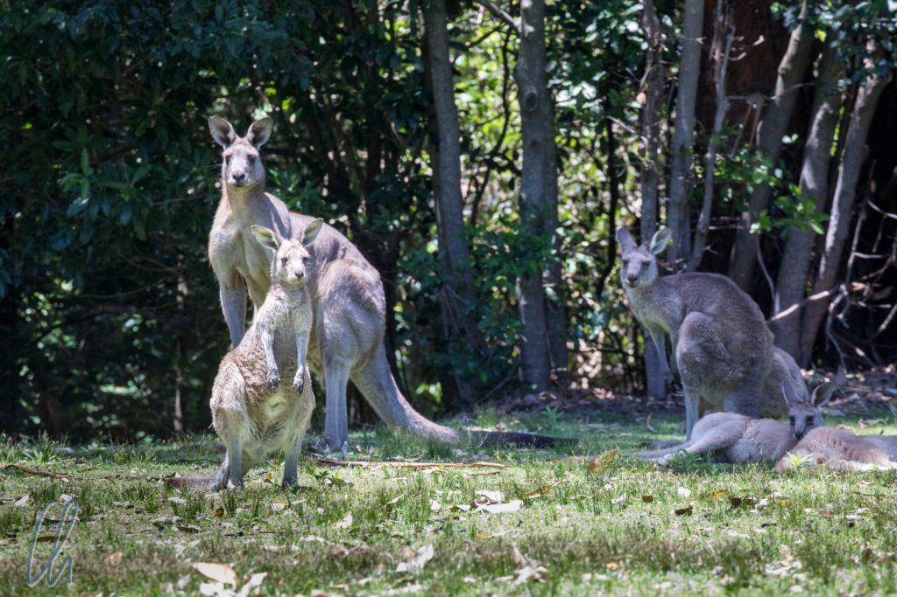
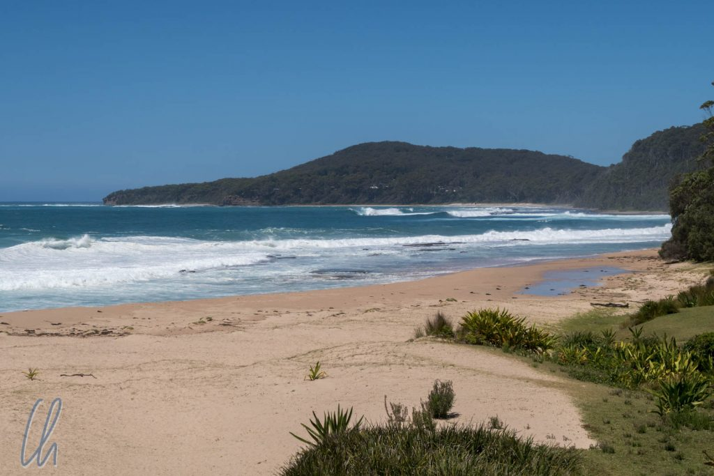

# Die Kängurus vom Kangaroo Beach

Australiens außergewöhnliche Tierwelt haben wir nicht nur im Zoo gesehen, sondern zum Glück auch in freier Wildbahn. Am Pebbly Beach (Steve, thanks for the recommendation!), der auch Kangaroo Beach genannt wird, sahen wir unsere ersten wilden Kängurus.

<!--more-->

## Wo sind die Kängurus?

Der Pebbly Beach liegt gut 4 Stunden südlich von Sydney im Murramarang National Park. Für uns war der Kangaroo Beach eine Durchreisestation, wir kamen zur Mittagszeit an. Da Kängurus vor allem morgens und abends aktiv sind, war unsere Besuchszeit leider alles andere als optimal. Auf einem kurzen Spaziergang zum und entlang des hübschen Strandes sahen wir folgerichtig auch kein einziges Beuteltier. Als wir uns etwas enttäuscht auf den Rückweg zum Auto machten, erspähte Mona zwischen den Bäumen auf einer Lichtung dann aber doch vom weitem die Silhouetten einiger Exemplare :)

Als wir uns ihnen näherten und zu den ersten Büschen kamen, raschelte es laut und anhaltend in den Blättern. Eine tödlich gefährliche australische Giftschlange? Nein, als Verursacher der Geräusche entpuppte sich ein für unsere Augen riesiger [Goanna](https://en.wikipedia.org/wiki/Goanna) (vermutlich ein [lace monitor](https://en.wikipedia.org/wiki/Lace_monitor) bzw. [Buntwaran](https://de.wikipedia.org/wiki/Buntwaran)). Von Kopf bis Schwanzende maß er bestimmt 1,50 Meter und watschelte 5 oder 6 Meter von uns entfernt durch das Gebüsch. Er fühlte sich durch uns anscheinend nicht gestört, da er eine große Delikatesse entdeckt hatte: Im trockenen Laub lag ein toter Rochen (wie auch immer der dorthin gekommen war).

Das war für das Reptil im wahrsten Sinne des Wortes ein gefundenes Fressen! Der Goanna ließ es sich sichtlich schmecken, obwohl es für unsere Nasen sehr fischig und verdorben roch. So verschieden sind die Geschmäcker: Der eine isst gerne Steak, der andere lieber Gammelrochen ;). Zwischen den Happen machte er immer wieder Genießerpausen, schaute in die Umgebung und lächelte zufrieden in die Kamera.

## Die Kängurus warten

Nach einigen Minuten verabschiedeten wir uns von dem Goanna, um die Kängurus zu besuchen. Ein paar Schritte weiter konnten wir sie wieder sehen, stellten jedoch fest, dass sie sich auf einem Privatgrundstück aufhielten. Als wir eigentlich schon aufgeben wollten, kam der Besitzer des Grundstücks vorbei, sah unsere sehnsuchtsvollen Blicke und erlaubte uns freundlich, auf sein Grundstück zu kommen. Wir sollten allerdings den Tieren nicht zu nahe kommen, vor allem wegen des großen, kräftigen Männchens (auf dem [ersten Bild dieses Posts](http://wittmann-tours.de/wp-content/uploads/2018/03/CW-20180118-114118-4383-1.jpg) hinten links).

Wir näherten uns also vorsichtig geduckt und hielten mindestens 25 Meter Abstand. Die Kängurus beobachteten uns interessiert, dösten dann aber weiter. Anscheinend fühlten sie sich durch uns nicht allzu sehr gestört. So lagen die meisten im Schatten auf dem Gras. Andere standen aufrecht, schienen aber auch zu entspannen. Als wir uns sattgesehen hatten, verabschiedeten wir uns nach einiger Zeit von den Beuteltieren und fuhren weiter Richtung Süden.
