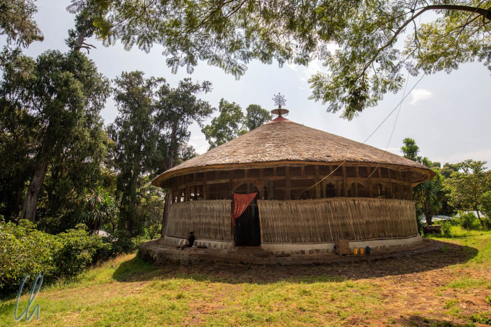
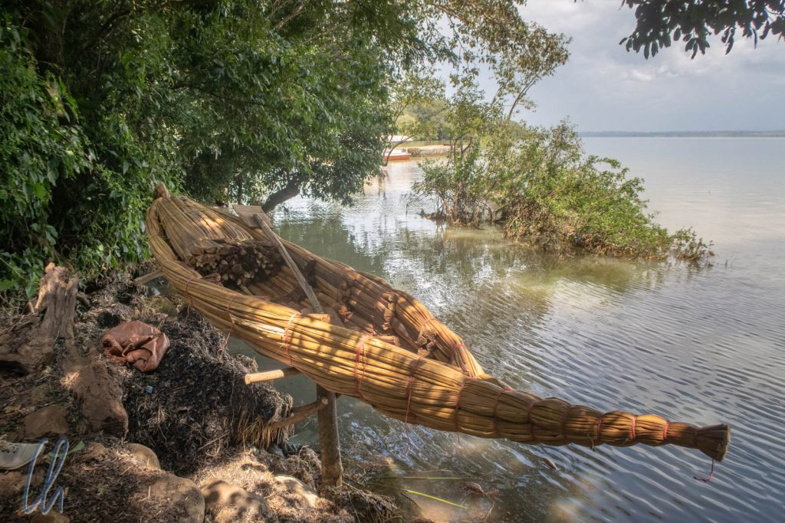
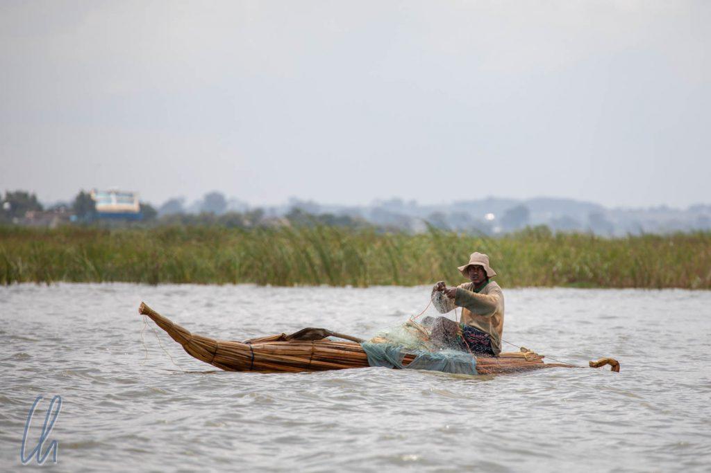
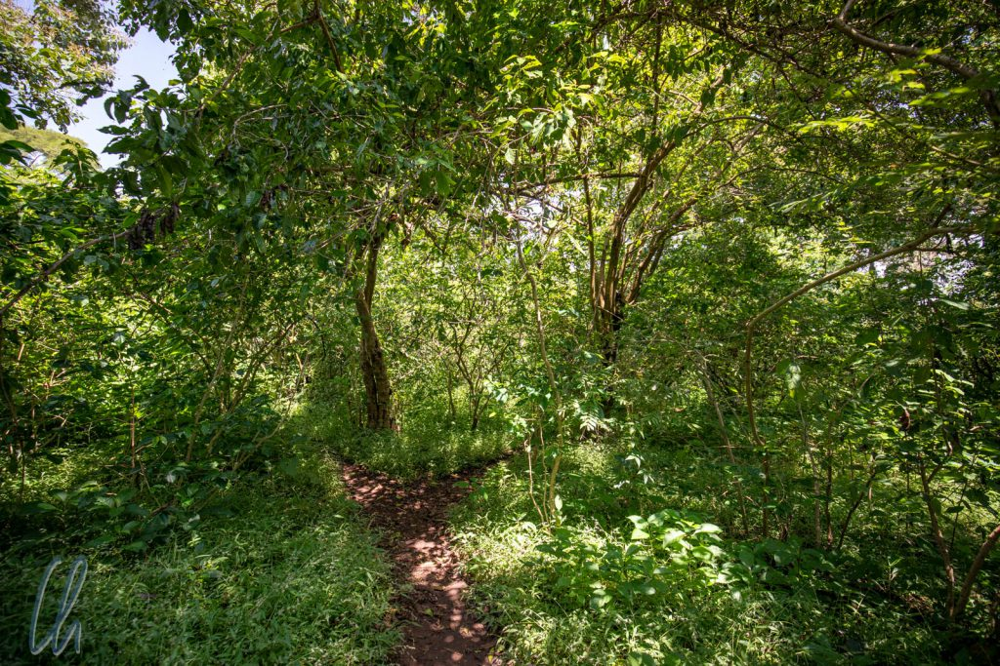

Eines der Motive, um nach Äthiopien zu reisen, war für uns, die christliche Tradition der äthiopisch-orthodoxen Kirche kennenzulernen. Auf der Zeghie [Halbinsel](https://en.wikipedia.org/wiki/Zege_Peninsula) besuchten wir zwei uralte Klöster und lernten Vieles über die für uns ungewöhnlichen Legenden und die unbekannten Heiligen, die diese religiöse Glaubensrichtung prägen. Damit auch die weltlichen Genüsse nicht zu kurz kämen, nahmen wir an einer äthiopischen Kaffeezeremonie teil.

<!--more-->

## Maria und Jesus am Tanasee

Im [vorherigen Artikel](http://wittmann-tours.de/bahir-dar-und-die-wasserfaelle-des-blauen-nil) haben wir den Tanasee mehr aus naturwissenschaftlich-wirtschaftlicher Sicht beschrieben. Der riesige See, der früher angeblich für ein Meer gehalten worden war ("[Bahir](https://translate.google.com/#view=home&op=translate&sl=am&tl=de&text=%E1%89%A3%E1%88%95%E1%88%AD)" bedeutet "Meer"), spielt in den christlichen Legenden der Äthiopier eine große Rolle. Kein geringerer als Jesus hat demnach den Tanasee besucht. Von diesem Ereignis sind zwei Varianten überliefert.

Wie in der Bibel beschrieben ([Mt 2, 13-15](https://www.die-bibel.de/bibelstelle/Mt2,13-15/EUE/)) flohen Maria und Josef mit dem Jesuskind nach Ägypten, um den Kindesmorden des König Herodes in Bethlehem zu entgehen. Auf dieser Reise soll die Heilige Familie nach äthiopisch-orthodoxer Überlieferung, wegen der großen Entfernung von einer silbernen Wolke getragen, auch am [Tanasee Halt gemacht](https://books.google.de/books?id=PAL31DP658MC&pg=PA24&lpg=PA24&dq=Maria+Jesus+Tanasee&source=bl&ots=e6RtOX7gOB&sig=ACfU3U3n7euXe9vzDJl50Q1xGjfL5u5VZA&hl=de&sa=X&ved=2ahUKEwiRqNrgvKHnAhXMyqQKHXrcBioQ6AEwD3oECAcQAQ#v=onepage&q=Maria%20Jesus%20Tanasee&f=false) haben. Maria selbst habe die Orte markiert, an denen später die Klöster gegründet werden sollten.

Die Geschichte wurde uns auch so erzählt, dass Jesus und Maria auf dem Heimweg aus dem Exil in Ägypten auf ihrer Wolke zum Tanasee geflogen seien. Dort hätten sie die Klöster (, die es eigentlich zu dieser Zeit noch nicht gab (Anmerkung der Redaktion),) für einige Tage besucht und wären dann nach Jerusalem weitergereist. Gleichgültig welche Variante nun die richtige ist und ob es eine richtige wirklich gibt, diese Begebenheit soll dem Tanasee seinen Namen gegeben haben. "Tsana" soll früher in etwa so viel bedeutet haben wie "auf den Wolken schweben".

Wir haben versucht, die uns mündlich erzählten Legenden im Internet wiederzufinden, jedoch selten mit Erfolg. Über diese Geschichten, die für die Identität der Äthiopier sehr wichtig sind, erbringt die Suche im World Wide Web selten auf Anhieb Brauchbares. Und wenn man auf etwas stößt, ist es häufig vage oder widersprüchlich. Daher bitten wir darum, unsere laienhaften Ausführungen nicht überzubewerten. Es handelt sich lediglich um die Erfahrungsberichte zweier Reisender, die versucht haben, ihre Erlebnisse einigermaßen schlüssig festzuhalten.

## Unterwegs auf dem Tanasee

Der am häufigsten vertretene Typ von Wasserfahrzeugen auf dem Tanasee könnte in der Tat aus biblischen Zeiten stammen. Es handelt sich dabei um sog. [Tankwas](https://en.wikipedia.org/wiki/Tankwa), kleine traditionelle Boote aus Papyrus. Alle Fischer, denen wir auf dem See begegneten, nutzten diese schwimmenden Untersätze, die wie historische Einmannkajaks aussahen. Wir jedoch stiegen für die Fahrt zur Zeghie Halbinsel nicht in solch eine fragil wirkende Nußschale, sondern in ein Motorboot aus Metall ;). So stachen wir zusammen mit unserem Guide Mass und Bootsführer Bramu von Bahir Dar aus in See und erreichten die bis zu ihren Ufern bewaldete Halbinsel nach gut einer halben Stunde.

Die Wege auf der Insel waren meist gerade breit genug für eine Person und überall wucherte üppige Vegetation. Scheinbar waren wir nur von Wald umgeben, aber das [Satellitenbild](https://www.google.de/maps/place/Zege+Peninsula/@11.6997256,37.3406102,3026m/data=!3m1!1e3!4m5!3m4!1s0x1644cb0f3d65e3cf:0x680bbb08c3c87185!8m2!3d11.7!4d37.3333333) offenbart überall kleine Häuser. Statt die Bäume zu roden, nutzten die Menschen ihren Schatten für den Anbau von Kaffee, den wir später auch kosten durften. Zunächst aber besuchten wir das Kloster Azua Mariam. Im Anschluss statteten wir dem Kloster Azoa Mariam eine Visite ab, das in seiner Bauweise und Ausgestaltung der ersten besuchten Kirche ähnelte.

(Fußnote: Der Name des ersten Klosters "Azua Mariam" ist die Transkription, wie sie unser Reiseveranstalter gewählt hatte. Selbst sonst zuverlässige Quellen im Internet verwenden verschiedene Schreibweisen. Wir fanden auch "Asua Mariam Monastery" ([OpenStreetmap](https://www.openstreetmap.org/?mlat=11.704191933333&mlon=37.3556025&zoom=15#map=19/11.70428/37.35541)), "Mehal Zege Betre Mariam" ([Google Maps](https://www.google.com/maps/place/Mehal+Zege+Betre+Mariam/@11.7043309,37.3545662,655m/data=!3m2!1e3!4b1!4m5!3m4!1s0x1644cb9bfb061e2b:0xb8e8972b0d6c8664!8m2!3d11.7043309!4d37.3553639?hl=de)) oder "Azuwa Maryam" ([Wikipedia](https://en.wikipedia.org/wiki/Zege_Peninsula#Azuwa_Maryam)). Allein die verschiedenen Bezeichnungen verdeutlichen, wie schwierig es ist, in diesen Kosmos einzutauchen.)

## Die Klöster auf der Zeghie Halbinsel

Die Klöster bzw. Klosterkirchen auf der Halbinsel waren keine ehrfurchtgebietende Gebäude, wie wir sie uns typischerweise vorstellen. Auch unterschieden sie sich grundlegend von den Sakralbauten, die wir bisher auf der Weltreise gesehen hatten. Aus dem Schatten des Waldes traten wir auf eine sonnige Lichtung und standen vor einem einfachen Gebäude aus Lehm und Holz. Die runde Form des Grundrisses soll für die Vollkommenheit Gottes stehen. Auf der Spitze des strohgedeckten Daches befand sich ein 7-armiges Kreuz mit sieben Straußeneiern. Sie symbolisieren die am Tanasee verehrten sieben Heiligen und die sieben Tage der Schöpfung.

Die Außenwände des Klosters bestanden aus einer luftigen Einfriedung aus Bambusgeflecht. Diese begrenzten eine Art runden, halb offenen Wandelgang um die Kirche. Von dort aus gelangte man durch große, schwere Holztore in den zweiten Bereich, der seinerseits in 4 Viertel eingeteilt ist. Eines davon ist den Priestern (durch den Haupteingang im Osten), das rechts davon (im Süden) den Frauen, das links (im Norden) den Männern und das auf der gegenüberliegenden Seite (Westen) den Mönchen vorbehalten.

Das dritte, innerste quadratische Areal ("Holy of Holies") in der Mitte der Kirche war geschlossen und wird nur zu den Gottesdiensten geöffnet. Betreten dürfen es nur die Priester. Die Außenwände des innersten Bereiches waren über und über mit verschiedenen Motiven in kräftigen Farben aus biblischem Kontext bemalt. In der Sektion der Frauen waren Szenen aus dem Leben der Jungfrau Maria dargestellt, bei den Männern die äthiopischen Heiligen, bei den Priestern das Leben Jesu und bei dem Mönchen die Wunder Christi.

## Legenden und Ikonen

Viele Motive konnten wir nicht zuordnen. Mass erzählte uns einige Legenden aus dem Kanon der äthiopisch-orthodoxen Kirche, zum Beispiel die Geschichte von Belai dem Kannibalen (in verschiedenen Varianten [hier](https://books.google.de/books?id=mLC7CgAAQBAJ&pg=PA27&lpg=PA27&dq=ethiopia+cannibalism+saint&source=bl&ots=ZDW3us1H8z&sig=ACfU3U3PrN1h2guEv3RvGw9mPTYo5miV_w&hl=de&sa=X&ved=2ahUKEwja7uP916HnAhWD-6QKHfAGBUk4ChDoATABegQICRAB#v=onepage&q=ethiopia%20cannibalism%20saint&f=false) und [hier](http://www.morrisgraham.com/humanitarian-leadership-and-embracing-the-unknown-reflections-on-a-field-trip-to-ethiopia/)). Belai hatte 77 Menschen verspeist, wurde aber trotzdem von der Jungfrau Maria vor der Hölle gerettet. Er hatte zu Lebzeiten einem Leprakranken etwas Wasser gereicht und diese edle Tat öffnete ihm trotz seiner schweren Sünden das Tor zum Paradies.

Ein immer wiederkehrendes Motiv war ein Heiliger, der auf einem Löwen reitet. Erst nahmen wir an, dass es sich um den [Löwen Judas](https://de.wikipedia.org/wiki/Löwe_Judas#Der_Löwe_von_Juda_in_der_äthiopischen_Tradition) handeln würde. Diese Raubkatze, die auch im Wappen Äthiopiens abgebildet ist, müsste jedoch gekrönt dargestellt werden. Die Theorie, der Löwenreiter sei einer der in der äthiopisch-orthodoxen Kirche verehrten [Neun Heiligen](https://en.wikipedia.org/wiki/Nine_Saints), ist ebenfalls unhaltbar. Schaut man aber genauer hin, so sind die Bilder beschriftet und damit kann es sich nur um den heiligen [Samuel von Waldebba](https://en.wikipedia.org/wiki/Samuel_of_Waldebba) handeln. Die wunderliche Geschichte dieses Heiligen findet Ihr hier: <http://www.aethiopisch-orthodoxe-kirche-deutschland.de/Samuel-von-Waldeba.html>.

Unweit der Klosterkirchen befanden sich die einfachen Unterkünfte der Mönche. Wir kamen an einer Gruppe von Mönchen vorbei, die in repetitiver Weise aus einem geistlichen Buch rezitierten, das in der altäthiopischen Sprache [Ge´ez](https://de.wikipedia.org/wiki/%C3%84thiopische_Schrift) verfasst war. Damit erinnerte diese Form des Gebetes ein wenig an das meditative Wiederholen von Mantras in asiatischen Religionen.

## Kaffeezeremonie

Nach dem Besuch der Klöster als kulturellem Programm wendeten wir uns dem Kaffee als Erfrischung des Körpers zu. Kaffee oder "[Buna](https://translate.google.com/#view=home&op=translate&sl=am&tl=de&text=%E1%89%A1%E1%8A%93)", wie er auf Amharisch genannt wird, kommt ursprünglich aus Äthiopien und wurde dort auch zum ersten Mal in der Menschheitsgeschichte kultiviert. Wann genau dies geschah, ist unklar. Kaffee ist im Gegensatz zu vielen anderen Nutzpflanzen eine [relativ neue Entdeckung](https://de.wikipedia.org/wiki/Kaffee#Ursprungslegenden,_Entdeckung_und_Etymologie). Auch wenn er in Äthiopien schon früher genutzt wurde, gelangte er erst im 14. Jahrhundert nach Arabien und von dort langsam in die große weite Welt hinaus.

Mass führte uns zu einem kleinen Häuschen, in dem eine Familie schon darauf wartete, mit uns eine verkürzte [Kaffeezeremonie](https://en.wikipedia.org/wiki/Coffee_ceremony) abzuhalten. Die Langvariante hätte mehrere Stunden gedauert und dient dazu, mit Freunden, Familie oder Gästen eine gute Zeit zu verbringen, ein Konzept, das durchaus entfernt an "Kaffee und Kuchen" in Deutschland erinnert ;). Vor Jahrhunderten beschwor man bei Kaffeezeremonien noch Geister, aber dies ist lange vorüber. Trotzdem wird zur Kaffeezeremonie auch heute noch mit Gras dekoriert, was ursprünglich dazu dienen sollte, dass die Geister sich wohlfühlen.

Der Kaffee war schon vorbereitet und die Herrin des Hauses füllte die Tassen in langem, ca. 30cm messendem Strahl aus der [Jabena](https://de.wikipedia.org/wiki/Jabana), einer traditionellen Kaffeekanne. Den Zucker durfte jeder für sich selbst dosieren. Sogar mir als Nicht-Kaffeetrinker schmeckte das schwarze Getränk sehr gut. Die heiße Flüssigkeit hatte ein fruchtiges Aroma, ganz ohne merkbare Bitterstoffe. Vermutlich wurden die Bohnen anders geröstet als in kommerziell verkauftem Kaffee. Zum Kaffeetrinker bin ich dadurch trotzdem nicht geworden.

## Zurück in Bahir Dar

Zurück im Hotel in Bahir Dar vernahmen wir Gesang aus der Nachbarschaft. Für kurze Zeit glaubten wir, den Muezzin zu hören, was bei einem Anteil von 8% Muslimen in der Stadt möglich gewesen wäre. Das Singen hielt allerdings an und klang auch deutlich anders als der muslimische Ruf zum Gebet. Tatsächlich waren die 90% äthiopisch-orthodoxen Christen der Stadt die Adressaten. Den ganzen Abend rezitierte ein Priester Verse und per Lautsprecher schallte es zu seinen Schäfchen. Dies zeigte erneut den Stellenwert der Religion im äthiopischen Alltag.
