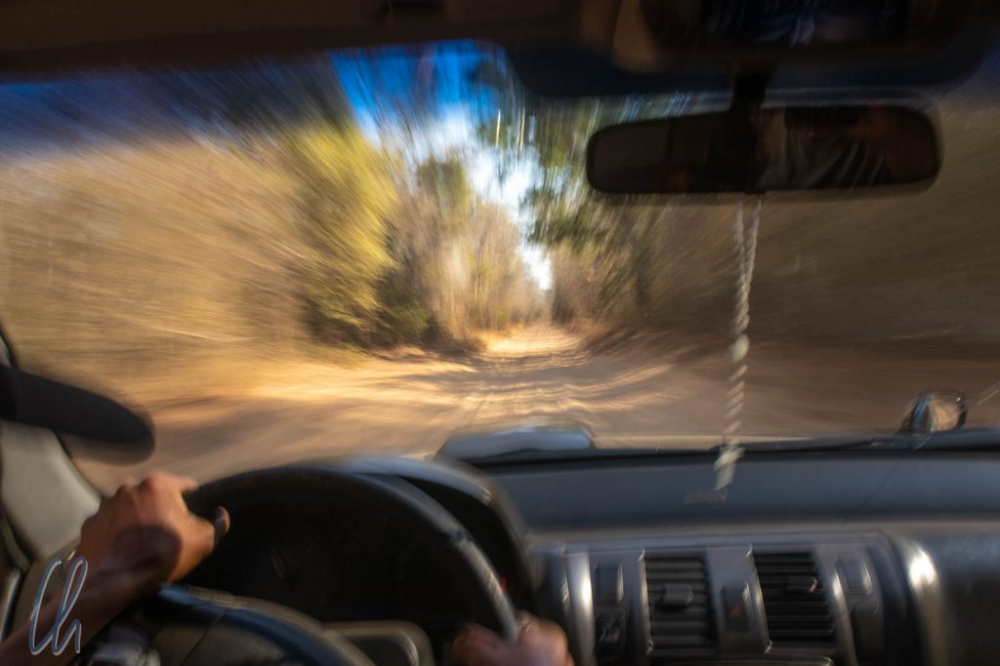
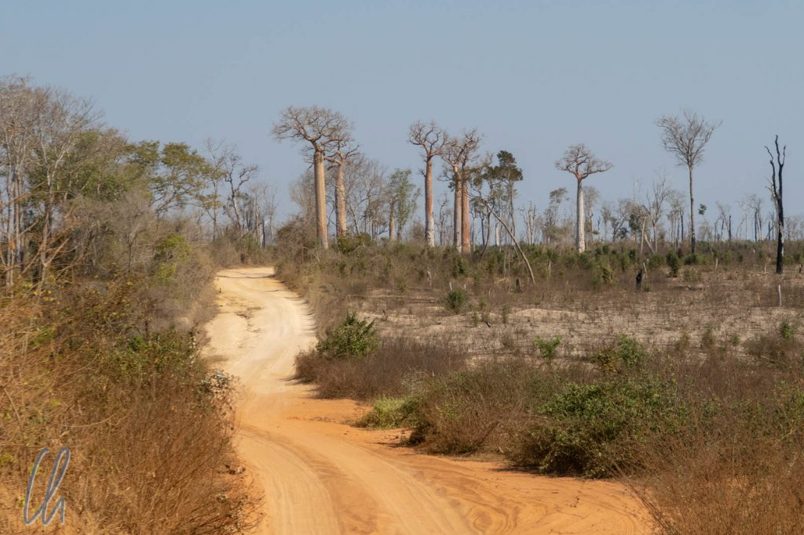
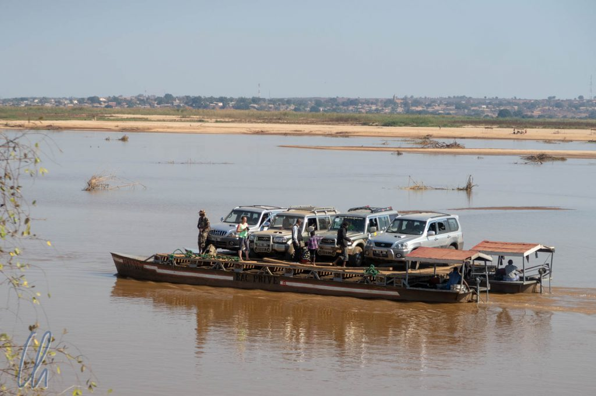

# Die Nationalstraße 8, über Belo nach Bekopaka

Auf dem Weg von Kirindy zu den Tsingys folgten wir der Nationalstraße Nummer 8 für 150km nach Norden. Was sich aufgrund der objektiven Parameter nach einer entspannten Etappe anhört, war in Wirklichkeit ein ganzer Fahrtag auf Sandpiste, mit zwei Flußüberquerungen per Fähre und als Teil einer Polizei-Kolonne. Die Ankündigung "Abenteuer pur" war nicht übertrieben.

<!--more-->

## Sandpiste, erste Episode

Die Kühle der Nacht wich schnell einer trockenen Hitze. Kein Wölkchen trübte den Himmel. Im Auto wurde es auch heiß, die meiste Zeit öffneten wir die Fenster einen Spalt zur Abkühlung. Nur bei Gegenverkehr schlossen wir sie hastig, damit wir keine Breitseite Staub abbekamen.

In der ersten Stunde fuhren wir über eine sandige, wellblechartige und holperige Piste, die Nationalstraße Nummer 8. Wir durchquerten offenes Gelände. Einige Mütter des Waldes, die Baobabs, standen vereinzelt im Buschland. Ein trauriges Bild, wenn man sich vorstellt, das alle Flächen ursprünglich bewaldet gewesen waren. Die ursprüngliche Vegetation war gerodet und abgebrannt worden, um Weideland für die Zebus zu schaffen.

## Mit der Autofähre nach Belo

Von Tsimafana nahmen wir die Fähre nach Belo-sur-Tsiribihina, da es keine Brücke über den breiten Fluss Tsiribihina gab. Die Autofähre in Madagaskar hatte wenig Ähnlichkeit mit den großen Wasserfahrzeugen, die wir beispielsweise vom Bodensee kennen. Die Piste führte direkt bis zum Flussufer, die letzten Meter eine steile Böschung hinunter. Die Fahrspuren endeten direkt im Wasser. Oben an der Böschung gab etwas Fläche, um ein paar Autos zu parken. Dort warteten wir auf die Fähre.

Die Fähre bestand aus zwei etwa 12 Meter langen Booten, die zu einem Gefährt verbunden worden waren. Die aus Holzbohlen konstruierte Plattform bot Platz für 4-6 Geländewagen. Für den Antrieb sorgten zwei ehemalige Traktormotoren. Die Bootsführer und Helfer banden das Wasserfahrzeug mit zwei Seilen an Büschen am Ufer "fest". Anschließend platzierten sie zwei Metallrampen, eine pro Reifen, zwischen Böschung und Ladefläche. Wenn verfügbar verbanden sie zwei Fähren vorübergehend zu einer, um auf der Plattform mehr Platz zum Rangieren zu schaffen.

## Schlaglochfreie Zone

Die Autos fuhren nun nacheinander vorsichtig über die Rampen und rangierten in Millimeterarbeit auf der Ladefläche, bis die Kfz passgenau geparkt waren. Dabei gab die Besatzung lautstarke Anweisungen und die Männer legten Steine oder Holzklötze als Barrieren unter die Reifen, um Kollisionen mit anderen Fahrzeugen zu verhindern oder gar, dass die Wagen von der Plattform abkamen. Auch wenn es über eine Stunde dauerte, bis die Autos verladen waren, sah der Prozess geregelt und souverän aus. Dann wurden noch Waren verladen. Schließlich balancierten die Passagiere über die Rampen an Bord und suchten sich auch ein Plätzchen auf der Fähre.

Auch wir folgten Christian (unserem Fahrer) und unserem Geländewagen auf die schwimmende Holzplattform. Wir nahmen im Schatten eines Autos Platz und ließen die Landschaft, diesmal ganz ohne Schlaglöcher und Staub, an uns vorbeiziehen. Die Motoren knatterten laut, aber ein erfrischender Fahrtwind wehte und blies den schwarzen Dieselqualm fort. Die Fahrt dauerte gut eine halbe Stunde. Am Ufer wurden Zebus getränkt und Wäsche gewaschen und wir winkten den Leuten, die in kleinen Booten auf dem Fluss vorbeipaddelten. Auf der anderen Seite angekommen war das Entladen wesentlich einfacher, da es deutlich mehr Platz gab.

## Die Sicherheitslage

Ab Belo fuhren wir in einem Polizeikonvoi weiter. Hintergrund war, dass es im Juni 2018 bewaffnete [Überfälle](https://lexpress.mg/13/06/2018/insecurite-le-tourisme-alerte-les-hautes-instances/) auf Touristenjeeps gegeben hatte, bei denen nicht nur die Vazahas bestohlen worden waren, sondern auch ein Fahrer den Tod gefunden hatte. Aufgrund dieser Vorfälle hatten wir kurzfristig erwogen, die Reiseroute auf Madagaskar zu ändern. Als Gegenmaßnahme fuhren nun alle Touristen-Fahrzeuge in einem von der Polizei begleiteten Konvoi, um in der Gruppe besser geschützt zu sein und durch die bewaffnete Begleitung gewaltbereite Übeltäter abzuschrecken. Seit Inkrafttreten dieser Maßnahme hatte es keine weiteren Überfälle mehr gegeben, die Lage war offiziell unter Kontrolle und wir beließen die Reiseroute wie ursprünglich geplant.

Sammelpunkt war um 13:45 Uhr am nördlichen Ortsausgang von Belo. Christian wollte pünktlich dort sein, um einen guten Platz in der Kolonne zu bekommen. Im ersten Drittel würden wir nicht so viel Staub schlucken müssen und könnten zügiger fahren. Ungefähr 15 bis 20 Fahrzeuge fanden sich ein, die von der Polizei registriert wurden. Außerdem kassierten die Männer für jeden Wagen eine Gebühr von 5000 Ar (1,25 Euro). Im Laufe der Fahrt fragten wir uns, wie denn nun die tatsächliche Sicherheitslage aussah. Bestand wirklich noch die Gefahr eines Überfalls oder war der Konvoi mittlerweile zu einer angenehmen Einnahmequelle geworden?

## Im Polizeikonvoi

Wie immer in einer solchen Situation versammelten sich viele neugierige Beobachter um die Vazahas, vor allem viele Kinder. Mona versuchte diesmal eine neue Taktik zur Ablenkung der Kinderschar. Sie zeigte den Kleinen Fotos aus unserem madegassischen Tierbestimmungsbuch - mit überwältigendem Erfolg! Süßigkeiten waren vergessen, stattdessen versuchten alle Kinder, einen Blick auf die bunten Bilder zu erhaschen :).

Die Karawane startete pünktlich um 14:00 Uhr. Statt allerdings zu versuchen, zusammen zu bleiben, fuhren alle Fahrzeuge anscheinend so schnell wie es nur ging. Jeder Fahrer versuchte, alles aus dem Geländewagen und der Piste herauszuholen. Das Feld zog sich also in die Länge, auch weil jedes Auto auf den meisten Abschnitten eine beachtliche Staubfahne hinter sich herzog. Nach kurzer Zeit hatten wir den Eindruck, alleine unterwegs zu sein. Weit und breit war kein anderes Fahrzeug mehr zu sehen, allerdings wäre im Ernstfall trotzdem relativ schnell das nächste Auto hinter uns aufgetaucht.

## 100 Kilometer Piste in 4 Stunden

Die Nationalstraße Nummer 8 war die meiste Zeit einspurig und mit Schlaglöchern in allen Größen und Formen garniert. Andere Abschnitte der Piste hatten eine ausgeprägte [wellblechartige Oberfläche](https://de.wikipedia.org/wiki/Wellblechpiste) entwickelt, die man auf Madagaskar treffenderweise als Kuhrippen bezeichnet ;). Wenn man darüber fährt, rappelt und vibriert das gesamte Fahrzeug. Wirklich schnell waren wir wegen des Zustandes der Straße selten unterwegs. Immer wieder bremste Christian, um das Auto besser kontrollieren zu können. Dennoch fühlte es sich an, als ob wir mit Karacho bei der Rallye Paris-Dakar dabei wären! Die tatsächliche Geschwindigkeit war allerdings eher bescheiden. Bei aller dynamischen Fahrweise schaffte Christian trotzdem einen erstaunlich guten Kompromiss aus Schnelligkeit und Komfort, Massage inklusive ;).

Durch das ständige Ruckeln, Schaukeln und Holpern blockierten die Sicherheitsgurte und hielten uns in den Sitzen fest. Mit der Zeit wurden die Gurte immer kürzer, ließen sich aber nicht mehr herausziehen. Um wieder mehr Freiheit zu erlangen, war viel Geduld und Fingerspitzengefühl notwendig. Auch wenn unsere Körper im Sitz nahezu gefesselt waren, bewahrte uns das nicht davor, mit unseren schwankenden Köpfen das eine oder andere Mal kräftig gegen die Seitenscheiben zu klatschen. Autsch!

## Nationalstraße Nummer 8: Langsam und holperig

Was wohl passieren würde, wenn ein Auto eine Panne hätte, fragten wir uns. Als ob wir es heraufbeschworen hätten, ging kurze Zeit später der Motor unseres Wagens in voller Fahrt über ein heftiges Wellblech einfach und ohne Vorwarnung aus. Christian sprang aus dem Auto, öffnete die Motorhaube, führte ein paar Handgriffe aus und... Fertig! Das Kfz sprang wieder an, bevor ein anderer Geländewagen hinter uns auffuhr. Christian hatte sein Fahrzeug wirklich in jeder Hinsicht im Griff.

Nach etwa Dreiviertel des Weges gab es einen Sammelpunkt, damit die hinteren Fahrzeuge der Kolonne aufschließen und bedürftige Fahrgäste eine Pause zur Erleichterung einlegen konnten. Auf der letzten Etappe setzte die Dämmerung ein, bei Sonnenuntergang erreichten wir kurz vor unserem Ziel den zweiten Fluss. Das Verladen ging diesmal deutlich schneller, da die Autos direkt vom Strand durch das Wasser auf die Rampen fahren konnten und es zwei Fähren gab. Außerdem dauerte das Übersetzen nur wenige Minuten. Wir waren an unserem Ziel im Ort Bekopaka angekommen.

## Angekommen in Bekopaka

Ein langer und aufregender Fahrtag lag hinter uns, vielleicht der abenteuerlichste der ganzen Weltreise. Effektiv hatten wir eine Durchschnittsgeschwindigkeit von 15km/h erreicht. Zum Spaß versuchte ich, die Route beim Schreiben dieses Artikels mit GoogleMaps zu planen, was nicht gelang. GoogleMaps kannte nicht alle Abschnitte der madegassischen Nationalstraße Nummer 8 und auch die Fähren sind (noch) nicht eingezeichnet. Wieso bloß? Dafür lieferte [OpenStreetMap](https://www.openstreetmap.org/directions?engine=fossgis_osrm_car&route=-20.06728%2C44.59703%3B-19.14000%2C44.79659#map=11/-19.3400/44.8098) mit einer prognostizierten Zeit von über 11 Stunden ein erstaunlich akkurates Ergebnis.

Nicht nur wir waren an diesem Abend alle mürbe und durchgeschüttelt, auch das Auto hatte auf der Fahrt gelitten. Eine Plastikverkleidung am linken Radkasten hatte sich gelöst und die Klappe des Kofferraums schloss nicht mehr richtig, sie stand immer einen Spaltbreit offen. Unser Fahrer Christian hatte sie mit einer Kordel zugebunden, das Beladen ging damit nur über die umgeklappte Rücksitzbank.

Am Ende war ausnahmslos alles eingestaubt, das Auto von innen und außen, unser Gepäck und wir selbst, alles hatte eine dekorative rötliche Staubschicht angesetzt. Es war ein echtes Abenteuer. Und da ein kurzes Video manchmal mehr sagt als ein langer Artikel, hier zum Abschluss die Fahrt auf 2 Minuten komprimiert:

https://www.youtube.com/watch?v=Gc5eUg7Noc4
