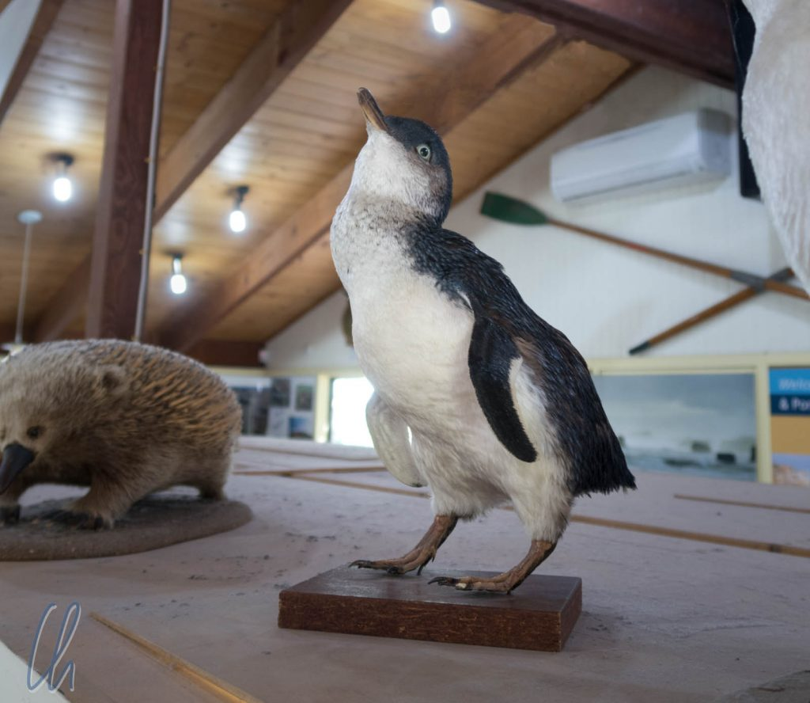

Im Süden Australiens leben verschiedene Arten von Pinguinen. Unter anderem in Port Campbell und Warrnambool sind die kleinsten der Welt heimisch, die [Zwergpinguine](https://de.wikipedia.org/wiki/Zwergpinguin). Vor Ort werden sie als "little penguins" bezeichnet bzw. "fairy penguins". Leider haben eingeschleppte Raubtiere, allen voran die Füchse, den Beständen stark zugesetzt. Trotzdem konnten wir sie an einem Abend beobachten, als sie an Land kamen. (Tagsüber verbringen sie ihre Zeit auf dem offenen Meer). Außerdem lernten wir eine erstaunlich einfache Strategie kennen, wie die Pinguine vor Feinden beschützt werden können.

<!--more-->

## Pinguine am Fuße der 12 Apostel

Am Fuße der berühmten [12 Apostel](<https://de.wikipedia.org/wiki/Twelve_Apostles_(Australien)>) (so wird eine Gruppe von Felsformationen genannt, die aus dem Pazifik ragen) kommen jeden Abend die Pinguine der dort ansässigen Kolonie an Land. Das Schauspiel beginnt ca. 20 Minuten nach Sonnenuntergang. Die Pinguinbeobachtung lässt sich also bestens mit dem Sonnenuntergang an den 12 Aposteln kombinieren. Leider bescherte uns das Wetter an diesem Abend ein frisches Wolkenband. Daher war der Sonnenuntergang leider nicht so spektakulär wie gewünscht und die Dunkelheit kam schneller als gedacht.

Bei schwindendem Licht tauchte in der Tat gut 30 Minuten nach Sonnenuntergang ein schwarzes Pünktchen in den Wellen auf. Für einige Minuten ließ sich Pinguin Nummer eins immer wieder von den Wogen überspülen und in der Brandung treiben, fast als ob er großen Spaß daran hätte. Dann tauchten später Pinguine 2 und 3 auf. Als sie sich sicher genug fühlten, watschelten sie zu dritt über den Strand in eine mit Sträuchern bewachsene Zone.

Ungefähr 10 Minuten später folgte eine Gesellschaft von vielleicht 20 bis 30 Pinguinen, die gemeinsam zielstrebig den Strand bis zur Vegetationszone überquerte. Dort standen sie wie eine formelle Abordnung in ihrer eleganten Abendgarderobe herum. Kurze Zeit später kam eine weitere Gruppe aus dem Wasser und dann war es endgültig zu dunkel geworden. Obwohl wir ein gutes Fernglas dabei hatten (kann man sich kostenlos bei der Tourist-Info in Port Campbell ausleihen) verschwammen die Konturen immer mehr. Die Nacht legte ihren Mantel aus Dunkelheit über Vögel, Felsen und Strand.

## Pinguine beschützen leicht gemacht

Von Menschen in Australien ausgewilderte Tiere stellen massive Probleme für das Ökosystem des Kontinents dar. Im Outback sind es [Kamele](https://de.wikipedia.org/wiki/Kamele_in_Australien#Heutige_Situation), Wildscheine sind ebenfalls [eine Plage](http://www.environment.nsw.gov.au/pestsweeds/FeralPigFactsheet.htm), und für die Pinguine sind die Füchse ein Feind, den sie nicht kennen und dem sie hilflos ausgeliefert sind. Schwindende Populationen waren die Folge, bis ein Hühnerfarmer auf eine einfache Lösung gekommen ist: Pinguine sind auch nur Hühner im Frack!

https://www.youtube.com/watch?v=hZJwWDmclSk

Hühnerzüchter in Australien setzen italienische [Maremma-Hunde](https://de.wikipedia.org/wiki/Maremmen-Abruzzen-Sch%C3%A4ferhund)​ein, um ihre freilaufenden Hühner (australisch „chooks“) vor Füchsen zu schützen. Diese Art von Hütehunden, die einen natürlichen stark ausgeprägten Beschützer-Instinkt hat, kann dazu verwendet werden, Fressfeinde von Nutztieren fernzuhalten. Sie werden bereits als Welpen mit der Art von Vieh gehalten, die sie später als ihre Herde betrachten. So bewachen sie Hühner vor Feinden und es ist gelungen, die Hunde für ihre Mission bei den Pinguinen auszubilden. In den Pinguinkolonien wechseln sich einige Hunde dabei ab, die Pinguine zu beschützen. Das funktioniert schon so lange, dass die erste Hundegeneration in Rente geht und Nachwuchs ausgebildet wird.

Über diese geniale Idee ist sogar ein Film gedreht worden: „Oddball“ bietet viel Spannung und leichte, unkomplizierte Unterhaltung und mit absehbarem Happy End!

https://www.youtube.com/watch?v=P7AV2ZYlxvI
