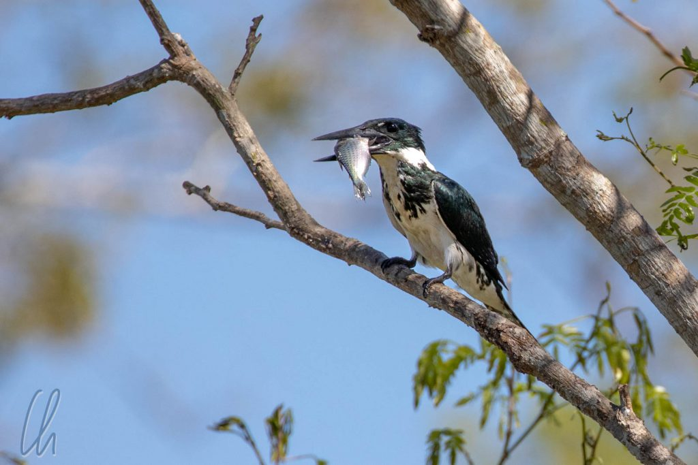
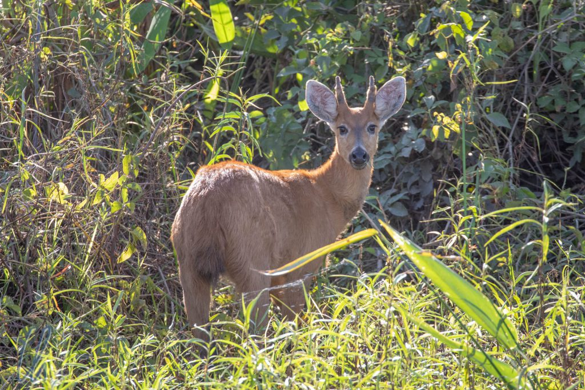

# Die reiche Tierwelt des Pantanal

Unsere Tage im Pantanal waren unbeschreiblich aufregend. Wir beobachteten neben den Jaguaren auch viele andere Tiere, die wir im [ersten Teil](http://wittmann-tours.de/das-pantanal-im-reich-der-jaguare) sträflich vernachlässigt haben. Über diese wollen wir im Folgenden berichten. Dabei begegneten uns nicht nur Vögel, sondern auch viele Säugetiere, die wir fleißig zählten - und auch diesmal waren erstaunlicherweise Katzen dabei!

<!--more-->

## Auf Safari im Pantanal

Nachdem wir das Jaguar Camp verlassen hatten, fuhren wir wieder Richtung Norden. Wir verbrachten drei weitere Nächte in zwei verschiedenen Lodges, die gleichzeitig als Farm genutzt wurden, um das Pantanal aus einer anderen, landbasierten Perspektive kennenzulernen. Dort waren wir ein wenig zu Fuß unterwegs, fuhren aber auch viel mit einem umgebauten kleinen Lkw. Hinten auf der Ladefläche waren Bänke montiert, so dass wir in einem offenem Safari-Fahrzeug saßen, wie man sie aus Afrika kennt. Entlang der Transpantaneira half die erhöhte Sitzposition sehr, da häufig rechts und links der Straße dichtes Gebüsch wuchs, das die Sicht aus einem normalen Auto versperrt hätte.

Die erste Ausfahrt fand nachts statt und sie begann gleich mit einem Paukenschlag! Nachdem wir so viele Jaguare gesehen hatten, glaubten wir, unser Katzenglück erschöpft zu haben. Wir hatten aber nicht mit Marcos Adlerblick gerechnet. Kaum hatten wir die Farm verlassen, sichtete er katzenartige Augen in der Dunkelheit. Ein Ozelot streifte in der Ferne entlang des Zauns. Es waren nur wenige Sekunden, aber was für ein Erlebnis!

Die vielleicht kurioseste Sichtung dieses Abends war das Nest eines [Orange-backed Troupial](https://en.wikipedia.org/wiki/Orange-backed_troupial). Der Vogel ist etwas kleiner als eine Amsel und hat leuchtend orangefarbenes Gefieder. Nachts schlief er, wie es sich für einen guten Troupial gehört, und hatte sich in seinem Nest zusammengerollt. Hat man so etwas schon mal gesehen?

## Wanderung im Cerrado

Nachdem wir so viel im Boot und im Auto gesessen hatten, freuten wir uns auf eine Wanderung im Trockenwald am nächsten Morgen. Auch dort gab es viele Vögel zu sehen, diesmal allerdings keine Wasservögel, sondern Spechte, Woodcreeper, den inzwischen ausgeschlafenen Orange-backed Troupial und sogar eine Eule. Wir sind keine [Birder](https://en.wikipedia.org/wiki/Birdwatching#Networking_and_organization) geworden, aber die Vielseitigkeit der Vogelwelt faszinierte uns trotzdem ungemein.

Wie viele Tiere man im Pantanal allerdings wirklich gesehen hat, das machte Marcos eher an den Säugetierarten fest. Auch wenn sie nicht bedroht sind, so sind [Schwarzschwanz-Seidenäffchen](https://de.wikipedia.org/wiki/Schwarzschwanz-Seiden%C3%A4ffchen) (Black-tailed marmoset) schwierig zu sichten. Umso erfreuter waren wir, dass uns eine ganze Familie zunächst nicht bemerkte. Hingebungsvoll betrieben sie gegenseitige Fellpflege in den Bäumen.

## Auf der Suche nach dem Ameisenbär

Für die Ausfahrt am Nachmittag und in die Nacht hinein hatte Marcos ein klares Ziel ausgegeben. Er wollte uns einen [großen Ameisenbären](https://de.wikipedia.org/wiki/Gro%C3%9Fer_Ameisenb%C3%A4r) zeigen, eine weitere spektakuläre Säugetierart. Öfter schon hatte er ein Exemplar dieser Gattung weiter nördlich in Richtung Pantanal-Eingang gefunden. Würden wir ihm auch heute begegnen?

Wir fuhren auf der Transpantaneira gen Norden und sahen, wie üblich, viele Vögel: Reiher, Störche, Kormorane, Greifvögel wie den Roadside Hawk oder den Southern Crested Caracara, aber auch Papageien, wie Monk-Parakeets. Außerdem sahen wir Rehe und Pekaris (Wildschweine). Wir hielten an und beobachteten letztere. Es war lustig, der kleinen Gruppe von Schweinen zuzusehen. Wenn sie sich vorwärts bewegten, trabten sie immer im Gänsemarsch, das größte Pekari vorneweg, alle anderen hinterher.

Der Sonnenuntergang nahte und wir hatten Glück. Auf einer großen eingezäunten Weide erspähten wir einen großen Ameisenbären. Er durchstreifte in Seelenruhe die Wiese, seinen Rüssel direkt am Boden auf der Suche nach Abendbrot. Unser Auto war günstig geparkt und er bewegte sich erstaunlicherweise in weiten Schlangenlinien langsam auf uns zu. Als er etwa noch 10 Meter von der Straße entfernt war, wechselte er die Richtung und verschwand allmählich in der Dämmerung.

## Rückfahrt durch die Nacht

Die Sonne war untergegangen und es wurde schnell dunkel und kalt. Es ist immer wieder erstaunlich, dass es auch in der Nacht gelingt, Tiere zu sichten. Der Trick mit der Reflexion des Taschenlampenlichts in den Sehorganen bei Dunkelheit funktioniert überall. Die vielleicht schönsten, leuchtend gelb-grünen Augen hatte ein [Common Potoo](https://de.wikipedia.org/wiki/Urutau-Tagschl%C3%A4fer). Er schien gerade aufgewacht zu sein und je länger wir ihn beobachteten, desto missgelaunter sah er aus. Um ihn nicht gänzlich zu verärgern, fuhren wir zügig weiter ;).

Marcos schien mit den Tieren Termine gemacht zu haben, immer wieder zauberte er Überraschungen aus dem Hut. Auf einmal hielten wir unvermittelt an. Auf unserer rechten Seite, vielleicht 8 Meter entfernt, saß ein Ozelot am Boden neben einem Baum! Es musterte uns, schien aber unbeeindruckt. Für eine Minute saß Felix (so nannten wir ihn später) dort, bevor er mit einem lautlosen Satz in den Baum kletterte.

## Schlechtes Wetter am letzten Tag

Leider schlug das Wetter um, der letzte Tag war bewölkt und kühl. Vor allem nach einer Fahrt bei Nieselregen auf dem offenen Fahrzeug bis zur nächsten Lodge waren wir bei der Ankunft ziemlich durchgefroren. Die Tiere schätzten das kalte, feuchte Klima auch nicht und zogen sich in die Wälder zurück. Marcos motivierte uns trotzdem, im Altiplano-Outfit (sprich mit allen warmen Klamotten, die wir dabei hatten), auf weitere Pirschfahrten zu gehen.

Da die Chancen auf spektakuläre Tierbeobachtungen wegen des Wetters gesunken waren, wechselten wir am letzten Tag vom Lkw aufs Pferd, um die Farm zu erkunden. Abseits der Straßen bekamen wir einen Eindruck davon, wie groß die Farmen im Pantanal sind. Statt wilder Fauna sahen wir diesmal mehr Nutztiere. Weit waren jedoch selbst hier die Räuber nicht entfernt. Wir fanden sogar frische Jaguar-Pfotenabdrücke im Sand.

## Das Pantanal, ein bedrohtes Paradies?

Leider ist aber auch im Pantanal die Welt nicht ganz so in Ordnung, wie es vielleicht scheinen mag. Es gibt vielfältige ökologische Eingriffe des Menschen, die dieses Paradies bedrohen. Die Gefahren resultieren weniger aus der Einflussnahme im Feuchtgebiet selbst, sondern vor allem aus der Umweltverschmutzung außerhalb des Areals.

Wie wir im ersten Teil schon berichteten, befinden sich 95% des Pantanal in Privatbesitz. Die Farmer betreiben im Rahmen der Möglichkeiten Weidewirtschaft, d.h. es wurde Wald gerodet, um Grasflächen für die Rinder zu schaffen. Verglichen mit der gesamten Fläche des Feuchtgebietes betrifft dies aber nur einen kleinen Teil, in dem das Pantanal nicht mehr so bewaldet ist wie in seinem natürlichen Zustand. Dieses Ökosystem hat außerdem ein erstaunliches Gleichgewicht gefunden. Die offenen Flächen bieten vielen Spezies einen Lebensraum. Erstaunlicherweise herrscht dort eine höhere Biodiversität als in Gebieten, die sich dann selbst überlassen und in der Folge von dichtem Buschwerk überwuchert wurden. Dieses Buschland kann nur von wenigen Arten genutzt werden. Wie allerdings die langfristige Entwicklung in solchen Gebieten aussieht, ist nicht bekannt.

Das Pantanal hat sich zum Öko-Tourismus-Ziel entwickelt. Viele Farmbesitzer haben erkannt, dass das Anbieten von Unterkunft und Aktivitäten für Gäste eine lohnenswerte zusätzliche Einnahmequelle darstellt. Nach unserer Wahrnehmung entspricht der Intensitätsgrad der Vermarktung noch dem, was man als Ökotourismus bezeichnen darf. Die Besucherzahlen werden auch dadurch begrenzt, dass in der Regenzeit der größte Teil des Marschlandes nicht oder nur schwierig zu erreichen ist. Das macht den Tourismus zu einem rein saisonalen Geschäft.

## Ökologische Herausforderungen

Es gibt keine Statistiken drüber, wie viele Besucher des Pantanal aus welchen Ländern kommen, aber wir hatten den Eindruck, dass die Ausländer die Mehrheit stellten. Schade eigentlich, dass sich nicht mehr Brasilianer für dieses phänomenale Ökosystem im eigenen Land interessieren, obwohl es eine kaufkräftige Mittel- und Oberschicht gibt, die sich den "Luxus" einer solchen Reise durchaus leisten könnte.

Neben "üblichen" Problemen (soll kein Sarkasmus sein) wie Wasserverschmutzung durch ungeklärte Abwässer der Städte und Bergbau, v.a. Goldminen, die die Umwelt mit Quecksilber belasten, und kommerzieller Überfischung, befindet sich ein Großprojekt in der Planung, das das gesamte Ökosystem des Pantanal zerstören [könnte](https://www.worldwildlife.org/ecoregions/nt0907). Der Rio Paraguay, der natürliche Abfluss des Pantanal, soll vertieft werden, um eine ganzjährige Schiffbarkeit des Flusses zu ermöglichen. Es besteht die Gefahr, dass dieses Mammutprojekt ([Hidrovia](https://es.wikipedia.org/wiki/Hidrov%C3%ADa_Paran%C3%A1-Paraguay)) das Feuchtgebiet quasi trockenlegen würde. Dies könnte dazu führen, dass sich die jährliche Überschwemmung des Pantanal verringern bzw. ganz ausbleiben könnte. Die ganze Region würde sich für immer verändern mit unabsehbaren Folgen für Fauna und Flora.

## Das Pantanal, ein Naturjuwel

Wer außergewöhnliche Tiere in ihrer natürlichen Umgebung beobachten möchte, sollte unbedingt das Pantanal besuchen. Die Tierwelt ist unglaublich. Wir bezeichneten das Marschland manchmal scherzhaft als riesigen Freiluftzoo. Wegen der spektakulären Beobachtungsmöglichkeiten erinnerte uns das Erlebnis ein wenig an Galapagos, auch wenn natürlich die Protagonisten ganz andere sind.

Mit Marcos als Führer, bei dem wir uns auf diesem Wege nochmal herzlich bedanken möchten, hatten wir sehr großes Glück. Er vereinte viele Qualitäten, die ihn unserer Meinung nach zu einem der besten Führer unserer Weltreise machten. Er war studierter Biologe und hatte ein leidenschaftliches Interesse an der Tier- und Pflanzenwelt des Pantanal. Außerdem war Marcos begeisterter Hobby-Fotograf und sprach zudem noch ein sehr gut Englisch. Besucherherz, was willst Du mehr!

Die Begegnung mit den Jaguaren war einer der Höhepunkte unseres Besuches im Pantanal. Die großen Raubkatzen sind jedoch nur ein kleiner Teil dieses faszinierenden Ökosystems - und auch nur eine der 12 Säugetierarten, die wir zu Gesicht bekommen haben: [Tayra](https://de.wikipedia.org/wiki/Tayra), [großer Ameisenbär](https://de.wikipedia.org/wiki/Gro%C3%9Fer_Ameisenb%C3%A4r), [Crab-eating Fox](https://de.wikipedia.org/wiki/Maikong), [Red Brocket Deer](https://de.wikipedia.org/wiki/Gro%C3%9Fmazama), [Marsh Deer](https://de.wikipedia.org/wiki/Sumpfhirsch), [White-collared Peccary](https://de.wikipedia.org/wiki/Halsbandpekari), [Ozelot](https://de.wikipedia.org/wiki/Ozelot), [Capybara](https://de.wikipedia.org/wiki/Capybara), [Black-tailed Marmoset](https://de.wikipedia.org/wiki/Schwarzschwanz-Seidenäffchen), [Tufted Capuchin Monkey](https://de.wikipedia.org/wiki/Gehaubter_Kapuziner), [Paca](https://de.wikipedia.org/wiki/Pakas) und natürlich der [Jaguar](https://de.wikipedia.org/wiki/Jaguar). Die vielen verschiedenen Vogelarten können wir beim besten Willen nicht zählen, aber eins ist sicher: Der Artenreichtum im Pantanal ist enorm.
