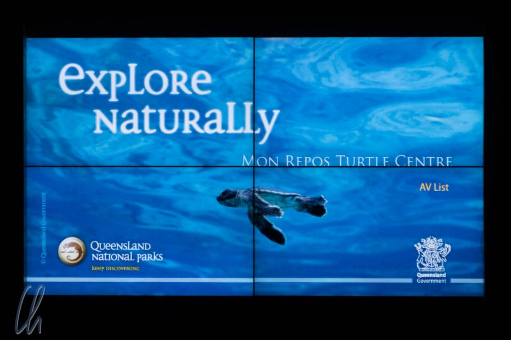
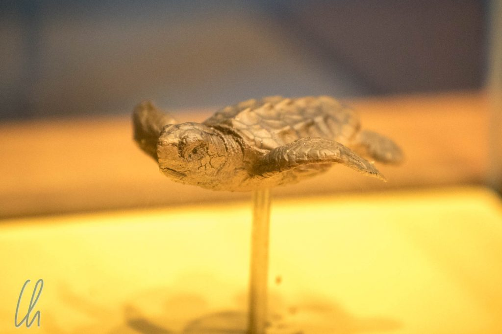
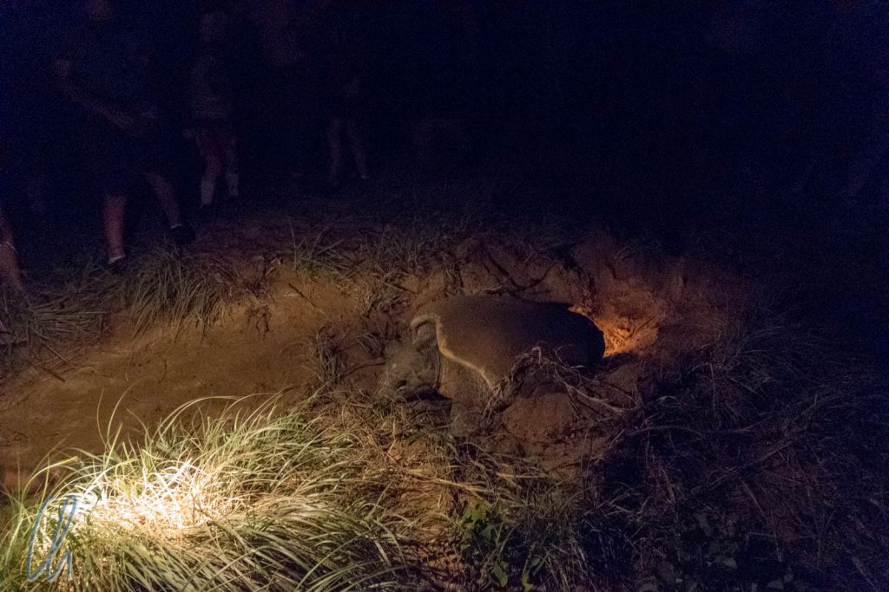
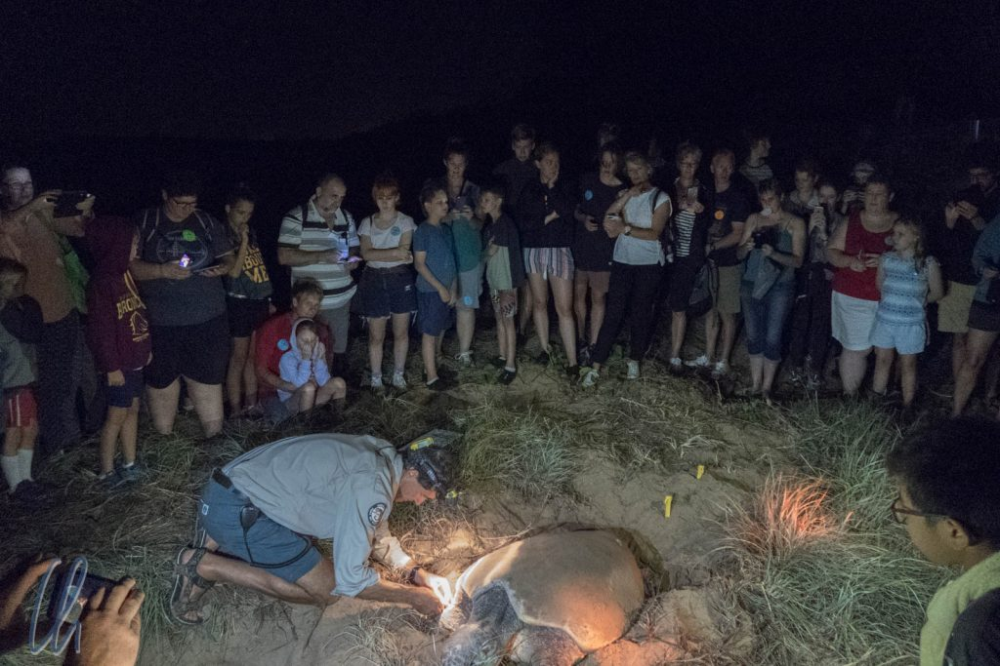

# Die Schildkröten von Mon Repos

Jedes Jahr zwischen November und März herrscht Hochbetrieb am Strand von Mon Repos in der Nähe von Bundaberg. Die Gäste sind keine sonnenhungrigen Touristen, sondern Meeresschildkröten. Sie legen hier ihre Eier ab und 2 Monate später schlüpfen die jungen Schildkröten. Dank eines engagierten Ranger-Teams und vieler freiwilliger Helfer dürfen die Touristen trotzdem kommen und die unechten Karettschildkröten („loggerhead turtles“) beobachten.

<!--more-->

## Schildkröten haben keine Uhren

Die Schildkröten kommen im Schutze der Nacht an Land, um ihre Eier abzulegen. Auch die frisch geschlüpften Jungen nutzen die Dunkelheit, um hoffentlich unentdeckt ins Meer zu gelangen. Damit findet auch das [Turtle Encounter](https://www.npsr.qld.gov.au/parks/mon-repos/turtle-centre.html#mon_repos_turtle_encounters) nachts statt. Um 19 Uhr ist Einlass und die Besucher werden in Gruppen eingeteilt. Diese werden dann zum Strand geführt, sobald Schildkröten ankommen oder schlüpfen.

Wir wurden in Gruppe 5 eingeteilt, wie sich herausstellen sollte die letzte Gruppe. In der Zwischenzeit hatten wir genug Zeit, die Ausstellung im Besucherzentrum zu studieren und die Filme anzuschauen, die über das Leben der Schildkröten, die Forscher und ihre Erkenntnisse berichteten. Außerdem lernten wir, was zum Schutz der Schildkröten schon erreicht wurde, und dass zumindest in Australien der rasante Rückgang der Population gestoppt werden konnte.

Den Tieren drohen viele Gefahren durch den Menschen. Sie können in Schleppnetze geraten und dann unter Wasser ersticken, da sie nicht zum Atmen auftauchen können. Verschmutzung der Meere gefährdet ihre Nahrungsgrundlage. Bebauung und Beleuchtung der Strände stört ihre Orientierungsfähigkeit und zerstört ihre Eiablagegebiete.

https://www.youtube.com/watch?v=RvRgtOERhDo

Auch erfuhren wir, dass die jungen Schildkröten direkt nach ihrer Geburt auf eine 13 Jahre dauernde Reise gehen, bis sie wieder zurück nach Australien kommen - einmal Südamerika und wieder zurück. Erst nach gut 30 Jahren kommen die Weibchen an genau demselben Strand wieder an Land, an dem sie selbst geschlüpft waren. Sie legen ihre Eier ab und starten den Kreislauf erneut. Nur ungefähr eine von 1000 Schildkröten kann diese Mission erfüllen.

https://www.youtube.com/watch?v=MGGEY4_8tLQ

Gegen 21 Uhr wurden schnell nacheinander die ersten beiden Gruppen aufgerufen. Auch Gruppe drei folgt eine halbe Stunde später und Gruppe 4 um 22:15. Kurze Zeit später war der letzte Film aus. Die Schildkröten konnten natürlich nicht wissen, dass wir weit gereist waren, um sie zu sehen - und Uhren haben sie auch nicht, wie die Ranger zu scherzen beliebten. Die einzige Option: Warten.

## Endlich dürfen wir zum Strand

Kurz nach 23 Uhr war es endlich soweit: Als Teil von Gruppe 5 gingen wir zum Strand. Auf dem geteerten Weg durften wir noch Taschenlampen benutzen. Bevor wir jedoch den Strand betraten, musste jedes Licht gelöscht werden, da jegliche Lichtquelle die Schildkröten stören oder irritieren kann. ["Unsere" Schildkröte](https://de.wikipedia.org/wiki/Unechte_Karettschildkr%C3%B6te) war gerade am Strand angekommen und mühte sich aus dem Wasser. Der Ranger führte uns an eine Stelle am Strand, wo wir uns hinsetzen und so tun sollten, als seien wir Felsen.

Die werdende Mutter robbte über den Strand in Richtung Dünen und kam direkt auf uns zu. Um den Weg nicht zu blockieren, teilte sich die Gruppe leise und vorsichtig. Die Leute rückten beiseite, wie gute Felsen es tun, und machten den Weg frei. Trotzdem durften wir uns normal unterhalten und der Ranger erklärte: Schildkröten hören nur tiefere Frequenzen. Da das einzige Licht von den Sternen der Milchstraße stammte, die über uns funkelten, sahen wir nur einen Schatten, der an Land kroch. Gut 20 Meter weiter kam das Weibchen nach einiger Zeit zu Ihrem Ziel und fing an, ein Loch für ihre Eier zu graben. Wir blieben weiter im Dunkeln sitzen, um sie nicht zu stören, bewunderten die Sterne, lauschten dem Meeresrauschen und am Horizont ging langsam der Mond auf.

## Die Eiablage

Wenn eine Schildkröte ihre Grube vollendet hat, stört sie sich immer weniger an ihrem Umfeld. So konnten wir nach einiger Zeit zunächst hinter ihr stehen. Sobald die Eiablage begonnen hatte und 10 Eier abgelegt waren bildeten wir einen Kreis und auch Licht war erlaubt. Die Ranger untersuchten und vermaßen das Reptil. Die Länge ihres Panzers betrug ca. 80 cm, ihr Gewicht wurde auf 80kg geschätzt (Faustformel: 1kg pro cm Panzerlänge). Aufgrund der Blechmarke an einer Flosse stellte sich heraus, dass sie eine alte Bekannte war. Ihr Alter betrug 44 Jahre, 2003 war sie das erste Mal am Strand von Mon Repos gewesen und hatte alle 3 bis 4 Jahre dort Eier gelegt.

Der Ranger reichte ein Ei herum: Sie waren so groß wie Pingpongbälle und fühlen sich auch so ähnlich an. Eine Besucherin fasste den weißen Ball versehentlich etwas fester an und war sehr erschrocken, dass er sich eindellen ließ. Der Ranger zeigte unbeeindruckt, dass sich die Delle im Ei auf Druck auch wieder ausbeulte.

Nachdem sie ihre über 100 Eier abgelegt hatte, begann die Schildkrötenmutter, das Loch wieder zu verschließen, indem sie mit Ihren Flossen den Sand hinter sich schob. Nach gut 20 Minuten war sie mit dem Ergebnis zufrieden und machte sich langsam wieder auf den Weg ins Meer. Kurz vor 1 Uhr morgens verschwand sie in der Brandung.

