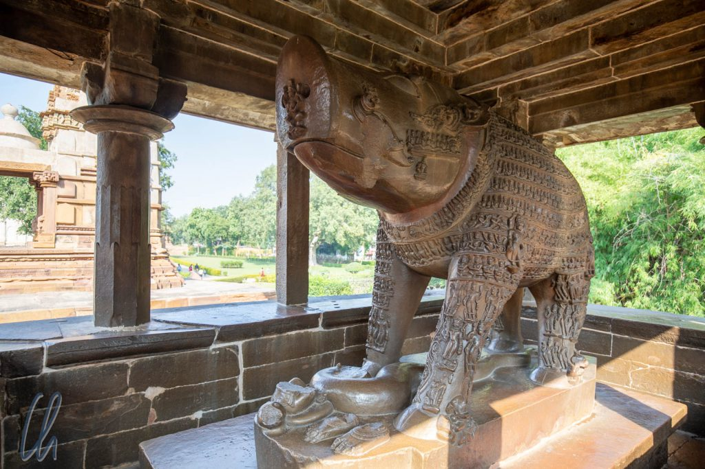

# Die sinnlichen Tempel von Khajuraho

Heutzutage ist Khajuraho eine Kleinstadt mit knapp [25.000 Einwohnern](https://de.wikipedia.org/wiki/Khajuraho). Vor gut 1000 Jahren befand sich in Khajuraho jedoch das kulturelle und religiöse Zentrum der mächtigen [Chandela](https://en.wikipedia.org/wiki/Chandelas_of_Jejakabhukti)-Dynastie. Aufgrund seiner abgelegenen Position geriet der Ort in Vergessenheit und so konnten die bemerkenswerten Tempel mit ihrer filigranen Steinmetzkunst die Jahrhunderte mehr oder weniger unbeschadet überdauern. Bekannt geworden sind die sakralen Bauwerke nicht nur wegen ihrer beeindruckenden Architektur, sondern vor allem wegen der erstaunlich detailreichen erotischen Darstellungen an ihren Wänden. So gehört die ansonsten eher verschlafene Kleinstadt zu den in Indien von Touristen vermehrt frequentierten Sehenswürdigkeiten.

<!--more-->

## Kama Sutra und Tantra

Sinnliche, leicht bekleidete Damen in lasziven Posen und sehr explizite Darstellungen von Geschlechtsverkehr, dafür sind die Tempel von Khajuraho bekannt. Was vordergründig wie ein historischer Porno erscheinen mag, soll nicht obszön wirken, es handelt sich vielmehr um Darstellungen aus der Liebeslehre des [Kama Sutra](https://de.wikipedia.org/wiki/Kamasutra) und bestimmter Strömungen des [Tantra](https://de.wikipedia.org/wiki/Tantra). Die Szenen stellen Schönheit, Liebe und Erotik dar, in der Auffassung, dass es in ihrer Gegenwart keinen Raum für dämonische Kräfte geben kann. Die Darstellungen sollen damit als Schutzschild gegen das Böse dienen.

Bei den leicht bekleideten weiblichen Figuren gilt es, Surasundaris und Apsaras zu unterscheiden. [Surasundaris](https://de.wikipedia.org/wiki/Surasundari) sind schöne Mädchen, die häufig als Begleiter von Männern oder Göttern dargestellt werden, ohne dass sie diese zu beachten scheinen. Sie tanzen alleine oder sind mit sich selbst beschäftigt, indem sie sich zum Beispiel schminken.

[Apsaras](https://de.wikipedia.org/wiki/Apsara) stellen eine eigene Spielart von Surasundaris dar. Sie sind halb menschlich, halb göttlich, Hofdamen am Palast des Gottes Indra, himmlische Tänzerinnen. Die an den Wänden der Tempel von Khajuraho dargestellten Mädchen sind Apsaras, so meinen wir es verstanden zu haben, wenn sie sich neben einem Gott befinden. Gottheiten wiederum erkennt man daran, dass sie mit mehr als zwei Armen abgebildet wurden. Viele steinerne Apsaras hatten wir auch schon in Kambodscha in [Angkor](http://wittmann-tours.de/die-tempel-von-angkor/) gesehen, wo sie ebenfalls ein sehr beliebtes Motiv waren.

## Fahrradtour zu den östlichen Tempeln

Den Höhepunkt in Khajuraho, die Tempelgruppe in der Stadt, wollten wir nicht gleich am ersten Tag besuchen. Stattdessen liehen wir uns zwei Fahrräder aus und erkundeten die Tempel östlich des Stadtzentrums. Endlich konnten wir uns bei den andern Verkehrsteilnehmern revanchieren. Die indischen Fahrräder waren einfach, aber solide gebaut, daher relativ schwer und hatten genau einen Gang. Das Modell wirkte klassisch zeitlos, man hätte sich Mahatma Gandhi auf einem ebensolchen Drahtesel vorstellen können. Das wichtigste Extra war jedoch eine fleischtomatengroße und unüberhörbare Klingel, mit der wir den hupenden Autos Paroli bieten konnten. DING-DONG!

Als erstes besuchten wir den Brahma Tempel. Dabei handelt es sich um einen der ältesten Bauten in Khajuraho und er liegt an einem von Wasserpflanzen bedeckten See außerhalb des Zentrums, schon im ländlichen Idyll. Die Anbetungsstätte demonstriert, wie kompliziert die indische Götterwelt ist: Seinen Namen hat der Tempel fälschlicherweise erhalten. Im Inneren befindet sich ein [Lingam](https://de.wikipedia.org/wiki/Linga) umgeben von vier Gesichtern. Diese stellen ein Erkennungszeichen für [Brahma](https://de.wikipedia.org/wiki/Brahma) dar, den Schöpfer, nach dem der Tempel heute benannt ist. Das Lingam symbolisiert jedoch Shiva und eine Abbildung dieses Gottes der Zerstörung und Erneuerung thront auch über der Eingangstür des kleinen Tempels. Damit ist diese Anbetungsstätte in Wirklichkeit Lord Shiva geweiht.

## Die Jain Tempel

Nicht weit entfernt von unserem ersten Halt besuchten wir eine Gruppe von [Jain](https://de.wikipedia.org/wiki/Jainismus) Tempeln. Auf den ersten Blick unterschieden sie sich wenig von den hinduistischen. Auch diese Gebäude waren mit feinen Steinmetzarbeiten geschmückt, aber die Symbolik und die Inhalte dieser Religion sind trotzdem recht verschieden. Ein wesentlicher Grundsatz des Jainismus ist der absolute Gewaltverzicht, nicht nur im Sinne von körperlichen Übergriffen auf andere Menschen, sondern grundsätzlich gegenüber jeglichen anderen Lebensformen, d.h. auch gegenüber Tieren und Pflanzen. Damit leben Jain konsequenterweise als Vegetarier und können nicht alle Berufe ausüben. Zum Beispiel dürfen sie keine Landwirtschaft betreiben, da sie beim Pflügen eines Ackers Insekten und Würmern Schaden zufügen könnten. Sie würden auch nie einen lästigen Moskito erschlagen.

Als Begründer des Jainismus gilt [Mahavira](https://de.wikipedia.org/wiki/Mahavira), der ungefähr zur gleichen Zeit wie Buddha gelebt haben soll. Mahavira war der letzte [Tirthankara](https://en.wikipedia.org/wiki/Tirthankara), ein spiritueller Lehrer, der den Kreislauf der Wiedergeburten ([Samsara](https://de.wikipedia.org/wiki/Samsara)) durchbrechen konnte und [Moksha](https://de.wikipedia.org/wiki/Moksha), die Erlösung, erreicht hat. Grundgedanken aus dem Buddhismus und Hinduismus finden sich damit auch im Jainismus, der allerdings in seiner Konsequenz fast schon wirklichkeitsfremd erscheint. Die Mönche einer der beiden wesentlichen Strömungen dieser Religion, der [Digambara](https://de.wikipedia.org/wiki/Digambara), kleiden sich zum Beispiel im Luftkleid, da sie jeglichen Besitz ablehnen, d.h. sie leben nackt. So betrachteten wir denn etwas verblüfft die großen Plakate mit der Fotografie eines Digambara-Gurus, die rund um die Tempel hingen. Dieser saß meditierend im Lotussitz und war in der Tat gänzlich unbekleidet.

Im Gegensatz zu den Darstellungen der indischen Gottheiten in den hinduistischen Tempeln befand sich im Heiligtum jeweils die Statue des Tirthankaras, der in dem entsprechenden sakralen Bauwerk verehrt wurde. Auch an den Außenwänden der Jain Tempel stellten sinnliche Apsaras und Surasundaris ihre Reize zur Schau. Am [Parshvanath Tempel](https://en.wikipedia.org/wiki/Parshvanatha_temple,_Khajuraho), findet sich zum Beispiel die berühmte Darstellung einer sehr gelenkigen Surasundari, die sich graziös einen Dorn aus ihrem rechten Fuß zieht.

## Führung bei den Haupt-Tempeln von Khajuraho

Am zweiten Tag besuchten wir die Haupt-Tempelgruppe in Khajuraho, die sich unübersehbar am westlichen Ende der Hauptstraße des kleinen Ortes befindet. Dort stehen elf mit einem überwältigendem Reichtum an Details verzierte Tempel. Was die kunstvollen Steinmetzarbeiten im Einzelnen abbildeten, war nicht immer leicht zu ergründen, da indische Gottheiten sich in den verschiedensten Inkarnationen und Gestalten manifestieren können. So stand zum Beispiel im [Varaha Tempel](https://en.wikipedia.org/wiki/Varaha_Temple,_Khajuraho) die Skulptur eines übermannsgroßen Wildschweines, welches eine Reinkarnation von [Lord Vishnu](https://de.wikipedia.org/wiki/Vishnu), einem der drei Hauptgötter des Hinduismus, darstellt.

Selbst unser Guide Raj machte es uns nicht immer leicht, wenn er in einem Affentempo ohne Punkt und Komma die Skulpturen erklärte. Mit einem Taschenspiegel reflektierte er das Sonnenlicht auf die Figuren, um die zahlreichen Götter, Krieger, (mythologischen) Tiere, Musikanten und natürlich die hübschen Mädchen zu erklären: Look-here-you-can-see-brahma-creator-you-know-we-have-three-main-gods-in-hinduism-brahma-creator-vishnu-preserver-shiva-destroyer-to-the-right-you-can-see-apsara-here-you-can-see-how-she-dance-look-here-for-kama-sutra-how-did-viagra-get-its-name-because-it-came-via-Agra-look-here…

Es gab sehr viel über die Tempel zu erfahren. Zahlreiche Elemente ihres architektonischen Aufbaus leiten sich aus der indischen Mythologie ab. Die Türme der Heiligtümer zum Beispiel symbolisieren den [Berg Meru](<https://de.wikipedia.org/wiki/Meru_(Mythologie)>), den Weltenberg in der Mitte des Universums, Wohnsitz der Götter. Darüber hinaus haben aber auch praktische Überlegungen die Bauweise der Anbetungsstätten beeinflusst. So steht jeder Tempel auf einer hohen Plattform, die ihn in Zeiten des Monsuns vor Überschwemmungen schützt.

## Selbststudium zur Wiederholung

Nach der knapp zweistündigen Führung, die interessant, wenn auch recht anstrengend war, wiederholten wir den Rundgang ohne unseren Guide, um uns die Details in Ruhe noch einmal anzusehen und unser frisch erworbenes Wissen in der Praxis zu festigen ;). Ein Motiv, dem wir häufig begegneten, war [Kirtimukha](https://en.wikipedia.org/wiki/Kirtimukha) ("das glorreiche Gesicht"), das entfernt an die [Grinsekatze](https://de.wikipedia.org/wiki/Cheshire_Cat) aus "Alice im Wunderland" erinnerte. Die Legende besagt, dass das löwenartige Ungeheuer Kirtimukha im Zorn Shivas drittem Auge entsprang. Um den unermesslichen Hunger des fürchterlichen Dämons zu stillen, befahl Shiva ihm, sich selbst, beginnend mit dem Schwanz, zu fressen. Dies tat der unersättliche Kirtimukha. Daher blieb letztendlich nur der Kopf des Monsters verschont. Lord Shiva, zufrieden mit dieser Demonstration seiner Macht, befahl dem schrecklichen Ungeheuer, Tempelbauten zu bewachen und vor Unheil zu bewahren.

Nach der Turbo-Einweisung durch Raj konnten wir sogar die Skulpturen einiger Gottheiten erkennen. Hilfreich fanden wir auch diese verständliche Übersicht, die allerdings nur die wichtigsten Vertreter des hinduistischen Pantheons aufführt: <http://www.worldhistorycharts.com/wp-content/uploads/2014/10/hindu-gods.png>. Sehr einfach für uns zu erkennen war Ganesh mit seinem Elefantenkopf. In profanen Szenen waren aber auch normale Arbeitselefanten an den Gebäuden abgebildet, wobei leider häufig die Rüssel im Laufe der Zeit angegriffen oder abgebrochen waren.

## Noch mehr Tempel in der Umgebung

Am dritten Tag in Khajuraho unternehmen wir erneut eine Fahrradtour. Diesmal fuhren wir weiter nach Süden, auf schmalen Straßen zwischen den Feldern der Bauern hindurch, wo sich weitere Tempel befanden. Unterwegs genossen wir die ländliche Umgebung, durften im Vorbeifahren einen Blick auf das alltägliche Leben der Menschen und ihrer Nutztiere werfen, überquerten einen kleinen Fluss. Die sakralen Gebäude waren nicht so spektakulär wie die der Hauptgruppe, dafür wirkte die Atmosphäre viel gelassener. An den Anbetungsstätten begegneten wir nur ein paar Gruppen indischer Besucher. In diesen Tempeln erlebten wir, dass die Heiligtümer von den Hindus weiterhin als aktive Orte der Verehrung angesehen werden. Manche Gläubige sprachen Gebete, andere besprengten die Statuen der Gottheiten mit Rosenwasser oder legen Blumen als Opfergaben ab.

Erstaunlich war für uns, wie viele Inder in ein Tuktuk passen. Bei einer Gelegenheit beobachteten wir gebannt, wie sich eine Großfamilie mit mindestens 10 bis 12 Erwachsenen aus zwei Tuktuks schälte. Die Reihe der aussteigenden Passagiere schien gar kein Ende nehmen zu wollen. Wir waren sehr beeindruckt, hätten unsere Fahrräder aber nicht eintauschen wollen.

Auch diese Tempel außerhalb der Hauptgruppe mit ihren meisterhaften Steinmetzarbeiten waren sehr sehenswert. Es fiel schwer zu glauben, dass diese detailreichen und so lebendig wirkenden Skulpturen schon um die 1000 Jahre alt sein sollen und dass sie die Jahrhunderte vergleichsweise unbeschadet überdauert haben. Auch wenn wir aufgrund unseres westlichen kulturellen Hintergrundes sicher nicht die Bedeutung jedes Details einordnen konnten, so steht die ästhetische Schönheit der Tempel außer Frage.
