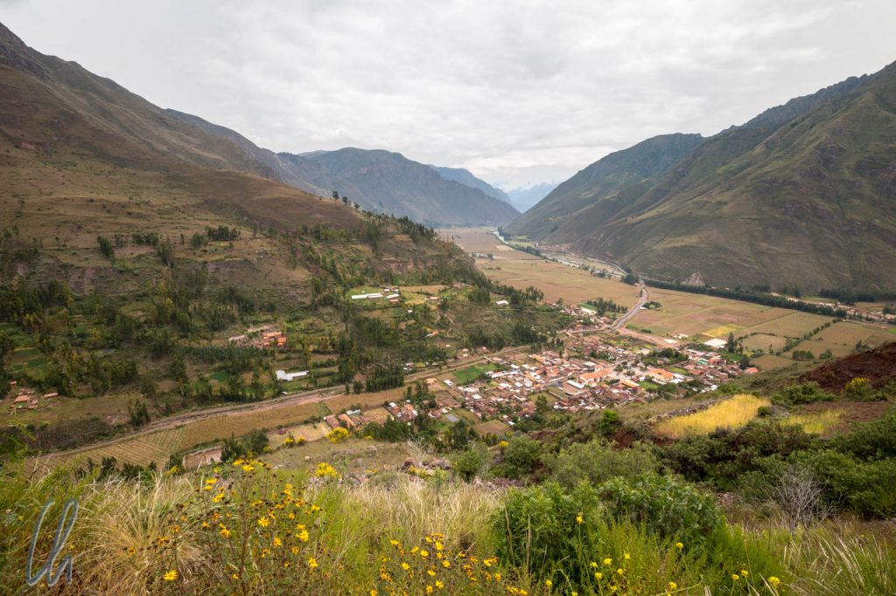
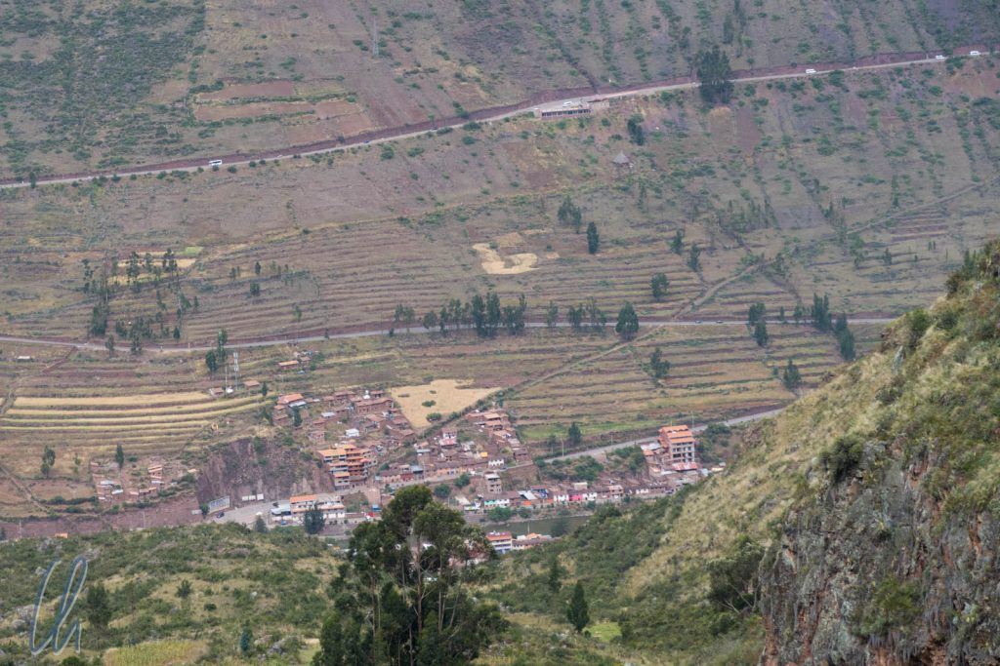
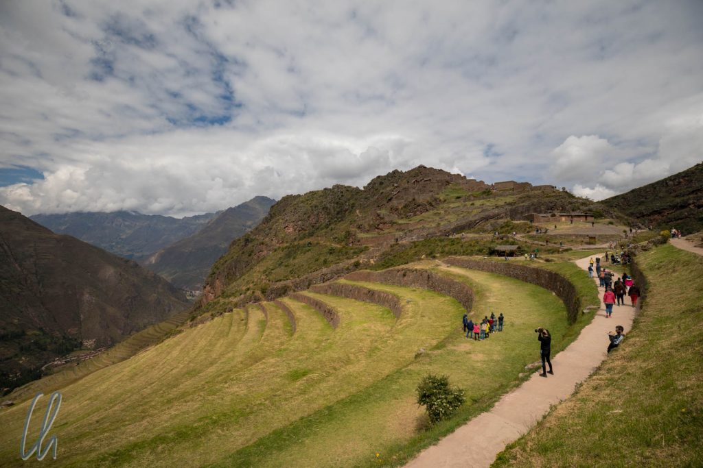
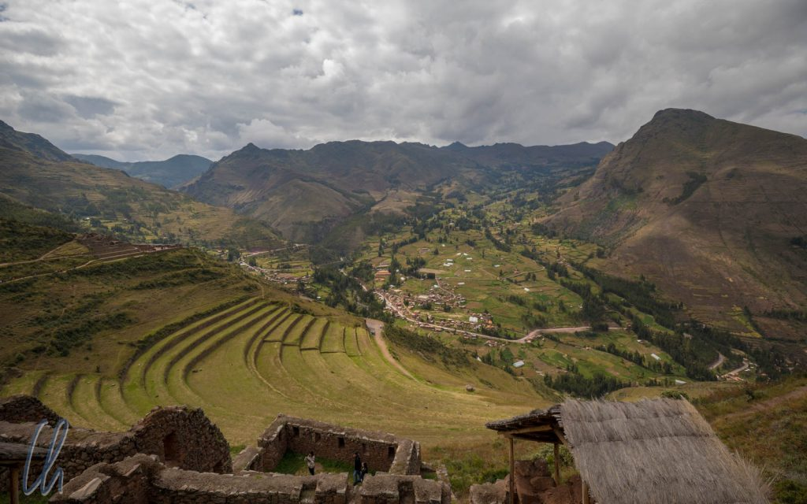
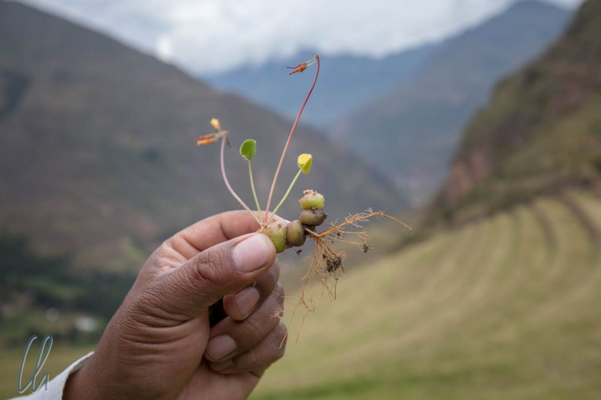
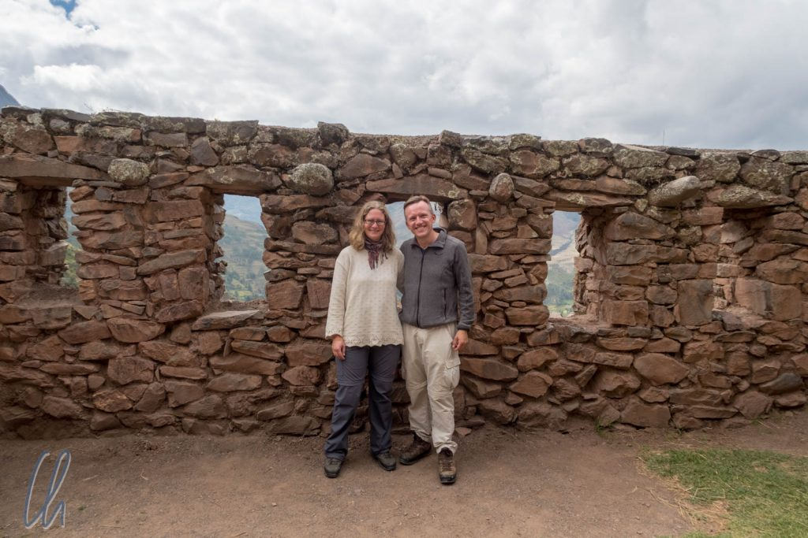
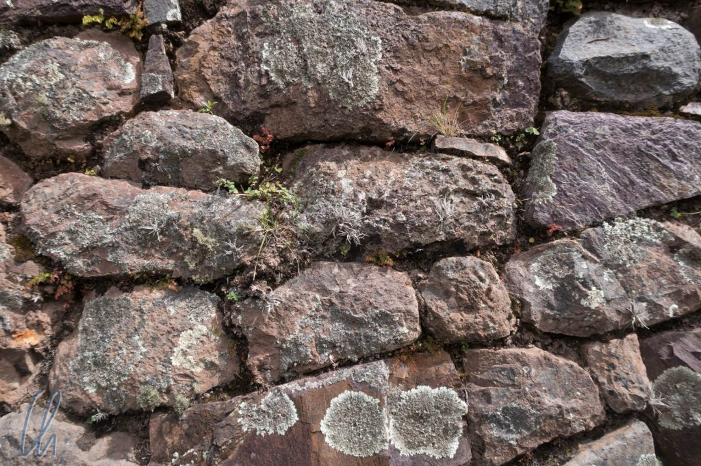

# Die Stätten der Inka im heiligen Tal

Rund um die ehemalige Inka-Hauptstadt Cuzco gibt es noch weitere Stätten der Inka. Wir besuchten die Ruinen im sogenannten Heiligen Tal ([Valle Sagrado](https://en.wikipedia.org/wiki/Sacred_Valley)) auf einem Tagesausflug, indem wir ein Taxi für den ganzen Tag mieteten. Unsere Ziele waren Pisac, Ollantaytambo und Moray.

<!--more-->

## Pisac: Landwirtschaft, Festung und Heiligtum

[Pisac](https://en.wikipedia.org/wiki/P%C3%ADsac) war unser erstes Ziel, 35 Kilometer auf einer kurvigen Straße von Cuzco entfernt. Die heutige Stadt liegt im Tal des Flusses [Urubamba](https://de.wikipedia.org/wiki/Urubamba), 600 Meter tiefer als Cuzco. Pisac war ein weitläufiger bäuerlicher Ort, unschwer zu erkennen an den zahlreichen landwirtschaftlichen Terrassen, die sich auch heute noch an den Hängen des Tals entlangziehen und die teilweise noch bewirtschaftet werden. Außerdem gab es dort Befestigungsmauern, einen Tempel und Wohnhäuser. Pisac lag strategisch günstig an einem wichtigen Inkaweg, der Cuzco mit anderen Städten im Dschungel, also östlich im Tiefland, verband. Interessanterweise sind einige dieser alten Pfade auch heute noch in Gebrauch und an den Berghängen problemlos zu erkennen.

Die Terrassierung der Berge wurde zwar schon in der Zeit vor der Herrschaft der Inka begonnen, die Inka perfektionierten den Terrassenbau jedoch. Mit ihrer produktiven Landwirtschaft legten sie den Grundstein für ihren Aufstieg zur überregionalen Macht. Die Felder am Hang, die wir in Pisac sahen, waren natürlich instandgesetzt worden. Unabhängig davon sieht man aber im heiligen Tal auch sehr häufig entlang der Straße alte Terrassen, die nicht mehr benutzt werden, aber trotzdem noch sichtbar sind.

## Terrasse ist nicht gleich Terrasse

Es gab verschiedene Arten von Terrassen. Die drei Haupttypen waren entweder für die Landwirtschaft, zum Anbau von Blumen oder zur Befestigung der Hänge gegen Erosion konzipiert worden. Die Befestigungsterrassen waren schmal und hoch. Die landwirtschaftlichen, die wir in Pisac sahen, waren relativ breit. Letztere wiesen eine Höhe von 5-8 Metern auf und eine Breite von etwa 10 bis 12 Metern. Allein schon die Anlage der Terrassen muss ohne Arbeitstiere eine Knochenarbeit gewesen sein. Um es noch anstrengender zu machen, soll sogar fruchtbarer Mutterboden von anderen Orten herbeigeschafft worden sein, um optimale Anbaubedingungen zu schaffen.

Die verschiedenen Kulturpflanzen wurden in unterschiedlichen Höhen angepflanzt. Auf den unteren Terrassen wuchs Mais, in der Mitte Getreide (Quinoa) und oben Kartoffeln, damit jede Pflanze in dem für sie besten Mikroklima gedeihen konnte.

Natürlich düngten die Inka ihre Felder auch. Dazu wurde nicht nur Lama- und Alpaka-Dung verwendet, sondern auch die Hinterlassenschaften der Meerschweinchen. Wir hatten allerdings Probleme, uns vorzustellen, wie viele Meerschweinchen man braucht, um eine Terrasse düngen zu können. Vielleicht sind die Ausscheidungen der Nager aber auch einfach extrem potent - ein Köttel pro Absatz und alles sprießt und ergrünt? ;)

## Mauer ist nicht gleich Mauer

Selbst für Hobbyarchäologen wie uns war es erstaunlich einfach, die grobe Datierung einer Mauer in den Ruinen vorzunehmen. Bestand sie aus kleinen Steinen, die eher zufällig aufgeschichtet waren, handelte es sich um eine Prä-Inka-Wand. Kleine, ordentlicher gefügte Steine wiesen auf die frühe Inka-Periode hin. Mauern aus großen Steinen, akkurat und scheinbar nahtlos eingepasst, waren in der späten Inka-Periode entstanden.

Ganz so trivial war die Altersbestimmung der Wände allerdings doch nicht, da noch eine weitere Dimension in die Überlegungen einbezogen werden musste: ihre Verwendung. Die wichtigen Gebäude (Tempel, Observatorien, Festungsmauern, Paläste von Würdenträgern), meist am Hang oberhalb der Unterkünfte des gemeinen Volkes gelegen, hatten feiner gearbeitete Mauern als normale Wohnhäuser.

Wie in jeder wichtigen Inka-Anlage gab es auch in Pisac eine Zitadelle, einen Sonnentempel, eine Art astronomisches Observatorium und zeremonielle Bäder. Zusätzlich befand sich in der Nähe ein antiker Friedhof der Inka. Zahlreiche Grabhöhlen waren im Steilhang zu erkennen.

## Ollantaytambo, der letzte Rückzugsort der Inka

Zur Mittagszeit erreichten wir [Ollantaytambo](https://en.wikipedia.org/wiki/Ollantaytambo). Am Rande des Ortes lagen die gleichnamigen Inka-Ruinen, die sowohl militärische Festung als auch Verehrungsstätte gewesen waren. Das Heiligtum lag hoch oben auf einem Felsen, wir mussten also zahlreiche Terrassen erklimmen. Oben angekommen sahen wir den Sonnentempel und weitere zeremonielle Anlagen.

Außerdem hatten wir von oben einen wunderschönen Blick über das heilige Tal. Dabei sah man einige Kilometer in der Ferne den Steinbruch, in dem das Baumaterial für die Anlage gewonnen worden war. Auch die Rampen, die dem Transport der Steine gedient hatten, waren zu erkennen. Sicher hatten die Menschen damals Schwerstarbeit verrichtet. Wir konnten uns gerade noch vorstellen, wie die Blöcke vom Steinbruch bergab ins Urubamba-Tal gebracht worden waren. Wie die Menschen sie jedoch in Ollantaytambo hinauf zur Festung geschafft haben könnten, blieb für uns ein Mysterium.

Nachdem das Inka-Heer unter [Manco Inka](https://de.wikipedia.org/wiki/Manco_C%C3%A1pac_II.) in der verlustreichen Schlacht von Sacsayhuamán durch die Konquistadoren besiegt worden waren, zogen sich die Überlebenden in die Festung von Ollantaytambo zurück. Dort konnten sie einen der wenigen Siege über die Spanier erringen. Die Angreifer konnten die oben auf einem Felsen liegende Zitadelle nicht erstürmen und die Inka fluteten die Ebene mit Wasser. Dann jedoch kamen die Spanier mit Verstärkung zurück und griffen erneut an. Schließlich konnten die Inka Ollantaytambo nicht mehr halten und waren damit im Hochland besiegt.

## Das Andenkreuz

Sowohl in Pisac als auch in Ollantaytambo (und sonst auch auf jeder Führung mit Inka-Bezug) erklärten die Führer uns die Bedeutung des [Andenkreuzes](https://de.wikipedia.org/wiki/Andenkreuz), angeblich eines der zentralen Symbole der Inka. Dafür, dass es derart wichtig gewesen sein soll, sahen wir es allerdings an den Inka-Stätten relativ selten, stattdessen jedoch immer als Souvenir (z.B. als Schlüssel- oder Kettenanhänger). Es sind also durchaus Zweifel angebracht, ob es wirklich ein historisch relevantes zentrales Symbol war. Es könnte sich dabei auch um eine moderne Interpretation der Weltanschauung der Inka handeln. Wie dem auch sei, das Andenkreuz sieht aus wie ein Kreuz, über dem noch ein kleineres Quadrat liegt. Damit ergeben sich 4 Seiten in jeweils 3 Ecken. In der Mitte ist zusätzlich ein Loch.

Angeblich steht das Kreuz für das Reich der Inka: Das Loch in der Mitte symbolisiert die Hauptstadt Cuzco und die vier Achsen stehen für die vier Himmelsrichtungen und das [Tawantinsuyu](https://de.wikipedia.org/wiki/Inka#Tawantinsuyu_%E2%80%93_Reich_aus_vier_Teilen), das aus vier Gebieten bestehende Reich. Die drei Stufen (von der Mitte aus gesehen) zeigen die Aufteilung der Welt in die Unterwelt, die Welt der Menschen und die Götterwelt an. Außerdem stellen sie die drei heilige Tiere (Schlange, Puma, Kondor), die drei Tugenden (lernen, lieben, arbeiten) und die drei Verbote (nicht lügen, nicht stehlen, nicht faul sein) dar.

Wir wollten Euch diese Theorie vollständigkeitshalber nicht vorenthalten. Vieles aus der Zeit der Inka scheint jedoch eher von Esoterikern und New-Age-Anhängern aufgegriffen, interpretiert und vielleicht verklärt worden zu sein. Vielleicht sehen wir es aber auch zu nüchtern ;).

## Moray, eine landwirtschaftliche Versuchsanlage

Gegen Ende des Tages wurde die Zeit knapp. Wir fuhren über eine gute Piste aus dem Tal bergauf nach [Moray](<https://de.wikipedia.org/wiki/Moray_(Inka)>). Die Landschaft, die wir durchquerten, wirkte wie ein ländliches Idyll und schien im Abendlicht von innen heraus zu leuchten. Der Blick über die Felder und die schneebedeckten Berge im Hintergrund war atemberaubend.

Moray selbst besteht im wesentlich aus drei trichterförmigen Terrassenanlagen, die wohl eine Art landwirtschaftliches Freiluftlabor waren. Hier sollen die Inka getestet haben, in welchem Mikroklima welche Pflanzen am besten gedeihen.

## Und dann ging die Sonne unter

Wie so oft hätten wir uns mehr Zeit gewünscht. Für einen Tagesausflug war unser Programm entweder zu ambitioniert oder unser Besichtigungstempo zu langsam. Wie auch immer, die Sonne ging unter, die Besichtigung von Salinas (Salzpfannen, die bereits durch die Inka zur Salzgewinnung genutzt worden waren) fiel aus und wir fuhren den größten Teil der Strecke im Dunklen zurück nach Cuzco. Im Nachhinein wäre es geschickt gewesen, von Cuzco aus ins heilige Tal zu fahren (Pisac, Salinas, Moray), einen Tag in Ollantaytambo zu verbringen und dann von dort mit dem Inca Train nach Machu Picchu zu fahren. So waren wir am Ende des Tages wieder zurück in Cuzco und fuhren von dort mit dem Zug nach Machu Picchu.

