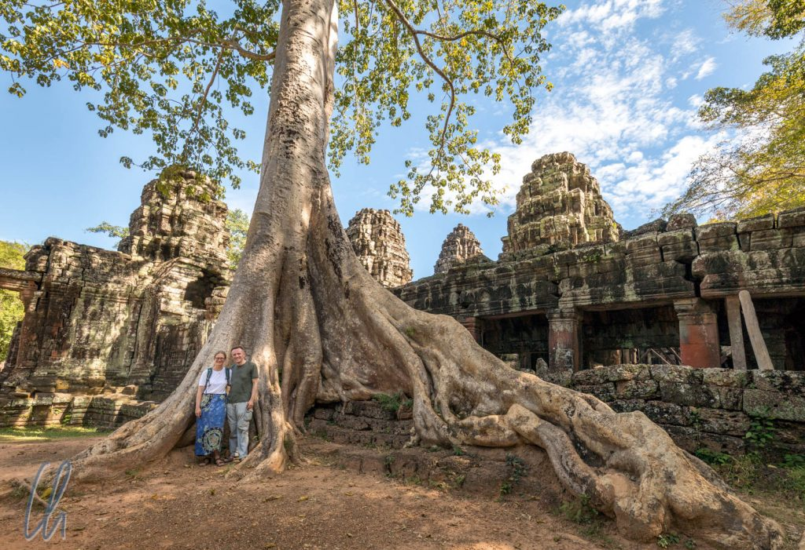
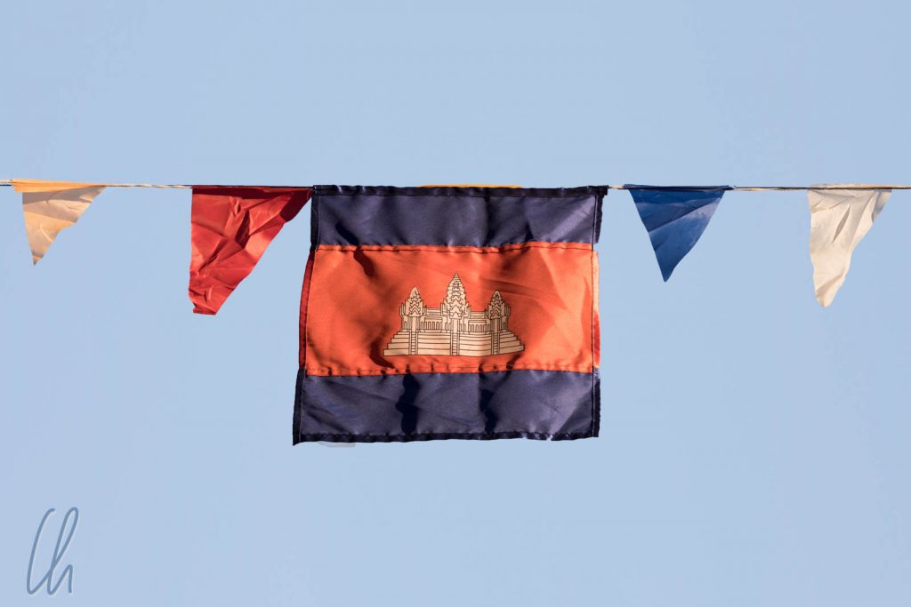

# Die Tempel von Angkor

Wer nicht in Angkor war, hat Kambodscha nicht gesehen - das ist eine vielleicht etwas plakative Behauptung, aber eins ist klar: Angkor ist Quell des Nationalstolzes aller Kambodschaner und natürlich nicht umsonst ein Touristenmagnet. Die Tempel sind zweifelsohne spektakulär, sowohl durch ihre Architektur als auch durch ihre Lage im Dschungel. Auch wenn viele Bauwerke - soweit möglich - von der Vegetation befreit und die Wege für die Touristen geebnet worden waren, gibt es auch noch überwucherten Tempel, die in so manchem Hollywood-Blockbuster (z.B. Tomb Raider) als Kulisse gedient haben.

<!--more-->

## Angkor vs. Angkor Wat

Angkor ist das ehemalige [Zentrum des Khmer Reichs](https://de.wikipedia.org/wiki/Angkor) und auf keinen Fall mit Angkor Wat gleichzusetzen. Angkor bezeichnet ein Gebiet von mehr als ca. 200km², in dem nacheinander mehrere Hauptstädte gegründet worden waren. Jede hatte als religiöses Zentrum ein Haupttempelareal. In diesem Großraum könnten zur Blütezeit des Reiches bis zu einer Million Menschen gelebt haben. Von dieser gewaltigen Stadt sind nur noch die Tempelgebäude erhalten, da allein die Götter Anspruch auf eine aus Stein erbaute dauerhafte Anbetungsstätte erheben durften. Alle Wohnhäuser und selbst die Paläste aus Holz sind längst zu Staub zerfallen.

Angkor Wat, der größte Tempelkomplex, ist "nur" einer von sehr vielen Tempeln, die im Zeitraum von 802-1432 dort erbaut worden waren. Angkor Wat ist auch heute noch der [bedeutendste Tempel](https://de.wikipedia.org/wiki/Angkor_Wat) von Angkor. Als solcher ziert er die Nationalflagge Kambodschas.

Auch wenn Angkor Wat aufgrund des Ansturmes zahlreicher Besucher auf uns eher wie eine Touristenattraktion wirkte, so ist es dennoch ein spiritueller Ort und tief in der nationalen Wahrnehmung der Khmer verwurzelt. Daher wird Angkor Wat sogar heute noch [von der Politik instrumentalisiert](http://www.bbc.com/news/world-asia-42219982).

Wenige Tage vor unserem Besuch hatte Premierminister Hun Sen eine Zeremonie in Angkor Wat abgehalten, offiziell um für Frieden und die Einigkeit des Landes zu beten. Vermutlich beabsichtigte er, an die Tradition der großen Könige anzuknüpfen und sich selbst zu legitimieren. Ein Kommentar steht uns eigentlich nicht zu, aber die gleichen politischen Bedenken, die unser Taxifahrer [am ersten Tag](http://wittmann-tours.de/erste-eindruecke-aus-kambodscha/) geäußert hatte, hörten wir auch von unserem Guide in Angkor. Die politische Lage ist offensichtlich angespannt.

## Angkor ist hauptsächlich hinduistisch

Gut vier Wochen zuvor hatten wir in [Bagan](http://wittmann-tours.de/bagan-zu-lande-zu-wasser-und-in-der-luft/) die große Tempeltour absolviert. Die beiden religiösen Stätten ähneln sich gar nicht. Bagan und Angkor haben einen jeweils sehr unterschiedlichen Charakter: Bagan liegt in der Wüste und die Tempel sind fast alle buddhistisch. In Angkor befinden sich die religiösen Bauwerke im (mehr oder weniger gebändigten) Dschungel, und die meisten Tempel sind hinduistisch. Die Blütezeit der beiden Hauptstädte fiel grob in einen vergleichbaren Zeitrahmen. Vor diesem Hintergrund sind die verschiedenen jeweils vorherrschenden Glaubensrichtungen spannend, da beide Orte zwar 1500km auseinander liegen, aber trotzdem zum gleichen Kulturkreis gehören.

Obwohl Kambodscha heute ein buddhistisches Land ist, begegneten wir also in den Tempeln statt Abbildungen von Buddha meistens [Shiva](https://de.wikipedia.org/wiki/Shiva) und [Vishnu](https://de.wikipedia.org/wiki/Vishnu), gelegentlich auch [Brahma](https://de.wikipedia.org/wiki/Brahma) und anderen hinduistischen Göttern. Im Laufe der vier Tage lernten wir die verschiedenen Erkennungsmerkmale dieser Gottheiten kennen, z.B. den [Garuda](https://de.wikipedia.org/wiki/Garuda) als Reittier von Vishnu. Natürlich konnten wir in der kurzen Zeit kein tiefes Verständnis der historischen Khmer-Spielart des Hinduismus erlangen. Es war jedoch faszinierend zu sehen, welchen Detailreichtum viele der Tempel aufweisen und dass auch historische Veränderungen erkennbar waren. Beispielsweise haben wir in einigen Tempeln unkenntlich gemachte Buddha-Bildnisse gesehen. Hierfür waren (ausnahmsweise mal) nicht die [Roten Khmer](https://de.wikipedia.org/wiki/Rote_Khmer) verantwortlich (, die in Angkor relativ wenig Schaden anrichteten), sondern religiöse Strömungen vor Hunderten von Jahren.

## Die Tempel im Dschungel

Selbst wenn man die religiösen Details völlig außer Acht lässt, ist die Stätte allein schon durch ihre Lage im Dschungel extrem reizvoll. Nach dem Untergang von Angkor hatte die Wildnis große Teile der damaligen Weltmetropole zurückerobert. Die bekanntesten überwucherten Tempel sind der [Preah Khan](https://de.wikipedia.org/wiki/Preah_Khan), [Banteay Kdei](https://de.wikipedia.org/wiki/Banteay_Kdei) und allen voran der [Ta Prohm](https://de.wikipedia.org/wiki/Ta_Prohm). Diese Bauwerke werden von gewaltigen Bäumen überragt, deren Wurzeln zwischen die Steinblöcke eingewachsen sind und die Tempel umklammern. Zuweilen scheinen Baum und Gebäude eins geworden zu sein.

Die historische Stadt und die Tempelanlagen waren nur überlebensfähig, weil es die nötige Infrastruktur gab, um die vielen Menschen zu versorgen. Dies betraf Lebensmittel und andere Dinge des täglichen Bedarfs, Baumaterial und vor allem Wasser. Letzteres wurde in riesigen Becken, sogenannten Barays, gespeichert und als Trink- und Brauchwasser, sowie zur Bewässerung der Reisfelder genutzt. Gleichzeitig hatten die Wasserbecken spirituelle Bedeutung. Diese riesigen Reservoire existieren teilweise heute noch.

## Zum Sonnenaufgang bei Angkor Wat

Der Sonnenaufgang bei Angkor Wat ist einer dieser Programmpunkte, die in keinem Angkor-Programm fehlen dürfen. So standen wir früh genug auf, um gegen 5 Uhr morgens ins Tuk Tuk zu steigen und durch die Morgenfrische nach Angkor zu düsen. Die gleiche gute Idee hatten natürlich auch einige Hundert andere Touristen ;). So fuhren die Tuk Tuks spätestens nach der Ticketkontrolle in Kolonne.

Bei einsetzender Dämmerung gegen 5:20 Uhr waren wir angekommen und unser aufmerksamer [Tuk Tuk-Fahrer Sa](https://www.facebook.com/TukTuk-Batmobile-Angkor-transport-205836793329325/) zeigte uns die Richtung, die wir einschlagen sollten. Eigentlich hätten wir auch einfach den Lemming-Modus einschalten können - immer den anderen hinterher ;). So überquerten wir den breiten Wassergraben auf einer temporären Pontonbrücke, da die originale Brücke gerade restauriert wurde, und schritten durch das Haupttor. Die Tempelanlage ist enorm beeindruckend, vor allem beim ersten Anblick! Die mächtigen Türme von Angkor dominieren das 1100 mal 800 Meter große Areal.

Große Menschentrauben standen schon vor den Wasserbecken, in denen sich Angkor Wat in der Morgendämmerung so pittoresk spiegelte. Die fliegenden Händler waren auch schon auf den Beinen: "Want Guidebook? One Dollar!" "Want to buy Scarf?" "Drink Coffee?". Je mehr Sonnenaufgang zu sehen war - und er war in der Tat sehr idyllisch - desto mehr Selfiesticks wurden in die Höhe gereckt, um das vermeintlich perfekte Foto zu machen.

## Die Flachreliefs und ihre Geschichten

Nach dem Frühstück, natürlich im Angkor Café ;), trafen wir unseren Guide, der uns einen Tag lang begleitete. Wir brannten darauf, mehr über die Geschichten zu erfahren, die die Tempel erzählen. Diese Legenden sind auf hunderte Meter langen Flachreliefs verewigt, die Episoden aus [Mahabharata](https://de.wikipedia.org/wiki/Mahabharata) und [Ramayana](https://de.wikipedia.org/wiki/Ramayana) darstellen. Die Inhalte sind u.a. die Kriege der Götter gegen die Dämonen. Die Reliefs zeigen filigran herausgearbeitet gigantische Schlachtszenen, in denen unzählige Krieger auf Pferden, Elefanten und Fabeltieren gegeneinander kämpfen.

Eine interessante, immer wieder dargestellte und leicht surreale Geschichte ist das [Quirlen des Milchmeeres](https://www.britannica.com/topic/churning-of-the-ocean-of-milk). Sie berichtet von den Bemühungen der Götter und der Dämonen um die Herstellung des Unsterblichkeitstranks Amrita und entspricht dem hinduistischen Schöpfungsmythos.

Deutlich kleiner, aber omnipräsent sind die Gravierungen der [Apsaras](https://de.wikipedia.org/wiki/Apsara). Es sind nymphenähnliche, tanzende Frauen, die scheinbar überall in die Tempel eingraviert sind.

## Viele unterschiedliche Tempel

Auch wenn die Gesamtzahl der (zugänglichen) Tempel im Vergleich zu Bagan eher überschaubar ist, so sind sie doch sehr verschieden, u.a. bedingt durch ihre Entstehungszeit, den Baustil, ihren aktuellen Zustand und die Lage. Wir haben 4 Tage lang die Tempel von Angkor erkundet, und es ist uns dabei auf keinen Fall langweilig geworden, da es immer wieder etwas Neues zu entdecken gab.

Sehr sehenswert war der relativ kleine Banteay Srei, der - obwohl eines der älteren Heiligtümer - durch einen erstaunlichen Reichtum filigraner Details in rötlichem Stein auffiel. Sein Name bedeutet „Zitadelle der Frauen“, da man die feinen plastischen Schnitzereien einer weiblichen Hand zuschrieb.

In jedem Fall herausragend ist der ausnahmsweise buddhistische Tempel Bayon. Beim Besuch fühlten wir uns dauernd beobachtet ;), da von seinen Türmen zahlreiche, meterhohe Gesichter mit mysteriösem distanzierten Lächeln auf uns herab blickten, deren Augen uns zu folgen schienen. Wer sich genau hinter dem Gesicht verbirgt, ist weiterhin unklar. Viele Historiker gehen jedoch davon aus, dass es sich um den Bodhisattva des Mitgefühls, [Avalokiteshvara](https://de.wikipedia.org/wiki/Avalokiteshvara), handelt. Dieser zeigt hier vermutlich das Gesicht des buddhistischen [Königs Jayavarman VII.](https://de.wikipedia.org/wiki/Jayavarman_VII.), der den Tempel in Auftrag gegeben hat. Der ubiquitär wachsame Blick des Herrschers entspräche in diesem Falle einer massiven Machtdemonstration.

Interessant sind in dieser Anlage auch die Flachreliefs mit der Darstellung von Alltagsszenen aus dem Kambodscha des 12. Jahrhunderts, z.B. Frauen beim Entfachen des Herdfeuers oder Männer beim Beobachten eines Hahnenkampfes. Zweifelsohne war der Bayon eines der Highlights unseres Besuchs.

