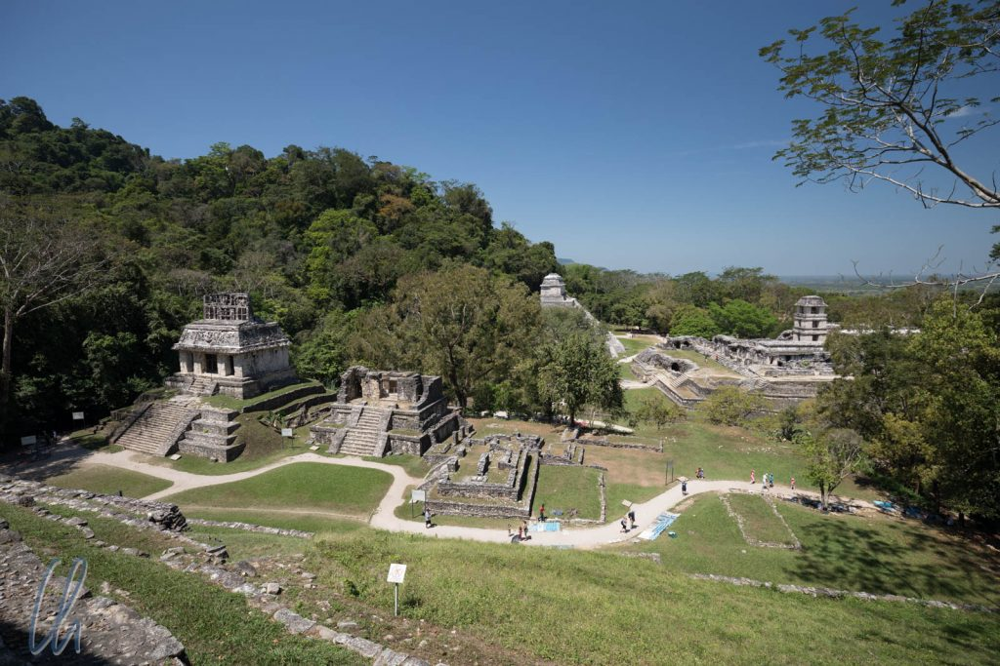
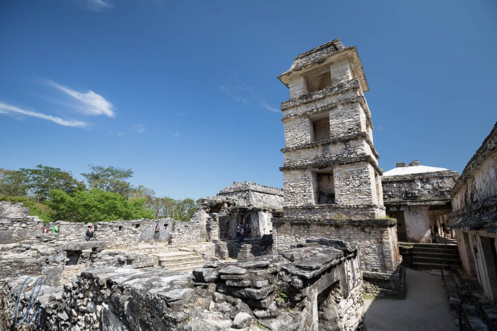
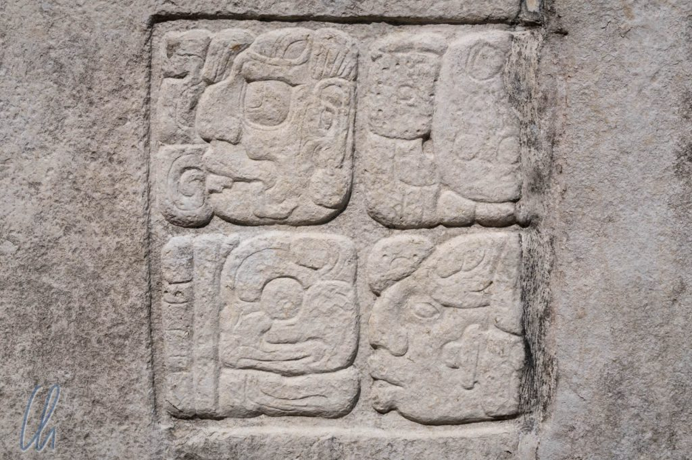
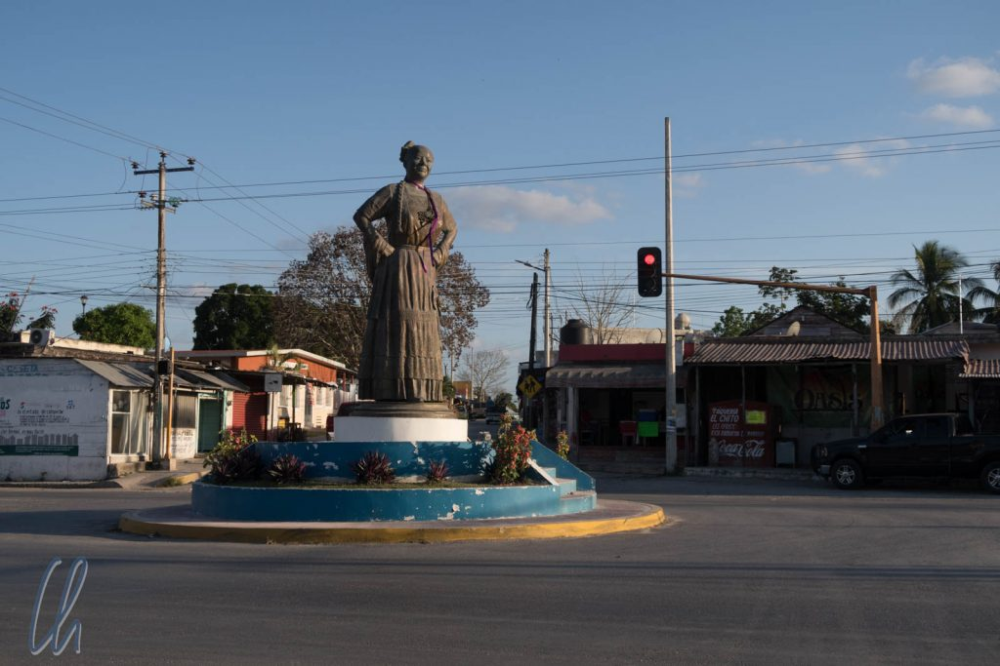

# Die untergegangene Pracht der Maya

Die ehemals prachtvollen Stadtstaaten der Maya befanden sich in Gebieten des heutigen Mexiko, Guatemala, Honduras und Belize. Neben den Azteken sind sie das bekannteste präkolumbianische Volk des heutigen Mexikos. Die Blütezeit der Maya-Kultur begann ungefähr von 250 n. Chr. und dauerte bis zum Niedergang ungefähr 900 n. Chr. Wir besuchten die berühmte Maya-Stadt von [Palenque](https://de.wikipedia.org/wiki/Palenque), außerdem die größere, aber heute weniger bekannte (und schwerer zu erreichende) Stadt [Calakmul](https://de.wikipedia.org/wiki/Calakmul), sowie die Ruinen rund um Xpujil (ausgesprochen "Eschpudschil"). Nach all den Eindrücken versuchten wir uns vorzustellen, warum die architektonisch so eindrucksvollen Städte aufgegeben worden waren.

<!--more-->

## Palenque, die Stadt Pakals des Großen

Die Ruinen von Palenque waren ganz anders als diejenigen, die wir vorher gesehen hatten. Das lag nicht zuletzt an der natürlichen Umgebung: Palenque liegt im Dschungel. Damit war es schwül-warm, die Zikaden machten im Wald ohrenbetäubenden Lärm und den ausgegrabenen Teil der Ruinenstadt umgab dichtes Grün. Angeblich sind 95% der Anlage noch von üppiger Vegetation überwuchert und warten darauf, freigelegt zu werden. Dennoch entwickelte sich der Besuch der Stätte für uns zum archäologischen Wandertag und wir gaben es auf, zu zählen, wie viele Stufen wir bis zu den Spitzen der zahlreichen Tempelpyramiden erklommen hatten.

Nach 20 kurzweiligen Minuten im Collectivo (einer Art Sammeltaxi) erreichten wir die Ruinen von Palenque. Nur wenige hundert Meter vom Eingang entfernt gelangten wir zu den ersten eindrucksvollen Bauten, unter anderem dem [Tempel der Inschriften](https://de.wikipedia.org/wiki/Tempel_der_Inschriften) ([Bild ganz oben](http://wittmann-tours.de/wp-content/uploads/2018/05/CW-20180317-101613-7715.jpg)), einer 21 Meter hohen Pyramide. In ihren Tiefen hatten Archäologen die reich ausgestattete Grabkammer von [Pakal I.](https://de.wikipedia.org/wiki/K%27inich_Janaab_Pakal_I.) gefunden, deren Nachbildung (sowie den Sarkophag und die [Totenmaske](http://wittmann-tours.de/wp-content/uploads/2018/05/CW-20180304-115657-6862-1.jpg) des Königs) wir bereits in [Mexiko City](http://wittmann-tours.de/frueher-tenochtitlan-heute-mexiko-city) im Anthropologischen Museum gesehen hatten.

Der sog. [Palast](https://de.wikipedia.org/wiki/Palenque#Der_Palast) war ein weiteres herausragendes Gebäude, das größte in Palenque. Der Turm, vermutlich ein Observatorium, soll angeblich in seiner Art einzigartig in allen Maya-Städten sein. In den Innenhöfen befanden sich, ähnlich wie in Monte Albán, in Steinplatten gemeißelte Abbildungen besiegter Würdenträger. Zusätzlich wurden auch Stelen mit restaurierten Maya-Glyphen ausgestellt. Die Maya hatten ein komplexes [Schriftsystem](https://de.wikipedia.org/wiki/Maya-Schrift), das heutzutage größtenteils entziffert ist und sehr kunstvoll aussieht.

In Palenque durften wir noch viele Gebäude besteigen bzw. betreten (das soll angeblich in Chichén Itzá mittlerweile völlig verboten sein) und wir erhielten von oben einen noch besseren Eindruck von der Größe der Bauwerke und der ganzen Stadt, vor allem wenn man im Hinterkopf hat, dass wir nur ca. 5% der Anlage überblicken konnten. Natürlich waren wir nicht die einzigen Besucher. Palenque ist eine der Maya-Sehenswürdigkeiten schlechthin. So fauchten immer wieder die bekannten Jaguar-Imitatoren um uns herum, an den Wegen hatten die Souvenirverkäufer auf bunten Decken ihre Waren ausgebreitet und zuweilen sahen die Pyramiden aus der Ferne so aus, als ob viele bunte Ameisen auf ihnen herumklettern würden.

## Weiterfahrt nach Xpujil

Von Palenque aus fuhren wir weiter nach Osten, also nicht nach Norden auf die Yucatán-Halbinsel, sondern nach Xpujil im Bundesstaat Campeche, immer mit etwas Abstand parallel zur Grenze zu Guatemala. Xpujil ist ein kleiner Ort mit ca. 4000 Einwohnern und Ausländer waren dort eher eine Seltenheit. Trotzdem fanden wir eine nette, einfache, aber saubere Unterkunft. Unser Zimmer war der örtlichen Pizzeria angeschlossen. Damit war auch die Versorgung gesichert, sonntags war dieses Lokal nämlich das einzige im Dorf, das abends nach offen hatte.

Die Ruinenanlagen rund um Xpujil sind eher klein. Wir besuchten die archäologischen Maya-Stätten [Chicanná](https://de.wikipedia.org/wiki/Chicann%C3%A1), [Becán](https://de.wikipedia.org/wiki/Bec%C3%A1n) and [Xpujil](https://de.wikipedia.org/wiki/Xpuhil) an einem Tag. Angenehm war, dass wir die Ruinen fast für uns alleine hatten. Immer wieder begegneten wir den gleichen zehn anderen Besuchern, die meisten davon Mexikaner. Trotzdem gab es Spektakuläres zu sehen. Höhepunkt in Chicanná war zum Beispiel eine Fassade, die einem riesigen aufgerissenem Schlangenmaul nachempfunden war. Im Eingangstor befand man sich also zwischen den Fangzähnen.

In Becán waren die Pyramiden sogar höher als in Palenque. Nach Bewältigung der mehr schlecht als recht erhaltenen Stufen offenbarte sich ein weiter Blick über den scheinbar endlosen Dschungel. Einige der anderen Strukturen der Anlage lugten aus dem Blätterdach hervor. Interessant an Becán war auch der Aufbau: Den zentralen Teil der Stadt umgab ein Wassergraben, dies ist für eine Maya-Stätte einzigartig.

Das eindrucksvollste Gebäude der Ausgrabungsstätte in Xpujil war ein riesiger Palast mit drei hohen Türmen, dessen Fassade maskenartige Dekorationen und Schlangenmaulportale schmückten.

## Calakmul, Maya-Metropole mitten im Dschungel

Xpujil war auch der Ausgangspunkt unserer Tour nach Calakmul, die Fahrt dauerte ungefähr 2 Stunden. Die erste Stunde fuhren wir auf der Hauptstraße (zurück) nach Westen, anschließend auf einer engen Straße durch dichten Wald nach Süden, fast bis zur guatemaltekischen Grenze.

Calakmul war flächenmäßig sogar noch größer als Palenque, dafür ist es nicht so penibel vom Dschungel befreit worden. Verglichen mit Palenque kommen zurzeit auch nur etwa 10% der Besucher. Selbst auf den großen Pyramiden wuchsen Bäume und auch hier gab es noch große unausgegrabene Bereiche. Unser Führer Ezequiel zeigte uns zum Beispiel einige unscheinbare Hügel im Wald, die für uns nach Erhebungen im Dschungel aussahen, unter denen allerdings Maya-Gebäude lagen.

Oft wird auch darüber berichtet, dass die Maya exzellente Astronomen waren. Nicht zuletzt aus dem Wissen um den Wandel der Jahreszeiten leitete sich die Macht der Elite ab. In Calakmul sahen wir einen Gebäudekomplex, der so konzipiert war, dass man an ihm die Jahreszeiten ablesen konnte. Vor dem mittleren Bauwerk war ein Fixpunkt angebracht, von dem aus man je eine Markierungsstruktur auf einem der drei Tempel als Indikator sah (wie in der folgenden Abbildung zu erkennen). Ging die Sonne direkt über der linken oberen Ecke des linken Gebäudes auf, war es der Tag der Sommersonnenwende, stieg sie direkt über dem mittleren Tempel in den Himmel, konnte man Frühlings- oder Herbstanfang bestimmen und wenn sie über der rechten oberen Ecke des rechten Bauwerks erschien, war Wintersonnenwende.

## Prächtige Bauwerke in der ganzen Stadt

An nur wenigen Bauwerken konnte man noch Reste der Original-Farben sehen. Früher war nicht alles grau in grau wie heute, sondern die Gebäude leuchteten innen und außen in prächtiger Bemalung. Die vorherrschenden Farben waren rot, blau und gelb. Der Zugang zum Inneren aller Gebäude war Besuchern leider verwehrt, zu groß ist die Angst vor Vandalismus, was wir sehr bedauerten. An den Außenwänden haben die Elemente das meiste der Farbe abgewaschen, aber manchmal fanden wir noch ein paar Überreste.

Außerdem staunten wir darüber, dass noch einige Original-Stelen aufrecht im Dschungel standen (andere waren wieder aufgestellt worden). Diese Stelen zeigten Bildnisse damaliger Persönlichkeiten und berichteten in der Glyphenschrift der Maya über wichtige Ereignisse, zum Beispiel über Krönungen von Königen oder militärische Eroberungen. Dass ab ca. 900 n. Chr. keine neuen Inschriften mehr angefertigt wurden, wertet man als Zeichen für den Untergang der Maya.

Andere interessante Orte waren die Opferstellen, wo auch die Herrscher immer wieder ihr eigenes Blut opfern mussten, um die Götterwelt gnädig zu stimmen. Die Frauen durchbohrten ihre Zunge, und das kostbarste Blut der Herrscher wurde aus ihrer Männlichkeit gewonnen - vielleicht war ein Leben als einfacher Bauer doch nicht so schlecht ;).

## Dschungel von oben und unten

Auch in Calakmul durften wir die meisten Gebäude noch besteigen. Von oben eröffnete sich ein scheinbar endloser Blick über den Dschungel und die höchsten umliegenden Bauwerke.

Am Fuße der Pyramiden hielten sich viele wilde Truthähne mit schimmerndem Gefieder auf, die sich in Calakmul sehr wohlfühlen, da sie im umgebenden [Biosphären-Reservat](https://en.wikipedia.org/wiki/Calakmul_Biosphere_Reserve) nicht gejagt werden dürfen. Vor der Rückfahrt sahen wir am Nachmittag auf einem kurzen Spaziergang im Dschungel erstaunlich viele Tiere: Tukane, ein Krokodil und einen ganzen Baum voll Klammeraffen (und leider auch eine Myriade Moskitos).

## Zeugnisse der Vergangenheit

Der Besuch der zahlreichen archäologischen Stätten war sehr interessant. Wir erfuhren eine Menge über die Kultur der Maya, das Leben vor allem der hochstehenden Persönlichkeiten, die Kriege, die Götterwelt, das Schönheitsideal und einige engagierte Führer haben die vergangene Zeit für uns zum Leben erweckt. Vieles kann leider nicht rekonstruiert werden, da die Spanier im Rahmen der Conquista alles zerstörten, was an die heidnische Vergangenheit erinnerte. Trotzdem ist heute einiges bekannt über die alten Kulturen, ihre Geschichte, ihre Mythen, ihre Herrscher und wie sie lebten.

Dieses Wissen verdanken wir unter anderem einigen wesentlichen Dokumenten, die die Vernichtungskampagne überstanden haben. So ließ sich im 16. Jahrhundert [Diego de Landa](https://de.wikipedia.org/wiki/Diego_de_Landa), Bischof von Yukatan, von einem adligen Maya das lateinische Alphabet in Glyphen aufschreiben. Dieses sogenannte Landa-Alphabet half den Wissenschaftlern trotz einiger Fehlinterpretationen bei der Entschlüsselung der Maya-Schrift.

Auch sind Teile von vier Maya-Codices erhalten geblieben. Der längste davon ist der Madrider Codex mit 112 Seiten. Seine begleitenden Illustrationen erinnern, wie auch manche Wandbemalungen, ein wenig an einen Comic. Den ganzen Madrider Codex gibt es übrigens heutzutage auch [online](http://www.famsi.org/research/graz/madrid/thumbs_5.html). Nicht zuletzt hat eine Abschrift des [Popol Vuh](<https://de.wikipedia.org/wiki/Popol_Vuh_(Buch)>) in lateinischer Schrift durch einen Maya-Priester die Vernichtung überlebt. Das „Buch des Rates“ erzählt die Schöpfungsgeschichte, Mythen und historische Aspekte der Quiché-Maya in Guatemala.
