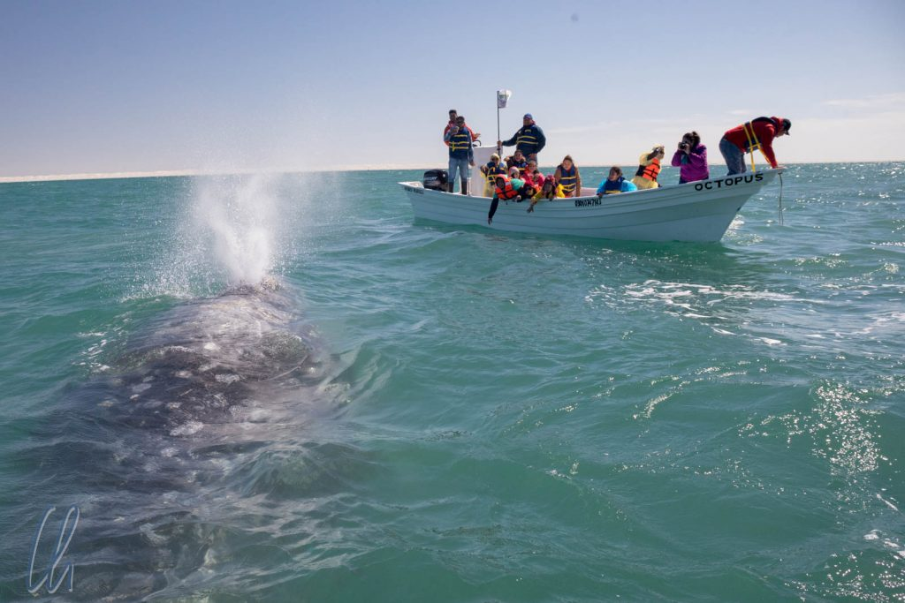
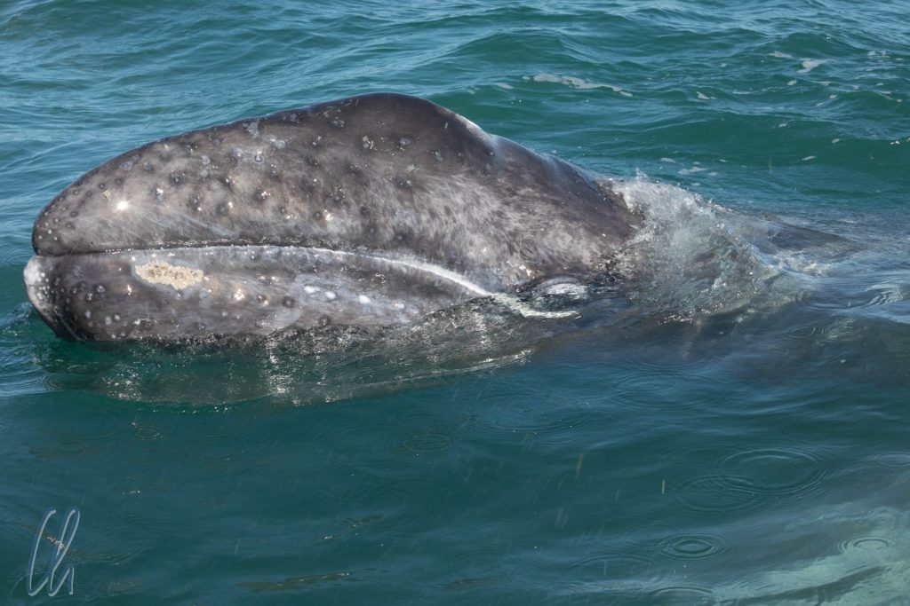
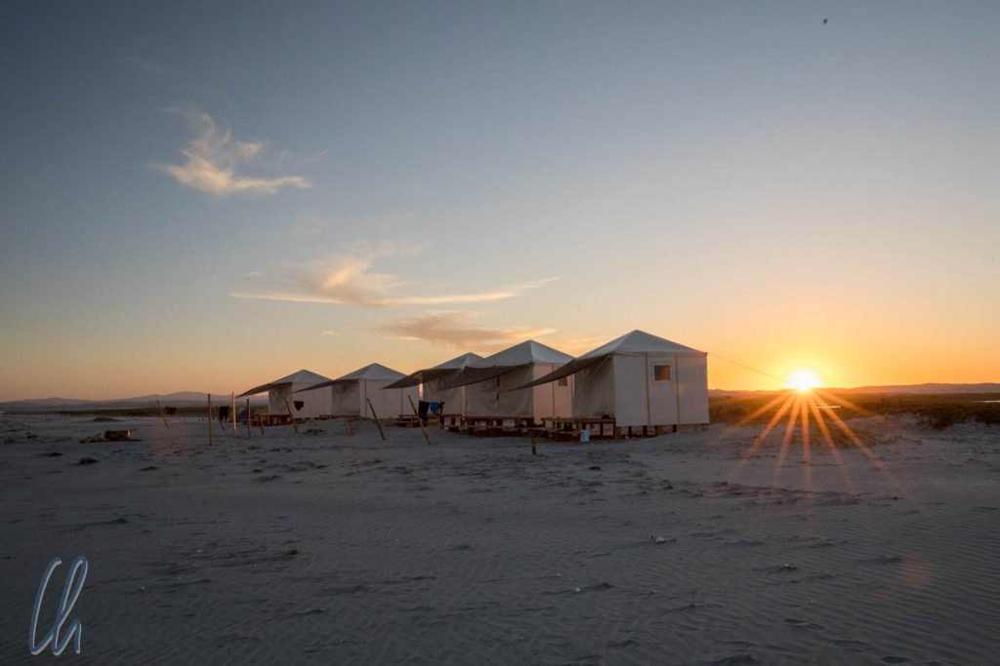

# Die Wale von Guerrero Negro

Der geplante Höhepunkt unserer Erkundung der Baja California sollten die Wale in der [Laguna Ojo de Liebre](https://en.wikipedia.org/wiki/Ojo_de_Liebre_Lagoon) in Guerrero Negro sein, einem der angeblich besten Orte der Welt, um Wale aus nächster Nähe zu beobachten. Trotz enthusiastischer Berichte, auch aus erster Hand, waren wir trotzdem skeptisch. Schließlich hatten wir an anderen Top-Whale Watching-Orten dieser Welt schon Waltouren gemacht, auf denen wir teilweise viel Meeresoberfläche, aber wenige Wale sahen. Würden wir wirklich einen Wal treffen, der direkt bis an unser Boot heran schwimmt? Soviel sei an dieser Stelle verraten: Unsere Erwartungen wurden weit übertroffen!

<!--more-->

## Was mach Guerrero Negro so besonders?

Einfach ausgedrückt bringen die Grauwale in der Lagune von Guerreo Negro ihre Kälber zur Welt. Das ist kein Zufall, denn die Lagune hat für die Wale viele Vorteile: Es gibt keine Räuber, das Wasser ist wärmer und salzhaltiger als der Ozean, bietet damit den Jungen mehr Auftrieb. Auch das ist für den Nachwuchs optimal, da er noch keine schützende Fettschicht besitzt. Diese müssen sie sich erst antrinken. Die Milch der Mutter enthält ca. 50% Fett und so nehmen die Baby-Wale pro Tag bis zu 50 Kilo zu.

Außerdem ist bemerkenswert, dass auf der Baja California das erste Walschutzgebiet der Welt geschaffen wurde, nämlich bereits 1972. Dies hat mit dazu geführt, dass die Grauwale, die an der Westküste Amerikas fast ausgestorben waren, inzwischen nicht mehr bedroht sind.

Eigentlich ist es verwunderlich, dass es unter diesen Umständen keinen groß aufgezogenen Whale Watching-Tourismus gibt. Die Anbieter sind zwar zahlreich, aber klein. Wir waren mit [Whale Magic](https://www.facebook.com/whalemagictours/) unterwegs und unsere kleine Gruppe war eine der ersten, die im neu eingerichteten [Whale Camp](http://www.whalemagictours.com/package-tour-information/) übernachtet hat. Dabei handelte es sich um einfache Unterkünfte, halb Hütte, halb Zelt, direkt an der Lagune, wo wir 2 Nächte blieben. Entstanden ist dieses Camp aus der Zusammenarbeit der lokalen Fischereikooperative und Shari Bondy, die seit über 30 Jahren Waltouren in Guerrero Negro anbietet.

## Auf zur Walbeobachtung!

Nach einer interessanten Einführung am Abend der Ankunft und einer Nacht in einem einfachen, aber sauberen Motel in Guerreo Negro wurden wir am nächsten Morgen gegen 8 Uhr abgeholt und fuhren mit einem Minibus zur Lagune. Dort angekommen bemerkten wir, dass hier mit Herzblut gearbeitet wird: Wir stiegen aus dem Minibus in einen umgebauten Pickup, der mit Sitzbänken ausgestattet war. Dieser Pickup fuhr ins Wasser, so dass wir trockenen Fußes das Boot erreichten!

Das Boot war speziell für die Walbeobachtung angefertigt worden. Die Basis war ein Fischerboot, in dem es 5 Bänke für die Besucher gab. Für den guten Überblick gab es ein Podest für den Kapitän Chama. Der Whalespotter Eric stand am Bug vorne im Boot.

Wir fuhren in die Lagune hinaus und blickten uns gespannt um. Wer würde wohl den ersten Wal sehen? Gut 10 Minuten später war es soweit, in der Ferne sahen wir einen Wal blasen. Wir näherten uns, der Meeressäuger begutachtete uns und tauchte ab. Als sich 2 oder 3 Minuten nichts tat, ließ der Kapitän den Außenborder wieder an. Kurze Zeit später tauchte der Wal hinter uns wieder auf, er hatte sich anscheinend direkt unter dem Boot befunden.

## Wale aus nächster Nähe

Da die Crew aber einen anderen Teil der Lagune als Ziel auserkoren hatte, fuhren wir weiter. Dort sahen wir schon ein paar andere Boote und offensichtlich auch Wale. Wasser spritzte in hohen Fontänen in die Luft und wir sahen die Riesen der Meere in der Nähe der Boote. Ähnlich wie unser erster Wal beäugten uns die Meeressäuger eher vorsichtig. Sie waren mehr an den Booten interessiert, die sie schon kannten. An diese schwammen sie wirklich so nah heran, dass die Passagiere sie anfassen konnten.

Nach einiger Zeit näherte sich auch unserem Boot ein Wal, ein junges Männchen. Sein Hauptinteresse bestand anscheinend darin, unser Boot zu benutzen, um sich am Rücken zu kratzen, auf dem Barnikel saßen. [Barnikel](https://en.wikipedia.org/wiki/Whale_barnacle) sind Organismen, die sich an die Haut der Meeressäuger heften und dort dauerhaft leben.

Einige Minuten später gesellte sich ein sehr freundliches Weibchen mit ihrem Kalb zu uns. Statt nur andächtig die Wale anzuschauen, wurden wir animiert, auch unsererseits mit den Tieren Kontakt aufzunehmen, mit ihnen mit möglichst tiefer Stimme zu reden und die Hände ins Wasser zu tauchen. Beide begutachteten das Boot und kamen schließlich so nah heran, dass wir sie sogar berühren konnten.

Das Kleine war sehr neugierig und hatte mehr Interesse an uns als die Mutter. Die Walhaut ist erstaunlich weich. Sie fühlt sich so ähnlich an wie eine feuchte Aubergine. So tauchten die Wale unter dem Boot durch, näherten sich immer wieder von Backbord und Steuerbord, vom Heck und vom Bug. Die gute Stimmung und die Aufregung der Passagiere an Bord übertrug sich auf die Wale und sie genossen anscheinend die Aufmerksamkeit und die Unterhaltung durch uns. Offensichtlich hatten die Tiere mindestens eben soviel Freude an uns wie wir an ihnen.

## Wale überall um uns herum

Trotzdem schwammen die beiden nach etwa 15 Minuten davon, aber sofort bekamen wir neue Gesellschaft. Die Party war in vollem Gange, und zuweilen waren 3 oder 4 Wale, Männchen und/oder Weibchen mit Kälbern in direkter Nähe unseres Boots. Sie schwammen immer wieder unter dem Boot durch, rieben sich daran, schaukelten es ein wenig, tauchten ab und auf. Natürlich atmeten sie auch kräftig neben dem Boot aus, so dass uns gelegentlich eine feine Salzwasserbrise ins Gesicht blies, andere würden sagen Walschnodder ;). Die Meeressäuger waren überall: Direkt am Boot und in der Ferne sahen wir noch viel mehr, es war einfach unglaublich!

Eigentlich hätten wir zwischendurch schon lange zum Mittagessen abfahren sollen, aber die Wale waren ja noch da, um mit dem Boot spielen. Uns so blieben wir einfach. Statt der veranschlagen 2 Stunden waren wir gut 3 Stunden auf dem Wasser.

Auch auf der Heimfahrt schwammen die Wale überall, links, rechts, nah und fern. Sie zogen entgegen dem Strom des ablaufenden Wasser in die Lagune, als ob sie uns eskortieren wollten. Wie viele der Meeressäuger wir allein an diesem Morgen sahen, ist schwer zu sagen. Die meisten glitten durch das Wasser, die Mütter hatten ihre Kälber dabei. Einige Wale stellten sind per [Spyhop](https://www.nationalgeographic.org/media/spyhopping/) auf oder sprangen sogar aus dem Wasser!

## Das Whale Camp

Mittags gegen 13 Uhr kamen wir im Whale Camp an, wo das Mittagessen serviert wurde. Die Spezialität des Hauses war Hummer. Er wird frisch von der Fischereikooperative gefangen und war mindestens so lecker, wie es sich anhört. Das Camp bestand aus einem größeren Haus, in dem sich auch die Küche und der "Speisesaal" befanden. Die Unterkünfte - halb Hütte, halb Zelt - waren am Strand auf jeweils ein Holzfundament gesetzt. Innen gab es echte Betten, 2 Kommoden, Handtücher, Solarbeleuchtung und Campingstühle.

Den Nachmittag verbrachten wir im Camp und ruhten uns aus, schließlich hatten wir sehr früh aufstehen müssen und das Whale Watching war sehr aufregend gewesen. Shari wiederholte, was sie vorher schon gesagt hatte, nämlich, dass wir die Meeressäuger auch vom Strand aus würden beobachten können. Diesmal glaubten wir ihr. Tatsächlich, einige Wale zogen nur gut 50 Meter vom Strand entfernt vorbei und bliesen Wasserfontänen in die Luft.

Im Camp lernten wir [Terry und Jude](http://amphibiographer.tv/) kennen, die das Camp betreuten und auch unsere Guides für die beiden kommenden Tage waren. Neben ihrer Arbeit im Camp filmten sie einen Dokumentarfilm über die Wale, den wir hoffentlich auch zu Gesicht bekommen werden.

Nachmittags gingen wir in den Dünen nahe des Camps spazieren. Der Sand hatte eine sehr interessante Konsistenz mit einer festen Oberfläche, fast wie eine Kruste, und einem sehr weichen Untergrund in den wir an einigen Stellen knietief einsanken. Weiter in Landesinneren sahen wir uns die Brackwasserseen an, wo es erstaunlich grün war in der Sandlandschaft und wo wir auf einige Wasservögel trafen.

Nachts war es im Camp recht frisch. Das Thermometer zeigte vermutlich 10°C und der konstante Wind trug seinen Teil bei. So war es nur unter mehreren Decken warm. Auch wenn es sich wie Camping anfühlte, war es doch deutlich komfortabler. Und in der Dunkelheit funkelten Tausende Sterne über uns.

## Zwei weitere Waltage

Wie viel besser konnte es noch werden? Vielleicht nicht besser, aber auf andere Art und Weise aufregend. Auch am zweiten Tag sahen wir überall Wale in der Lagune. Sie bliesen, guckten aus dem Wasser oder sprangen gar in die Luft. Eine freundliche Mutter mit Kalb näherte sich unserem Boot. Auch diese Bootsfahrt dauerte länger als geplant. Als unerwarteten Bonus sahen wir auch einen Delfin, der kurz mit unserem Boot spielte, und etwas später auch eine neugierige Robbe.

Nachmittags machten wir eine weitere kurze Ausfahrt in der Nähe des Camps und sahen dort viele Mütter mit noch sehr jungen Kälbern, so dass sie noch nicht näher an unser Boot kommen wollten.

Am Abreisetag hingegen sahen wir wieder Wale satt. Es dauerte wieder ein wenig, bis sich eine Mutter mit ihrem Kalb an das Boot herantraute, dafür blieben sie gut 10 Minuten, tauchten unter dem Boot hindurch und kamen wiederholt so nah an das Boot heran, dass wir ihnen mit einer Berührung Lebewohl sagen konnten.

## 5-Sterne Whale Watching

Die Laguna Ojo de Liebre wirkte auf uns wie eine sehr große Badewanne voller Wale. Die professionelle Durchführung des Whale Watching trug wesentlich zum gelungenen Erlebnis bei. Es gab kein aggressives Heranfahren an die Tiere. Stattdessen haben sie sich entscheiden, zu uns ans Boot zu kommen. Die Grauwale haben auf ihre Art und Weise People Watching betrieben.

Auch in Phasen, wenn die Wale nicht direkt zum Boot kamen, war es trotzdem ein ergreifendes Erlebnis, die zahlreichen Meeressäuger aus nächster Nähe zu beobachten und mit ihnen zusammen die Zeit zu verbringen, sie tauchen und atmen zu hören, zu sehen, wie sie durch das Wasser glitten, auf- und abtauchten und ihnen wortwörtlich ins Auge zu blicken.

Diese 3 Tage werden ohne Zweifel ein Höhepunkt unserer gesamten Reise sein. So ein fantastisches Whale Watching hatten wir vorher noch nie erlebt. Unsere Erwartungen wurden weit, weit übertroffen.

https://www.youtube.com/watch?v=n2KTlXMA5N4
