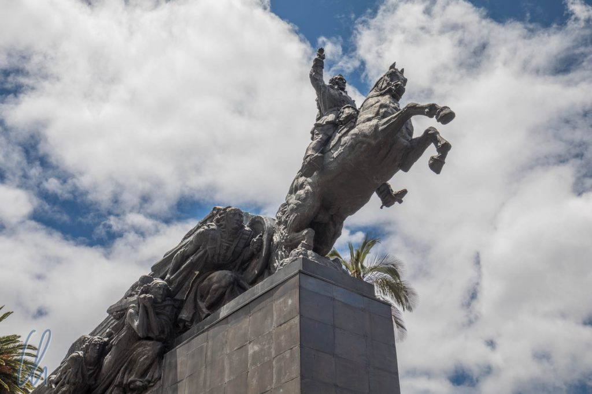
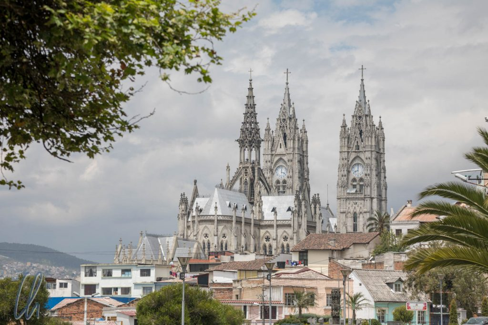
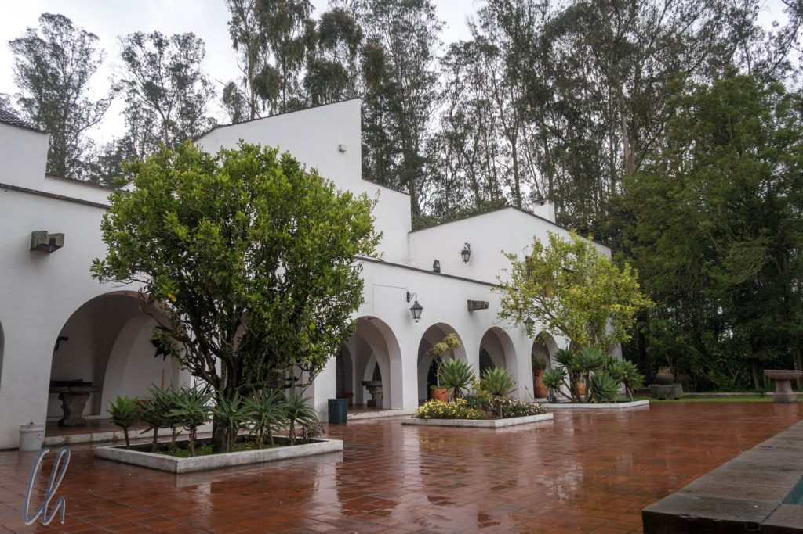

# Die zahlreichen Facetten von Quito

Nach unserem Aufenthalt in [Otavalo](http://wittmann-tours.de/otavalo-eine-typisch-ecudorianische-stadt/) kehrten wir nach Quito zurück. Von dort aus unternahmen wir die Ausflüge zum [Mitad del Mundo](http://wittmann-tours.de/tanz-auf-dem-aequator/) und [Pululahua-Krater](http://wittmann-tours.de/pululahua-der-ritt-im-vulkan/). In Quito und um Quito herum gab es aber noch deutlich mehr zu sehen, wovon wir in diesem Artikel berichten möchten.

<!--more-->

## Erweiterter Stadtrundgang in Quito

Bei unserem zweiten Aufenthalt in Quito wohnten wir nicht in der historischen Altstadt, sondern im Mariscal, einem modernen Viertel mit vielen Hotels, Restaurants und leider einer äußerst lebhaften und lautstarken Partyszene. Von dort aus liefen wir am ersten Tag in Richtung Innenstadt. Der Weg führte vorbei an der Sternwarte, an einem großen Denkmal für Simón Bolívar bis zur [Basilica del Voto Nactional](https://de.wikipedia.org/wiki/Bas%C3%ADlica_del_Voto_Nacional).

Die Basilica ist eines der auffälligsten Gebäude von Quito, aber sie ist nicht alt (und steht auch nicht im historischen Zentrum). Sie wurde 1924 nach über 20 Jahren Bauzeit fertiggestellt, aber erst 1988 geweiht. Die eher schlichte, neugotische Kirche ist eine der größten ihrer Art in der neuen Welt und weist einige interessante Details auf. Die Wasserspeier stellen einheimische Tierarten dar z.B. Lamas, Iguanas und Schildkröten.

## Die Capilla del Hombre

Das in unseren Augen sehenswerteste Museum in Quito war die [Capilla del Hombre](https://en.wikipedia.org/wiki/La_Capilla_del_Hombre), welche die Werke von [Oswaldo Guayasamín](https://de.wikipedia.org/wiki/Oswaldo_Guayasam%C3%ADn), einem der bedeutendsten Künstler Lateinamerikas des 20. Jahrhunderts, zeigt. Beeinflusst wurde sein Werk durch Van Gogh, Da Vinci, El Greco und maßgeblich Picasso. Auch konnte man das Wohnhaus von Oswaldo Guayasamín besichtigen, der seinerseits Kunstwerke vieler verschiedener Richtungen sammelte, indigene Artefakte, religiöse Bilder und Skulpturen (obwohl er Atheist war) und vieles mehr.

Die Capilla del Hombre (Die Kapelle des Menschen) ist der Bevölkerung Lateinamerikas gewidmet und hat ihr Leben und Leiden, sowie die Gewalt, der sie ausgesetzt ist und war, zum Thema. Eines der beeindruckendsten Werke war das große Gemälde [El Toro y el Cóndor](http://www.capilladelhombre.com/index.php/obra/murales-y-monumentos/129-el-toro-y-el-condor-1998), welches eine alte Tradition darstellt, das sogenannte Blutfest (Yaguar Raimi oder Yáwar Fiesta). Während der Feierlichkeiten wird ein Kondor auf dem Rücken eines Bullen festgebunden und beide sind so gezwungen, bis zum Tod eines der Tiere zu kämpfen. Dabei stellt der Stier die alte, durch die spanische Kolonialmacht geprägte, und der Greifvogel die neue Welt dar. Wenn der Kondor gewinnt, ist das ein Zeichen für eine gute Ernte.

## Mit der Teleférico hoch hinauf

Echte Höhenluft schnupperten wir beim Ausflug mit der [Teleférico](https://de.wikipedia.org/wiki/Telef%C3%A9riQo) zum Rucu Pichincha (4690m), dem Hausvulkan von Quito. Die Teleférico ist eine Seilbahn, die den Besuchern eine willkommene Abkürzung der ersten 900 Höhenmeter bis zum Gipfel bietet. Dabei liegt schon die Talstation mit 3050m oberhalb des Gipfels des höchsten Berges in Deutschland, der [Zugspitze](https://de.wikipedia.org/wiki/Zugspitze) (2962m). Die Bergstation war zu ihrer Eröffnung im Jahre 2006 mit 3950m über dem Meeresspiegel die höchste Bergstation der Welt. So hoch hinauf waren wir auf unserer Reise bisher noch nicht gelangt.

Folgerichtig fühlten wir die Höhe sehr deutlich. Die [Höhenanpassung](https://de.wikipedia.org/wiki/Akklimatisation) dauert (leider) deutlich länger als das Auskurieren von Jetlag. Der Weg zu den diversen Aussichtspunkten nahe der Seilbahnstation war nicht sonderlich steil, aber trotzdem mussten wir sehr langsam gehen, kleine Schritte und viele Pausen machen, da uns schnell die Puste ausging. Aber was genau steckt dahinter? Es ist nicht so, dass die Sauerstoffkonzentration in größerer Höhe abnimmt, sondern der Hauptfaktor ist der [abnehmende Luftdruck](https://de.wikipedia.org/wiki/Luftdruck#Abnahme_mit_der_H%C3%B6he). Auf knapp 4000m beträgt der Luftdruck nur noch 60% des Luftdrucks auf Meeresspiegelniveau und daher gelangt beim Einatmen weniger Luft (und damit weniger Sauerstoff) in die Lunge.

## Ausblick über Quito auf dem Weg zum Pichincha

Auch wenn wir leicht aus der Puste gerieten, der Ausblick auf Quito und das Umland war grandios. Wir konnten einige Orte erkennen, an denen wir bereits gewesen waren oder die wir noch besuchen wollten, die Altstadt, die Capilla del Hombre, den Panecillo. Von den Bergen auf der sogenannten [Straße der Vulkane](https://de.wikipedia.org/wiki/Allee_der_Vulkane) konnten wir nur den [Pasochoa](https://en.wikipedia.org/wiki/Pasochoa) in der Ferne erkennen. Alle anderen versteckten sich in den Wolken. Auch der Gipfel des Rucu Pichincha schaute nur gelegentlich hervor.

Auch wenn wir witzelten, wir hätten unsere Skier vergessen, herrschte oben kein ewiges Eis. Mollig warm war es trotzdem nicht, aber immerhin gut 10 Grad Celsius. Die Vegetation bestand aus ein paar Büschen, wenigen Blumen (manche davon ohne Stiel) und dichtem 30 bis 40 Zentimeter hohem Gras. Sogar einige Tiere trafen wir auf dem Wanderweg: diverse Spatzen, Greifvögel und sogar ein Kaninchen haben wir gesichtet.

Ganz bis zum Gipfel sind wir (wie geplant) nicht aufgestiegen. Als wir auf 4300 Metern angekommen waren, zogen immer mehr Wolken auf, der Gipfel war verhüllt und wir sehnten uns auf keinen Fall nach weiteren 400 Höhenmetern. So kehrten wir um und auf einmal ging alles ganz leicht! Den Abstieg bewältigten wir in weniger als der Hälfte der Zeit, die wir für den Aufstieg gebraucht hatten. Zurück an der Seilbahnstation stärkten wir uns statt mit Germknödeln und Skiwasser mit Tamales, Empanadas und Cola ;).

## Die Polizei, unser Freund und Interviewpartner

In der Innenstadt von Quito herrschte tagsüber immer eine starke Polizeipräsenz. Einige der Polizisten waren explizit zur Bewachung der Touristen abgestellt, die [Policía Turística](https://www.quito-turismo.gob.ec/nuestros-servicios/policia-turistica). An einem Tag startete die Polizei zusätzlich zur Befriedung der Innenstadt auch noch eine Statistikoffensive. Auf unserem Rundgang wurden wir mehrmals angesprochen und freundlich befragt, welche Orte in Ecuador wir schon besucht hätten und was noch auf unserem Programm stände. Wir wurden darauf hingewiesen, dass wir vorsichtig sein und gut auf unsere Wertsachen aufpassen sollten. Rucksäcke sollten immer vorne vor der Brust getragen werden und es reiche voll und ganz, eine Kopie des Passes mit sich zu führen. Am Ende trugen wir uns jeweils brav in eine Liste ein, damit die Damen und Herren der Polizei nachvollziehen konnten, mit wem und wo sie die Interviews geführt hatten. Anschließend baten Sie uns, zur Dokumentation ein Foto von uns machen zu dürfen. Wir benutzten die Gelegenheit, den Spieß umzudrehen und baten ebenfalls um eine Aufnahme.

## Aufregung im Trolebus

Der Trolebus (Oberleitungsbuslinie) ist eines der besten öffentlichen Verkehrsmittel in Quito. Er hat oft eigene Spuren, fährt im 2- bis 3-Minutentakt und ist günstig (25 Cent pro Fahrt). Allerdings hätte uns im Trolebus fast ein ähnliches Schicksal ereilt wie in der Metro in Mexiko City. Auf einer Fahrt, kurz nachdem wir eingestiegen waren, wollte ich auf meinem Telefon nachsehen, wie viele Stationen wir fahren müssten, aber da war kein Telefon, auch nicht in den anderen Taschen, es war geklaut worden!

Wenige Momente später hielt der Bus an der nächsten Haltestelle und ein Mann direkt neben mir steuerte als einziger auf den Ausgang zu. Ich packte ihn eher instinktiv an seiner Jacke und fragte ihn unüberhörbar „Tienes mi teléfono?“ ("Hast Du mein Telefon?"), verstört schaute er mich an, und ich fragte deutlich in die Menge „Quién tiene mi teléfono?“ ("Wer hat mein Telefon?"). Mona rief „Ladrón, ladrón!“ („Dieb“). Die andern Leute waren alarmiert, zwei andere Mitfahrer packten den Mann und die Türen schlossen sich wieder, der Bus fuhr weiter.

Es folgten hastige Unschuldsbeteuerungen des Festgehaltenen. Ein Mann neben mir fragte mich nach meiner Telefonnummer, damit er mich anrufen könne. Ich gab ihm die ecuadorianische Nummer und er fing an zu wählen. Auf einmal fiel mein Telefon auf den Boden, der Dieb hatte offensichtlich die Nerven verloren. Ob es der Mann war, den ich gepackt hatte, wird sich nie herausstellen. Diebstahl in öffentlichen Verkehrsmitteln ist anscheinend ein Problem, aber die Quiteños scheinen in solchen Situationen zusammenzuhalten, um sich gegenseitig zu schützen. Ohne die spontane Hilfe der anderen Fahrgäste wäre das Telefon weg gewesen. Großes Glück gehabt!

## Der Panecillo

Eine Besichtigung von Quito ist nicht vollständig ohne einen Besuch des [Panecillo](https://de.wikipedia.org/wiki/El_Panecillo) (wörtlich übersetzt am ehesten der "Brötchenhügel"), um die Aussicht über die Altstadt zu genießen und die Marienstatue, das Wahrzeichen der Stadt, zu bewundern. Die Darstellung der Muttergottes an sich ist bemerkenswert, da die [Jungfrau vom Panecillo](https://en.wikipedia.org/wiki/Virgin_of_Quito) (oder auch die Jungfrau von Quito) als apokalyptische Madonna aus der Offenbarung ([Offenbarung 12, 1-2](https://www.bibleserver.com/text/EU/Offenbarung12)) mit Flügeln erscheint.

Die Aluminium-Statue an sich ist 30 Meter hoch und damit 3 Meter höher als das [Hermannsdenkmal](https://de.wikipedia.org/wiki/Hermannsdenkmal). Rechnet man jedoch den Sockel mit ein, bringt es der Hermann auf 53 Meter und die Virgen nur auf 41 Meter ;).

## Arm und Reich in Quito

Quito zeigte sich uns mit verschiedenen Gesichtern und hatte viele interessante Orte zu bieten. Es gab die auf Hochglanz polierte Altstadt, eingezäunte, bewachte Wohnanlagen für Reiche und trotz aller Reformen noch viel Armut und Ungleichheit. In einigen Stadtvierteln wirkte Quito sehr modern und trotzdem war nicht zu übersehen, dass nicht alle vom Boom der vergangenen Jahre profitiert hatten, zum Beispiel die fliegenden Händler, die überall versuchten, ihre Waren zu verkaufen.

Auch an den Ampeln boten sie alles von Trinkwasser über Süßigkeiten bis Zeitungen feil. Einige versuchten auch, ihr Publikum (sprich die vor der rotem Ampel wartenden Autofahrer) für eine milde Gabe zu unterhalten. Bemerkenswert waren ein Feuerspeier, ein sehr guter Jongleur und ein Seiltänzer, der das Seil zwischen die roten Ampeln auf beiden Straßenseiten spannte, eine kurze Einlage bot und schnell genug wieder abgebaut hatte, dass der Verkehr bei Grün weiterfahren konnte. Natürlich blieb ihm auch noch genug Zeit, um mit einem Hut durch die Autoreihen zu gehen.

Insgesamt haben wir eine Woche in Quito verbracht und die Zeit sehr genossen. Nur die Touristenpolizei war leider nicht zu Stelle, als wir sie gebraucht hätten ;)
