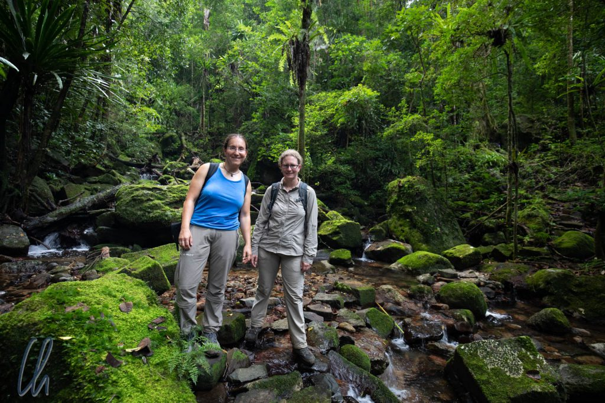
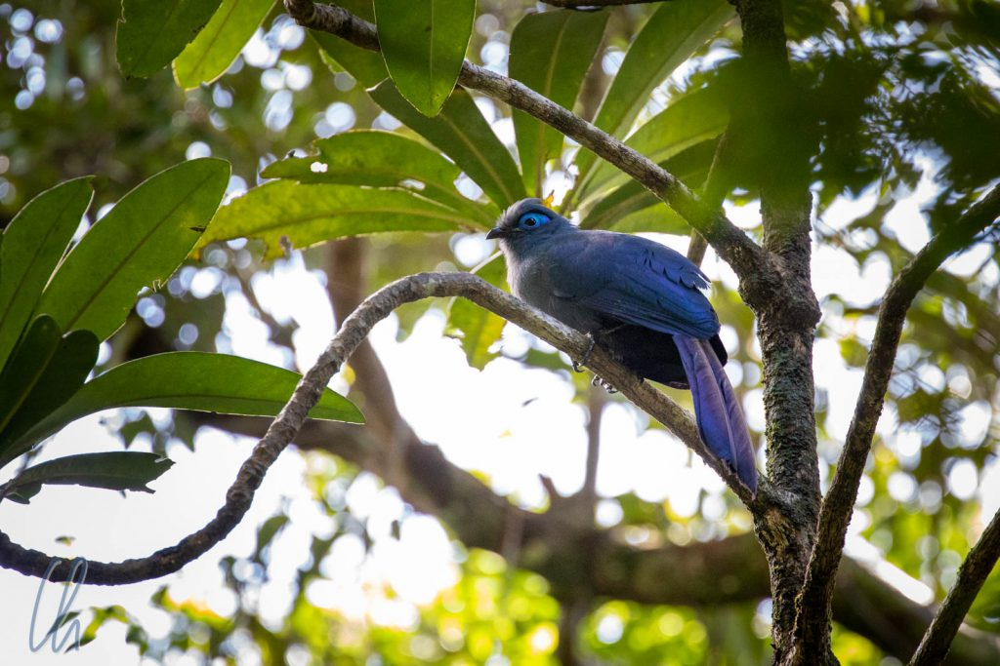
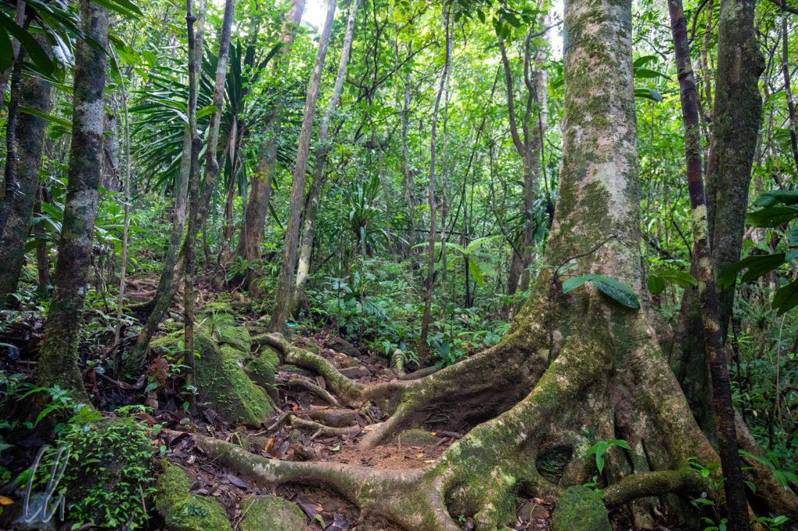
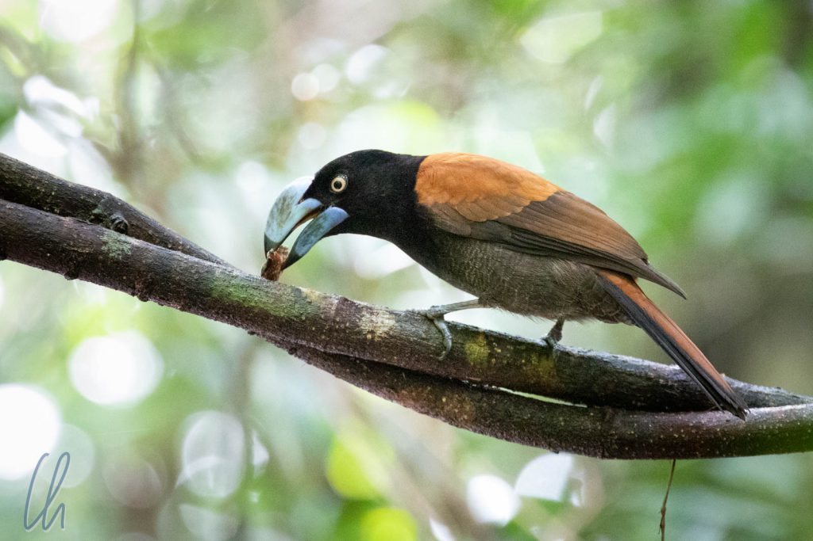
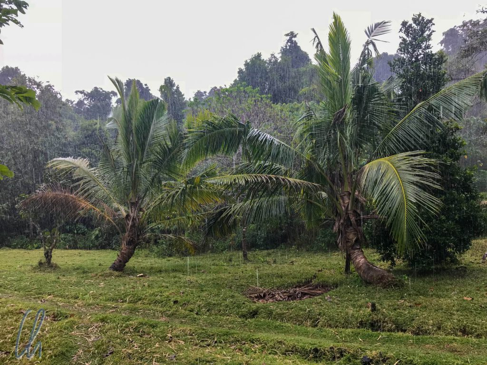
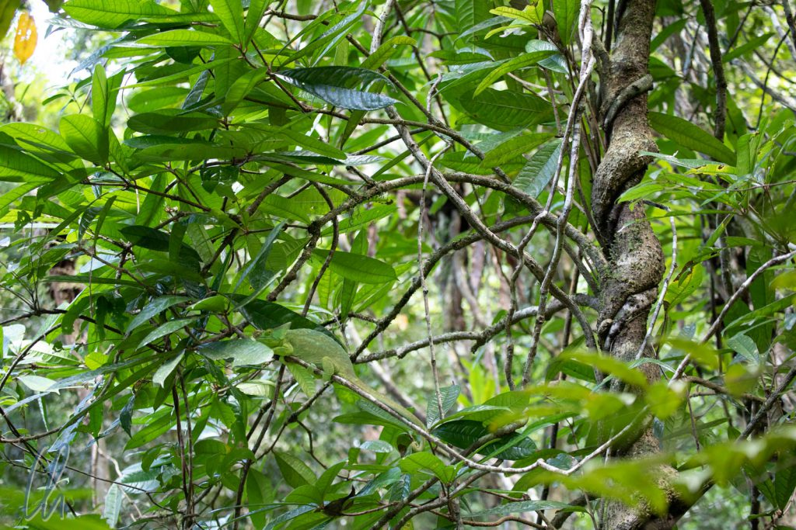

# Drei Tage im Masoala-Regenwald

Nach einer knapp 2-stündigen Bootsfahrt von [Nosy Mangabe](http://wittmann-tours.de/nosy-mangabe) aus erreichten wir unser Ziel, die Masoala Forest Lodge. Wir landeten an einem Strand und gingen kaum 200 Meter landeinwärts, wo ein paar hübsche kleine Bungalows auf uns warteten. So viel Luxus hatten wir nach der vorherigen Campingnacht kaum erwartet. Um das gute Wetter - sprich kein Regen - auszunutzen, starteten wir umgehend auf die erste Wanderung durch den Urwald.

<!--more-->

## Angekommen auf der Masoala-Halbinsel

Armand war kein Führer für Fußkranke. In den kommenden Tagen wanderten wir ausdauernd über die Wege Masoalas. Morgens waren wir 3 bis 4 Stunden unterwegs, nachmittags wetterabhängig (je nachdem wie viel es regnete). Abends unternahmen wir jeden Tag eine Nachtwanderung zwischen Sonnenuntergang und Abendessen.

Waren die Wege in der Nähe des Camps noch gut zu erkennen, so konnte man sie weiter entfernt kaum von der Umgebung im Wald unterscheiden, da sie teilweise von Wurzeln überwuchert waren. Ohne Führer hätte die Gefahr bestanden, sich hoffnungslos zu verlaufen. Für die geringe Anzahl von Besuchern war das gesamte Wegenetz aber in einem sehr guten Zustand.

## Auf der Suche nach den roten Varis

Armand wollte uns gerne die roten Varis (Lemuren mit einem rot-braunen Fell) zeigen. Sie sind in der Wildnis nur noch im Masoala-Regenwald zu finden, da ihr Lebensraum immer weiter zerstört wird. Auf der ersten Wanderung hatten wir allerdings kein Glück. Armand war einige Wochen nicht in diesem Gebiet gewesen und wusste (noch) nicht, wo die wenigen Futterbäume standen, die aktuell Früchte trugen. Für die Lemuren herrschte sozusagen Fastenzeit. Durch das geringe Nahrungsangebot waren sie nicht so aktiv und ruhten sich die meiste Zeit in den Baumkronen aus.

Trotzdem sahen wir viele interessante Tiere, große bunte Vögel zum Beispiel. Eine der eindrucksvollsten Spezies war der [Helmvanga](https://de.wikipedia.org/wiki/Helmvanga). Äußerlich erinnert er entfernt an einen Tukan (ist aber endemisch auf Madagaskar) und besitzt einen großen hellblauen Schnabel, der sich vortrefflich dazu eignet, dicke Käfer zu knacken.

Armand zeigte uns viele Facetten des Regenwaldes. Wie gut er sich wirklich auskannte, sollten wir aber erst in den kommenden Tagen erleben. Der erste Tag fing verheißungsvoll an, mit Vögeln und Chamäleons. Die roten Varis hingegen versteckten sich noch erfolgreich. Vor allem Armand konnte seine Enttäuschung nicht verbergen, aber vor uns lagen ja noch zwei weitere Tage. Wir hingegen waren sehr beeindruckt, wie viele Tiere wir bereits gesehen hatten, die wir ohne Armand niemals entdeckt hätten.

## Nachtwanderung

Wie so häufig veränderte sich der Wald nach Einbruch der Dunkelheit grundlegend. Das Konzert der Frösche ertönte von überall her und die Lichtkegel unserer Taschen- und Stirnlampen, die über die feuchtglänzenden Blätter glitten, waren die einzigen Lichtquellen. Diverse Spinnen hatten sich hervor getraut und saßen auf dem Boden und in den Blättern der Bäume, ebenso wie die verschiedensten Frösche.

Nachdem wir tagsüber die roten Varis nicht gefunden hatten, sahen wir immerhin in der Nacht einige Mausmakis durch die Bäume huschen bzw. ihre reflektierenden Augen im Blattwerk. Gelegentlich waren wir sogar nahe genug, um die kleinen Kerle ganz zu sehen.

Und auch Chamäleons durften nicht fehlen. Meisterlich versteckten sie sich zwischen den Blättern, aber Armand fand trotzdem einige Exemplare. - Bestimmt sind wir an vielen, vielen anderen einfach vorbeigegangen und vielleicht dachten sie sich: "Puh, das ist ja nochmal gutgegangen!"

## Wildlife rund um unsere Bungalows

Nicht nur auf unseren Wanderungen begegneten wir vielen Tieren, schon auf der Lichtung rund um unsere Bungalows gab es einiges zu sehen. An der Außenwand des Pavillons, in dem die Mahlzeiten serviert wurden, saßen des Öfteren leuchtend grüne [Taggeckos](https://de.wikipedia.org/wiki/Madagaskar-Taggecko).

Gelegentlich kamen auch Gruppen von Lemuren vorbei. Sie kündigten sich meist durch das Rascheln von Blättern an und ihr Ziel war ein Baum mit schmackhaften Früchten am Waldrand.

## Die Vari-Safari

Am zweiten Tag war Armand bestens vorbereitet. Er hatte schon ohne uns den Wald erkundet und eine Gruppe von [roten Varis](https://de.wikipedia.org/wiki/Roter_Vari) gefunden, die er uns zeigen wollte. Die Lemuren waren in der Tat scheinbar die ganze Zeit im Siesta-Modus. Sie saßen hoch oben in den Bäumen und bewegten sich kaum, nahmen uns aber trotzdem war.

Der Bann war gebrochen, an diesem Morgen sahen wir dank unseres Lemurenflüsterers gleich mehrere Gruppen von roten Varis. Einmal hörte Armand einen Ruf und wusste sofort, dass es die rotbepelzten Primaten waren, aber wo? Nach kurzem Überlegen meinte er, wir müssten umkehren. Wir folgten einem schmalen Pfad, teilweise steil bergauf. Nach mindestens 10 Minuten saßen sie in der Tat über unseren Köpfen, vielleicht handelte es sich um einen ihrer Lieblingsbäume. Auch als wir wussten, wo sie sich aufhielten, war es immer noch schwierig genug, sie wirklich zu sehen. Nur aus einem sehr begrenzten Blickwinkel konnten wir sie zwischen den Blättern erspähen.

## Miniatur auf dem Weg

Nicht nur hoch oben in den Baumwipfeln, sondern auch mitten auf den Wegen entdeckte Armand (wie auch immer?) spannende Tiere. Die Wege waren oft mit Wurzeln überzogen und mit Laub bedeckt. Da es im Regenwald keine Jahreszeiten wie in Europa gibt, sind die meisten Bäume das ganze Jahr über grün, am Boden sieht es aber trotzdem konstant herbstlich aus, da sie ständig Blätter verlieren. Auf einem steilen Stück Weges, wo jeder Schritt wohlbedacht sein wollte, zeigte Armand auf den Boden. Ein Mini-Chamäleon der Art [Brookesia](https://de.wikipedia.org/wiki/Brookesia) befand sich, kaum sichtbar, im braunen Laub, das den Pfad bedeckte.

Wie klein es wirklich war, wird erst im Größenvergleich klar. Vorsichtig nahm Armand das kleine Brookesia auf seine Hand, damit wir es betrachten konnten.

Wesentlich größer und auch deutlich aktiver waren mehrere [Tausendfüßler](https://fr.wikipedia.org/wiki/Aphistogoniulus_corallipes), die unseren Weg überquerten. Ihre kräftige rote Farbe soll davor warnen, dass sie nicht gut schmecken. Also haben wir uns beherrscht und nicht probiert ;).

https://www.youtube.com/watch?v=nRY8q3ETReI

## Gefiederte Freunde bei Nacht

Erstaunlicherweise sahen wir des Nachts auch viele Vögel. So saß zum Beispiel ein [Wald-Eisvogel](https://de.wikipedia.org/wiki/Madagaskarfischer) zwischen den Ästen versteckt. Interessanterweise ist er an ein Leben im Dschungel angepasst und nicht auf Gewässer angewiesen. Der Regenwald bietet ihm genügend Nahrung in Form von Fröschen, Insekten, Geckos und Chamäleons.

Kurze Zeit später flog ein Schatten fast lautlos über unsere Köpfe, eine [Eule](https://de.wikipedia.org/wiki/Madagaskar-Zwergohreule). Als wir uns näherten, flog sie immer wieder ein Stückchen weiter. Eine Taschenlampe brauchte sie auf keinen Fall, um sich im dunklen Wald zu orientieren, stattdessen blinzelte sie uns mit ihren eindrucksvollen gelben Augen entgegen.

## Chamäleons in der Dunkelheit

Am Ende der zweiten Nachtwanderung zeigte Armand, was in ihm steckte. Wir hatten angehalten, um einen Wieselmaki in der Ferne zu beobachten. Es war nicht einfach, ihn zwischen all den Ästen und Zweigen zu erspähen. Während wir mit dem Maki beschäftigt waren, schaute Armand sich weiter um. Dann sagte er mit seiner leisen Stimme, die aber etwas aufgeregt klang: "Dort ist ein Chamäleon, ein junges Parsons Chamäleon." Wir fragten uns (mal wieder) wie er die gut getarnte Echse im dunklen Wald gesichtet hatte, als er den Weg verließ, um uns das Chamäleon zu zeigen. 10 Meter von uns entfernt, sagte er, wieder leise aber bestimmt: "Kommen Sie! Kommen Sie!"

Die Wege im Masoala-Nationalpark sind mal mehr, mal weniger abenteuerlich, oft mit Wurzeln, Steinen und Pflanzen bedeckt, aber jetzt ging es querwaldein, und das mit mehr als 45 Grad Gefälle. Wir beäugten ungläubig die schlüpfrige, dicht bewachsene Böschung, aber es gab schließlich ein Chamäleon zu sehen, auf ging es! Es war rutschig, steil und finster, schwups, den Halt verloren und ein Stückchen auf den feuchten Blättern bergab geschliddert. Zum Glück gab es 2 bis 3 Zentimeter dünne Baumstämmchen, an die wir uns klammerten und die uns erstaunlich viel Halt gaben. Bei Armand angekommen, standen wir wirklich keine 3 Meter von einem jungen Parsons Chamäleon entfernt. Es schlief und öffnete nicht die Augen, obwohl wir auf unserem Weg nach unten eine Menge Lärm verursacht hatten.

Bei der nächsten Nachtwanderung ereignete sich etwas Ähnliches. Auf einmal sagte Armand: "Da, ein kleines Chamäleon!" Wir sahen natürlich wieder nichts, nur Vegetation. Armand ging zielgerichtet in den Wald, vielleicht 5 bis 6 Meter ins Gestrüpp, und fing an, kräftig an einer Schlingpflanze zu ziehen. Er zog bestimmt 3 Meter Liane von einem Baum herunter. Wir schauten verwundert und gespannt zu, bis er auf das Chamäleon zeigte: "Da ist das Chamäleon.", aber wir sahen immer noch nichts. Er pflückte ein kleines Ästchen ab, auf dem das 5 Zentimeter kleine Tier saß. Erst hatte es die Miniäugelchen geschlossen, aber insgesamt hatten wir es doch geweckt. Es bewegte sich jedoch kaum und ließ sich von allen Seiten betrachten.

## Kein Geld für Umweltschutz

Bei so viel Wald hätte man fast vergessen können, dass wir keine 200 Meter vom Meer entfernt wohnten. So schnorchelten wir einen Nachmittag im Meer und kombinierten ein anderes Mal eine Bootsausfahrt mit einer Strandwanderung. Drei Männer in zwei kleinen einheimischen Booten flüchteten dabei regelrecht vor uns, illegale Fischer, wie uns Armand erklärte. Auf einem Weg gerade neben der Grenze zum Nationalpark sahen wir eine frisch abgeschnittene Holzstange liegen. Armand sagte, dass diese Baumart aus dem Park stamme und geschützt sei. Leider könne man wenig unternehmen, es gäbe einfach nicht genug Personal, um den Nationalpark effektiv zu schützen.

Da begegnete er uns erneut, der ständig bestehende Konflikt zwischen Umweltschutz und den Interessen der Bewohner der Region. Die Natur ist dort Lebensgrundlage für die Menschen und Alternativen sind rar. Da nur wenige Patrouillen durchgeführt werden, ist es nicht verwunderlich, dass immer wieder illegal gefischt wird und auch im Wald verbotene Aktivitäten stattfinden.

## Begehrte Edelhölzer

Der Masoala-[Nationalpark](https://de.wikipedia.org/wiki/Nationalpark_Masoala) umfasst 2400 Quadratkilometer. Es gibt 65 Ranger, um ihn zu schützen. Das ergibt eine Fläche von ca. 4000 Fußballfeldern pro Ranger. Wenn man nun bedenkt, dass 55 dieser Männer sich öfter im Büro als in der Natur aufhalten, wird die Hoffnungslosigkeit der Situation offenbar. Für Naturschutz ist einfach nicht genug Geld vorhanden - oder vielleicht liegen die Schwerpunkte des Interesses der Politik auch anders?

Mit Edelhölzern lässt sich sehr schnell sehr viel Geld verdienen. Zwar ist der Wald offiziell geschützt, aber vor allem in den politischen Wirren von 2009 fanden [kaum Kontrollen](https://www.geo.de/natur/oekologie/11971-bstr-illegaler-holzhandel-raubbau-am-regenwald) statt. Vor allem die Harthölzer, die unter dem Sammelbegriff [Rosenholz](https://de.wikipedia.org/wiki/Rosenholz) zusammenfasst werden, sind aufgrund ihrer rötlichen Farbe in China sehr begehrt: Rot ist die asiatische Farbe des Glücks.

International ist das Fällen vieler Baumarten durch das [Washingtoner Artenschutzübereinkommen (CITES)](https://de.wikipedia.org/wiki/Washingtoner_Artenschutz%C3%BCbereinkommen) verboten. Auch in Deutschland und der EU gibt es schwierig zu findende und zu verstehende [Informationen](https://www.bfn.de/themen/cites/arteninfos/einfuhr-von-holz-geschuetzter-arten.html), welche Arten nicht gehandelt werden dürfen. Durch intransparente Lieferketten, eine große Nachfrage und damit verbunden hohe Preise ist zu vermuten, dass der lukrative Handel dennoch im Geheimen weiter [floriert](https://www.spektrum.de/news/obszoen-hohe-profite/1305972), und dass sich Politiker, Polizisten und Händler auf das Üppigste daran bereichern.

## Erlebnis Regenwald

Für diejenigen unter Euch, die gerne den Masoala-Regenwald erleben würden, ohne die beschwerliche Reise auf sich zu nehmen, können wir einen Besuch der [Masoala-Halle](https://de.wikipedia.org/wiki/Masoala-Halle) des Züricher Zoos empfehlen, durch die wir 2012 staunend spaziert sind. Der Zoo unterstützt den Schutz des einzigartigen Ökosystems in Madagaskar und hat eine riesige Halle gebaut, in der Dschungel wächst und in der sich Lemuren und andere Tiere frei bewegen können. Das Erlebnis in Zürich ist natürlich deutlich zivilisierter als die Reise zum echten Vorbild, bildet aber Flora und Fauna sehr gut ab. Armand war während der Konzeptionsphase zur Beratung vor Ort in der Schweiz gewesen und er erzählte uns, wie er beteiligte Biologen auf der Masoala-Halbinsel geführt hatte.

Für uns waren es drei wunderschöne, aber anstrengende Tage im Masoala-Nationalpark, in denen wir viel gewandert sind, auf abenteuerlichen Wegen, auf und ab über Stock und Stein und bei tagsüber stetig hoher Luftfeuchtigkeit. Im Schatten des Waldes wurde es zwar nicht übermäßig heiß, aber die Fortbewegung war trotzdem schweißtreibend. Es regnete jeden Tag mehrmals, wenn auch nicht dauerhaft. Armand hatte den Regenwald über viele Jahre erforscht und es bereitete ihm sichtlich Freude, uns die Tiere und Pflanzen näherzubringen. Seine Lieblinge waren die roten Varis.

Wenn Führer anfangen zu fotografieren, dann gibt es etwas Besonderes zu sehen. Auf der letzten Wanderung kamen wir einer Gruppe roter Varis dadurch sehr nahe, dass sie auf einem Baum saßen und wir oben an einer steilen Böschung standen. Wieder schlugen wir uns etwas querwaldein durch die Vegetation, damit keine Zweige im Weg wären. Dadurch befanden wir uns schließlich fast auf Augenhöhe mit den Lemuren.

