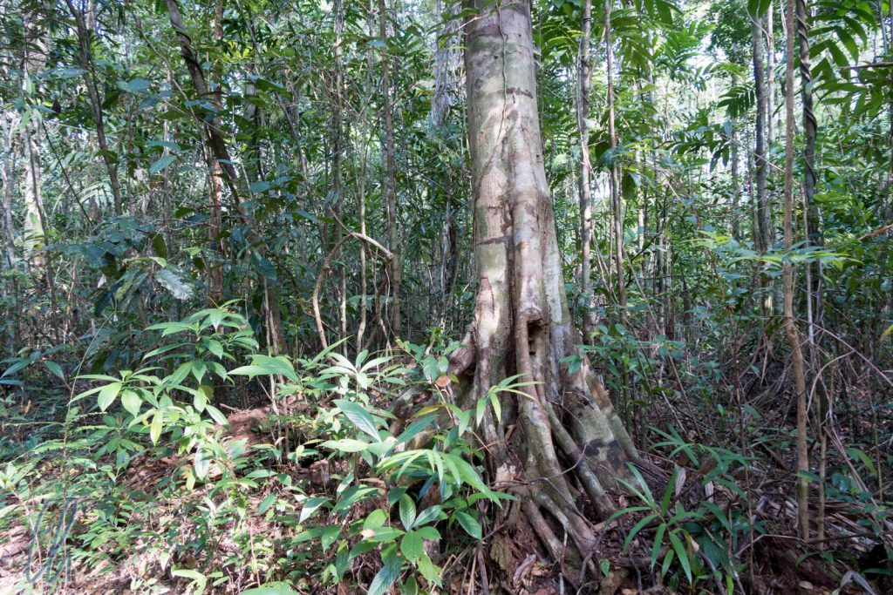

Nach einem eher kulturlastigen Programm in Phnom Penh, [Angkor](http://wittmann-tours.de/die-tempel-von-angkor/) und Battambang freuten wir uns darauf, auch die Natur Kambodschas kennenzulernen. Wir fuhren ins Kardamom-Gebirge und besuchten das Öko-Tourismus-Projekt in [Chi Phat](http://www.chi-phat.org/), welches wie [Phnom Tamao](http://wittmann-tours.de/kuscheln-mit-elefanten-im-phnom-tamao/) von [Wildlife Alliance](https://www.wildlifealliance.org/) unterstützt wird. Dort unternahmen wir ein 3-tägiges Dschungel-Trekking. Allein das Wort Dschungel riecht schon nach Abenteuer und wir sollten nicht enttäuscht werden.

<!--more-->

## Von Phnom Penh in den Dschungel

Schon die Anreise war ein kleines Abenteuer. Wie empfohlen hatten wir eine Busverbindung nach Koh Kong gebucht und zeigten dem Busfahrer auf der Karte Andoung Teuk, wo wir aussteigen mussten. Zum Glück kannte er den Ort. Anscheinend waren wir nicht die Ersten, die dorthin wollten. Fünf Stunden dauerte die Fahrt mit dem Möchtegern-Rennfahrer. Wir waren also sehr erleichtert, endlich kurz vor der Brücke des Phipot-Flusses aussteigen zu dürfen.

Dort gab es nicht viel mehr als ein kleines Hüttchen, die Bushaltestelle, wo die Zeit stillzustehen schien. Auf der Landstraße war fast kein Verkehr, und in der brütenden Mittagshitze regte sich auch sonst nichts. In der Bushaltestelle warteten noch einige weitere Touristen und mehrere Einheimische, von denen wir uns nicht sicher waren, ob sie irgendwo hin wollten oder ob sie einfach dort waren. Eine ältere Dame verkaufte Snacks und Erfrischungen.

Dankbar nahmen wir im Schatten Platz. Das Boot nach Chi Phat sollte fahren, sobald die beiden noch fehlenden Reisenden eingetroffen sein würden. So warteten wir auf eine sehr angenehme Art und Weise, die Hütte strahlte eine unbeschreibliche Ruhe aus: Niemand wusste, wie lange es dauern würde, keiner schien etwas vorzuhaben, die Hitze erdrückte jegliche Ambitionen, den Schatten verlassen zu wollen, aber fühlten wir gut aufgehoben dort.

## Willkommen in Chi Phat

Gut 45 Minuten später kamen in der Tat die beiden weiteren Gäste an. Wir trugen unsere Rucksäcke zum Boot und fuhren flussaufwärts in Richtung Chi Phat. Unterwegs sahen wir trotz knatterndem Außenborder sogar einige Vögel, anfangs in den Mangroven, später in den Bäumen und Sträuchern am Flussufer. In Chi Phat angekommen bezogen wir einen sehr gemütlichen Bungalow, den ein Lehrer des Dorfes auf seinem Grundstück für Gäste gebaut hatte.

Nach dem Abendessen nahmen wir unsere Ausrüstung in Empfang: Einen Rucksack, eine Hängematte mit integriertem Moskitonetz und eine Decke. Drei Liter Wasser und ein Frühstückspaket würden wir am Morgen bekommen. Außerdem sollten wir mitnehmen, was wir im Dschungel bräuchten, z.B. Waschzeug, Handtuch, Sonnen- und Insektenschutz. Beim Einpacken nach dem Abendessen versuchten wir uns vorzustellen, was notwendig sein würde. In Anbetracht der Tatsache, dass im Bungalow bereits Scharen von Insekten die Lichtquellen umschwärmten, Mona bei uns im Bad schon mit einem Frosch engere Bekanntschaft geschlossen hatte und es die nächsten beiden Abende keinen Strom geben würde, fragen wir uns, ob wir uns das wirklich gut überlegt hätten ;) - aber es gab kein zurück mehr. Am kommenden Morgen sollte es um 5:30 Uhr losgehen.

## Mit dem Boot in die Wildnis

Morgens vor der Abfahrt trafen wir unsere beiden Begleiter, unseren Guide Mao und den Koch ("Forest Cook") Kirn, beide junge Männer um die 30 Jahre. Die ersten 2 Stunden fuhren wir motorgetrieben im Boot, erst ein Stückchen den Phipot flussabwärts und dann flussaufwärts in einem Seitenarm. Gut 15 Minuten nachdem wir abgelegt hatten, tauchten wir in dichte Nebenbänke ein. Blätter trieben auf der Wasseroberfläche und immer wenn es windstill war, lag ein leicht modriger Geruch in der Luft. Die Sonne brauchte gut eine Stunde, um den Nebel aufzulösen. Bis dahin war es erstaunlich frisch auf dem Boot.

Gegen 8 Uhr wechselten wir vom Motorboot in je ein Ruderboot. Bei geringerer Lärmentwicklung hätten wir vielleicht die Möglichkeit, ein paar Tiere zu beobachten.

In der Tat turnten ein paar Eichhörnchen, rotbraune und größere schwarze, durch die Bäume. Außerdem sahen wir einen [Nashornvogel](https://de.wikipedia.org/wiki/Nashornv%C3%B6gel), grüne Papageien und einige andere schwer bestimmbare Vögel, die den Tag begrüßten.

## Zu Fuß durch den Dschungel

Nach gut 45 Minuten legten wir an. Ab jetzt ging es zu Fuß weiter. Mao führte unsere Vierergruppe, in der linken Hand einen Stock und in der rechten eine Art Machete. Diese verwendet er, um immer wieder den Weg freizumachen. Er kürzte Äste und Gräser. Wurzeln, die vorwitzig über den Pfad verliefen und zu Stolperfallen werden konnten, durchtrennte er mit seinem Universalwerkzeug.

Trotz noch moderater Temperaturen im Schatten der Bäume dauerte es nicht mal 20 Minuten, bis wir komplett durchgeschwitzt waren. Das Gute daran war, dass die Kleidung uns auf diese Weise angenehm kühlte. Unterwegs hielten wir immer wieder an, da Mao uns interessante Flora und Fauna zeigte: Giftige Pilze, gigantische Spinnen und Heilpflanzen.

Bei der ersten richtigen Pause bemerkte Mona, dass sich an ihrem Knöchel ein kleiner Blutegel befand. Diese possierlichen Tiere stehen wirklich aufgerichtet auf den Wegen und warten auf eine Nahrungsquelle. Auf Maos Anraten durften wir ausprobieren, dass unser DEET-haltiges Insektenspray, wie auf der Dose angegeben, auch wunderbar gegen solche Blutsauger half. Ein ordentlicher Sprühstoß und der Egel ließ los, krümmte sich und regte sich nicht mehr.

Der Höhepunkt des Morgens waren die Gibbons, deren Gesang wir zunächst in der Ferne hörten (Eine Klangprobe findet ihr ganz unten im Artikel). Je weiter wir gingen, desto deutlicher vernahmen wir ihre Rufe und dann hatte Mao sie hoch oben in den Bäumen erspäht: Ein schwarzes Männchen und ein helles Weibchen mit einem jungen Äffchen. Behände schwangen sie sich durch die Bäume, bis sie nach einiger Zeit verschwanden.

## Früher Holz und Jagd, heute Öko-Tourismus

Die Wege, auf denen wir gingen, werden heute in erster Linie für den Tourismus genutzt. Früher dienten sie dem Transport von Holz, oder Jäger bewegten sich auf ihnen. Der Wald von Chi Phat ist seit ca. 15 Jahren geschützt. Das erklärt, warum er zwar wie ein Primärwald wirkt, alte Bäume jedoch fehlen.

Auch unsere beiden Begleiter waren früher noch mit ihren Vätern im Dschungel unterwegs gewesen, um zu jagen. Daher kannten die beiden den Regenwald wie ihre Westentasche und konnten uns ständig etwas Neues zeigen. Wenn man zum Beispiel die gut 10 cm dicken Äste einer bestimmten Pflanze mit der Machete entfernt und aufhackt, so kann man das darin enthaltene Wasser wie aus einem Gefäß trinken - erstaunlich! Heute sind die Beiden überzeugte Umwelt- und Tierschützer, da sie erkannt haben, dass ein intakter Wald für sie wertvoller ist als ein zerstörter.

Die Mittagspause verbrachten wir an einem kleinen Fluss. In einem tieferen Becken des Stromes konnte man sich wunderbar im kühlen Wasser erfrischen. Es gab dort viele Schmetterlinge in allen erdenklichen Farben und Größen, kleine Zitronenfalter, orangefarbene, neongrün leuchtende, blau oder gelb gemusterte. Sie fühlten sich anscheinend von unseren Rucksäcken angezogen und ließen sich gerne darauf nieder. Einige landeten sogar auf unseren Armen und Händen und schienen den salzigen Schweiß aufzusaugen ;)

## Im Dschungel-Camp

Gegen 15 Uhr erreichten wir unser Nachtlager: eine Lichtung mit überdachten, auf Stelzen stehenden Plattformen, wo wir unsere Hängematten aufhängen konnten. Außerdem gab es Bänke und einen Tisch, die aus dünnen runden Holzstecken gebaut waren, und ein wenig einladendes Klohäuschen. Außerdem plätscherte ein kleiner Fluss in direkter Nachbarschaft, in dem wir Staub und Schweiß des Tages abwaschen konnten.

Pünktlich nachmittags um 16 Uhr machte der Regenwald seinem Namen alle Ehre. Erst fielen einige wenige dicke Tropfen, die auf das Wellblechdach unserer Unterkunft klopften. Kurze Zeit später regnete es in Strömen, vielleicht eine Stunde lang.

Abends gingen die Tage schnell zu Ende. Der Sonnenuntergang fand gegen 17:45 Uhr statt und spätestens um 18:15 Uhr war es dunkel. Kirn servierte das Abendessen entsprechend früh, um bei der Zubereitung das Tageslicht noch ausnutzen zu können. Nach dem Essen war es dunkel, nur der Schein unserer Stirnlampen erhellte das Camp. Der Dschungel jedoch ging nicht Schlafen. Ganz im Gegenteil, mit einsetzender Dunkelheit startete das Konzert der Zikaden, und auch viele andere Tiere wurden aktiv.

## Die Nacht im dunklen Wald

Eine Überraschung präsentierte uns Mao mit Hilfe unserer Stirnlampen. Leuchtete man auf den Boden, so sah man an vielen Stellen glänzende Punkte verteilt. Bei genauem Hinsehen entpuppten sie sich nicht als Reflexionen von Regentropfen, sondern von Augen, und sie waren überall. Sie gehörten zu kleinen Spinnen, die überall auf Beute lauerten, für uns allerdings harmlos waren. Trotzdem sind geschlossene Schuhe sehr zu empfehlen ;).

Aufdringlicher waren die fliegenden Insekten, Mücken, Falter und Motten. Sie alle fanden die wenigen Lichter unwiderstehlich. So war der einzige Ort, an dem wir ungestört lesen konnten, unsere Hängematte mit dem Moskitonetz. Hübsch dagegen waren einige Glühwürmchen, die uns am zweiten Abend umschwebten.

Spätestens um 21 Uhr waren alle Lampen aus und unsere Äuglein zugefallen. Die Hängematte war erstaunlich bequem :). Für uns beide war es eine neue Erfahrung, eine Nacht in der Hängematte zu verbringen. Nach dem Regen und durch die hohe Luftfeuchtigkeit wurde es im Laufe der Nacht erstaunlich kühl, so dass unsere Decken uns gute Dienste leisteten.

Die Morgendämmerung setzte ab 5:30 Uhr ein und Sonnenaufgang war gegen 6 Uhr. Auch die Geräuschkulisse des Dschungels veränderte sich wieder. Das Konzert der Zikaden verstummte und die Vögel fingen an zu singen (manche ziemlich laut). So brauchten wir keinen Wecker, um für das Frühstück um 7 Uhr bereit zu sein.

## Das Mikroklima im Regenwald

Insgesamt war das Klima im Dschungel feucht. Morgens gab es eine Art Morgennebel, als hätte der Wald während der Nacht die ganze Luftfeuchtigkeit aufgesogen und würde sie zu Beginn des Tages wieder abgeben. Während unserer Tage im Dschungel schloss sich der Kreislauf abends durch kräftige Regenfälle, obwohl offiziell Trockenzeit war. Klamotten, die über Nacht draußen gehangen hatten (d.h. außerhalb der Hängematte) waren morgens nicht nur klamm, sondern eher feucht.

Tagsüber wurde es im Dschungel nicht sehr heiß, da es fast überall schattig war, trotzdem erreichten die Temperaturen bestimmt 30 Grad. Der Wald konnte die Luftfeuchtigkeit halten und es war sehr schwül, so dass wir beim Wandern schnell wieder ins Schwitzen gerieten. Oder anders ausgedrückt: So richtig trocken war unsere Kleidung fast nie. Das machte bei der Wärme jedoch nichts aus.

Am zweiten Tag verließen wir den Wald auf ein paar Abschnitten. Wir besuchten ein Wasserloch (wo wir hätten Tiere beobachten können, wenn sie zum Trinken gekommen wären) und wanderten über eine Grasebene und durch eine Bananen-Plantage. Dort spürten wir den Unterschied im Klima im Vergleich zum Regenwald sofort: Die Luft war trockener, es war mindestens 3 Grad heißer, und die Sonne brannte vom Himmel.

## Der Dschungel war ein Erlebnis

Der Regenwald ist ein einmaliges Ökosystem, das wir 3 Tage lange hautnah mit allen Sinnen erleben durften. Erstaunlicherweise hörten wir im Dschungel fast mehr als wir sahen. Durch den Wettlauf der Pflanzen nach einem Platz an der Sonne ist der Wald extrem dicht, zuweilen fast schon zweidimensional, da die Begrenzung des Weges eine fast undurchdringliche Vegetationsmauer ist. Regnet es tagsüber ein wenig, so tröpfelt es oben in den Blättern, aber unten am Boden kommen keine Tropfen an. Wenn ein großer Vogel, z.B. ein Nashornvogel über uns flog, hörten wir zuerst sein typisches Flügelschlagen. Mit etwas Glück sahen wir ihn auch durch das Blätterdach, manchmal in der Sonne auch sein schwarz-weißes Federkleid. Auch von den Affen haben wir wesentlich mehr gehört als gesehen.

https://www.youtube.com/watch?v=ZaWCfYBAR_g

Das Wandern in der feuchten Wärme war anstrengend. Dennoch genossen wir die grüne Wildnis, die einsamen Schlafplätze, die wildromantischen Badestellen, die Begegnungen mit den Affen und Vögeln und die Geräusche des Waldes. Trotzdem waren wir nach 3 Tagen froh, wieder unseren Bungalow beziehen zu dürfen, wo wir Solarstrom und aus dem Wasserhahn fließendes Nass hatten, das Bad mit unserem Frosch teilten und die Geckos sich um die Dezimierung der Moskitos verdient machten.

Chi Phat ist ein sehr interessantes und anscheinend erfolgreiches Öko-Tourismus-Projekt. Hier sind aus manchen Jägern Tierschützer geworden und eine ganze Dorfgemeinschaft profitiert von den Einnahmen, nicht nur einige wenige Unternehmer. Wir wünschen den freundlichen Bewohnern von Chi Phat, dass sie auch in Zukunft ihre kostbarste Ressource, den Wald und die Tiere, schützen können.
