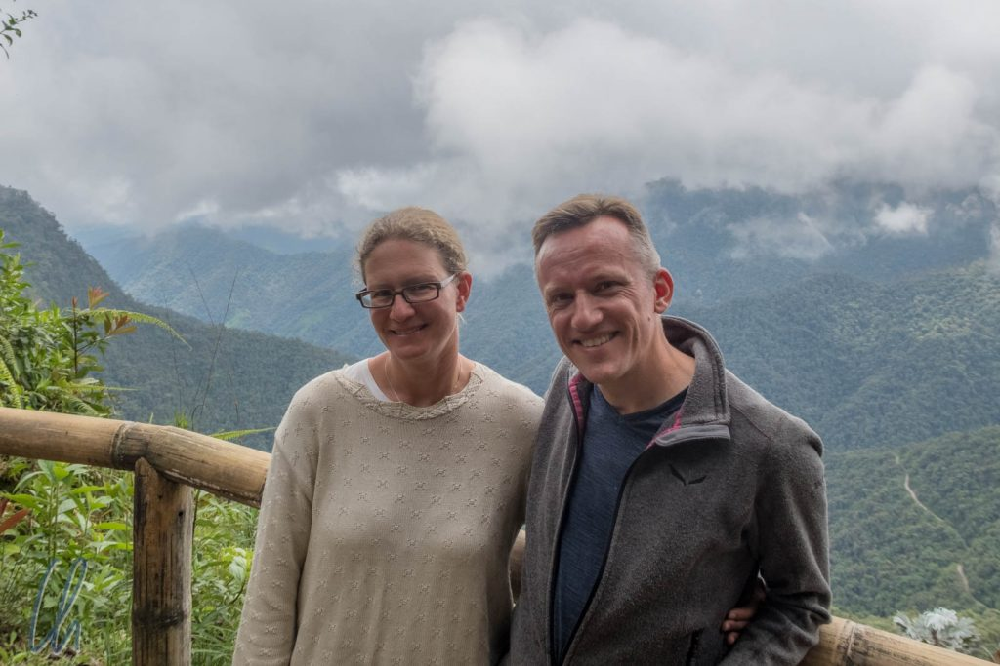
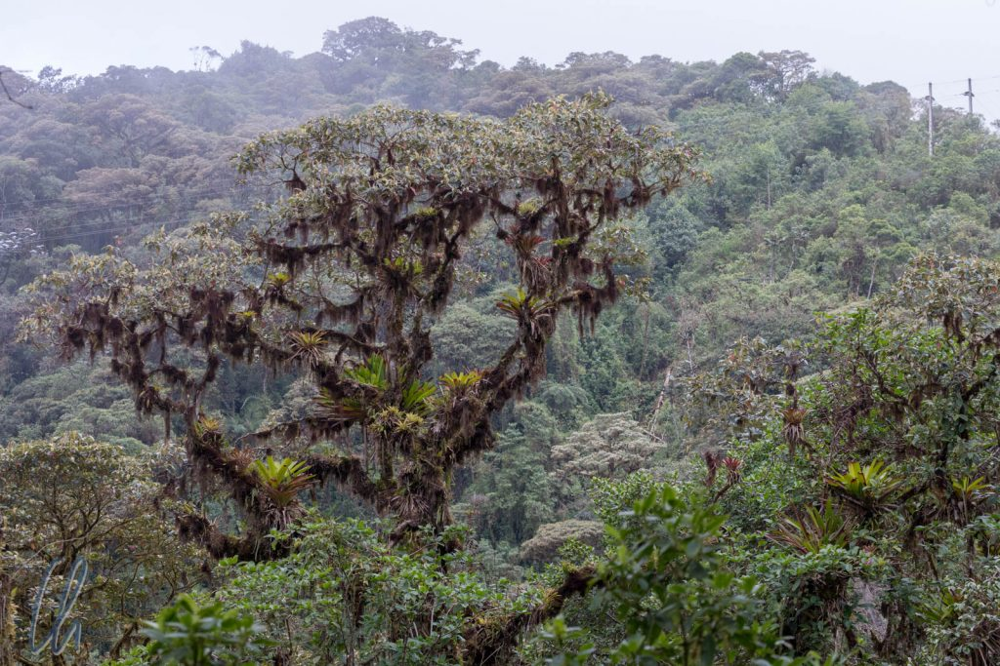
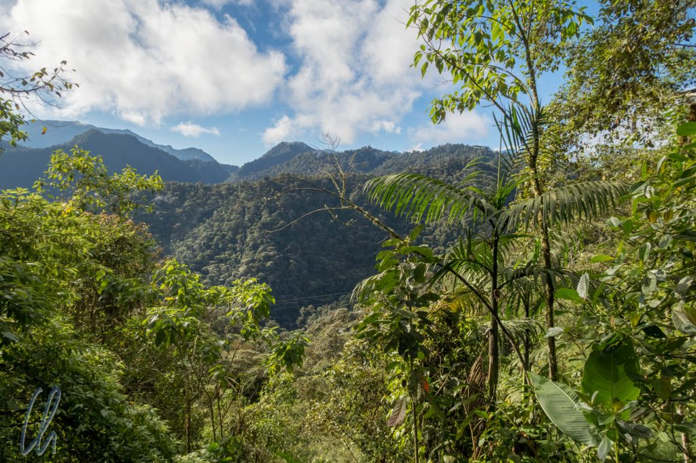
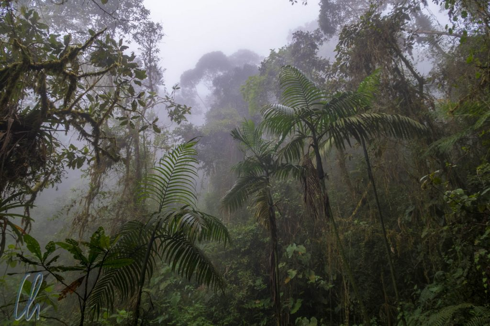
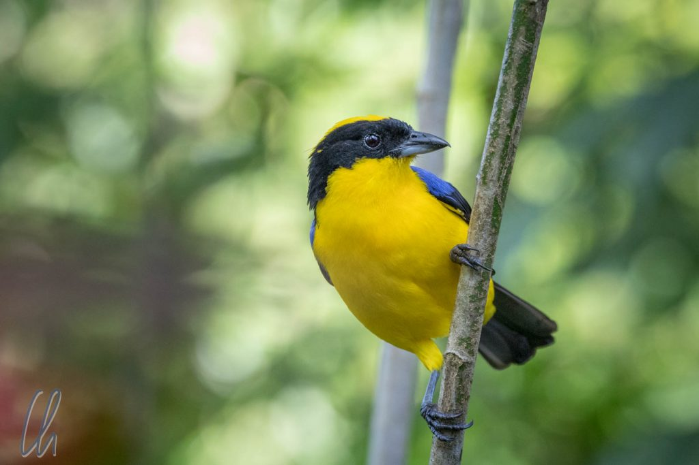

Nachdem wir von den Galapagos-Inseln auf das ecuadorianische Festland zurückgekehrt waren, leiteten wir eine allmähliche Höhenanpassung ein, da wir planten, die nächsten Wochen in den Anden zu verbringen, in Ecuador, Peru und Bolivien. Zwischen der Küste und dem Hochland gibt es einen nicht sehr bekannten Nebelwald mit einer großen Biodiversität, der zwischen 900 und 2500 Metern über dem Meeresspiegel liegt. Unsere Unterkunft trug den verheißungsvollen Namen Bellavista ("Die schöne Aussicht"). Das erschien uns gleich ein wenig paradox: Wie lässt sich Nebel(wald) mit Ausblick vereinbaren?

<!--more-->

## Bellavista im Nebelwald

Bellavista ist eine Öko-Lodge, deren Besitzer 1990 angefangen haben, Regenwald aufzukaufen, um ihn zu schützen und Besuchern zugänglich zu machen. Das erschien den Leuten vor Ort damals als ziemlich verrückte Idee. Die Einheimischen holzten den Wald ab, um Weideland für Milchkühe zu schaffen oder um Baumtomaten anzupflanzen. Es gab sogar eine Vorschrift der Regierung, die bestimmte, dass das Land gerodet werden musste, um die landwirtschaftliche Nutzung voranzutreiben. Da die Böden an sich eher unfruchtbar sind und nur das intakte Nebelwald-Ökosystem die üppige Natur hervorbringt, nahm die Produktivität der bewirtschafteten Flächen schnell ab und die Bauern brauchten neues Land. Mehr Wald wurde gerodet, ein bekannter Teufelskreis…

Zu Bellavista gehört heute ein beachtliches Waldgebiet von 700 Hektar, das aus Sekundär- und Primärwald besteht. Die Lodge steht im Bereich des Sekundärwaldes. Dort gibt es viele Wanderwege, um den Wald zu erkunden. Der Primärwald ist nicht durch Wege erschlossen, er soll bleiben wie er ist, unberührt und ungestört.

## Es nebelt wirklich

Der Nebelwald (Cloud Forest) hat seinen Namen zu Recht erhalten. Während unseres Aufenthaltes war der Himmel jeden Morgen klar, die Morgensonne begrüßte uns und es gab in der Tat eine herrliche Aussicht auf die umliegenden Hügel und sogar auf die hohen Berge in der Ferne. Irgendwann zwischen 9 und 11 Uhr zogen Wolken auf und setzten sich im Wald als zäher Nebel fest, der der Stadt Ulm alle Ehre gemacht hätte ;). Die Sichtweite betrug zuweilen nur wenige Meter. Fast jeden Tag fing es außerdem am späten Vormittag oder am frühen Nachmittag zu regnen an, meist eher ein leichter Landregen. Normalerweise hörte es nach einiger Zeit auch wieder auf, aber es tropfte weiterhin aus dem Blätterdach. Der Nebel löste sich erst am nächsten Morgen auf, wenn die Landschaft nach dem frühen Aufstehen wie ausgewechselt erschien.

Nachts war es im Nebelwald erstaunlich ruhig. Es gab keine Schwärme von Zikaden, die um die Wette zirpten. Das lag vermutlich an den niedrigen Temperaturen, die nachts unter 10 Grad Celsius fielen. So packten wir unsere warme Kleidung aus und schalteten abends auch den kleinen Elektroheizkörper im Zimmer an.

## Alle Vög'lein sind schon da

Eine der wesentlichen Attraktionen des Nebelwaldes sind die zahlreichen bunten Vögel. Im Gegensatz zu [Galapagos](http://wittmann-tours.de/galapagos-die-verwunschenen-inseln/) waren die Tiere dort allerdings eher scheu, d.h. sie versteckten sich gut zwischen den Zweigen und Blättern und flogen oft sofort weg, sobald wir sie erspäht hatten. Daran mussten wir uns erst wieder gewöhnen ;). Zum Glück begleitete uns unser Guide Juan Carlos, ein wahrer Vogelzwitscherer. Wenn wir durch den Wald gingen, reichte ein Vogelruf und er wusste ganz genau, um welche Spezies es sich handelte. Mit einer App und Bluetooth-Lautsprecher imitierte er - etwas gemogelt ;) - die Vogelstimmen, erspähte die gefiederten Freunde in der üppigen Vegetation und zeigte uns mit einem grünen Laserpointer (ohne die Vögel selbst anzuleuchten), wo sie sich befanden.

Frühmorgens trafen wir uns (wie auch auf [Pook's Hill](http://wittmann-tours.de/das-zweite-kapitel-des-dschungelbuches-pooks-hill/)) vor dem Frühstück auf dem kleinen Bellavista-Parkplatz. Die Vögel schienen die Morgensonne ebenso zu genießen wie wir und wir sahen auf engstem Raum viele verschiedene Arten. Ein Trogon war Dauergast, wir sahen ihn jedem Morgen in direkter Nähe unseres Zimmers. Weiterhin gab es [Jays](https://de.wikipedia.org/wiki/Garrulus), [Woodcreeper](<https://de.wikipedia.org/wiki/Baumsteiger_(V%C3%B6gel)>), [Tanagers](https://de.wikipedia.org/wiki/Tangaren), [Flycatcher](https://de.wikipedia.org/wiki/Tyrannen) und viele mehr.

## Unterwegs im Nebelwald

Jeweils am späteren Vormittag und nachmittags unternahmen wir mit Juan Carlos und einem weitgereisten belgischen Ehepaar 2-3 stündige Wanderungen auf den Wegen rund um die Lodge. Durch die Höhe (2250m), den Nebel und die damit verbundenen niedrigen Temperaturen (10 bis 15 Grad Celsius) erschien der ecuadorianische Cloud Forest zwar so dicht wie der Dschungel in Belize, aber Flora und Fauna waren ganz anders. Der Nebelwald hat nur ungefähr die Hälfte der Biomasse eines tropischen Regenwaldes. Interessanterweise sahen wir mehr Blüten als in Belize, außerdem gab es nur wenige Baumriesen.

Neben den vielen Vögel zeigte Juan Carlos uns auch die vielfältige Flora und andere Tiere wie Eidechsen und Frösche. Die Frösche waren winzig und hätten problemlos auf einer Münze Platz gefunden. Eines Abends konnten wir auf dem Gelände der Lodge ein [Kinkajou (Wickelbär)](https://de.wikipedia.org/wiki/Wickelb%C3%A4r) beobachten. Die Pflanzenwelt zeichnete sich durch eine unglaubliche Vielfalt aus und keine zwei Gewächse einer Art standen nebeneinander. Viele Pflanzen können auf die eine oder andere Art genutzt werden - als Medizin, als Werkstoff oder als Nahrungsmittel. Die verschiedenen Blätter erschienen in ihren unterschiedlichen Formen als wahre Kunstwerke, vor allem, wenn sie von Sonnenstrahlen, die den Weg durch das Blätterdach bis auf den Boden gefunden hatten, erleuchtet wurden.

## Die Kolibris von Bellavista

Alle Gäste in Bellavista waren fasziniert von den Kolibris. In den Bäumen nahe der Lodge hingen ein paar Fütterungsstationen und in deren Umgebung schwirrten verschiedene Spezies in leuchtenden Farben durch die Lüfte. Die besonders kleinen Vögelchen einer Art summten beim Fliegen wie überdimensionierte Hummeln. Andere hatte hübsche weiße Federbüschel an den Beinen, die wie kleine Stiefelchen aussahen. Die Kolibris einer weiteren Art hatten lange, blaue Schwanzfedern. Sie alle tranken gerne das Zuckerwasser, hatten sich untereinander aber nicht lieb. Sie schubsten sich gegenseitig vom Rand der Feeder und behakten sich in der Luft mit den Schnäbeln. Das alles spielte sich in einer unglaublichen Geschwindigkeit ab! Die kleinen Vögelchen müssen ein ganz anderes Zeitempfinden haben als wir.

Habt Ihr schon mal einen Kolibri auf der Hand gehabt? Wir bisher auch nicht! Das änderte sich am ersten Tag in Bellavista. Wir beobachteten die flinken Vögelchen, die alles andere als schreckhaft waren, an den Futterstationen. Beim ersten Versuch, sie zu filmen, landeten sie sogar auf der Kamera. Kurze Zeit später gab uns Sebastian (der Manager der Lodge) eine rotes Schälchen mit Zuckerwasser und sofort wurden die Kolibris vom Nektar magisch angezogen! Sie summten um unsere Köpfe, so dass wir diese manchmal sogar reflexartig einzogen. Sie landen auf dem Rand des Schälchens oder auf unseren Händen. Wir spürten die kleinen Krallen der wenigen Gramm schweren Winzlinge, was ein wenig pikste, und manchmal kitzelten die weichen Federn. Seht selbst:

https://www.youtube.com/watch?v=MomTQTKNTu0

Rot ist anscheinend eine Futter verheißende Signalfarbe für die Vögelchen. Ein Kolibri ließ sogar seine lange Zunge in mein (Christians) von der Sonne auf Galapagos etwas gerötetes Ohr schnellen auf der Suche nach Nektar. :)

## Der Cock-of-the-Rock

Auch wenn wir keine ausgesprochenen Vogelbeobachter sind, so schauen wir uns doch sehr gerne vor allem bunte exotische Vögel in ihrer natürlichen Umgebung an. Eigentlich ist der [Cock-of-the-Rock](https://de.wikipedia.org/wiki/Felsenh%C3%A4hne) (zu Deutsch Felsenhahn) der Nationalvogel Perus, aber auch im Nebelwald von Ecuador gibt es gute Möglichkeiten, ihn zu sehen. So schlossen wir uns einer Tour an, um den eigenartigen Vogel in freier Natur zu erleben. Er ist kräftig rot und auf seinem Köpfchen trägt er stolz ein schmuckes Federbüschel wie einen Kamm, das auch den Schnabel größtenteils verdeckt, so dass seine Silhouette sehr ungewohnt aussieht.

Die Tour startete am Nachmittag und natürlich regnete es ;). Nach ein paar Kilometern Autofahrt, die aufgrund der schlechten Piste gut eine Stunde dauerten, erreichten wir den Ort, wo sich der Cock-of-the-Rock heimisch fühlte und öfters gesichtet wurde. Es gab sogar einen Unterstand, von dem aus wir einen guten Ausschnitt des Waldes überblicken konnten. Wenige Minuten später sahen wir in der Tat (wie bestellt) einen roten Punkt durch die Blätter fliegen. Juan Carlos versuchte, das Scope einzustellen, die Cocks-of-the-Rock blieben aber nie länger an einer Position. Sie flogen von rechts nach links und zurück durch die Äste. Auf einmal ging alles schnell: Zwei Vögel tauchten vergleichsweise nah vor uns auf, setzten sich auf einen Ast vielleicht 10 Meter von uns entfernt und posierten für ein Foto, nur um kurze Zeit später die Bühne wieder zu verlassen.

Für drei Tage hat uns der Nebelwald sehr gut gefallen, aber auf Dauer würden wir ihn bestimmt nicht genießen können. In der Regenzeit regnet es angeblich wirklich jeden Tag, in der Trockenzeit wird es nur neblig. Wir erlebten die Übergangsphase zwischen Regen- und Trockenzeit. Egal wann, so richtig warm wird es nie, trotz der Lage direkt am Äquator. Die Tier und Pflanzenwelt war auf alle Fälle sehr interessant. So eine Art von Wald hatten wir vorher noch nie gesehen!
