# Ein Tag am Meer in Morondava

Nach den langen und ereignisreichen Tagen [bei den Tsingys](http://wittmann-tours.de/die-grossen-und-kleinen-tsingys) verbrachten wir einen Tag am Meer in Morondava. Dort erlebten wir ein gänzlich anderes Madagaskar ohne Reisfelder und Zebus, dafür mit Booten und Fisch.

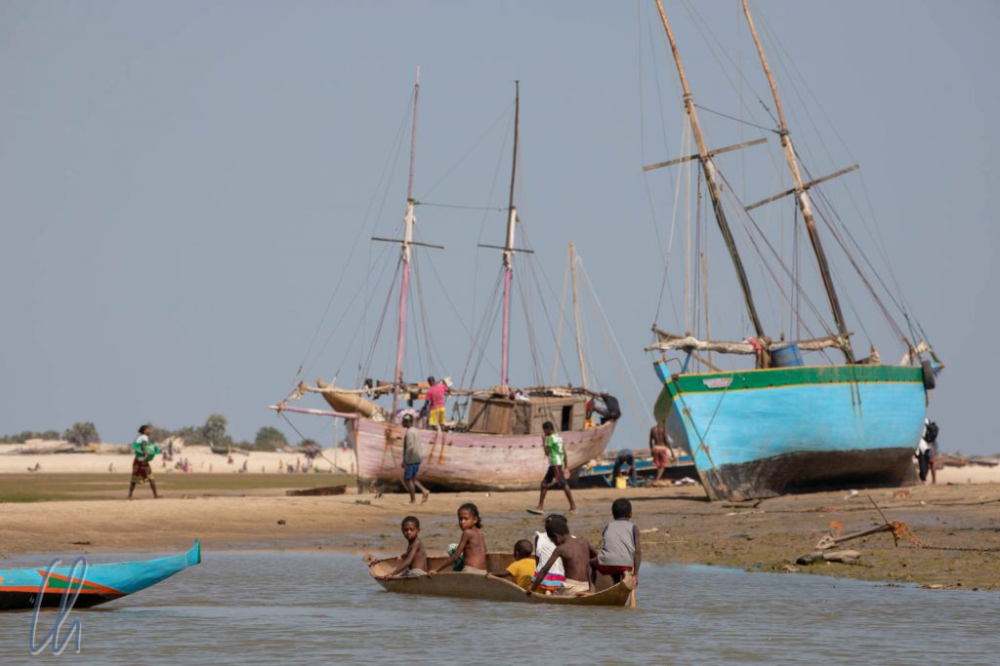

<!--more-->

## Von Fischern und Booten

Begleitet von zwei Fischern, Meki und Saki, fuhren wir mit einem Fischerboot, einer Art Seekanu mit 2 Auslegern mit Platz für 5 Personen und Ladung zu einem kleinen Fischerdorf. Der erste Teil des Weges führte durch einen Kanal ([Chenal de Hellot](https://www.openstreetmap.org/way/240815849)). Zu unserer Linken sahen wir ein Mangrovenwäldchen, an dessen Ufer sich putzige [Schlammspringer](https://de.wikipedia.org/wiki/Schlammspringer) tummelten. Auf der rechten Seite lag Morondava, einige Boote lagen bei Niedrigwasser am Strand und Fischer sortierten ihre Netze.

Zwei Fischer standen im seichten Wasser beim Fischen. Dabei erzählte uns Tahina eine interessante Episode die belegte, wie schwierig es manchmal ist, sinnvoll zu helfen: Da Malaria ein vermeintliches Problem ist, überlegte sich eine NGO, Moskitonetze zu spenden, damit sich die Menschen gegen die Moskitos und damit gegen die Malaria schützen könnten. Hört ich prima an, nicht wahr? Aber heraus kam etwas anderes. Statt die Netze aufzuhängen benutzen die Menschen sie als Fischernetze, was zu gut funktionierte. Da die Moskitonetze zu engmaschig sind, fingen Sie nicht nur die großen Fische, sondern Meeresbewohner aller anderen Größen. Kurzfristig war es für die Fischer eine große Hilfe, langfristig stellte sich jedoch das Gegenteil ein, da der Fisch-Nachwuchs zurückging. Wer hätte diese Kausalkette voraussagen können?!

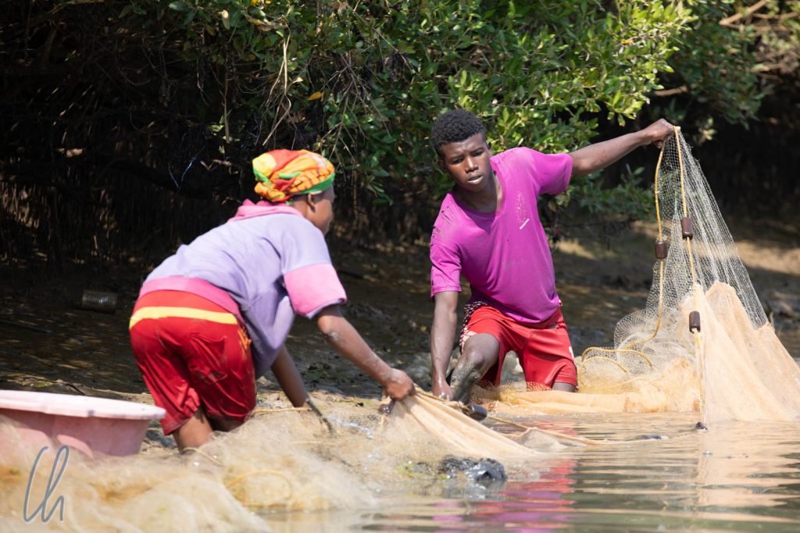

## Fußweg bei Ebbe

Den weiteren Weg zum Dorf hätten wir auch über den Strand laufen können, so wie es viele Einheimische taten. Ein nicht abreißender Strom von Menschen ging vom Dorf in die Stadt oder umgekehrt. Die meisten (Frauen) balancierten ihre Taschen oder mit Fisch gefüllte Plastikwannen elegant auf ihrem Köpfen, statt sie zu tragen.

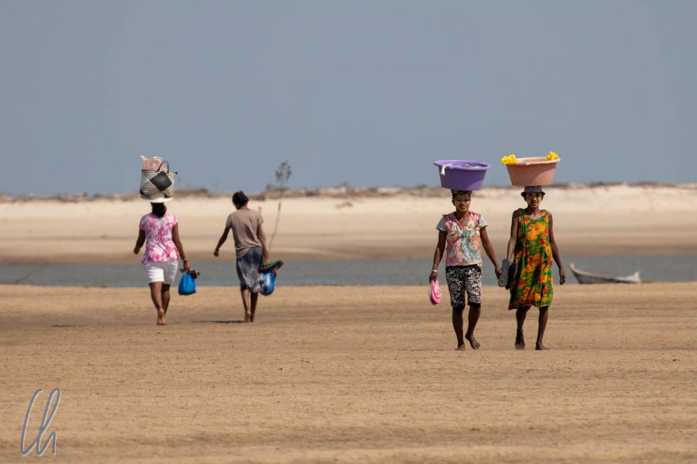

Nur ganz am Ende des Weges mussten sie durch eine fast hüfttiefe Wasserrinne waten. Als wir eben in an diesem Strand anlegten lag direkt neben uns ein Fischerboot, welches gerade noch den Fang des Tages und die Netze sortierte.

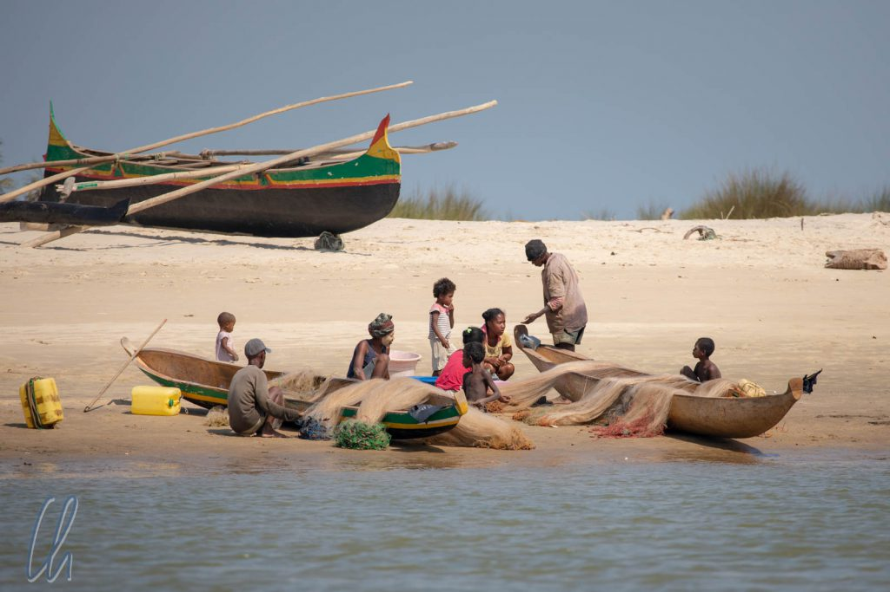

## Das Fischerdorf Betania

Von dort gingen wir etwas landeinwärts zum Dorf, welches unter Kokospalmen und anderen Bäumen aus Holzhäusern mit Wellblech- oder Naturdach bestand. Einzelne Bereiche im Dorf waren mit Zäunen aus Zweigen und Ästen abgetrennt. Die Preise, die sie auf dem Markt dafür erlösen werden würden, sind für unser europäisches Preisgefüge eher gering. Ein Kilo Shrimps, frisch aus dem Meer, kostet etwa 16.000 Ar, also gerade einmal 4 Euro.

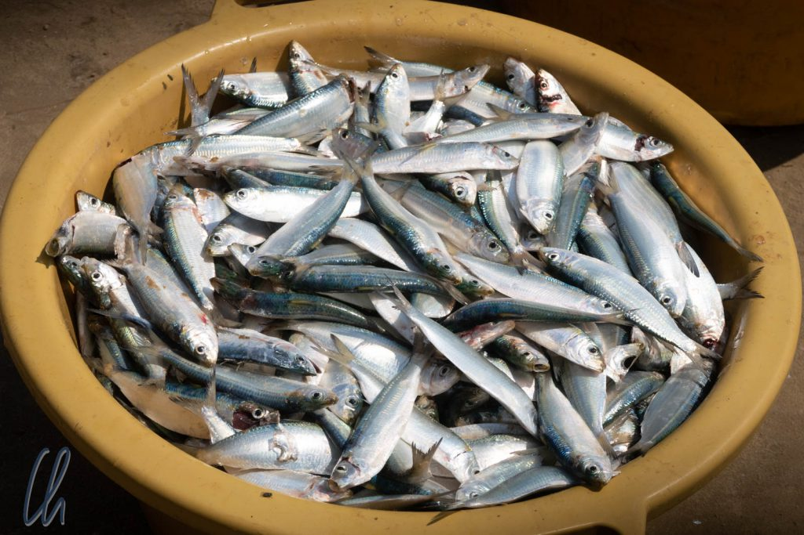

Die Menschen im Dorf hatten keine Zebus, sondern echte und lebendige Sparschweine. Man kauft sich ein kleines Schweinchen und füttert es ein Jahr lang mit organischen Abfällen. Am Ende hat man ein ausgewachsenes Schein, dass auf dem Markt einen guten Preis erzielt.

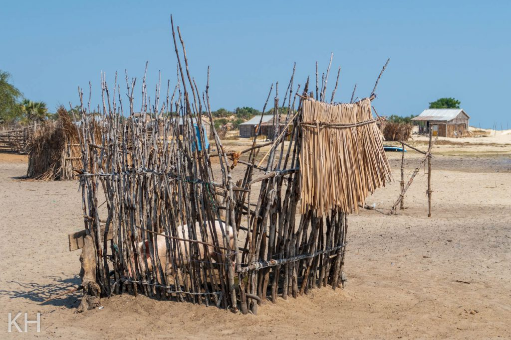

Die Temperaturen waren mindestens so tropisch, wie es auf den Fotos aussieht, dank einer konstanten Briese allerdings sehr angenehm. Trotzdem war uns eine frische Kokosnuss zur Erfrischung sehr recht. Wie frisch sie sein würde hätten wir allerdings nicht gedacht, direkt von der Palme. Die spezielle Drehtechnik beim Ernten hatten wir zwar [in Belize](http://wittmann-tours.de/die-garifuna-hauptstadt-dangriga/) gelernt, allerdings auf einer Leiter. Ein junger Mann hingegen kletterte geschwind, barfuß und ohne irgendwelche Hilfsmittel einfach die Palme empor und warf kurze Zeit später die Kokosnüsse in den Sand.

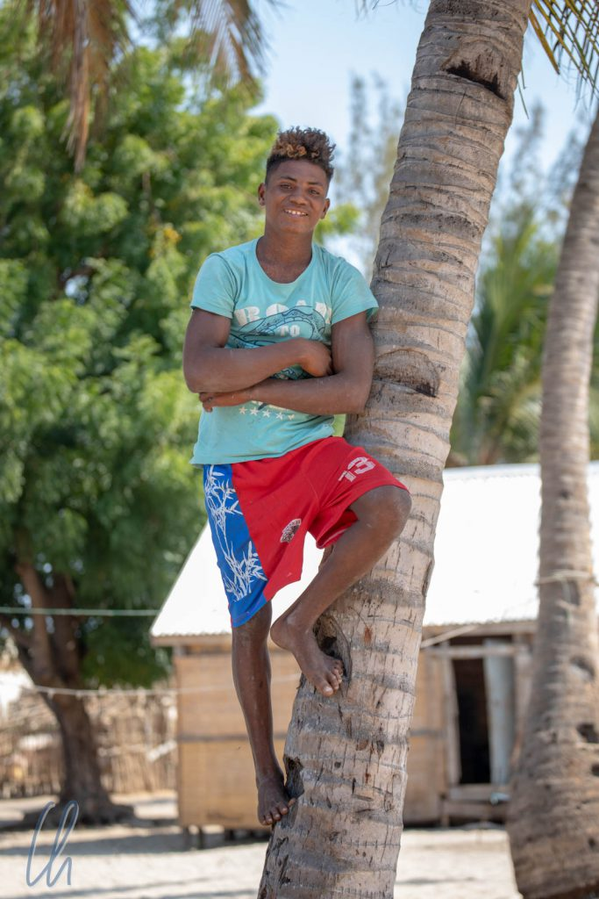

## Frischer Fisch am Strand serviert

Das Mittagessen bereiteten Meki und Saki in den Dünen zwischen Strand und Dorf zu. Bevor das Essen fertig war gab es zum Glück auch noch etwas Zeit ins kühle Nass zu hüpfen. Die Wellen waren kräftig und machten mächtig Laune. Vielleicht waren sie sogar etwas zu heftig. Nach einiger Zeit spürten wir keinen Boden mehr unter den Füßen und wir mussten kräftig in Richtung Ufer schwimmen, um nicht in die [Straße von Mosambik](https://de.wikipedia.org/wiki/Stra%C3%9Fe_von_Mosambik) gespült zu werden. Baywatch, Bojen, oder Flaggen gab es natürlich nicht…

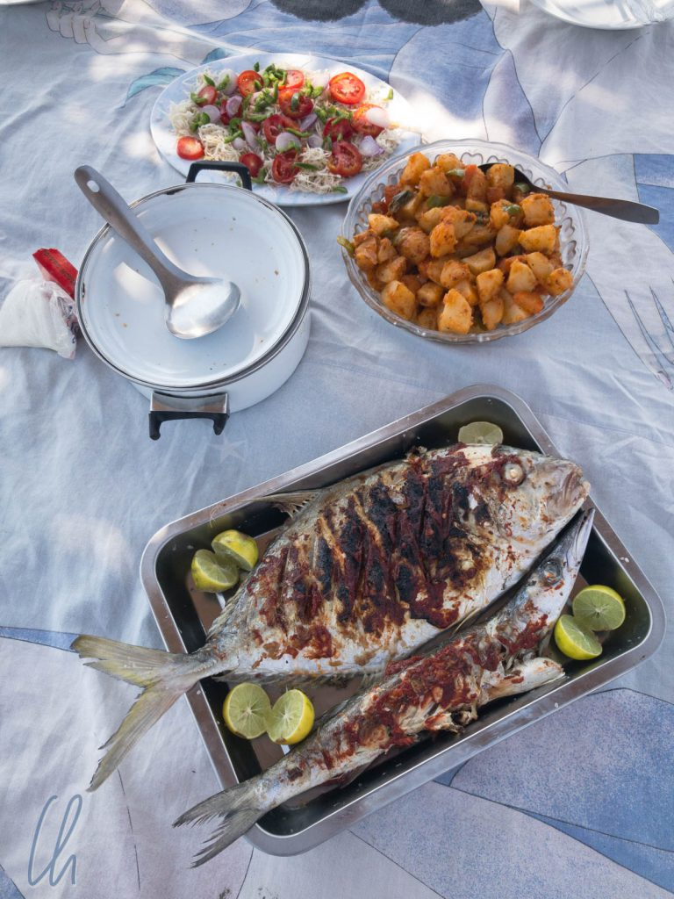

Zurück am Strand war das Essen fast fertig. Es gab natürlich frischen Fisch, zwei Sorten lecker gegrillt, dazu Reis (was sonst?), außerdem und sogar Kartoffeln und Salat.

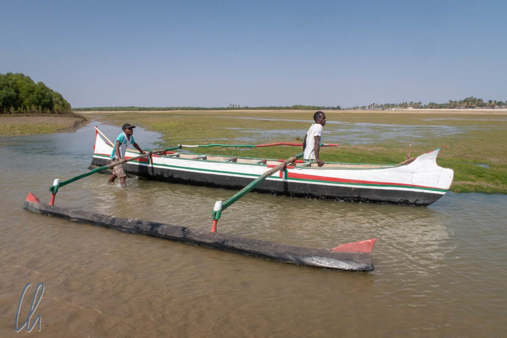

Auf dem Weg zurück nach Morondava war die Flut gekommen. Der Fußweg zum Dorf war abgeschnitten. Gut dass uns Meki und Saki fuhren!

## Sonnenuntergang am Strand

Es war ein sehr entspannter Tag, der sich wirklich wie Urlaub und nicht wie Reise anfühlte. Also lag nicht näher, als ihn am Strand zum Sonnenuntergang ausklingen zu lassen. Obwohl es natürlich Hotels für Touristen gab (wie unseres zum Beispiel), waren die Einheimischen quasi unter sich. Sie arbeiteten an Ihren Fischernetzen, gingen Spazieren, saßen am Stand oder schauten dem Fußballspiel einiger Kinder zu.

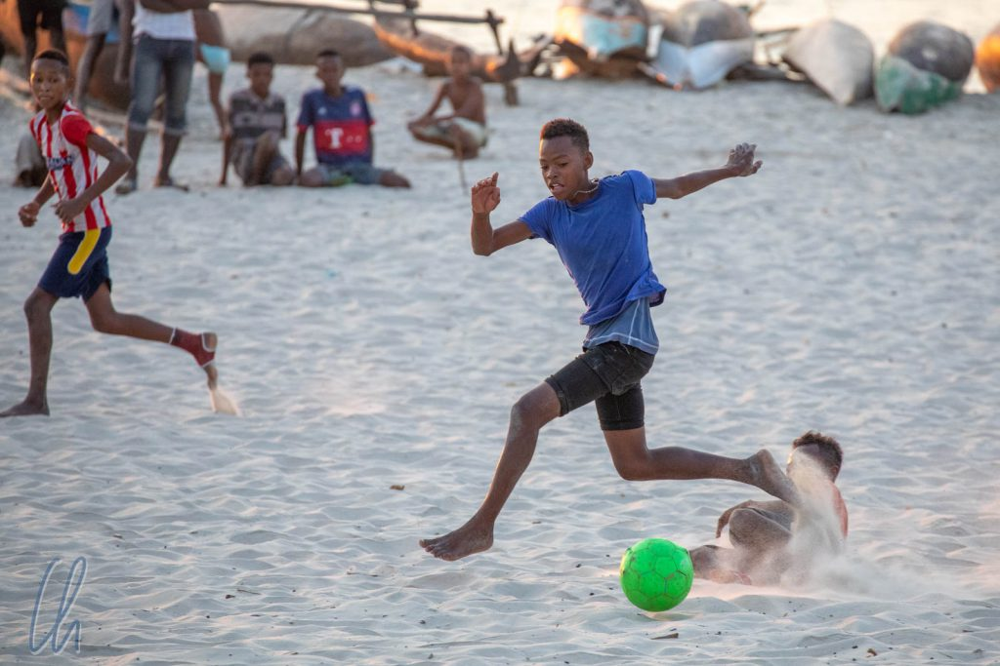

In diesem Moment war der harte Alltag vergessen, hoffentlich nicht nur für uns, sondern auch für die Einheimischen, die dem Rauschen der Brandung lauschten und dem Sonnenuntergang zusahen.

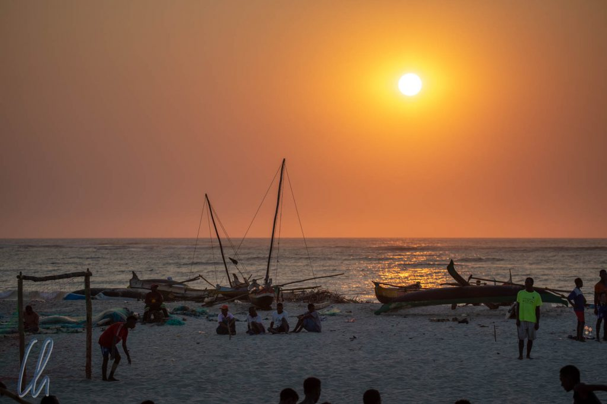
