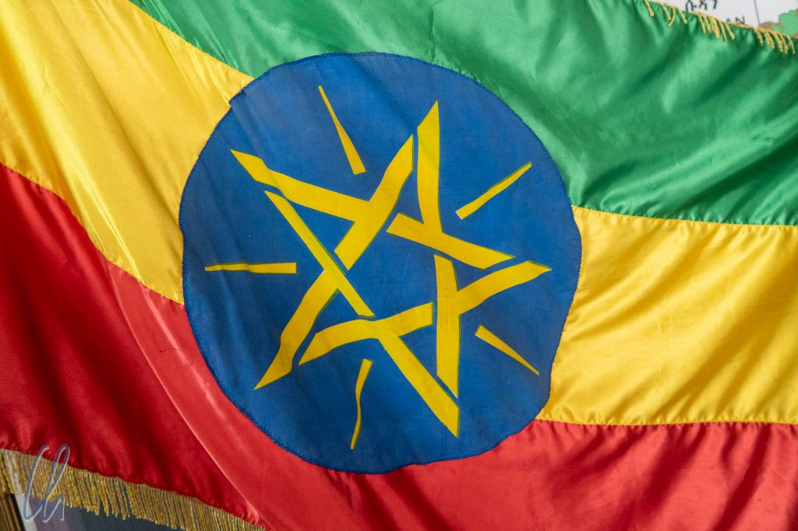
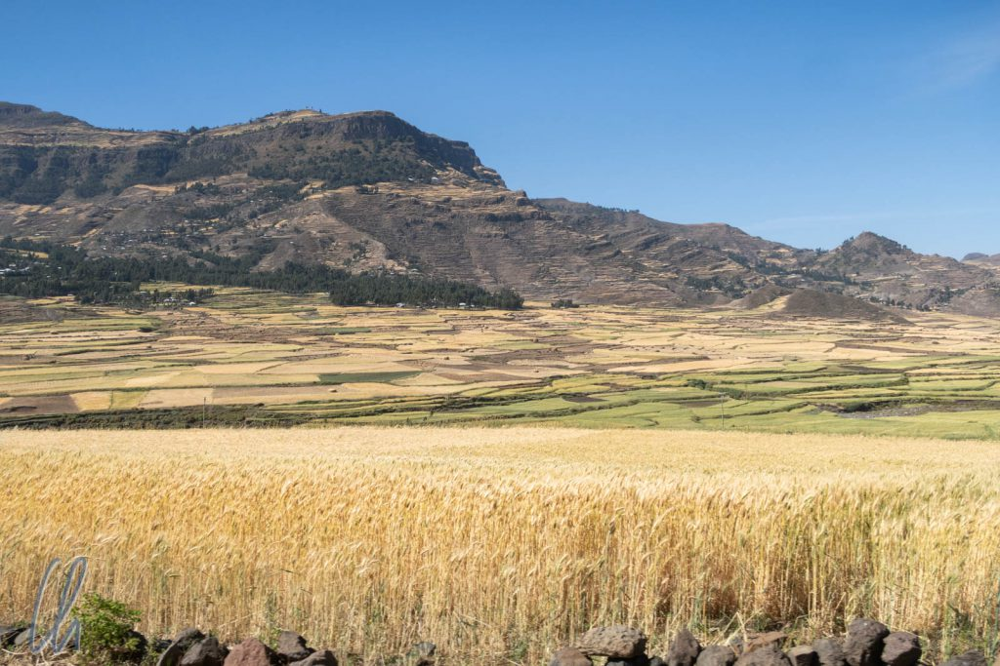
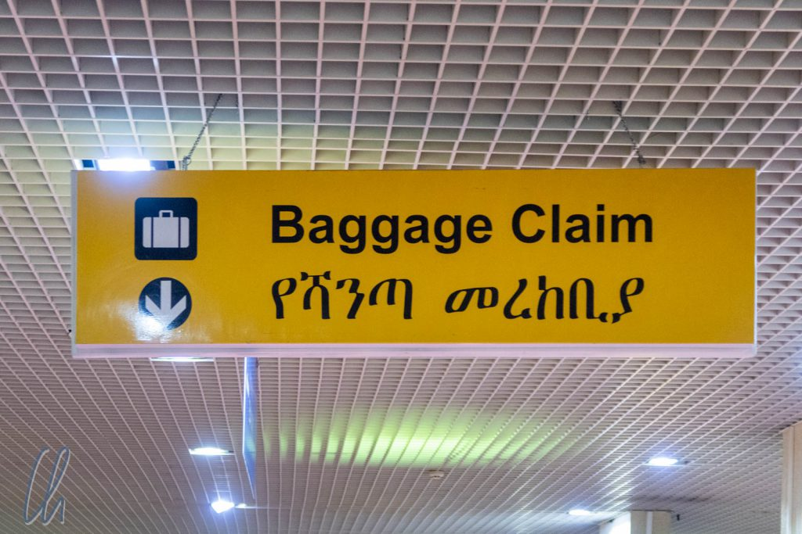

Längere Zeit waren wir uns nicht sicher, ob es wirklich eine gute Idee wäre, nach Äthiopien zu fahren. [Das Land](https://de.wikipedia.org/wiki/%C3%84thiopien) befand sich zu Beginn unserer Weltreise im [Ausnahmezustand](https://www.zeit.de/politik/ausland/2018-01/unruhen-aethopien-opposition): Gewaltsame Demonstrationen, der Zugang zum Internet war gesperrt worden, das Auswärtige Amt hatte Reisewarnungen veröffentlicht, zahlreiche Regionen waren für Besucher nicht sicher. Zum Glück hatte sich die politische Lage mit der Wahl von Premierminister [Abiy Ahmed](https://de.wikipedia.org/wiki/Abiy_Ahmed) rasant [gewandelt](https://www.dw.com/de/%C3%A4thiopien-hebt-ausnahmezustand-auf/a-44078868). Sogar ein [Friedensvertrag](https://www.sueddeutsche.de/politik/historischer-friedensschluss-der-mann-der-den-verheerenden-krieg-beendete-1.4046902) zwischen Äthiopien und Eritrea war ausgehandelt worden. Die Reisevorbereitungen konnten also beginnen. :)

<!--more-->

## Reisevorbereitungen

Trotz aller positiven Nachrichten und einem eindeutigen Trend wollten wir aber nicht in Eigenregie unterwegs sein. Verstärkt wurde der Wunsch dadurch, dass die Infrastruktur in Äthiopien im Reiseführer als (sehr) unzuverlässig und kompliziert beschrieben wurde. Somit suchten (und fanden) wir einen Reiseveranstalter, über den wir eine individuelle Tour zusammenstellen konnten, die unseren Vorstellungen eines angemessenen Zeitplanes entsprach. Organisierte Touren tendieren häufig dazu, möglichst viele Sehenswürdigkeiten zu besuchen. Wir wollten zwischendurch aber auch "Freizeit" haben, u.a. um Blog zu schreiben und unseren Aufenthalt in Indien, unserem letzten Reiseland, vorzubereiten.

Wir entschieden uns für eine Route durch den Norden Äthiopiens und eine Variante mit sog. Driver Guide. D.h. wir würden ein Fahrzeug mit einem einheimischen Fahrer zur Verfügung gestellt bekommen, der Land und Leute kennt und Englisch spricht, aber nicht den Anspruch hat, ein vollwertiger Reiseleiter zu sein. An den jeweiligen Sehenswürdigkeiten im Land wird man ohnehin verpflichtet, zusätzlich auf lokale Führer zurückzugreifen, die einem die Besonderheiten der Orte nahebringen.

## Warum Äthiopien?

Viele Menschen verbinden auch heute noch Äthiopien mit Hungersnot. Damals, 1984-1985, als wir beide in die Grundschule gingen, war das Land in den Schlagzeilen mit einer [Hungersnot](https://de.wikipedia.org/wiki/Hungersnot_in_Äthiopien_1984–1985#Reaktionen), wie sie die Medien vorher nicht gezeigt hatten. Diese Bilder sind haften geblieben, spiegeln aber nicht die heutige Realität im Land wieder. Äthiopien ist in vielen Landesteilen sehr fruchtbar und Lebensmittelknappheit beruht oft eher auf einem Verteilungsproblem im Staat.

Von anderen Reisenden hatten wir viel Interessantes über Äthiopien gehört, das unsere Neugier geweckt hatte. Damals war uns noch nicht bewusst, dass Äthiopien nicht nur über eine beeindruckende Natur, sondern auch über eine reiche Kultur und Geschichte verfügt. Einige kurze Beispiele: Äthiopien wurde nie kolonisiert (auf dem afrikanischen Kontinent neben [Liberia](https://de.wikipedia.org/wiki/Liberia) einzigartig). Das Land hat eine lange christliche Tradition: Das äthiopisch-orthodoxe Christentum ist allerdings eine ganz eigene Glaubensrichtung. Die Religion besitzt in der Bevölkerung einen sehr hohen Stellenwert. Nach ihren Glaubenssätzen wird die originale Bundeslade in Aksum aufbewahrt. In Äthiopien befindet sich außerdem der angeblich heißeste Ort der Welt und es gibt grasende Affen. Soviel könnten wir vorweg nehmen, wir verbrachten drei spannende Wochen im Land!

## Angekommen in Addis Abeba

Der Anschlussflug von Dubai nach [Addis Abeba](https://de.wikipedia.org/wiki/Addis_Abeba) transportierte bemerkenswert wenige Passagiere. Maximal 20-30% der Sitze waren besetzt, das hatten wir schon lange nicht mehr erlebt. Im Anflug auf die Hauptstadt im Dunklen sahen wir viele verstreute Lichter ohne ein erkennbares Zentrum. Nach drei Wochen in Jordanien waren wir wieder zurück auf dem afrikanischen Kontinent.

Die erste Bürgerpflicht, wie immer nach der Ankunft in einem neuen Land, bestand darin, den Geldautomaten zu plündern. In Äthiopien zahlt man mit Birr ("Silber" auf Amharisch), die Banknote mit dem höchsten Wert zu 100 Birr ist ungefähr 3 Euro wert und das Transaktionsmaximum betrug 4000 Birr, also etwa 120 Euro. Unser Geldbeutel war also wieder mit vielen Scheinen, aber wenig Gegenwert, gefüllt.

## Die Fahrt zum Hotel

Am Flughafen kamen wir kurioserweise am nationalen Terminal an, was uns allerdings nicht sofort bewusst wurde. Erstaunt bemerkten wir die Abwesenheit eines Wittmann-Schildes, da uns ein Transfer zum Hotel zugesagt worden war. Die Atmosphäre vor dem Flughafen war recht entspannt, die Taxifahrer nicht aufdringlich. Stattdessen bemerkte der dritte, mit dem wir sprachen, dass wir falsch waren und zeigte uns den Weg zum internationalen Terminal.

Dort angekommen wartete leider auch kein Fahrzeug vom Hotel, dafür aber deutlich mehr Taxifahrer, die auch alle sehr höflich waren. Natürlich boten sie uns eine Fahrt an, hatten aber Verständnis dafür, dass wir abgeholt würden. Als dann weiterhin kein Wittmann-Schild auftauchte, stiegen wir in die Verhandlungen für eine Fahrt zu unserer Herberge ein. Dem Reiseführer sei Dank wussten wir, in welche Preisregion wir gelangen mussten :) und es war trotzdem noch erstaunlich teuer. Diese Art des individuellen Transportes ist in Addis anscheinend echter Luxus. Die Fahrt zog sich unerwartet in die Länge, da der Taxifahrer zwar ungefähr wusste, wo das Hotel sein musste, eine online-Navigation aufgrund fehlender SIM-Karte (bei uns) und unzureichendem Guthaben (beim Taxifahrer) unmöglich war. Unterwegs versuchte unser Chauffeur dann auch, uns ein anderes Hotel schmackhaft zu machen.

## Unsere Nachbarschaft

Die Straße, an der die Unterkunft lag, war eine unasphaltierte, verwinkelte, unbeleuchtete schmale Nebenstraße. So waren wir zunächst etwas skeptisch, ob wir uns nicht wieder verfahren hätten, aber schließlich stellte es sich als das richtige Hotel heraus. Der Besitzer entschuldigte sich und sagte, dass er uns auf einem ganz anderen Flug erwartet hätte. Na, das fing ja gut an… (Sollte sich aber nicht wiederholen.) Jedenfalls waren wir erleichtert, nach der Irrfahrt endlich angekommen zu sein :).

Das recht schicke Hotel kam uns in der Umgebung wie ein Fremdkörper vor. Es war das einzige sechs- oder siebenstöckige Bauwerk dieser Art in der direkten Nachbarschaft. Die Gebäude daneben waren hauptsächlich Wellblechhütten oder einfache, schmucklose Betonhäuser. Obwohl wir freundlicherweise vom Hotel als Wiedergutmachung zum Abendessen eingeladen wurden, ging ich vorher noch kurz zu einem Lebensmittelladen, um etwas Trinkwasser zu kaufen. Einige Menschen waren noch auf der Straße. Niemand beachtete mich, obwohl ich offensichtlich der einzige Weiße war. Trotzdem fühlte ich mich nicht 100% wohl, als ich durch die dunklen Gassen bis zur Hauptstraße und wieder zurück ging.

## Datum und Uhrzeit sind relativ

Wir werden wohl nie erfahren, was der eigentliche Grund für das Versehen war. Fakt ist jedoch, dass in Äthiopien die Uhren in der Tat anders ticken. Das soll in diesem Falle keine Metapher sein, sondern die Stunden werden im Land wirklich anders angegeben. In Äthiopien beginnt der Tag um 6 Uhr (unsere Zeit) morgens mit 0 Uhr äthiopischer Zeit. Als wir am ersten Tag in Addis unseren Fahrer trafen und die Uhr im Auto 3:07 anzeigte, ging sie nicht falsch, sondern zeigte äthiopische Zeit an. Nach unserer Zeitrechnung war es 9:07 Uhr. Um die Sache noch weiter zu verkomplizieren, hing an der Rezeption unseres Hotel eine Uhr, die scheinbar rückwärts lief. Die Zahlen auf dem Ziffernblatt waren (nach unserer Wahrnehmung) gegen den Uhrzeigersinn angeordnet.

Und damit nicht genug: Auch das Datum wird anders angegeben. Wir dachten, wir wären am 17.10.2018 in Addis Abeba angekommen. Nach äthiopischer Zeitrechnung reisten wir allerdings am 7 Ṭəqəmt 2011 ein (das könnt ihr [hier](http://www.nabkal.de/kalrech8.html) nachrechnen). Der [äthiopische Kalender](https://de.wikipedia.org/wiki/Äthiopischer_Kalender) ist zu unserem Kalender um 7 Jahre verschoben. Das Jahr umfasst 12 Monate mit 30 Tagen und hat noch einen 13. Schaltmonat mit 5 oder 6 Tagen. In diesem Zusammenhang kursiert der nicht ganz ernstzunehmende Werbeslogan von Reiseagenturen, der Besucher würde bei der Einreise nach Äthiopien schlagartig um sieben Jahre verjüngt. Auf Reisen muss man eben immer wieder den eigenen Standpunkt relativieren und dass Zeit relativ ist, weiß doch heute jedes Kind ;).

## Die äthiopische Schrift

Neben landestypischem Datum und Uhrzeit besitzt Äthiopien auch eine eigene Schrift. Zum Glück ist allerdings vieles zusätzlich in lateinischen Buchstaben (meist Englisch) ausgeschildert, sonst hätten wir nichts lesen können. Die [äthiopische Schrift](https://de.wikipedia.org/wiki/%C3%84thiopische_Schrift) sieht reizvoll aus, ist aber eher kompliziert. Was wie einzelne Buchstaben aussieht, sind in Wirklichkeit Silben aus Konsonant und Vokal. Insgesamt gibt es [33x7 Silben](https://allaboutethio.com/talphabet.html).

Bei unserem ersten Mittagessen mit einem lokalen Führer zeigte dieser uns, wie man unsere Namen in äthiopischen Buchstaben zu Papier bringt. Aus "Mona" wurde ሞና und "Christian" schrieb er als ክርስትያን. Wenn Ihr Eure Namen auch transkribieren möchtet, findet Ihr hier ein Online-Tool: <http://mylanguages.org/amharic_transliteration.php>

Nicht nur Datum, Uhrzeit und Schrift sind in Äthiopien eigen. Diese Nation ist ein kleiner Kosmos für sich. Die Geschichte verlief in Äthiopien grundlegend anders als in anderen Gegenden Afrikas, die christliche Religion hat ihre eigenen Traditionen und nicht zuletzt unterschied sich Äthiopien auch kulinarisch von allen anderen Ländern unserer Reise. Mehr dazu werden wir in den folgenden Artikeln berichten.
