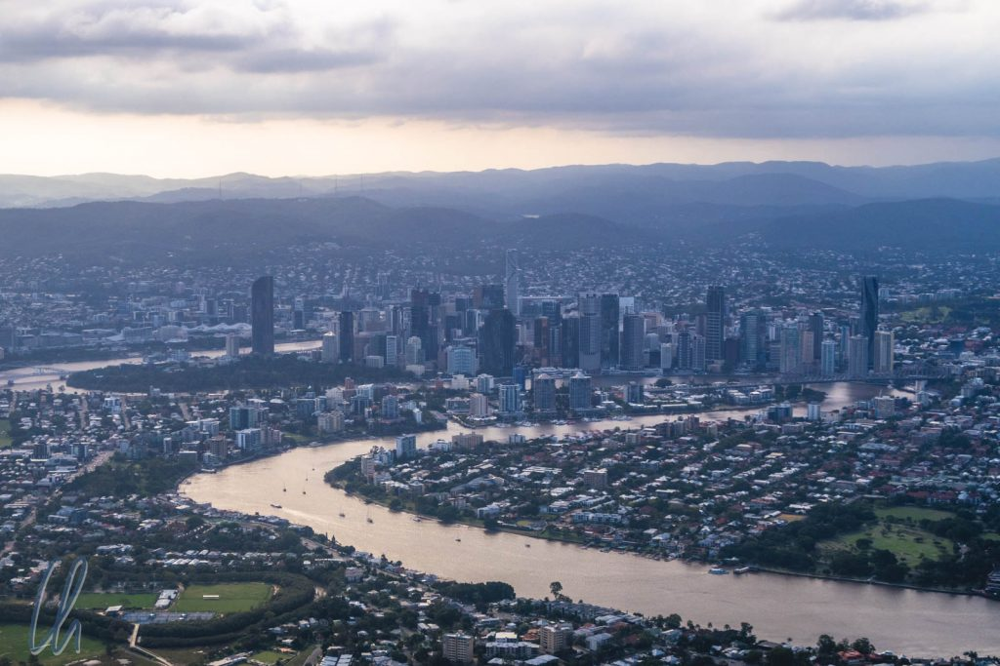

# Erste Eindrücke aus Australien: Brisbane

G‘day mates! No worries! Unser knapp 5-wöchiger Driveabout in Down Under begann in Brisbane („Brissie“) an der Ostküste Australiens. Im Anschluss fuhren wir an der Küste entlang nach Süden bis nur noch Ozean kommt, dann nach Westen bis nach Adelaide.

<!--more-->

## Das Begrüßungskomitee

Direkt am Flughafen begrüßten uns gleich ein paar schräge Vögel, die uns einen ersten Vorgeschmack auf Australiens Tierwelt gaben. [Noisy Miners](https://en.wikipedia.org/wiki/Noisy_miner), die für unsere Augen außergewöhnlich und für unsere Ohren auch wirklich recht geräuschvoll waren. Woran erkennt man frisch angekommene Touristen? Richtig, für sie sind diese Vögel keine Normalität, sondern sie finden sie sehr bemerkenswert! ;)

Beim abendlichen Rundgang durch Brisbane waren wir dann schon mehr mittendrin, als wir es uns gewünscht hatten. Aus einem Quietschen und Schnattern in den Bäumen schlossen wir, daß im Centenary Place Park Flughunde leben. Die erste Euphorie ("Ohh, guck mal!") wich schnell unserem Fluchtinstinkt. Beim Passieren der Bäume regnete es Flughund-Exkremente, die dummerweise auch einige Treffer landeten, grmpf…

Ansonsten ist Brisbane auf den ersten Blick eine ziemlich westlich anmutende, moderne Stadt. Klar, viele Dinge sind hier andersherum, aber so ist das eben in Downunder, noch mehr sogar als in Neuseeland. Die Menschen stehen alle auf dem Kopf, im Winter ist hier Sommer, deshalb haben die Kinder auch zu Weihnachten Sommerferien. Die Sonne steht mittags im Norden, es gibt Bäume, die ihre Rinde statt ihrer Blätter abwerfen und der Wert der Münzen wird immer geringer, je größer sie werden. Zumindest sind 50 Cent größer (und schwerer) als 1 Dollar und eine Ein-Dollar-Münze ist größer als 2 Dollar. Insgesamt waren die Münzen in Australien sehr schwer - ungewohnt nach Myanmar und Kambodscha, wo es nur Papiergeld gab.

## Brisbane ist die drittgrößte Stadt Australiens

Am nächsten Morgen waren wir vor den Flughunden sicher, da sie tagsüber schlafen. Also brachen wir bei bestem Sommerwetter (28 Grad und Sonnenschein) zu einem Stadtrundgang auf. Nicht nur die zahlreichen Gebäude in englischem kolonialem Stil, sondern auch die Namen von Plätzen und Straßen ("George Street","Queens Garden", "Victoria Bridge") zeigen eindeutig die englischen Wurzeln der Stadt. Aber auch die zahlreichen anderen Einwanderer haben Akzente gesetzt. Es gibt z.B. eine beachtliche China-Town und auf den Straßen sahen wir viele asiatische Gesichter. Erst später fiel uns auf, dass wir nur auf sehr wenig Spuren der ersten Bewohner Australiens gestoßen waren.

Dank Wochenende und Sommerferien war die Stadt für eine 2-Millionen-Metropole und drittgrößte Stadt Australiens erstaunlich leer. Doch selbst wenn mehr Menschen unterwegs gewesen wären: Brisbane macht einen großzügig gestalteten und luftigen Eindruck. Durch den mäandernden Brisbane River, die breit angelegten Straßen, nicht zu hohe Häuser und viele Parks mit exotischen Pflanzen gibt es reichlich freie Flächen. Hier trafen wir auch das erweiterte Begrüßungskomitee aus Buschhühnern und Ibissen auf dem Rasen.

Auf dem Brisbane-River verkehren Linienboote, die, wie auch in Hongkong, den Transport mit einer wunderbaren Aussicht kombinieren. So sahen wir Brisbanes Skyline vom Wasser aus, von wo aus auch die heutigen Ambitionen der Metropole deutlich werden. Nach der [Expo 88](https://en.wikipedia.org/wiki/World_Expo_88) ist das heutige Stadtmotto "Australia's New World City". Viele Wolkenkratzer sind im Bau, die die älteren Bauwerke wie die [Story Bridge](https://de.wikipedia.org/wiki/Story_Bridge) oder das Riesenrad schon jetzt deutlich überragen.

## Ein Vorgeschmack: Australiens Tierwelt

Nachdem wir selbst in der Großstadt schon mit erstaunlich vielen Tieren teils sehr nahe Bekanntschaft geschlossen hatten, wollten wir am zweiten Tag noch mehr von der Fauna Australiens sehen. Wir besuchten das [Lone Pine Koala Sanctuary](https://koala.net/en-au/), wo neben unzähligen Koalabären auch Kängurus, [Kookaburras](https://en.wikipedia.org/wiki/Laughing_kookaburra), tasmanische Teufel und andere australische Originale auf uns warteten. Wie schon in der Innenstadt saß das erste sehenswerte Tier aber nicht im Gehege, sondern lief einfach auf den Wegen herum: Zahlreiche kapitale [Eastern Water Dragons](https://de.wikipedia.org/wiki/Australische_Wasseragame) posierten bereitwillig für Fotos.

Die Kängurus im Park waren so sehr an Menschen gewöhnt, dass sie die meiste Zeit im Schatten lagen (das ist ein natürliches Verhalten) und sich gerne füttern ließen (das eher nicht). Leider gab es keine Schnapspralinen zu kaufen, sonst hätten wir auch die Gelegenheit ergriffen ;). Ein Foto mit Kängurus musste aber trotzdem sein, so nah kommt man ihnen sonst nicht.

Sehr gut gefiel uns auch die die Vorführung der Fähigkeiten australischer Hütehunde. Agile Kelpies und Border Collies trieben Schafe im Null-Komma-Nichts zusammen und durch Tore in eine Umfriedung. In einer Greifvogelshow mit anschließendem Fotoshooting lernten wir die einheimische Vogelwelt kennen.

Und bei einer Fütterung von Wildvögeln kamen zahlreiche kunterbunte rainbow und scaly-breasted lorikeets aus der Umgebung herangeflogen, um sich an flüssigem Futter zu laben. Deutlich weniger dynamisch ging es bei den Koalabären zu. Wir schauten ihnen dabei zu, wie sie gelegentlich ein paar Eukalyptusblätter verspeisten, meist aber buchstäblich in den Ästen der Bäume hingen und mit träumerisch-entrücktem Blick dösten.

Wie viele dieser Tieren würden wir wohl in freier Wildbahn erleben?
