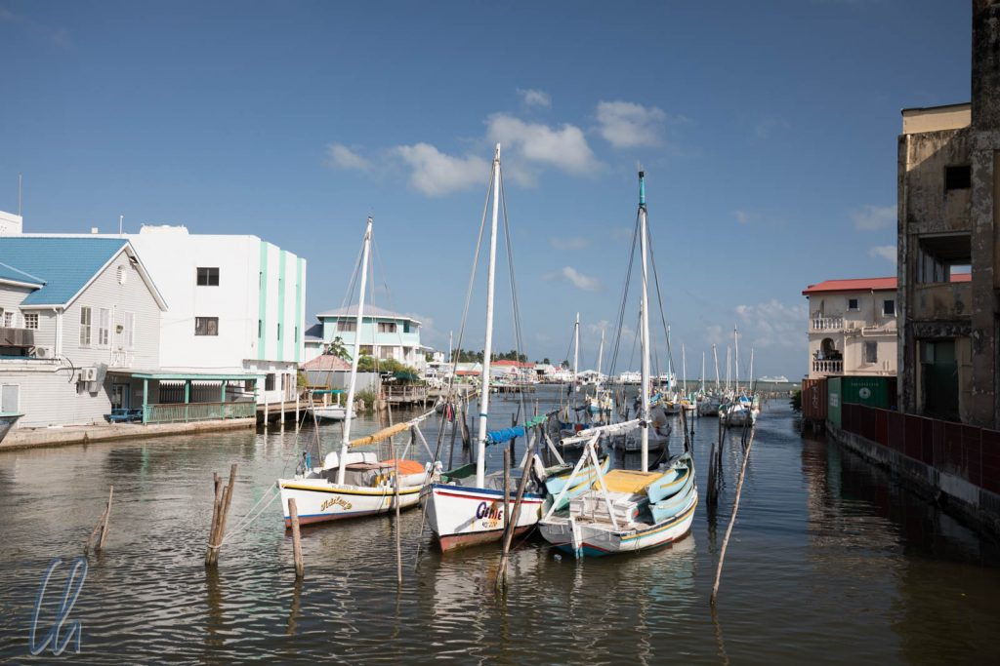

# Erste Eindrücke aus Belize

Nachdem wir die [Grenze](http://wittmann-tours.de/an-der-grenze-von-mexiko-nach-belize/) überquert hatten, merkten wir ziemlich schnell, dass Belize sich sehr von den umgebenden lateinamerikanischen Ländern unterscheidet. Auf einmal wurde nicht mehr Spanisch, sondern Englisch gesprochen und geschrieben. Auch die Leute sahen ganz anders aus, ohne dass es diskriminierend klingen soll. Die Hautfarbe der Menschen war wesentlich dunkler und etwas polemisch könnte man sagen, dass auf einmal viele Bob Marley-Typen herumliefen, manche komplett mit eingeflochtenen Muscheln in den langen Rastalocken. Belize ist in vielerlei Hinsicht anders und die Gründe dafür liegen in der (Kolonial-)Geschichte.

<!--more-->

## Erwerbslose Piraten schulen um

Wie kam es dazu, dass die Geschichte in Belize einen anderen Lauf genommen hat als in den Nachbarländern?

Den von der See ankommenden Spaniern erschien die sumpfige Küste aufgrund des dichten Mangrovenwachstums abweisend, sie hielten das Land wegen des unwegsamen Dschungels zur menschlichen Besiedlung für ungeeignet (das war den Maya, die im Landesinneren seit Jahrhunderten zahlreich in vielen Städten und Siedlungen lebten, allerdings nicht bekannt) und segelten von dannen. Zur Zeit der Conquista durch die Kolonialisatoren in Mexiko wurde das heutige Belize dann ein Rückzugsort der verbliebenen Maya. Die undurchdringlichen Wälder und die wehrhaften Ureinwohner machten die Region für die Spanier wenig attraktiv, zumal es in anderen Gebieten mehr zu holen gab.

Der reiche Strom von Gold und Silber aus den Kolonien in die alte Welt war auch für Piraten eine lukrative Einnahmequelle. Besonders gefürchtet waren die englischen Freibeuter. Diese hatten ebenfalls das heutige Belize als Rückzugsgebiet erkannt und zwar besonders die zahlreichen, der Küste vorgelagerten Inseln, die Teil des Belize [Barrier Reef](https://de.wikipedia.org/wiki/Belize_Barrier_Reef) sind. Nach erfolgreichen Raubzügen konnten sie mit ihren schnellen und wendigen Schiffen in den schwierigen Gewässern besser manövrieren und sich zwischen die Eilande flüchten, wohin ihnen die schweren spanischen Galeonen nicht folgen konnten.

1670 hatte das lukrative Piratenleben ein Ende. Großbritannien und Spanien unterzeichneten einen Vertrag, der die Freibeuterei beendete. Um nicht auf Hartz IV zurückzufallen, wendeten sich die erwerbslosen Piraten dem Handel mit Tropenhölzern zu. Die Erlaubnis dazu bekamen sie interessanterweise von den Spaniern. Für die schweren Holzfällarbeiten im Urwald beschafften sich die Engländer schiffsladungsweise Sklaven aus Afrika. Es kam immer wieder zu Auseinandersetzungen zwischen den Spaniern und den britischen Siedlern. Das Blatt wendete sich 1798 nach der Schlacht von [St. George’s Caye](https://de.wikipedia.org/wiki/St._George%E2%80%99s_Caye) mit einem Sieg der sogenannten englischen „Baymen“ und schließlich stand das Land endgültig unter britischer Herrschaft. 1862 erhielt das damalige Britisch Honduras den Status einer Kronkolonie. 1973 wurde das Land wieder in „Belize“ (die historische Bezeichnung des Gebietes, zu deren Herkunft es mehrere Theorien gibt) umbenannt, unabhängig wurde es allerdings erst 1981.

## Das englische Erbe

Damit ist Belize heute das einzige englischsprachige Land Lateinamerikas, wie die Belizianer immer wieder stolz betonten. Das frühere British Honduras ist heute noch [Teil des Commonwealth](http://thecommonwealth.org/our-member-countries/belize) und immer wieder begegneten wir Spuren der ehemaligen Kronkolonie. In Belize City tragen die Straßen Namen wie Regent Street oder Albert Street, es gibt einen Stadtteil namens Fort George und die größte Kirche des Landes ist die anglikanische [St. John's Cathedral](<https://en.wikipedia.org/wiki/St._John%27s_Cathedral_(Belize_City)>).

Die Beschilderung ist auf Englisch, die Geschwindigkeit wird in Meilen pro Stunde gemessen und Längenangaben auf Verkehrsschildern sind in Meilen und Yards angegeben. Trotzdem fährt man in Belize auf der richtigen, der rechten Seite. Die Queen lächelt von den Geldscheinen und auch die Häuser zeugen mit Ihrer Architektur von der kolonialen Vergangenheit. Leider sind an vielen Fassaden Zeichen des Verfalls oder Schäden der letzten Hurrikane unübersehbar, aber einige repräsentative Bauten sind noch erhalten.

## Vielfalt ist an der Tagesordnung

Die Nachfahren der Engländer sieht man draußen auf der Straße nicht und sie stellen auch keineswegs den Großteil der Bevölkerung dar. Heute sind die Belizianer ein kunterbunter Haufen von gerade einmal 350.000 Einwohnern. (Ungefähr so viele Menschen wie auf Island oder in Bielefeld). Die größten Volksgruppen sind die Maya, Mestizen (Maya-Europäer), Kreolen (Afrikaner-Europäer) und Garinagu (mehr zu den Garinagu folgt noch). Außerdem gibt es noch viele kleinere Gruppen, manche mit nur wenigen hundert Menschen. Zu diesen gehören u.a. Inder, die von den Briten als Arbeiter oder Polizeioffiziere verpflichtet worden waren, und Mennoniten, die ursprünglich aus deutschsprachigen Ländern kamen.

Ein Teil von letzteren sind Anhänger einer konservativen Strömung. Sie lehnen die Verwendung von elektrischen Geräten und Maschinen ab und leben von der Landwirtschaft wie vor Hunderten von Jahren. Vor allem im Süden sahen wir einige Mennoniten. Die Frauen trugen lange Röcke und Kopftücher, die Männer weiße Hemden, Hosen mit Hosenträgern und Strohhüte und sie wirkten ein wenig wie Zeitreisende aus der Vergangenheit, was sie auf eine Art ja auch sind. Einmal sahen wir auch zwei junge Burschen auf einem Pferdefuhrwerk. Als wäre dies nicht schon ungewöhnlich genug, muss man sich diese Leute mit nordeuropäischem Äußeren in einem tropischen Umfeld in einer vorwiegend dunkelhäutigen Gesellschaft vorstellen.

Auch sprachlich herrscht Vielfalt. Englisch dominiert zwar im öffentlichen Leben, aber es ist nicht ungewöhnlich, wenn ein Belizianer im Alltag vier Sprachen benutzt. Diese sind neben Englisch: Kreol (eine vereinfachte und verballhornte Variante des Englischen, die von den Sklaven gesprochen wurde, damit ihre "Herren" sie nicht verstünden), Spanisch (vor allem nahe den Grenzen) und Maya oder Garifuna. Dabei werden nicht alle Sprachen in Reinkultur verwendet. Ein Satz kann gerne Wörter aus mehreren Sprachen enthalten. Spanglish ist eine sehr beliebte Verständigungsform.

## Stadtrundgang

Belize City ist zwar seit dem schweren Hurrikan Hattie 1961 nicht mehr die Hauptstadt, dennoch mit ca. 63.000 Einwohnern die mit Abstand größte Stadt in Belize. In San Ignacio (der zweitgrößten Stadt) leben nicht ganz 20.000 Menschen und Belmopan (die Hauptstadt) zählt nicht einmal 15.000 Einwohner. Ein orientierender Stadtrundgang in Belize Stadt am ersten Tag dauerte nicht lange und wir hatten vorher genug Zeit für unsere üblichen Erledigungen: SIM-Karte kaufen und Geld abheben. Entgegen eher pessimistischen Schilderungen im Reiseführer war beides kein Problem, die Geldautomaten waren reichlich bestückt.

Neben einigen sehenswerten Gebäuden gibt es ein sogenanntes Touristendorf mit vielen Souvenir- und Kunsthandwerksständen, in dem immer dann viele potentielle Käufer eintreffen, wenn ein Kreuzfahrtschiff vor Belize City ankert. Für uns gab es dort wenig zu sehen und die Belizianer sehen diese Art von Tourismus sehr kritisch, weil fast kein Geld im Land bleibt. Der Spaziergang entlang des Ufers mit Blick auf das sonnenüberglänzte Meer an Kolonialstilhäusern vorbei, die schon bessere Zeiten gesehen hatten, war sehr lohnenswert. Dort konnten wir verschiedene Schiffe beobachten und den Pelikanen beim Fischfang zuzusehen.

## Belize City am Abend

Am ersten Abend, als wir gegen 19:30 Uhr zum Abendessen aufbrachen, lernten wir noch eine andere Seite von Belize City kennen. Zu Fuß kamen wir gerade mal einen Block weit. Ein Polizei-Pickup hielt neben uns an und die Beamten fragten, wohin des Weges wir seien. Wir nannten das Restaurant, sie überlegten und baten uns auf den beiden Hauptstraßen zu bleiben, da es abseits unsicher sein könnte. Dann meinte einer der Polizisten im Auto, das Lokal sei geschlossen, aber sie würden uns trotzdem gerne hinfahren, nur um sicherzugehen, dass uns nichts geschieht. Die Polizei, unser Freund und Helfer!

So fuhren wir ein paar Blocks weiter und in der Tat, das Restaurant war geschlossen :(. Nach kurzem Überlegen nannte Mona ein anderes, das auf der anderen Seite der Brücke war, wir waren mittags schon dort gewesen. Die Beamten kannten die Lokalität und fuhren uns bis zur Brücke, da dort ihr Bezirk endete, wirklich sehr freundlich! Leider war im zweiten Restaurant eine geschlossene Gesellschaft, so dass wir uns einen Plan C überlegen mussten…

Wir gingen entlang der Hauptstraße zurück, wie uns geraten worden war. Nur noch wenige Menschen waren auf der Straße und alle Geschäfte und Lokale schienen geschlossen zu sein. Schließlich entdeckten wir doch noch eine Imbissstube, wo wir [Stew-Beans](http://belizenewspost.com/belizeanstewedbeans/), Reis und Rind bestellten. Beglückt wurden wir mit einer großen, dampfenden Portion (s. folgendes Foto). Es war köstlich! Beim Essen kamen wir mit dem Besitzer des Ladens ins Gespräch, was hier aufgrund der Sprache (Englisch) und der offenen Menschen sehr einfach war. Er erzählte, dass er 20 Jahre in den USA gelebt habe, aber nach Belize zurückgekommen sei, da er in seinem Heimatland investieren wollte. Er habe zwei Lokale und sei der festen Überzeugung, dass es Belize unter der richtigen Führung viel besser gehen würde.

## Die Auflösung zwei Tage später

Dass die Bürgersteige so früh hochgeklappt wurden und wir erst nach langer Suche ein offenes Lokal finden konnten, hatte uns sehr verwundert. Nachdem uns die Polizei aufgegabelt hatte, hegten wir schon ein etwas mulmiges Gefühl. Dies hielt uns aber nicht davon ab, unser kreolisches Abendessen zu genießen. Die Hintergründe erfuhren wir zwei Tage später, als wir beim gleichen Imbiss frühstückten. Die Zeitung lag aus und titelte "A murderous weekend".

Hier ging es um einen Bandenkrieg. Der Boss einer Bande war erschossen worden, was eine Welle der Gewalt und Vergeltung ausgelöst hatte. Daher war die Polizei in doppelter Alarmbereitschaft und die Menschen fühlten sich anscheinend auf einmal bei Dunkelheit draußen nicht mehr sicher.

## Die Garinagu

Belize City hatte aber mehr zu bieten als ein paar hübsche Gebäude. Die eigentliche Sehenswürdigkeit sind die Menschen und die verschiedenen Kulturen der unterschiedlichen Volksgruppen. Eine der wichtigen (und stolzen) ethnischen Gruppen in Belize sind die [Garinagu (Singular: Garifuna)](https://de.wikipedia.org/wiki/Garifuna). Um mehr über sie zu erfahren, besuchten wir das Garifuna Museum in Belize City. Dieses Museum wird vermutlich den Preis des familiärsten Museums auf unserer Reise gewinnen.

Das Museum befindet sich in zwei Räumen des Erdgeschosses eines Hauses in einem Wohngebiet. Wir nahmen vom Zentrum aus ein Taxi für die ungefähr 3 Kilometer. Um unser Kommen anzukündigen, hupte der Taxifahrer vor der Tür und eine ältere Frau rief uns von einem Fenster im ersten Stock aus zu, wir sollten kurz auf der Bank vor dem Haus Platz nehmen, sie würde gleich kommen. Anscheinend musste sie noch ihren sieben Monate alten Enkel fertigmachen, den sie wenige Minuten später auf dem Arm hatte und im Ausstellungsraum in eine Spielecke setzte. Nach einer sehr freundlichen Begrüßung gab sie uns eine kleine Führung zur Geschichte und Kultur der Garinagu. Anschließend durften wir die Ausstellung selbst erkunden und sie spielte mit ihrem Enkel. Zum Abschied riet sie uns paradoxerweise noch, wir sollten vorsichtig sein und nicht mit den „schwarzen Jungs herumhängen“, was wir sehr lustig fanden, da sie selbst eine alles andere als lilienweiße Haut hatte.

## Eine ungewöhnliche Geschichte

Die Geschichte der Garinagu ist sehr ungewöhnlich, denn es sind Schwarze, die nicht versklavt wurden. Es ist statt dessen eine Geschichte von Vertreibung, Flucht vor der Sklaverei, der Suche nach einer neuen Heimat und dem Bewahren von Traditionen. Alles begann 1635 als zwei Sklavenschiffe bei St. Vincent Schiffbruch erlitten und sich die Überlebenden mit den dort heimischen Kariben vermischten. Vor der Versklavung konnten sich die Garifuna retten, der Preis ihres Widerstandes gegen die englischen Kolonialisatoren war 1796 die Deportierung von St. Vincent auf die Insel Baliceaux, wo mangels natürlicher Ressourcen ungefähr 50% der Gefangenen starben. Dann erfolgte eine erneute Umsiedelung auf die Insel Roatan. Verzweifelt suchten die Garinagu nach einer neuen Heimat und 1832 landeten viele Angehörige dieses Volkes in ihren Schiffen am Strand des heutigen Dangriga in Belize.

Heute leben ungefähr 25.000 Garinagu in Belize. Sie sprechen ihre eigene Sprache (Garifuna), haben ihre eigene Flagge, sind stolz auf ihre Musik und versuchen ihre Geschichte und Traditionen am Leben zu erhalten. Der Tag der Ankunft der Angehörigen dieses Volkes (Garifuna Settlement Day) ist mittlerweile ein nationaler Feiertag in Belize. Fester Bestandteil des Festes ist das Nachspielen des Erreichens der Küste durch die ersten Garinagu.

Zu den traditionellen Tänzen gehört auch der Jankanu. Bei diesem Tanz werden die Europäer der Kolonialzeit mit rosa Masken, weißen Kleidern und Hosenträgern nachgemacht und ins Lächerliche gezogen.

## Cave Tubing

Kultur ist aber bestimmt nicht der einzige Grund, Belize zu besuchen. Neben dem Dschungel und dem karibischen Meer locken auch einige adrenalintreibende Angebote in der Umgebung von Belize City. Ziplining und Cave Tubing wollten wir uns auf keinen Fall entgehen lassen, was sich gut zu einem Tagesausflug kombinieren ließ.

Als erstes ging es zum Cave Tubing. Dabei lässt man sich auf einem aufgeblasenen Schlauch (Tube), entweder von einem alten Reifen oder in der modernen Variante, auf einem Fluß durch eine Höhle (Cave) treiben. Damit nichts passieren kann, ist man mit einem Führer unterwegs. Wir wurden mit den Tubes ausgestattet und liefen ungefähr 30 Minuten stromaufwärts durch dichten grünen Dschungel. Schon auf dem Weg bekamen wir nasse Füße, da wir den Fluss zweimal queren mussten.

Zum Glück waren wir früh von Belize City aus gestartet und hatten so die Höhle für uns alleine. Schnell wurde es dämmerig als wir hineintrieben, und nach einer Kurve war ganz dunkel. Ein kleiner Wasserfall wurde von den Steinwänden akustisch zu riesenhafter Größe verstärkt. Unser Guide zeigte uns einige interessante Felsformationen und erklärte uns, dass die Höhle von den Maya (die auch in Belize heimisch waren und sind) als [Xibalbá](https://de.wikipedia.org/wiki/Xibalb%C3%A1) (Unterwelt) angesehen wurde. Hierhin wurden Geschenke für die Götter gebracht. In anderen Höhlen sind auch Skelette von Menschenopfern gefunden worden.

https://www.youtube.com/watch?v=6qC7l-dEXyY

## Ziplining

Zum Glück durchquerten wir die Unterwelt unbeschadet und wurden quasi an der anderen Öffnung der Höhle neu geboren ;). Wir ließen uns noch etwa 20 Minuten gemächlich den Fluss abwärts treiben und kamen wieder am Ausgangspunkt an. Anschließend wechselten wir das Equipment und es ging los zum Ziplining.

Beim [Ziplining](https://de.wikipedia.org/wiki/Seilrutsche) (zu deutsch Seilrutsche-Fahren) waren durch den Dschungel lange Stahlseile zwischen den Bäumen gespannt, an denen entlang man mit einer Rolle fahren konnte. An dieser hing man wiederum mit einem Beckengeschirr. Durch die Schwerkraft angetrieben sausten wir also durch das Blätterdach des Regenwaldes und über den Fluss, auf dem wir uns vorher hatten treiben lassen. Im Umkehrschluss hieß das natürlich, dass wir zunächst ein paar Höhenmeter nach oben laufen mussten, um anschließend die Abfahrt genießen zu können ;).

https://www.youtube.com/watch?v=rfco2IRHZAM

So bekamen wir einen Vorgeschmack auf den Dschungel aus einer ungewöhnlichen Perspektive. Noch viel mehr Urwald sollten wir in den kommenden Tagen in Belize sehen, doch mehr dazu im nächsten Post.
