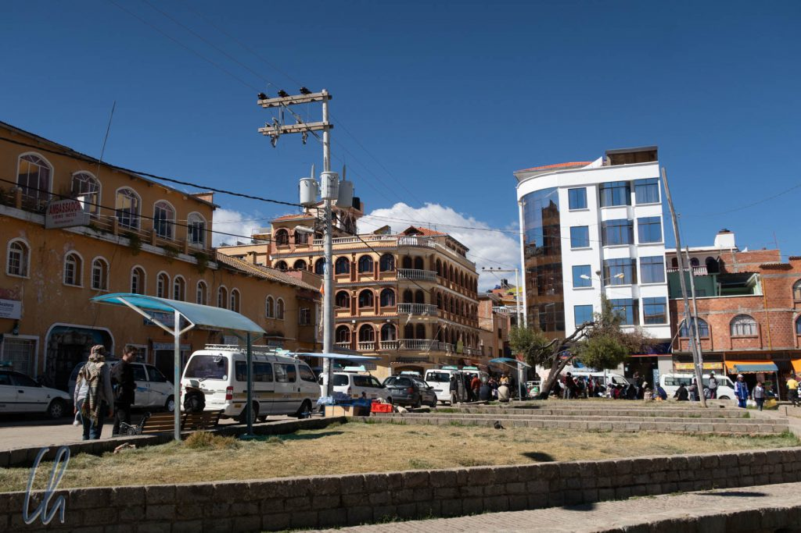

Auf den ersten Blick änderte sich nach dem unproblematischen Grenzübertritt von Peru nach Bolivien in Kasani relativ wenig. Einige Häuser aus rotem Backstein, eine hügelige Landschaft, immer wieder herrliche Ausblicke auf den tiefblauen Titicacasee, ein ländliches Bolivien. Dass Bolivien anders ist als Peru, bemerkten wir kurze Zeit später, als wir in Copacabana einfuhren. Ein Mann stieg in den Bus und sammelte von jedem Fahrgast "Eintritt" für Copacabana ein: 2 Bolivianos oder 1 Sol (0,25 Euro) pro Person. Kurtaxe? Steuern? Vermutlich eine Art der Selbstverwaltung und in der Masse eine gute Einnahmequelle.

<!--more-->

## Copacabana in Bolivien: Klein, beschaulich, unproblematisch

Im Vergleich zu Puno in Peru (der Stadt, die wir am Titicacasee besucht hatten), wirkte Copacabana sehr beschaulich und wir sahen nur eine Handvoll Touristen. Nicht nur war der Ort wesentlich kleiner, es gab auch viel weniger Autos. Das deutlich geringere Verkehrsaufkommen werteten wir als Indiz dafür, dass der Lebensstandard in Bolivien niedriger war als in Peru.

Der Reiseführer hatte uns vorgewarnt, dass Geld in Bolivien ein Problem sein könne. Geldautomaten seien öfters leer und das Wechseln von großen Scheinen (mehr als 20 Bolivianos (2,50 Euro)) ein Volkssport. Kreditkarten böten auch keinen Ausweg, da man nur in seltenen Einzelfällen damit bezahlen könne. Wie so oft malte der Lonely Planet die Situation zum Glück etwas zu schwarz und beim Abheben am Geldautomaten wähnten wir uns sehr glücklich. Die Maschine spuckte im ersten Anlauf nur 10er und 20er Scheine aus. So hoben wir ein paar mal das Transaktionsmaximum von 500 Bolivianos (63 Euro) ab. Am Ende fühlten wir uns ein wenig wie Bankräuber, als wir mit einem dicken Geldbündel in einer Plastiktüte die Filiale verließen :)

## Die wundertätige Jungfrau von Copacabana

Copacabana ist vielleicht der wichtigste Wallfahrtsort in Bolivien. Hier kann man sogar sein neu erstandenes Fahrzeug segnen lassen (jeden Samstag und Sonntag um 10 Uhr morgens, separate Parkplätze vor der Kirche stehen bereit). Die Spende für den Priester ist ja auch günstiger als eine Kfz-Versicherung ;). Angebetet wird hier die Jungfrau von Copacabana. Die holzgeschnitzte Statue der Muttergottes in der Kathedrale hat eine sehr interessante Entstehungsgeschichte. Die erste christliche Gemeinschaft in Copacabana wählte La Santísima Virgen de Candelaria als ihre Schutzpatronin, also brauchte man ein passendes Bild für den Altar.

Ein direkter Nachfahre der Inka-Herrscher, Francisco Tito Yupanqui, fertigte eine Skulptur aus Ton an, die aber als nicht angemessen abgelehnt und entfernt wurde. Statt enttäuscht aufzugeben, studierte er in Potosí Kunst. 1583 stellte er die in 8-monatiger Arbeit geschnitzte Statue der dunklen Virgen Morena del Lago (die dunkle Jungfrau des Sees) fertig. Kurz nachdem diese ihren Platz auf dem Altar der Kirche von Copacabana gefunden hatte, begannen die Wunder in Form von unerklärlichen Heilungen. Copacanaba wurde zum Pilgerort.

## Brasilien, Bolivien?

Wer Copacabana eher mit Brasilien statt mit Bolivien in Verbindung bringt, liegt gar nicht so falsch. In der Tat ist das bolivianische Copacabana namensgebend für den brasilianischen Stadtteil Rio de Janeiros mit dem berühmten Strand. Die Geschichte, die uns erzählt wurde, geht ungefähr so: Brasilianische Wallfahrer kamen, um die [Jungfrau](https://en.wikipedia.org/wiki/Virgen_de_Copacabana) von Copacabana anzubeten und erwarben auch ein Gemälde der Heiligen, das sie mit sich nahmen. Als an ihrem Heimatort in Brasilien ein schwerer Sturm drohte, beteten sie zur Virgen. Wie durch ein Wunder überlebte die gesamte Familie das schreckliche Unwetter unbeschadet. Zum Dank für die unerwartete Rettung stifteten sie eine Kapelle (die heute leider nicht mehr existiert), die der Jungfrau von Copacabana geweiht wurde, und stellten dort das Bild der Virgen aus. Der Stadtteil in Rio de Janeiro wurde nach der Schutzheiligen des kleinen Gotteshauses benannt.

## In Copacabana und am Titicacasee

Die interessantesten Sehenswürdigkeiten des Titicacasees auf bolivianischer Seite sind die beiden Inseln [Isla del Sol](https://de.wikipedia.org/wiki/Isla_del_Sol) ("Insel der Sonne") und [Isla de la Luna](https://de.wikipedia.org/wiki/Isla_de_la_Luna) ("Insel des Mondes"). Beides sind zentrale Orte des Schöpfungsmythos der Inka. Die Isla del Sol ist der Geburtsort der Sonne selbst, des Schöpfergottes [Viracocha](https://de.wikipedia.org/wiki/Wiraqucha) und der ersten Inka Manco Capac und seiner Schwester-Gemahlin Mama Ocllo. Die Isla de la Luna ist der Ort, an dem Viracocha dem Mond befohlen hat, in den Himmel aufzusteigen. Das Wetter machte der Legende vom Titicacasee als Geburtsort der Sonne alle Ehre: Der strahlende Sonnenschein ließ den See in einem unglaublichen Blau leuchten.

Es gibt mehrere Theorien, woher sich der Name des Titicacasees herleitet. Die häufigste bezieht sich auf einen Felsen im Norden der Isla del Sol in der Nähe einer rituellen Opferstelle. Seine Form soll einem Raubtier ähneln, daher wird er auf [Quechua](https://de.wikipedia.org/wiki/Quechua) als „Titi Khar´ka“ (Felsen des Puma) bezeichnet. Dieser große Stein soll namensgebend für den See sein, verballhornt hat sich daraus Titicaca entwickelt.

## Blockade auf der Isla del Sol

Der Versuch, eine Tour zu den Inseln zu organisieren, gestaltete sich leider etwas schwierig. Auf der Isla del Sol herrschte ein lokaler Konflikt. Einheimische blockierten das Ufer im Norden der Insel, wo sich die wichtigsten Sehenswürdigkeiten befinden. Fakt war, dass man seit ungefähr einem Jahr (Stand Mai 2018) als Ausländer den Norden der Insel nicht mehr besuchen durfte. Die genauen Gründe waren schwierig zu ergründen und wir hörten die unterschiedlichsten Geschichten. Außerdem schien bereits eine gewisse Legendenbildung eingesetzt zu haben.

Einheimische erzählten uns unter anderem, es ginge um Gold. Die Blockade sollte verhindern, dass Außenstehende nach dem wertvollen Metall suchten. Am besten gefiel uns diese Version: Am Tag der Sommersonnenwende werde ein Sonnenstrahl auf den Felsen des Puma fallen. Dadurch werde sich der Stein öffnen und einen Goldschatz offenbaren.

Die seriöseren Erklärungen deuteten darauf hin, dass es auf der Isla del Sol zu Unzufriedenheit gekommen sei, da die Bewohner im Norden der Insel nur vergleichsweise geringe Einnahmen aus dem Tourismus erhielten, obwohl es dort die wichtigsten Sehenswürdigkeiten gibt.

## Krieg am Gartenzaun

Die glaubwürdigsten Berichte zu den Vorkommnissen auf der Isla del Sol, die wir auch in einer Zeitung fanden ([hier](http://www.paginasiete.bo/cultura/2017/7/18/comunidades-pugna-turismo-toman-isla-144989.html) und [hier](http://www.paginasiete.bo/sociedad/2018/1/14/conflicto-comunal-isla-agudiza-166491.html)), wirkte auf uns etwas wie ein Krieg am Gartenzaun. Seit Februar 2017 gab es einen Konflikt zwischen den Gemeinden Cha'lla (in der Mitte der Insel) und Cha'llapampa (im Norden der Isla del Sol) bezüglich einiger Cabañas, die zum Zwecke des Öko-Tourismus in direkter Nähe der archäologischen Stätten (im Norden, d.h. in Cha'llapampa) gebaut worden waren.

Die Bewohner der Gemeinde Cha'lla (also in der Mitte der Insel) waren der Meinung, dass die neu gebauten Hütten zu nah an den Ausgrabungsstätten lägen. Ihre Argumente wurden allerdings von den Behörden nicht angehört. Also ergriffen die Leute von Cha'lla selbst die Initiative und zerstörten die Cabañas, was wiederum die Menschen aus Cha'llapampa sehr verärgerte. Die Bewohner von Cha´lla ließen dann keine Touristen mehr in den Norden der Insel, es sollen schon Reisende bedroht worden sein. Die Blockade wurde als Druckmittel eingesetzt, um den Konflikt zu lösen, indem sie jegliche Einnahmen aus dem Tourismus unterband. Die Auseinandersetzung erschien festgefahren, eine Lösung nicht in Sicht.

Etwas befremdlich fanden wir, dass anscheinend niemand, keine Lokal- oder Zentralregierung, die Macht hatte, eine Lösung durchzusetzen. Die Bewohner von Cha'lla haben stattdessen Selbstjustiz geübt. Allerdings gab es unserer Meinung nach viele Verlierer: Alle Bewohner im Norden der Isla del Sol, da sie keine Einnahmen durch die Touristen hatten, und die Besucher, die die Inka-Ruinen nicht besuchen konnten.

## Besuch der zugänglichen Sehenswürdigkeiten

Trotz der Blockade konnten wir eine Kombinationstour der Isla de la Luna und Isla del Sol buchen, allerdings ohne den wohl interessantesten Teil, den Norden der Isla del Sol. Zusammen mit zwei Ecuadorianern aus Guayaquil, Veronika und Luis, und unserer Führerin Rosemary, einer echten bolivianischen [Cholita](https://es.wikipedia.org/wiki/Chola_boliviana), stachen wir in See.

Unser erstes Ziel war die Isla de la Luna, wo wir den [Templo de las Virgenes](https://es.wikipedia.org/wiki/I%C3%B1akuyu) ("Tempel der Jungfrauen") besuchten, ein Kloster für auserwählte junge Mädchen. Ihre Bestimmung war es, in jungen Jahren den Göttern der Sonne oder des Mondes geopfert zu werden. Wenn sie ein gewisses Alter überschritten hatten, blieben sie als Lehrerinnen der jüngeren Frauen im Konvent oder es kam vor, dass hochstehende Inka sie als Konkubinen zu sich holten. Der teils rekonstruierte Bau war mit einem [Andenkreuz](https://de.wikipedia.org/wiki/Andenkreuz) verziert, allerdings in der Mondvariante. Die vier mal 7 Ecken (also 28, müssten aber eigentlich 29,5 sein (Anmerkung der Redaktion)) sollten die Tage der Mondphasen darstellen.

Anschließend überquerten wir die schmale Insel von Norden nach Süden, wobei wir ca. 100 Meter auf- und absteigen mussten. Von oben offenbarte sich ein atemberaubender Blick über den See mit mehreren schneebedeckten 6000m hohen Gipfeln der Cordillera Real in der Ferne. Die Berge werden auf [Aymara](<https://de.wikipedia.org/wiki/Aymara_(Sprache)>) auch als die Achachilas bezeichnet, was soviel wie Beschützer bedeutet.

## Der Süden der Isla del Sol

Auf der Isla del Sol gingen wir in der Nähe der Südspitze an Land, wo sich die Ruinen des sogenannten Palacio del Inca befinden. Das gut erhaltene Bauwerk ist auf zwei übereinanderliegenden Terassen am Hang erbaut worden. Von dort hatten wir einen wunderbaren Blick über den Titicacasee auf die Isla de la Luna. Es wird vermutet, dass das Gebäude vom Inka-Herrscher Tupac-Yupanqui errichtet worden war.

Von dort aus wanderten wir zum Ort Yumani. Unterhalb des Dorfes erfrischten wir uns an einer Quelle, die ein Jungbrunnen sein soll. Angeblich sollen die drei Wasserströme für eine gesellschaftliche Regel der Inka stehen: „Stehle nicht, lüge nicht und sei nicht faul.“ Was es wohl bedeutet, dass eines der drei Rohre trockengefallen ist?

Anschließend stiegen wir über die sorgfältig rekonstruierte Treppe der Inka (Escalera del Inca) bis zum Seeufer ab.

Zusammengefasst war es eine sehr schöne Tour mit Wehrmutstropfen. Die Landschaft der Inseln und die Ausblicke über den Titicacasee waren nahezu überirdisch schön, allerdings hatten wir die kulturellen Sehenswürdigkeiten im Norden der Isla del Sol nicht besuchen können.

## Lamas und Alpakas

Die große Tourismus-Weisheit "Alle Sehenswürdigkeiten werden interessanter und lustiger, wenn es Tiere gibt" konnten die Bolivianer noch steigern. Sowohl auf der Isla del Sol als auch in unserem Hotel in Copacabana durften wir Lamas und Alpakas sogar streicheln und füttern! Auf der Isla del Sol hatte Mona die Gelegenheit, zwei weiße Baby-Alpakas (Lukas und Luna) mit einem Milchfläschchen zu bestechen - Entschuldigung: zu füttern.

Unser Hotel in Copacabana war ebenfalls sehr um seine Gäste bemüht. Es gab mehrere mehr oder weniger freilaufende Alpakas und ein Lama. Wir konnten jederzeit an die Rezeption gehen und uns eine Tüte Anden-Popcorn (deutlich größer als unseres und natur) geben lassen, um die lieben Tierchen zu füttern. Natürlich waren die Alpakas sofort unsere besten Freunde. - Manchmal vielleicht sogar zu gute Freunde, nämlich wenn sie versuchten, sich selbst zu bedienen. Dabei konnten wir sie auch streicheln und es ist unbeschreiblich, wie weich vor allem die Baby-Alpakas sind. Die Hand versinkt fast ohne Widerstand in der flauschigen Wolle und sofort fühlt es sich warm an.

Aber was ist eigentlich der Unterschied zwischen einem Lama und einem Alpaka bzw. wie kann man sie auseinanderhalten? Lamas sind größer, haben längere, bananenförmige Ohren und eine längere Schnauze. Im Gegensatz zum Alpaka hat das Lama an den Beinen außerdem keine Wolle: "They walk more sexy" ;).

